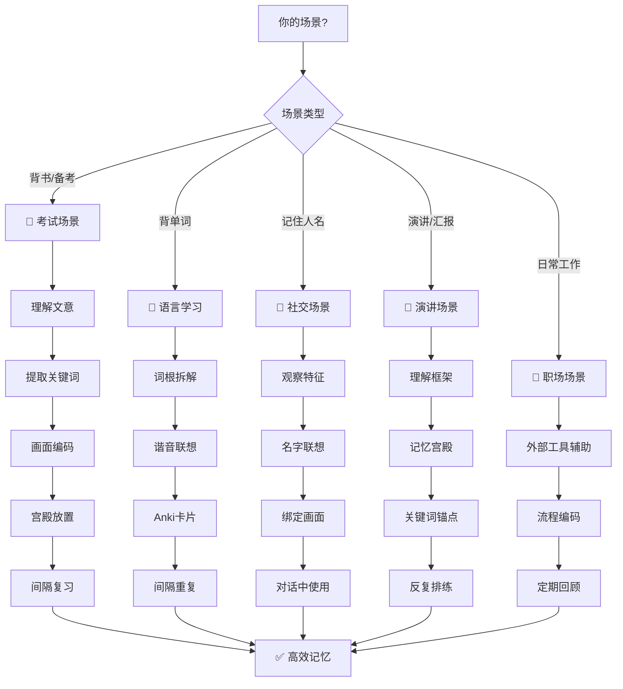
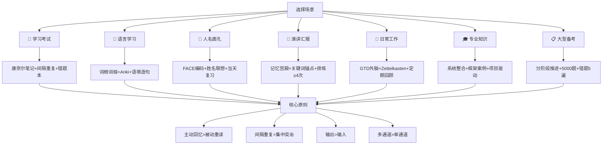

# 记忆术的实战应用场景

> **📍 本章导航**：前置 → [02-核心记忆技巧](02-核心记忆技巧.md)、[01-记忆科学基础](01-记忆科学基础.md) ｜ 相关 → [方法地图](方法地图.md)（方法 ID 总线）、[33-记忆速查手册](33-记忆速查手册.md)、[36-职场记忆效率](36-职场记忆效率.md)、[35-儿童记忆训练](35-儿童记忆训练.md) ｜ 方法 → M01·M08·M10·M07-R·M33 ｜ 难度 ⭐⭐ ｜ 阅读 ~90min（建议按场景选读，不必通读）

> 知道方法不等于会用。本章将记忆术从“理论”拉到“战场”--八大高频场景,每一步精确到分钟级别,配有大量实例、失败分析和真实案例,可直接执行。
>
> **⏱ 预计阅读时间**：约90-120分钟（全文约25000字）
> **📖 建议分3次阅读**：
> - 第1次：场景一~三（学习考试+语言学习+记住人名），约40分钟
> - 第2次：场景四~六（演讲汇报+日常工作+特殊场景），约30分钟
> - 第3次：场景七~八（专业知识+考研考公考证），约40分钟

> **📌 前置知识**：本章假设你已经了解基础记忆技术。如果还不熟悉记忆宫殿、联想法、间隔重复等核心概念，请先阅读：
> - **第02章《核心记忆技巧》**：十大记忆技术的原理和操作步骤
> - **第01章《记忆科学基础》**：理解记忆的编码-存储-提取机制

> **🧠 小白秒懂**:前面几章教你"是什么"和"为什么",这一章教你"怎么做"。每个场景都有**分钟级的操作流程**,跟着做就行。
>
> ```
> 本章结构:
>
>   场景选择 ──▶ 找到你的场景 ──▶ 跟着流程操作 ──▶ 检验效果
>      │
>      ├── 学习考试(背书、备考)
>      ├── 语言学习(背单词、练口语)
>      ├── 记住人名(社交场合)
>      ├── 演讲汇报(脱稿演讲)
>      ├── 日常工作(待办、会议)
>      ├── 特殊场景(扑克牌、数字)
>      ├── 专业知识(医学、法律、编程)
>      └── 大型备考(考研、考公、考证)
> ```
> **💡 相关阅读**：[36-职场记忆效率](36-职场记忆效率.md)（客户/产品/演讲记忆）| [35-儿童记忆训练](35-儿童记忆训练.md)（游戏化多感官训练）

## 📊 场景-方法匹配流程图



---

## ⚡ 5分钟速览

本文将记忆术从理论拉到实战——八大高频场景，每步精确到分钟级别。**核心要点**：

1. **学习考试全流程**：预习(建空文件夹)→听课(主动编码)→复习(间隔提取)。康奈尔笔记法+间隔重复节奏：当天→第1天→第3天→第7天→第14天→第30天。开学前先查 §开头的**场景×方法速配表**定方法组合与投入，期末应急看 §1.6。
2. **语言词汇记忆**：每天15-20个新词+词根词缀+语境造句+Anki间隔重复，3个月可掌握4500词。
3. **人名面孔记忆**：FACE面部编码(额头/外貌/下巴/眼睛)+姓名联想法(谐音/拆字/名人/场景)，30秒内完成编码。
4. **演讲汇报**：用记忆宫殿放关键词，记骨架不记逐字稿。排练≥4次，忘词时跳过继续>用自己的话重述。
5. **日常工作**：外脑系统(GTD)管理待办——大脑用来思考，不用来存储。Zettelkasten卡片笔记法管理知识。
6. **专业知识**：医学用器官系统整合记忆法，法律用框架+案例法，编程用项目驱动法，金融用公式推导法。
7. **大型备考**：考研分四阶段(基础→强化→冲刺→考前)，考公行测靠错题本+间隔复习，考证CPA/法考靠1500+小时+5000题+5遍错题。
8. **核心原则**：主动回忆>被动重读，间隔重复>集中突击，多通道编码>单一通道，输出>输入。

> **阅读建议**：根据你的场景选择对应章节。§一(学习考试)和§二(语言学习)最常用。§七(专业知识)和§八(大型备考)按需查阅。

### ⚡ 一分钟速记

> **只有1分钟？记住这3个要点：**
> 1. 学习考试全流程：预习建框架→听课主动编码→间隔重复复习，当天→第1天→第3天→第7天→第14天→第30天
> 2. 记住人名的FACE法：额头(Forehead)+外貌(Appearance)+下巴(Chin)+眼睛(Eyes)，30秒完成编码
> 3. 核心原则：主动回忆 > 被动重读，间隔重复 > 集中突击，输出 > 输入

---

## 🎯 核心框架



### 📊 效果对比：场景-方法匹配效果

| 场景 | 最佳方法 | 传统方法 | 效率提升 | 关键差异 |
|------|----------|----------|----------|----------|
| 背书备考 | 间隔重复+主动回忆 | 反复阅读 | 3倍+ | 提取练习效应 |
| 背单词 | 词根词缀+Anki | 死记硬背 | 2-3倍 | 语义编码vs机械重复 |
| 记人名 | FACE编码+联想 | 重复名字 | 5倍+ | 视觉绑定vs语音回路 |
| 演讲脱稿 | 记忆宫殿+关键词 | 逐字背诵 | 2倍+ | 结构化vs线性依赖 |
| 日常待办 | GTD外部系统 | 全凭记忆 | 10倍+ | 外脑释放工作记忆 |
| 医学记忆 | 器官系统整合 | 逐条背诵 | 3倍+ | 网络化vs孤立记忆 |
| 考研备考 | 分阶段1500h+5000题 | 临时突击 | 2-3倍 | 系统性vs随机性 |

> ⚠️ 上表的"效率提升"倍数为经验估计，不是实验测量值；真实差异取决于材料、基础与执行质量。可验证的规律来自 [研究证据汇总](#-研究证据汇总)：提取练习与间隔练习的效应量中等（d≈0.4-0.7），方向确定、倍数因人而异。

---

## 🧭 场景×方法速配表（含预期投入）

> 与 [方法地图 §3 选择矩阵](方法地图.md#3-场景--方法-选择矩阵) 呼应，但细到"每个场景到底用哪几个方法 ID、每天花多少时间、多久验收"。任何记忆任务都遵循"**编码 1-2 个 + 固化 1 个 + 提取 1 个**"的最小组合（见 [方法地图 §3.2](方法地图.md#32-最小组合是什么)）——只编码不提取，就是"看着眼熟说不出来"。

**考试线**

| 场景 | 为什么难（记忆机制） | 编码 | 固化 | 提取 | 预期投入 | 详见 |
|---|---|---|---|---|---|---|
| 四六级词汇 | 形近词互相干扰（前摄干扰），孤立词无线索 | [M25 语境](方法地图.md#m25)·[M24 词根](方法地图.md#m24) | [M07-R 间隔重复](方法地图.md#m07-r) | [M08 主动回忆](方法地图.md#m08) | 每天 40min（新词 20+复习） | §2.1、§8.4 |
| 四六级/雅思听力 | 听觉编码弱、语速压力下提取失败 | [M23 泛听](方法地图.md#m23)→[M19 听写](方法地图.md#m19) | [M07-R](方法地图.md#m07-r) | [M21 复述](方法地图.md#m21) | 每天 25min | §2.3、[53-听力记忆实战](53-听力记忆实战.md) |
| 考研政治 | 抽象术语多、加工深度浅 | [M10 结构](方法地图.md#m10)·[M13 精细加工](方法地图.md#m13)·[M14 口诀](方法地图.md#m14) | [M07-R](方法地图.md#m07-r) | [M08](方法地图.md#m08)·[M32 错题反提](方法地图.md#m32) | 每天 60-90min | §8.4 |
| 考研英语作文 | 只看不写=提取练习缺失 | [M25](方法地图.md#m25)·[M01 宫殿挂骨架](方法地图.md#m01) | [M07-R](方法地图.md#m07-r) | [M08 默写](方法地图.md#m08) | 每篇 40min | §8.4 |
| 考公行测常识 | 范围广而浅，易混易忘 | [M14](方法地图.md#m14)·[M15 组块](方法地图.md#m15) | [M07-R](方法地图.md#m07-r) | [M32](方法地图.md#m32) | 每天 30min | §8.2、§8.4 |
| 考公申论 | 需要结构化输出，光背没用 | [M10](方法地图.md#m10)·[M13](方法地图.md#m13) | [M34 检索日历](方法地图.md#m34) | [M21](方法地图.md#m21)·[M33 模拟](方法地图.md#m33) | 每天 45min | §8.2、§8.4 |
| 法考 | 法条彼此相似（干扰极强） | [M13 对比](方法地图.md#m13)·[M06 桩](方法地图.md#m06) | [M07-R](方法地图.md#m07-r) | [M32](方法地图.md#m32) | 每天 2-3h | §8.4 |
| CPA | 计算与记忆混合、战线长 | [M10](方法地图.md#m10)·[M40 推导链](方法地图.md#m40) | [M07-R](方法地图.md#m07-r) | [M32](方法地图.md#m32) | 每天 2-3h | §8.3、§8.4 |
| 驾考科目一/四 | 题库大但浅、数字罚款易混 | [M15](方法地图.md#m15)·[M14](方法地图.md#m14) | [M07-R](方法地图.md#m07-r) | [M08 刷题自测](方法地图.md#m08) | 每天 25min×7 天 | §8.4 |
| 职称考试 | 在职碎片时间、动力不足 | [M10](方法地图.md#m10)·[M06](方法地图.md#m06) | [M07-R](方法地图.md#m07-r) | [M32](方法地图.md#m32) | 每天 30min | §8.4 |
| 课堂听讲 | 持续被动输入、无提取环节 | [M13 即时关联](方法地图.md#m13) | [M07-R](方法地图.md#m07-r) | [M08](方法地图.md#m08)（课后 20min） | 每节课后 20min | §1.1 |
| 期末周 | 时间压缩、倒摄干扰（科目互相冲） | [M10](方法地图.md#m10)·[M08](方法地图.md#m08) | [M34](方法地图.md#m34) | [M33 模考](方法地图.md#m33) | 每天 4-6h×7 天 | §1.6 |
| 古文/课文背诵 | 虚词韵律无意义、线索缺失 | [M13](方法地图.md#m13)·[M14](方法地图.md#m14) | [M27 睡前复习](方法地图.md#m27) | [M21](方法地图.md#m21) | 每天 20min | [52-古文与文言文记忆](52-古文与文言文记忆.md)、§5.6 |

**职场线**

| 场景 | 为什么难 | 编码 | 固化 | 提取 | 预期投入 | 详见 |
|---|---|---|---|---|---|---|
| 述职/周报 | 成就零散、事后想不起 | [M10](方法地图.md#m10)·[M22 速记](方法地图.md#m22) | [M34](方法地图.md#m34) | [M21 复述](方法地图.md#m21) | 每周 30min | §4.4 |
| 产品发布会/宣讲 | 内容长+临场压力（状态依赖） | [M01](方法地图.md#m01)·[M12 夸张](方法地图.md#m12) | [M30 状态一致](方法地图.md#m30) | [M33](方法地图.md#m33) | 提前 7 天、每天 30min | §4.4 |
| 电梯演讲 30 秒 | 时间极限压缩，必须脱口而出 | [M14 三句口诀](方法地图.md#m14)·[M07 身体桩](方法地图.md#m07) | [M30](方法地图.md#m30) | [M33](方法地图.md#m33) | 一次 10min 搭好，每天 2min | §4.4 |
| 饭局/展会记人名 | 社交注意被占用、名字线索缺失 | [M39 人脸锚定](方法地图.md#m39)·[M18 名人法](方法地图.md#m18) | [M08 当晚回忆](方法地图.md#m08) | [M08 称呼使用](方法地图.md#m08) | 当场 30s/人 | §3.4 |
| 会议纪要 | 语速快、多人发言互相干扰 | [M22](方法地图.md#m22) | [M07-R](方法地图.md#m07-r) | [M21](方法地图.md#m21) | 会后 10min | §5.2 |

**生活线**

| 场景 | 为什么难 | 编码 | 固化 | 提取 | 预期投入 | 详见 |
|---|---|---|---|---|---|---|
| 电话号/价格/取件码 | 无意义数字串、无语义线索 | [M03 谐音](方法地图.md#m03)·[M15 组块](方法地图.md#m15) | [M07-R](方法地图.md#m07-r) | [M08](方法地图.md#m08) | 每次 2min | §5.4 |
| 记路线 | 空间线索未主动建立 | [M38 地图心象](方法地图.md#m38)·[M01](方法地图.md#m01) | [M30](方法地图.md#m30) | [M08 心理重走](方法地图.md#m08) | 首次 10min | §5.5 |
| 辅导孩子背诵 | 儿童注意短、抽象内容无画面 | [M11 多感官](方法地图.md#m11)·[M02 故事链](方法地图.md#m02)·[M14](方法地图.md#m14) | [M27 睡前](方法地图.md#m27) | [M08 游戏化自测](方法地图.md#m08) | 每天 15min | §5.6、[35-儿童记忆训练](35-儿童记忆训练.md) |

---

## ⏱ 中国作息碎片化方案（通勤/午休/睡前/周末）

> 记忆训练最大的敌人不是"记不住"，是"没时间"。下表按中国用户典型作息（含 996 与晚自习人群）把上面的速配表拆进时间缝里。原则：**新内容放精力好的时段，复习放碎片时段，输出放整块时段**。

| 时间块 | 时长 | 适合任务 | 方法组合 | 具体动作 | 验收标准 |
|---|---|---|---|---|---|
| 早通勤（地铁/公交） | 20-40min | 复习为主 | [M07-R](方法地图.md#m07-r)+[M08](方法地图.md#m08) | 手机 Anki 清完当天到期卡；到站前合上手机回忆刚才 3 张卡内容 | 到期卡清零；能回忆 ≥80% 卡片正面 |
| 晚通勤 | 20-40min | 轻量新输入 | [M25](方法地图.md#m25)/[M13](方法地图.md#m13) | 学 10-15 个新词（带例句），或精读 1 段材料并写 2 句摘要 | 合上手机自测，正确 ≥80% |
| 午休 | 20min | 复习+小睡 | [M27](方法地图.md#m27)+[M08](方法地图.md#m08) | 前 10min 空白纸回忆上午所学；后 10min 闭眼休息（不刷手机） | 纸上写出 ≥3 个要点 |
| 睡前 | 15min | 睡前复习 | [M27](方法地图.md#m27) | 只看"今天没记住的"清单 + 明日待办，不学新内容 | 给每条打"记住了/明天再看"标记 |
| 周末整块 | 2h | 结构化输出 | [M10](方法地图.md#m10)+[M31](方法地图.md#m31)/[M32](方法地图.md#m32) | 前 1h 建本周知识框架/做 1 套题；后 1h 错题复盘+写 300 字总结 | 产出 1 张 A4 框架图 + 1 份错题清单 |
| 996 最低配 | 25min/天 | 保底不断档 | [M07-R](方法地图.md#m07-r)+[M27](方法地图.md#m27) | 15min Anki（通勤完成）+10min 睡前回忆 | 连续 7 天不断档即达标，缺 1 天不补课只顺延 |

> 💡 **为什么这样排**：睡前复习受睡眠巩固加持（[M27](方法地图.md#m27)，机制见 [01-记忆科学基础](01-记忆科学基础.md) 的巩固章节）；碎片时段只做"提取"不做"新编码"，因为嘈杂环境下编码质量低、容易记错。**失败回退**：若某周断档 >3 天，砍掉新内容输入，只保留 Anki 到期卡 + 睡前 10min，直至恢复。

---

## 场景目录

1. ⭐ [学习考试](#一学习考试) —— 必读：全流程记忆策略+文理科方法
2. ⭐ [语言学习](#二语言学习) —— 必读：词汇/语法/口语的完整工作流
3. ⭐ [记住人名与面孔](#三记住人名与面孔) —— 必读：FACE编码+姓名联想法
4. 📖 [演讲与汇报](#四演讲与汇报) —— 推荐：记忆宫殿+关键词法脱稿演讲
5. 📖 [日常工作与生活](#五日常工作与生活) —— 推荐：GTD+Zettelkasten+场景记忆
6. 🔍 [特殊场景](#六特殊场景) —— 参考：扑克牌/数字/音乐/棋类记忆
7. 🔍 [专业知识记忆](#七专业知识记忆) —— 参考：医学/法律/编程/金融专项方案
8. 📖 [考研/考公/考证](#八考研考公考证等大型备考的记忆规划) —— 推荐：大型备考的分阶段规划

---

> **📍 导航**：[03-日常习惯与生理优化](03-日常习惯与生理优化.md) ← **04-实战应用场景** → [05-工具资源与行动方案](05-工具资源与行动方案.md)

## 一、学习考试

> **🧩 本节方法 ID**：编码 [M13 精细加工](方法地图.md#m13)·[M10 结构化](方法地图.md#m10) ｜ 固化 [M07-R 间隔重复](方法地图.md#m07-r)·[M27 睡前复习](方法地图.md#m27) ｜ 提取 [M08 主动回忆](方法地图.md#m08)·[M32 错题反向提取](方法地图.md#m32)。
>
> **🤔 为什么这个场景难记**（术语见 [01-记忆科学基础](01-记忆科学基础.md)）：①课堂是**持续被动输入**，加工深度浅，编码痕迹脆弱；②科目之间、章节之间存在**前摄/倒摄干扰**（刚背的马原把昨天的毛概冲掉）；③教材内容抽象、缺少个人经验作**线索**，提取时无从下手；④"看一遍很熟"制造**熟悉感错觉**，让人误以为记住了——其实只是再认，不是提取。对策顺序：先解决"提取缺失"（§1.1 复习环节），再解决"线索缺失"（编码环节），最后才是工具。

### 1.1 课堂/教材学习的全流程记忆策略

学习不是"听一遍、看一遍"就结束的事情。真正有效的学习是一个**编码→巩固→提取**的完整闭环。以下是从预习到复习的全流程操作指南,精确到每一分钟该做什么。

#### 第一步:预习--建立记忆锚点(上课前15-30分钟)

**核心目标:** 不是学会,而是"知道自己将要学什么"。

**分钟级操作流程:**

| 时间 | 操作 | 具体动作 |
|---|---|---|
| 第1-3分钟 | 快速浏览标题和目录 | 用笔在纸上画出本章的"骨架"--所有小标题列出来,形成一个简单的思维导图框架 |
| 第4-7分钟 | 扫读重点段落第一句和最后一句 | 不要逐字读。重点看每段的第一句话和最后一句话,以及加粗、加框的内容 |
| 第8-10分钟 | 标记"已知"与"未知" | 用两种颜色标记:绿色=我大概知道的,红色=我完全不懂的 |
| 第11-15分钟 | 生成问题清单 | 把预习中发现的疑问写下来,至少写3个问题 |
| 第16-20分钟(选做) | 查阅一个最困惑的问题 | 尝试用5分钟快速查阅一个最让你困惑的问题,形成初步理解 |

**实例--预习高中物理"电磁感应":**

| 时间 | 做了什么 |
|---|---|
| 第1-3分钟 | 列出章节骨架:电磁感应现象→法拉第定律→楞次定律→感应电动势→应用(发电机、变压器)|
| 第4-7分钟 | 扫读发现:法拉第定律讲磁通量变化产生电动势,楞次定律讲感应电流的方向 |
| 第8-10分钟 | 绿色标记:磁通量(初中学过)、电动势(学过);红色标记:楞次定律的方向判断(完全不懂)|
| 第11-15分钟 | 写下问题:1磁通量变化和电动势是什么关系?2楞次定律为什么叫"来拒去留"?3发电机的原理是什么?|

**为什么有效:** 预习在大脑中创建了"空文件夹"--当你上课时听到相关内容,大脑会自动把信息归入对应文件夹,而不是面对一堆陌生信息手足无措。心理学上这叫**先行组织者效应**(Ausubel, 1960)。

> 💡 **实践要点**
> 1. **预习只花15-30分钟**：Ausubel (1960) 的研究表明，先行组织者可使学习效果提升 15-25%。不要试图预习时完全学会，只标记框架和疑问
> 2. **课堂笔记用康奈尔笔记法**：右侧记要点，左侧写提示词，底部写总结。每页底部用1-2句话总结本页核心，为后续主动回忆做准备
> 3. **当天晚上花15-20分钟整理笔记**：填写左侧提示栏，写底部总结，用荧光笔标出3-5个核心知识点。这一步是编码→巩固的关键桥梁

**常见错误:**
- ❌ 预习时试图完全学会(浪费时间,且容易形成错误理解)
- ❌ 预习时不做任何标记(等于没预习)
- ✅ 正确做法:标记框架和问题,把"学会"的任务留给课堂

#### 第二步:听课--主动编码(课堂上)

**分钟级操作流程:**

| 时间 | 操作 | 具体动作 |
|---|---|---|
| 上课前1分钟 | 翻开预习笔记 | 看一眼问题清单,提醒自己今天要重点听什么 |
| 每5-10分钟 | 即时关联 | 听到新知识时,立刻问自己:"这和我已知的什么知识有关?" |
| 每15分钟 | 标记重点 | 在笔记旁边用星号★标记老师反复强调的内容 |
| 课堂最后3分钟 | 快速回顾 | 浏览今天的笔记,圈出仍然困惑的点 |

**核心方法:康奈尔笔记法**(Cornell Method)

把笔记本页面分成三部分:
- **右侧主栏**(占70%宽度):记录课堂要点,用关键词和短句,不要逐字抄。
- **左侧窄栏**(占30%宽度):课后填写,写每条笔记对应的"提示词"或"问题"。
- **底部区域**:课后用1-2句话总结本页核心内容。

**具体例子--历史课"鸦片战争":**

| 右侧主栏(课堂记录) | 左侧提示栏(课后补充) |
|---|---|
| 英国完成工业革命 → 需要市场和原料 | 工业革命 → 市场需求? |
| 中国贸易顺差 → 英国白银外流 | 贸易逆差 → 英国怎么办? |
| 英国向中国输入鸦片 → 扭转贸易逆差 | 鸦片 = 解决方案? |
| 林则徐虎门销烟 1839年 | 谁?做了什么?何时? |
| 1840年 英国发动战争 | 何时开战? |
| 《南京条约》割让香港岛、赔款2100万银元、五口通商 | 条约内容? |

**常见错误:**
- ❌ 试图记下老师说的每个字(不可能也没必要)
- ❌ 只顾抄笔记而不听讲解(抄≠理解)
- ✅ 用关键词+箭头+符号快速记录关系,课后再补充

#### 第三步:复习--巩固与提取(课后当天 + 间隔重复)

**分钟级操作流程:**

| 时间 | 操作 | 具体动作 |
|---|---|---|
| 课后0-10分钟 | 合上笔记本回忆 | 尝试回忆课堂主要内容,想不起来的做标记 |
| 课后10-20分钟 | 对照笔记补充 | 翻开笔记,把想不起来的部分补充到回忆清单中 |
| 当天晚上15-20分钟 | 整理康奈尔笔记 | 填写左侧提示栏,写底部总结,荧光笔标出3-5个核心知识点 |
| 第1天复习 10分钟 | 主动回忆测试 | 看左侧提示栏,尝试说出右侧内容 |
| 第3天复习 10分钟 | 主动回忆测试 | 同上,重点关注上次想不起来的 |
| 第7天复习 10分钟 | 综合测试 | 不看笔记,尝试写出本章的完整知识框架 |
| 第14天复习 5分钟 | 快速扫描 | 浏览笔记,确认所有知识点仍然清晰 |
| 第30天复习 5分钟 | 最终巩固 | 快速回忆,确认长期记忆已形成 |

**失败模式分析:**

| 失败模式 | 表现 | 原因 | 对策 |
|---|---|---|---|
| "听了就忘" | 课后什么都想不起来 | 被动听讲,没有主动编码 | 强制自己每10分钟做一次即时关联 |
| "记了但不会用" | 笔记记得好,但做题不会 | 只有输入没有输出 | 每次复习后做3-5道相关练习题 |
| "三天打鱼两天晒网" | 间隔中断,前功尽弃 | 缺乏固定复习时间 | 设置手机闹钟,每天固定时间复习 |
| "复习时走马观花" | 翻了一遍笔记但没过脑子 | 被动重读而非主动回忆 | 合上笔记先回忆,再对照 |

> **📋 本节要点**：
> - 学习全流程 = 预习(建空文件夹) → 听课(主动编码) → 复习(间隔提取)
> - 康奈尔笔记法:右侧记要点,左侧写提示词,底部写总结
> - 复习黄金节奏:当天 → 第1天 → 第3天 → 第7天 → 第14天 → 第30天
> - 核心原则:主动回忆 >> 被动重读,间隔重复 >> 集中突击

**真实案例（经验参考，个体差异大）:**

**案例1:** 2019年世界记忆锦标赛冠军王峰在采访中提到,他的学习方法核心就是"编码+间隔提取"。他在大学期间用间隔重复法管理所有课程,每门课建立独立的记忆卡片组,每天固定花40分钟复习旧知识,30分钟学习新知识。他的GPA从大一的3.2提升到大四的3.9,核心变化就是从"考前突击"转变为"每日间隔复习"(来源:《最强大脑》选手访谈,2019)。

**🆕 案例6:** 2024年12月,第33届世界记忆锦标赛全球总决赛在土耳其伊斯坦布尔举行。来自辽宁沈阳的15岁女孩曹慕可夺得"世界记忆大师"称号,成为中国战队当年唯一获此殊荣的选手。她的训练方法正是经典的"记忆宫殿+PAO编码+间隔重复"组合,但她的启蒙教练乔雪松(世界脑力锦标赛中国区训练导师)特别强调:"图像转化、空间锚定、联想串联--核心方案30年没变过,变的只是训练工具和效率。"(来源:2026年5月新浪新闻报道)


**案例3:** 清华大学计算机系的李同学(化名),大一时GPA仅3.0,考试前总是临时抱佛脚。大二开始使用Anki进行间隔重复复习,每天花30分钟复习旧知识卡片。他为每门课建立了500-800张卡片,涵盖概念、公式、代码片段。到大四毕业时,他的GPA提升到3.8,并成功保研。他在经验分享中说:"Anki让我从'学了就忘'变成了'学了就记',最大的变化是我不再害怕考试了"(来源:清华大学学生学习经验分享会,2020)。


---

### 1.2 考前高效复习方案

考前复习不是"重新学一遍",而是"强化提取路径"。

#### 方案一:间隔重复 + 主动回忆

**分钟级操作流程(考前14天计划):**

| 天数 | 时间安排 | 具体操作 |
|---|---|---|
| 考前14天 | 60分钟 | 列出所有考点清单,分类标记✅⚠️❌ |
| 考前13-12天 | 每天90分钟 | 攻克❌类考点:重读教材→理解→做笔记→做题 |
| 考前11-10天 | 每天90分钟 | 攻克⚠️类考点:回忆→查漏→做题 |
| 考前9-7天 | 每天120分钟 | 第一轮全科模拟测试+错题分析 |
| 考前6-4天 | 每天120分钟 | 第二轮模拟测试+重点攻克错题涉及的知识点 |
| 考前3-2天 | 每天90分钟 | 快速回顾所有✅类考点+错题本 |
| 考前1天 | 60分钟 | 只看错题本和核心公式,不学新内容,23:00前睡觉 |

#### 方案二:模拟测试法

**操作流程:**

1. **收集真题和模拟题**:至少准备3套完整试卷。
2. **严格模拟考试环境**:计时、不看笔记、独立完成。
3. **批改后分析错题**--问自己三个问题:
   - 这道题考的是哪个知识点?
   - 我为什么会错?(记错了?没记住?理解错误?)
   - 我需要怎么补救?
4. **建立错题本**:把错题按知识点分类整理,考前重点翻看。

**5个具体实例--错题分析示范:**

**实例1:** 数学题"求函数f(x)=x3-3x的极值"做错了。
- 知识点:导数与极值
- 错因:求导后令f'(x)=0,解出x=±1,但忘记判断是极大还是极小
- 补救:复习"二阶导数判断法"和"一阶导数符号变化法"

**实例2:** 历史题"《马关条约》的内容"只写出3条,漏了2条。
- 知识点:《马关条约》五条内容
- 错因:只记住了"割地、赔款、开埠",忘了"允许设厂"和"承认朝鲜独立"
- 补救:用口诀"割赔开厂认"--割(割台湾)、赔(赔2亿两)、开(开四口)、厂(允许设厂)、认(承认朝鲜独立)

**实例3:** 英语完形填空选错了一个介词。
- 知识点:介词搭配
- 错因:混淆了"depend on"和"depend in"
- 补救:建立易混介词搭配清单,用Anki强化

**实例4:** 物理题"计算带电粒子在磁场中的运动轨迹"完全不会。
- 知识点:洛伦兹力+圆周运动
- 错因:不理解"洛伦兹力提供向心力"这个核心关系
- 补救:重新学习洛伦兹力公式F=qvB,理解其与向心力F=mv2/r的等量关系

**实例5:** 政治题"分析供给侧结构性改革的意义"答得不全面。
- 知识点:供给侧结构性改革
- 错因:只从经济角度分析,忘了政治角度
- 补救:建立"经济-政治-文化-社会-生态"五位一体的分析框架

**常见错误:**
- ❌ 只看书不做题(被动输入,大脑没有提取练习)
- ❌ 做完题不分析(浪费了最有价值的学习机会)
- ❌ 考前一晚拼命熬夜(睡眠是记忆巩固的关键阶段,熬夜反而损害记忆)
- ❌ 大量刷新题而忽略旧题("做100道新题不如重做10道错题")

---

### 1.3 文科记忆的具体方法与实例

#### 历史年代记忆(100个高频年代示例)

**方法一:故事联想法**

把孤立的年代串成一个有画面感的故事。

**实例--鸦片战争1840年:**

> 想象一个画面:一个**医生**(18谐音"要发"→ 医生要发财)拿着**司令棒**(40谐音"司令")指挥一群士兵。医生说:"要发,司令!"--这是1840年鸦片战争爆发的场景。

**方法二:数字挂钩法**

把年份拆成有意义的部分,与事件建立关联。

**中国近代史20个关键年代速记表:**

| 年份 | 事件 | 联想画面 |
|---|---|---|
| 1840 | 鸦片战争 | 18要发+40司令→想发财的司令发动战争 |
| 1842 | 《南京条约》 | 18要发+42柿儿→签约的笔像柿子 |
| 1860 | 火烧圆明园 | 18要发+60榴莲→榴莲着火了 |
| 1894 | 甲午战争 | 18要发+94教师→教师般的英雄邓世昌 |
| 1895 | 《马关条约》 | 18要发+95酒壶→码头关卡喝酒签约 |
| 1900 | 八国联军侵华 | 19药酒+00眼镜→戴眼镜喝药酒的八国人 |
| 1901 | 《辛丑条约》 | 19药酒+01灵药→辛苦酿造的丑药 |
| 1911 | 辛亥革命 | 19药酒+11筷子→喝药酒壮胆闹革命 |
| 1919 | 五四运动 | 19药酒+19药酒→两杯药酒(5×4=20) |
| 1921 | 中共一大 | 19药酒+21鳄鱼→鳄鱼在开会 |
| 1927 | 南昌起义 | 19药酒+27耳机→耳机里的起义命令 |
| 1931 | 九一八事变 | 19药酒+31鲨鱼→日本像鲨鱼入侵 |
| 1935 | 遵义会议 | 19药酒+35珊瑚→尊贵的义气 |
| 1937 | 全面抗战 | 19药酒+37三七→卢沟桥石狮子旁 |
| 1945 | 抗战胜利 | 19药酒+45师父→敬师父一杯庆祝 |
| 1949 | 新中国成立 | 19药酒+49天安门→举杯在天安门庆祝 |
| 1966 | 文化大革命 | 19药酒+66溜溜→药酒溜溜搞文革 |
| 1978 | 改革开放 | 19药酒+78西瓜→药酒泡西瓜(甜蜜果实) |
| 2001 | 加入WTO | 20鹅铃+01灵药→鹅铃灵药加入世界 |

> **更多年代**：前221秦统一(221鳄鱼统一六条鱼)、618唐朝建立(我要发)、960北宋(九六零万平方公里)、1271元朝(一两银子起义)、1368明朝(一三篱笆)、1644清朝入关(石榴试试入关)。完整80个年代速记表见附录。

**世界史15个关键年代:**

| 年份 | 事件 | 联想画面 |
|---|---|---|
| 1492 | 哥伦布发现新大陆 | 钥匙(14)+狗儿(92)→钥匙挂在狗儿脖子上发现新大陆 |
| 1640 | 英国资产阶级革命 | 石榴(16)+司令(40)→石榴司令闹革命 |
| 1776 | 美国独立宣言 | 仪器(17)+犀牛(76)→仪器在犀牛身上宣布独立 |
| 1789 | 法国大革命 | 仪器(17)+白酒(89)→仪器里装着白酒闹革命 |
| 1848 | 《共产党宣言》 | 要发(18)+石板(48)→宣言刻在石板上 |
| 1914 | 一战爆发 | 药酒(19)+钥匙(14)→药酒泡钥匙(打开战争之门) |
| 1917 | 俄国十月革命 | 药酒(19)+仪器(17)→布尔什维克的精密仪器 |
| 1929 | 经济大萧条 | 药酒(19)+恶狗(29)→药酒被恶狗喝了(经济崩溃) |
| 1939 | 二战爆发 | 药酒(19)+胃泰(39)→战争让人胃疼 |
| 1945 | 二战结束 | 药酒(19)+师父(45)→敬师父一杯庆祝胜利 |
| 1961 | 柏林墙修建 | 药酒(19)+轮椅(61)→轮椅撞柏林墙 |
| 1969 | 人类登月 | 药酒(19)+牛角(69)→牛角飞上月球 |
| 1989 | 柏林墙倒塌 | 药酒(19)+白酒(89)→白酒浇倒柏林墙 |
| 1991 | 苏联解体 | 药酒(19)+球衣(91)→苏联球队解散 |
| 2001 | 9·11事件 | 鹅铃(20)+灵药(01)→鹅铃响了需要灵药 |

**方法三:时间轴法**

画一条水平时间轴,把同一时期中国和世界的事件并列标注,形成"全球视野"的时间网络。

```
1840        1860        1894        1900        1911        1919        1949
  |           |           |           |           |           |           |
鸦片战争   第二次     甲午战争    八国联军    辛亥革命    五四运动   新中国
           鸦片战争                                  │
                                                     ↓
                                              1848年《共产党宣言》
                                              (世界史对照)
```

**历史年代记忆20个额外高频补充:**

| 年份 | 事件 | 联想 |
|---|---|---|
| 前221 | 秦统一六国 | 221=鳄鱼→鳄鱼统一了六条鱼 |
| 前202 | 西汉建立 | 202=鹅→鹅叫了汉朝来了 |
| 220 | 三国开始 | 220=鹅铃→三国的鹅铃响了 |
| 581 | 隋朝建立 | 581=我要棒→隋朝要棒打天下 |
| 618 | 唐朝建立 | 618=我要发→唐朝我要发 |
| 960 | 北宋建立 | 960=九六零→九百六十万平方公里的宋朝 |
| 1271 | 元朝建立 | 12=一两, 71=起义→一两银子起义建元朝 |
| 1368 | 明朝建立 | 13=一三, 68=牛排→明朝修篱笆 |
| 1644 | 清朝入关 | 16=石榴, 44=试试→石榴试试入关 |
| 1840 | 鸦片战争 | 见上文 |
| 1894 | 甲午战争 | 见上文 |
| 1911 | 辛亥革命 | 见上文 |
| 1919 | 五四运动 | 见上文 |
| 1921 | 中共成立 | 见上文 |
| 1937 | 全面抗战 | 见上文 |
| 1945 | 抗战胜利 | 见上文 |
| 1949 | 新中国成立 | 见上文 |
| 1966 | 文化大革命 | 19=药酒, 66=溜溜→药酒溜溜地搞文革 |
| 1978 | 改革开放 | 19=药酒, 78=西瓜→药酒泡西瓜(改革开放的甜蜜果实)|
| 2001 | 加入WTO | 20=鹅铃, 01=灵药→鹅铃灵药加入世界 |

---

#### 地理知识记忆方案

**方法一:地图记忆法**

不要死记"长江流经11个省市",而是:
1. 打开地图,用手指沿着长江走一遍(2分钟)
2. 每经过一个省,停顿3秒,在脑中强化"我正在经过XX省"
3. 合上地图,默画长江及其流经省份
4. 用首字串联法辅助记忆:青(青海)→ 川(四川)→ 藏(西藏)→ 滇(云南)→ 渝(重庆)→ 鄂(湖北)→ 湘(湖南)→ 赣(江西)→ 皖(安徽)→ 苏(江苏)→ 沪(上海)

**地理知识5大记忆专题:**

**专题1:中国地形三级阶梯**
- 第一级:青藏高原(4000米+) → "青藏最高是第一"
- 第二级:高原盆地(1000-2000米) → "高原盆地第二级"
- 第三级:平原丘陵(500米以下) → "平原丘陵到海边"

**专题2:中国气候类型分布**
- 热带季风:云南、广东南部、台湾南部 → "热"
- 亚热带季风:秦岭-淮河以南 → "亚热"
- 温带季风:秦岭-淮河以北 → "温"
- 温带大陆性:西北内陆 → "干"
- 高原山地气候:青藏高原 → "高"
- 对比记忆表:

| 气候类型 | 分布 | 特征 | 代表城市 |
|---|---|---|---|
| 热带季风 | 南部沿海 | 全年高温,分旱雨两季 | 海口 |
| 亚热带季风 | 秦淮以南 | 夏热冬温,雨热同期 | 上海、武汉 |
| 温带季风 | 秦淮以北 | 夏热冬冷,雨热同期 | 北京、哈尔滨 |
| 温带大陆性 | 西北内陆 | 冬冷夏热,降水稀少 | 乌鲁木齐 |
| 高原山地 | 青藏高原 | 日照充足,气温低 | 拉萨 |

**专题3:世界洋流分布**
- 规律:副热带海区→大洋西岸暖流、东岸寒流
- 北印度洋:夏顺冬逆(季风洋流)
- 口诀:"北半球顺时针,南半球逆时针,西暖东寒记心窝"

**专题4:中国河流特征对比**

| 河流 | 长度排名 | 流域 | 特征 | 记忆口诀 |
|---|---|---|---|---|
| 长江 | 1 | 180万km2 | 水量最大,"黄金水道" | "长第一" |
| 黄河 | 2 | 75万km2 | 含沙量最大,"地上河" | "黄第二" |
| 珠江 | 3 | 45万km2 | 汛期最长 | "珠第三" |
| 黑龙江 | 4 | 185万km2 | 结冰期最长 | "黑第四" |

**专题5:省区轮廓联想记忆**
- 云南 → 像一只孔雀
- 黑龙江 → 像一只天鹅
- 内蒙古 → 像一只展翅的雄鹰
- 山东 → 像一只骆驼
- 甘肃 → 像一只哑铃
- 湖北 → 像一顶警察帽
- 湖南 → 像一个侧面人头
- 广东 → 像一只大象鼻子
- 陕西 → 像一把钥匙
- 台湾 → 像一片香蕉叶

**专题6:世界地理分区特征**

| 分区 | 核心特征 | 关键词 |
|---|---|---|
| 东南亚 | 热带气候,稻米出口,华人聚居 | "热稻华" |
| 中东 | 石油丰富,沙漠气候,宗教冲突 | "油沙教" |
| 撒哈拉以南非洲 | 黑种人,单一商品经济,殖民历史 | "黑单殖" |
| 欧洲西部 | 发达国家密集,温带海洋性气候,畜牧业 | "发海洋牧" |
| 北美 | 移民国家,地势东西高中间低 | "移高低" |

**专题7:中国铁路干线**
- 南北干线:京哈线、京沪线、京广线、京九线、焦柳线、宝成-成昆线
- 口诀:"哈沪广九柳成昆"(谐音:哈呼广九六成捆)
- 东西干线:京包-包兰线、陇海-兰新线、沪昆线
- 口诀:"包兰陇新沪昆"(谐音:包拢龙心湖坤)

**专题8:自然灾害分布**
- 地震:环太平洋地震带和地中海-喜马拉雅地震带
- 台风:东南沿海(夏秋季节)
- 干旱:华北地区(春季)
- 洪涝:长江中下游(夏季)
- 口诀:"震在两带,台在东南,旱在华北,涝在长江"

**专题9:农业地域类型**
- 季风水田农业:东亚、东南亚、南亚 → "水热充足种水稻"
- 商品谷物农业:美国中部平原 → "地广人稀机械化"
- 大牧场放牧业:阿根廷潘帕斯草原 → "草场广阔养牛羊"
- 乳畜业:西欧 → "温湿多雾养奶牛"
- 混合农业:澳大利亚墨累-达令盆地 → "种麦养羊混合干"

**专题10:城市区位因素**
- 自然因素:地形(平原)、气候(温和)、河流(水源、交通)
- 社会经济因素:资源、交通、政治、军事、宗教、科技
- 记忆框架:"自(自然)社(社会经济)两方面,地气河水资交政军宗科"

---

#### 英语语法记忆方案

**方法一:模式识别法**

不要死记语法规则,而是通过大量例句识别模式。

**实例--虚拟语气:**

与其背诵"与过去事实相反的虚拟语气,if从句用had done,主句用would have done",不如:
1. 读10个例句:
   - If I **had studied** harder, I **would have passed** the exam.
   - If she **had come** earlier, she **would have met** him.
   - If we **had left** on time, we **wouldn't have missed** the train.
2. 观察规律:所有句子都是 "If ... had done, ... would have done"
3. 自己造3个句子

**方法二:对比归纳法**

把容易混淆的语法点放在一起对比。

**英语语法8大易混点对比表:**

| 语法点 | 用法A | 用法B | 区分方法 |
|---|---|---|---|
| 现在完成时 vs 一般过去时 | have done(与现在有关)| did(纯粹过去)| 看是否有"现在的影响" |
| will vs be going to | 临时决定 | 已有计划 | 看是否提前计划 |
| used to vs be used to | 过去常常 | 习惯于 | used to+V原形,be used to+Ving |
| which vs that | 非限制性定语从句 | 限制性定语从句 | 有逗号用which,没逗号用that |
| other vs another | 泛指另一个 | 另一个(三者以上)| another=an+other |
| few vs a few | 几乎没有(否定)| 有几个(肯定)| a few=肯定,few=否定 |
| must vs have to | 主观必须 | 客观必须 | 说话人是"我觉得"还是"不得不" |
| spend/cost/take | 人+spend | 物+cost | it+takes+时间 |

**方法三:语法口诀速记**

**10大语法口诀:**

1. **be动词用法**:"我用am,你用are,is连着他她它,单数is复数are"
2. **名词复数**:"以s/x/ch/sh结尾加es,辅音加y变ies,f/fe变ves"
3. **一般疑问句**:"be动词/助动词/情态动词提前,句末加问号"
4. **现在进行时**:"be+Ving,now/look/listen是标志"
5. **过去进行时**:"was/were+Ving,at that time/when是标志"
6. **被动语态**:"be+过去分词,by+动作执行者"
7. **定语从句**:"先行词是人用who/that,是物用which/that,是时间when,是地点where"
8. **主谓一致**:"就近原则用or/nor/either...or,就远原则用as well as/with"
9. **倒装句**:"否定词开头要倒装,so/neither引导也一样"
10. **虚拟语气**:"与现在相反:过去时;与过去相反:had done;与将来相反:should do/were to do"

---

### 1.4 理科记忆的具体方法与实例

#### 数学公式记忆(50个核心公式示例)

**方法一:推导记忆法**

不要死记公式,而是记住推导过程。一旦理解了公式是怎么来的,你随时可以重新推导出来。

**实例--勾股定理 a2 + b2 = c2:**

与其死记,不如理解:在一个直角三角形中,以三条边为边长各画一个正方形,两条直角边上的正方形面积之和等于斜边上的正方形面积。这是一个面积关系,你可以用剪纸实验证明它。

**50个高中数学核心公式速记:**

**代数部分(20个):**

| 序号 | 公式 | 记忆方法 |
|---|---|---|
| 1 | (a+b)2=a2+2ab+b2 | 完全平方:"首平方+尾平方+2倍乘积" |
| 2 | (a-b)2=a2-2ab+b2 | 同上,中间变减号 |
| 3 | a2-b2=(a+b)(a-b) | 平方差:"两数和×两数差" |
| 4 | (a+b)3=a3+3a2b+3ab2+b3 | 杨辉三角:1 3 3 1 |
| 5 | a3+b3=(a+b)(a2-ab+b2) | "立方和=和×(平方差加ab)" |
| 6 | a3-b3=(a-b)(a2+ab+b2) | "立方差=差×(平方差减ab变加)" |
| 7 | 韦达定理:x1+x2=-b/a,x1x2=c/a | "两根之和等于负b除a" |
| 8 | 等差数列通项:an=a1+(n-1)d | "首项加(n-1)个公差" |
| 9 | 等差数列求和:Sn=n(a1+an)/2 | "项数×(首项+末项)÷2" |
| 10 | 等比数列通项:an=a1·qn-1 | "首项乘q的n-1次方" |
| 11 | 等比数列求和:Sn=a1(1-qn)/(1-q) | "首项×(1-qn)÷(1-q)" |
| 12 | 对数换底公式:logab=logcb/logca | "换底=新底的对数÷原底的对数" |
| 13 | 对数性质:loga(MN)=logaM+logaN | "乘法变加法" |
| 14 | 指数方程:ax=N ↔ x=logaN | "指数和对数互为逆运算" |
| 15 | 二项式定理系数:C(n,k)=n!/[k!(n-k)!] | "从n个里选k个的组合数" |
| 16 | 绝对值不等式:|a+b|≤|a|+|b| | "三角不等式:两边之和大于第三边" |
| 17 | 均值不等式:a+b≥2√(ab)(a,b>0) | "算术平均≥几何平均" |
| 18 | 柯西不等式简化:(a2+b2)(c2+d2)≥(ac+bd)2 | "平方和的乘积≥乘积和的平方" |
| 19 | 递推数列:an=Sn-Sn-1(n≥2) | "第n项=前n项和-前n-1项和" |
| 20 | 复数模:|a+bi|=√(a2+b2) | "复数的模=到原点的距离" |

**几何部分(20个):**

| 序号 | 公式 | 记忆方法 |
|---|---|---|
| 21 | 圆面积:S=πr2 | "π乘半径的平方" |
| 22 | 圆周长:C=2πr | "2πr,圆的腰带" |
| 23 | 扇形面积:S=1⁄2r2θ | "半径平方乘角度的一半" |
| 24 | 球体积:V=4/3πr3 | "三分之四πr3" |
| 25 | 球表面积:S=4πr2 | "4πr2,球的皮肤" |
| 26 | 圆锥体积:V=1/3πr2h | "圆柱体积的三分之一" |
| 27 | 椭圆标准方程:x2/a2+y2/b2=1 | "a是长半轴,b是短半轴" |
| 28 | 双曲线标准方程:x2/a2-y2/b2=1 | "和椭圆一样但中间是减号" |
| 29 | 抛物线标准方程:y2=2px | "焦点在x轴上" |
| 30 | 点到直线距离:d=\|Ax0+By0+C\|/√(A2+B2) | "代入公式除以根号下系数平方和" |
| 31 | 两点间距离:d=√[(x2-x1)2+(y2-y1)2] | "勾股定理的坐标版" |
| 32 | 中点坐标:((x1+x2)/2,(y1+y2)/2) | "两点坐标取平均" |
| 33 | 三角形面积:S=1⁄2absinC | "两边乘夹角正弦的一半" |
| 34 | 正弦定理:a/sinA=b/sinB=c/sinC=2R | "边与对角正弦的比值相等" |
| 35 | 余弦定理:c2=a2+b2-2abcosC | "勾股定理的推广" |
| 36 | 向量数量积:a·b=\|a\|\|b\|cosθ | "模的乘积乘夹角余弦" |
| 37 | 向量叉积模:\|a×b\|=\|a\|\|b\|sinθ | "模的乘积乘夹角正弦" |
| 38 | 参数方程:x=x0+at, y=y0+bt | "起点加方向乘参数" |
| 39 | 极坐标转直角坐标:x=rcosθ, y=rsinθ | "极径乘cos得x,乘sin得y" |
| 40 | 弧长公式:l=rθ | "半径乘圆心角(弧度)" |

**微积分与概率部分(10个):**

| 序号 | 公式 | 记忆方法 |
|---|---|---|
| 41 | 导数定义:f'(x)=lim[Δx→0][f(x+Δx)-f(x)]/Δx | "变化率的极限" |
| 42 | 幂函数导数:(xn)'=nxn-1 | "指数下移,指数减1" |
| 43 | 链式法则:[f(g(x))]'=f'(g(x))·g'(x) | "外层导数乘内层导数" |
| 44 | 积分基本定理:∫abf(x)dx=F(b)-F(a) | "原函数在上下限的差" |
| 45 | 排列数:P(n,k)=n!/(n-k)! | "从n个里选k个并排序" |
| 46 | 组合数:C(n,k)=n!/[k!(n-k)!] | "从n个里选k个不排序" |
| 47 | 二项分布:P(X=k)=C(n,k)p^k(1-p)^(n-k) | "n次试验中成功k次的概率" |
| 48 | 期望:E(X)=Σxipi | "各取值乘概率求和" |
| 49 | 方差:D(X)=E(X2)-[E(X)]2 | "平方的期望减期望的平方" |
| 50 | 正态分布:f(x)=(1/σ√2π)e^[-(x-μ)2/2σ2] | "钟形曲线的数学表达" |

**方法二:形象化记忆法**

**实例--三角函数符号:**

"一全正,二正弦,三正切,四余弦"--在四个象限中,哪些三角函数为正?

联想画面:一个人站在广场上(四个象限),第一象限他"全正"(全部三角函数为正),走到第二象限只有"正弦"还站着,第三象限只剩"正切",第四象限只剩"余弦"。

**方法三:口诀记忆法**

**10大数学口诀:**

1. **诱导公式**:"奇变偶不变,符号看象限"
2. **三角函数定义**:"正弦是对边比斜边,余弦是邻边比斜边,正切是对边比邻边"
3. **集合运算**:"交集取公共,并集全都要"
4. **函数单调性**:"同增异减"(复合函数内外层单调性)
5. **指数函数**:"底大于1递增,底小于1递减"
6. **对数函数**:"真数大于0,底数大于0且不等于1"
7. **等差中项**:"2b=a+c"
8. **等比中项**:"b2=ac"
9. **向量共线**:"交叉相乘差为0"
10. **概率加法**:"互斥事件概率相加,独立事件概率相乘"

---

#### 化学方程式记忆

**方法:实验联想法**

化学方程式不是死记的,而是"想象你在做实验"。

**实例--铁在氧气中燃烧:**

```
3Fe + 2O2 → Fe3O4
```

想象画面:你把3根铁丝(3Fe)放入充满氧气(2O2)的瓶中,铁丝剧烈燃烧,火星四溅,最后瓶底出现黑色固体(Fe3O4,四氧化三铁)。

**20个高频化学方程式记忆表:**

| 反应 | 方程式 | 联想画面 |
|---|---|---|
| 铁在氧气中燃烧 | 3Fe+2O2→Fe3O4 | 铁丝在氧气中火星四溅 |
| 碳在氧气中充分燃烧 | C+O2→CO2 | 木炭在氧气中发出白光 |
| 硫在氧气中燃烧 | S+O2→SO2 | 蓝紫色火焰,刺激性气味 |
| 镁在空气中燃烧 | 2Mg+O2→2MgO | 耀眼白光,白色粉末 |
| 氢气在空气中燃烧 | 2H2+O2→2H2O | 淡蓝色火焰,生成水 |
| 一氧化碳燃烧 | 2CO+O2→2CO2 | 蓝色火焰 |
| 甲烷燃烧 | CH4+2O2→CO2+2H2O | 天然气灶的蓝色火焰 |
| 实验室制氧气(加热高锰酸钾)| 2KMnO4→K2MnO4+MnO2+O2↑ | 紫黑色粉末加热产生气泡 |
| 实验室制二氧化碳 | CaCO3+2HCl→CaCl2+H2O+CO2↑ | 大理石遇盐酸冒气泡 |
| 铁与硫酸铜反应 | Fe+CuSO4→FeSO4+Cu | 铁钉放入硫酸铜溶液,铁钉变红 |
| 铜与硝酸银反应 | Cu+2AgNO3→Cu(NO3)2+2Ag | 铜丝放入硝酸银溶液,铜丝变银白 |
| 氢氧化钠与盐酸 | NaOH+HCl→NaCl+H2O | 酸碱中和,温度升高 |
| 碳酸钠与盐酸 | Na2CO3+2HCl→2NaCl+H2O+CO2↑ | 小苏打遇醋冒泡 |
| 生石灰与水 | CaO+H2O→Ca(OH)2 | 生石灰遇水放热 |
| 二氧化碳与水 | CO2+H2O→H2CO3 | 二氧化碳溶于水生成碳酸 |
| 二氧化碳与石灰水 | CO2+Ca(OH)2→CaCO3↓+H2O | 石灰水变浑浊 |
| 电解水 | 2H2O→2H2↑+O2↑ | 正极氧气,负极氢气(正氧负氢)|
| 一氧化碳还原氧化铁 | 3CO+Fe2O3→2Fe+3CO2 | 高炉炼铁的原理 |
| 氢气还原氧化铜 | H2+CuO→Cu+H2O | 黑色粉末变红色 |
| 氯化钠与硝酸银 | NaCl+AgNO3→AgCl↓+NaNO3 | 生成白色沉淀(检验Cl-)|

---

#### 生物过程记忆

**方法:流程图 + 角色扮演法**

**实例--光合作用:**

把自己想象成一片叶子:
1. "我"(叶绿体)站在阳光下(光能)
2. 从左边吸收CO2(二氧化碳),从右边吸收H2O(水)
3. 在我体内,阳光提供能量,把CO2和H2O重新组合
4. 产出C6H12O6(葡萄糖,我的食物)和O2(氧气,排出去给动物呼吸)

**10大生物过程角色扮演:**

| 过程 | 角色 | 扮演要点 |
|---|---|---|
| 有丝分裂 | 一条染色体 | "我先复制自己,然后排队到赤道板,最后被拉开" |
| 减数分裂 | 一个生殖细胞 | "我复制一次,分裂两次,最终变成4个" |
| DNA复制 | DNA聚合酶 | "我沿着母链从5'到3'方向合成新链" |
| 转录 | RNA聚合酶 | "我读DNA模板链,写出mRNA" |
| 核糖体翻译 | 核糖体 | "我读mRNA上的密码子,一个一个接上氨基酸" |
| 神经冲动传导 | 一个神经元 | "我从树突接收信号,沿轴突传导到突触" |
| 免疫应答 | 一个T细胞 | "我识别被感染的细胞,释放穿孔素消灭它" |
| 基因表达调控 | 一个启动子 | "我决定基因什么时候开启、什么时候关闭" |
| 生态系统能量流动 | 一个能量单位 | "我从太阳出发,经过生产者、消费者、分解者" |
| 细胞呼吸 | 一个葡萄糖分子 | "我在线粒体中被氧化,释放出ATP能量" |

---

### 1.5 考试中的提取技巧

考试不是"看你记了多少",而是"看你能在压力下提取多少"。

**技巧一:先通览全卷**(拿到试卷后2-3分钟)

快速浏览所有题目。这会在大脑中启动相关知识的"预激活"--即使你还没有正式开始做题,大脑已经在后台搜索相关信息了。

**技巧二:利用"启动效应"**

如果某道题想不起来,先跳过做后面的题。后面的题目可能会无意中激活你遗忘的知识。

**技巧三:重建记忆情境**

闭上眼睛3秒,想象你学习这个知识点时的场景--你在哪个教室、坐在哪个位置、笔记写在哪个页面的哪个位置。这种**情境依赖记忆**可以帮助你找回在那个情境下编码的信息。

**技巧四:从已知推向未知**

如果记不清完整答案,先写下你确定的部分,然后从这些已知部分推导出不确定的部分。

**5个实例:**

**实例1:** 记不清《南京条约》的全部内容,但记得"割地、赔款、通商"三个大类。先写下这三个关键词,然后逐一展开:割了哪里(香港岛)、赔了多少(2100万银元)、开放了哪五个口岸。

**实例2:** 数学大题卡住了,但记得相关的公式。先把公式写下来,然后尝试代入题目中的数据。

**实例3:** 英语作文想不起某个高级词汇,但记得它的同义词。先用同义词替代,保证文章流畅。

**实例4:** 物理题记不清楞次定律的表述,但记得"来拒去留"四个字。从这四个字展开推导完整定律。

**实例5:** 政治大题想不起某个理论的完整表述,但记得关键词。先写出关键词,再围绕关键词展开论述。

### 1.6 期末周的正确打开方式（突击≠方法）

**先说结论**：突击不是一种记忆方法，它只是"把 4 个月的提取练习压缩到 7 天"的高风险操作。它的天花板是"应付及格"，代价是考完两周后忘掉 70%+（倒摄干扰+无间隔巩固）。如果你还有 4 周以上，请直接用 §1.1/§1.2 的常规节奏；下面的 7 天方案是**应急手段**，不是推荐学习方式。

**可持续版（还剩 4 周以上，每天 40min）：**

| 阶段 | 动作 | 耗时/天 | 产出物 | 验收标准 |
|---|---|---|---|---|
| 每周持续 | 每章做 1 张 A4 框架图（[M10](方法地图.md#m10)） | 20min | 13 周 × 13 张框架图 | 合上书画出主干分支 ≥80% |
| 每周持续 | 周末把本周框架图串成 1 张总图 | 周末 30min | 1 张总图 | 能口头讲出章节间关系 3 条 |
| 考前 2 周 | 启动 [M34 间隔检索日历](方法地图.md#m34)：第 1/3/7 天各测一轮 | 20min | 测试记录表 | 每轮正确率上升 ≥10% |
| 考前 3 天 | 只看错题和不会的框架图分支 | 30min | 短板清单 | 清单逐条销项 |

**应急版（只剩 7 天，每天 4-6h，允许牺牲但要知道代价）：**

| 天 | 耗时 | 动作 | 验收标准 |
|---|---|---|---|
| D1 | 5h | 收集近 3 年真题+划重点（找老师/学长/划重点课），建"考频表"：每个考点标考过几次 | 产出 1 份考频表，覆盖 ≥80% 历年考点 |
| D2-D3 | 每天 6h | 只背考频前 50% 的考点：[M10](方法地图.md#m10) 建框架→[M13](方法地图.md#m13) 搞懂→[M08](方法地图.md#m08) 合上书复述 | 每个考点闭卷复述 ≥70% 关键词 |
| D4-D5 | 每天 5h | 真题模拟（严格计时）+错题归因（[M32](方法地图.md#m32)）：是没记住还是没理解 | 套卷正确率 ≥65%；错题分两类清单 |
| D6 | 5h | 只攻"没记住"类错题；"没理解"类战略性放弃或只背结论 | 错题清单销项 ≥70% |
| D7 | 3h | 全部框架图过一遍+早睡（[M27](方法地图.md#m27) 睡眠巩固比多背 2 小时值钱） | 能在 30min 内口述全课骨架；23:00 前睡 |

**失败回退**：若 D4 套卷正确率 <50%，说明"没记住"占比过高，砍掉 D5 的第二套模拟，把时间还给 D2-D3 的背诵循环；若正确率 <30% 且只剩 3 天，转入"保及格模式"：只背考频前 20% 的考点+背大题模板。**任何情况下不要熬夜**——睡眠剥夺下背的内容第二天提取率显著下降，还会把白天背的旧内容冲掉（倒摄干扰）。

---

## 二、语言学习

> **🧩 本节方法 ID**：编码 [M25 语境](方法地图.md#m25)·[M24 词根词缀](方法地图.md#m24)·[M11 多感官](方法地图.md#m11) ｜ 固化 [M07-R 间隔重复](方法地图.md#m07-r) ｜ 提取 [M08 主动回忆](方法地图.md#m08)·[M19 听写](方法地图.md#m19)·[M21 复述](方法地图.md#m21)。
>
> **🤔 为什么这个场景难记**：①外语词与母语词**互相干扰**（形近词、假朋友），且词形本身无线索；②孤立单词表违背语义编码原理，加工深度极浅；③听力是**听觉通道一次性输入**，没有第二次机会，对听觉编码弱的人尤其难；④口语需要"提取速度"，而背单词只练了"再认"。对策：一切词汇先进语境（[M25](方法地图.md#m25)），一切听力先精听后泛听，一切口语先背诵后脱稿。

### 2.1 词汇记忆完整工作流

词汇是语言的基石。以下是从**遇到生词到长期记忆**的完整工作流,精确到每个步骤。

#### 全流程工作流:从生词到永久记忆

**第1步:初次接触--多通道编码(每个新词2-3分钟)**

| 时间 | 操作 | 具体动作 |
|---|---|---|
| 0-30秒 | 看拼写 | 看词形特征,注意前缀、词根、后缀 |
| 30-60秒 | 听发音 | 听标准发音(用词典App),大声跟读3遍 |
| 60-90秒 | 理解含义 | 看中文释义+英文释义(英英释义帮助建立英语思维)|
| 90-120秒 | 查词根 | 分析词根词缀,建立与已知词的联系 |
| 120-180秒 | 造一个句子 | 用新词造一个和自己生活相关的句子 |

**实例--记忆 "ephemeral"(短暂的):**

- 看:e-p-h-e-m-e-r-a-l,注意它很长但意思是"短暂",形成反差
- 听:/ɪˈfem.ər.əl/,大声读三遍
- 义:lasting for only a short time
- 根:epi-(在...之上)+ hemer-(一天)+ -al(形容词后缀)= "只在一天之上的" → 短暂的
- 句:"The beauty of cherry blossoms is ephemeral - they bloom for only a week."

**第2步:即时巩固(接触后5分钟内)**

1. 闭上眼睛,在脑中回忆这个词的拼写、发音和含义
2. 用这个词口头造一个不同的句子
3. 如果想不起来,立刻重新查看(这个"想不起来又重新看"的过程本身就是强化)

**第3步:当日复习(当天晚上,每个词30秒)**

1. 翻开今天的生词清单
2. 看中文含义,尝试回忆英文拼写和发音
3. 能想起来的打✅,想不起来的打❌
4. 把❌的词重新走一遍"第1步"

**第4步:间隔重复(使用Anki或类似工具)**

**Anki推荐设置:**
- 新卡片每天不超过20个(贪多嚼不烂)
- 学习间隔:第1次复习 → 1天后 → 3天后 → 7天后 → 14天后 → 30天后
- 卡片正面:英文单词 + 一个简短的语境提示
- 卡片背面:中文释义 + 词根分析 + 一个例句
- 复习时:一定要大声读出单词和例句(多通道输出)

**第5步:语境输出(每周2-3次)**

1. 每天写一段话(3-5句),强制使用本周学过的新词
2. 找语伴练习:在对话中尝试使用新学的词汇
3. 阅读中标记:在英文阅读材料中遇到你刚学过的词,用荧光笔标出

**5个完整实例--从生词到记忆的全流程:**

**实例1:单词 "ubiquitous"(无处不在的)**
- 初次接触:u-bi-qui-tous → 注意"quit"嵌在里面
- 发音:/juːˈbɪk.wɪ.təs/,读3遍
- 词根:ubique(拉丁语"到处")→ ubiquitous = 到处都有的
- 造句:"Smartphones are ubiquitous in modern life."
- 当日回忆:✅ 记住了
- Anki卡片正面:"UBIQUITOUS - 你在任何地方都能看到它"
- Anki卡片背面:"无处不在的 | ubique(到处) + -ous | Smartphones are ubiquitous."

**实例2:单词 "ephemeral"(短暂的)**
- 见上文详细分析
- 当日回忆:❌ 忘了词根部分
- 重新复习词根:epi-(上面) + hemer-(天) → 只在上面一天 → 短暂
- Anki强化后记住

**实例3:单词 "sycophant"(谄媚者)**
- 初次接触:sy-co-phant → 注意"phant"像"elephant"
- 发音:/ˈsɪk.ə.fænt/,读3遍
- 联想:see-co-phant → "看见(see)公司(co)里的大象(phant)就拍马屁"
- 造句:"The boss's sycophants always agree with everything he says."
- 当日回忆:✅ 联想画面很生动
- 阅读中遇到:"He was surrounded by sycophants who told him only what he wanted to hear." → 强化确认

**实例4:单词 "pragmatic"(务实的)**
- 初次接触:prag-matic → 注意"prag"像"practical"
- 发音:/præɡˈmæt.ɪk/,读3遍
- 词根:pragma(希腊语"行为")→ pragmatic = 注重实际行动的
- 造句:"We need a pragmatic approach to solve this problem."
- 当日回忆:✅
- 与 "practical" 对比记忆:practical = 实际的(侧重可行性),pragmatic = 务实的(侧重实用主义态度)

**实例5:单词 "eloquent"(雄辩的)**
- 初次接触:e-lo-quent → 注意"loqu"是"说"的词根
- 发音:/ˈel.ə.kwənt/,读3遍
- 词根:e-(出) + loqu-(说) + -ent(形容词) = 能说出来的 → 雄辩的
- 同根词:loquacious(话多的)、colloquial(口语的)、soliloquy(独白)
- 造句:"Martin Luther King was an eloquent speaker who inspired millions."
- 当日回忆:✅
- 词根网络已建立

**常见错误:**
- ❌ 一天背100个新单词(不可能有效巩固,第二天忘90%)
- ❌ 只看不读(缺少听觉和动觉通道的编码)
- ❌ 背单词不造句(没有语境的单词很难在实际使用中提取出来)
- ✅ 每天15-20个新词 + 复习旧词,持续3个月,效果远超突击

---

### 2.2 语法记忆的渐进方案

> **🧠 小白秒懂**:语法不是"背规则",而是"养成语感"。就像你学骑自行车,不是靠记住"身体前倾15度、双脚交替蹬踏",而是靠反复练习直到身体自动知道怎么骑。语法也一样--先大量接触正确例句,再总结规律,最后通过输出练习内化。

语法不是背规则,而是内化模式。以下是分阶段的渐进方案。

**阶段一:感知期(第1-2周)--大量输入,不求甚解**

- 每天阅读英文文章15-20分钟(推荐材料:BBC News, The Economist, 英文小说)
- 不查语法书,不分析句子结构,只是"感受"英语的节奏
- 目标:让大脑习惯英语的"语序感"

**阶段二:识别期(第3-4周)--发现规律**

- 阅读时标记不理解的语法结构
- 查语法书,理解该结构的规则
- 收集5-10个包含该结构的例句
- 目标:能识别常见语法结构

**阶段三:模仿期(第5-8周)--造句练习**

- 每个新学的语法结构,造5个句子
- 句子要和自己的生活相关(更容易记住)
- 找语伴或老师纠正错误
- 目标:能正确使用常见语法结构

**阶段四:内化期(第9周以后)--大量输出**

- 每天写英文日记(100-200词)
- 每周写一篇英文短文(300-500词)
- 对话中自然使用新学的语法
- 目标:语法成为"自动反应",不需要刻意回忆规则

**5个语法难点的渐进记忆实例:**

**实例1:虚拟语气**
- 感知期:读到 "If I were you, I would..." → 记下"这个句子长得不一样"
- 识别期:学习虚拟语气的三种类型(与现在/过去/将来事实相反)
- 模仿期:造句 "If I had more time, I would learn Japanese." / "If she had studied harder, she would have passed."
- 内化期:在对话中自然说出 "I wish I could speak French fluently."

**实例2:定语从句**
- 感知期:读到 "The man who is standing there is my teacher." → 注意"who"的作用
- 识别期:学习关系代词(who/which/that/whose/whom)和关系副词(when/where/why)
- 模仿期:造句 "This is the book which changed my life." / "I know the reason why he left."
- 内化期:在写作中自然使用复杂定语从句

**实例3:倒装句**
- 感知期:读到 "Never have I seen such a beautiful sunset." → 注意语序颠倒
- 识别期:学习全部倒装和部分倒装的条件
- 模仿期:造句 "Only by working hard can we achieve our goals." / "So beautiful was the scenery that I forgot to take photos."
- 内化期:在演讲或写作中使用倒装句增强表达力

**实例4:非谓语动词**
- 感知期:读到 "Seeing the teacher, the students stood up." → 注意"seeing"不是谓语
- 识别期:学习现在分词、过去分词、不定式作状语的区别
- 模仿期:造句 "Given more time, I could do it better." / "To pass the exam, you need to study hard."
- 内化期:在写作中灵活运用各种非谓语结构

**实例5:强调句**
- 感知期:读到 "It was John who broke the window." → 注意"It was...who..."结构
- 识别期:学习"It is/was + 被强调部分 + that/who + 其余部分"
- 模仿期:造句 "It was in the park that I met her." / "It is persistence that leads to success."
- 内化期:在写作中使用强调句突出重点

---

### 2.3 口语表达的记忆策略

口语的核心不是"记住句子",而是"记住表达模式"。

**策略一:场景句型库法**

为每个常见场景建立"句型库",每个场景记忆10-15个核心句型。

**5个高频场景句型库:**

**场景1:自我介绍**
- My name is... and I go by...
- I'm currently working as... at...
- I graduated from... with a degree in...
- In my spare time, I enjoy...
- I'm passionate about...
- One thing people often don't know about me is...

**场景2:表达观点**
- From my perspective,...
- I'm inclined to think that...
- The way I see it,...
- I couldn't agree more with...
- I see your point, but...
- That's an interesting perspective. However,...

**场景3:描述问题**
- The main issue is...
- What concerns me most is...
- We're facing a challenge with...
- The root cause seems to be...
- One possible solution would be...
- I think we need to address... first.

**场景4:商务会议**
- I'd like to call this meeting to order.
- Let's move on to the next agenda item.
- Could you elaborate on that point?
- I'd like to propose...
- Let's summarize the key takeaways.
- I'll follow up with an email by end of day.

**场景5:日常闲聊**
- Have you been up to anything interesting lately?
- I just started watching... on Netflix. Have you seen it?
- I've been meaning to try...
- That reminds me of...
- You know what I find fascinating?
- Speaking of which,...

**策略二:影子跟读法(Shadowing)**

**分钟级操作流程:**

| 步骤 | 时间 | 操作 |
|---|---|---|
| 第1遍 | 2分钟 | 只听,不看文本,专注捕捉关键词和主旨（听不懂的跳过，不要回放） |
| 第2遍 | 3分钟 | 看文本,标记听不懂的地方,查生词 |
| 第3遍 | 2分钟 | 播放音频,几乎同步跟读(延迟0.5-1秒)|
| 第4遍 | 2分钟 | 不播放音频,自己看着文本朗读 |
| 第5遍 | 2分钟 | 不看文本,尝试背诵或复述 |
| 每日总时长 | 15-20分钟 | 验收：第 7 天能盲听复述关键点 ≥50%，第 30 天 ≥80%；未达标→降低材料难度回到策略一的短句，或改用 [M19 听写](方法地图.md#m19) 逐句补盲区 |

**策略三:录音对比法**

1. 选择一段英文音频作为"标准"
2. 自己朗读同一段文字,录音
3. 对比自己的录音和标准音频,找出差异
4. 重点练习差异最大的部分
5. 再次录音,对比改进

**策略四:思维英语化**

1. 每天花5分钟,尝试用英语描述你看到的东西
2. 不要翻译--直接用英语思考
3. 遇到不会表达的,记下来查字典
4. 逐渐延长"英语思维"的时间

**失败模式分析--口语记忆的常见失败:**

| 失败模式 | 表现 | 原因 | 对策 |
|---|---|---|---|
| "背了不会用" | 背了很多句型但说不出来 | 只有输入没有输出 | 每天用新学的句型造5个句子并大声说出来 |
| "中式英语" | 说出来的是中文直译 | 没有建立英语思维 | 用影子跟读法模仿地道表达 |
| "发音不标准" | 单词发音错误 | 没有听标准发音 | 用词典App听标准发音,跟读对比 |
| "张不开嘴" | 明明会但不敢说 | 心理障碍 | 从自言自语开始,先在安全环境中练习 |
| "话题转换卡壳" | 换一个话题就不会说了 | 话题词汇量不足 | 为每个常见话题建立句型库 |

**真实案例（经验参考，个体差异大）：**

**案例1:** 著名英语教学专家钟道隆教授在45岁时开始自学英语,从零基础到能够流利地与外国人交流。他的核心方法是"听写法"--每天听写英语新闻,逐字逐句地写下来,然后对照原文纠正错误。他说:"听写是最好的英语学习方法,因为它同时训练了听力、拼写、语法和语感"。他每天坚持听写2小时,3年后成为优秀的英语翻译(来源:钟道隆,《逆向法巧学英语》,2001)。他的方法本质就是 [M19 听写](方法地图.md#m19) 的长期版：每天的"对照纠正"就是提取后的纠错回路。

---

### 2.4 英语从四级到雅思7分的记忆策略进阶

| 阶段 | 目标 | 词汇量 | 核心记忆策略 |
|---|---|---|---|
| 四级阶段 | CET-4 500+ | ~4,500 | 词根词缀 + 间隔重复 + 真题语境 |
| 六级阶段 | CET-6 550+ | ~6,000 | 同义替换记忆 + 阅读中积累 + 写作输出 |
| 雅思6分 | IELTS 6.0 | ~7,000 | 场景词汇分类 + 听力真题精听 + 口语话题卡准备 |
| 雅思7分 | IELTS 7.0 | ~8,000+ | 学术词汇深度学习 + 同义词网络 + 大量精读精听 |

**雅思7分的词汇记忆特别策略:**

1. **同义词网络法**:雅思考试的核心是"同义替换"--题目中用一个词,原文中用另一个同义词。所以记忆词汇时,不要孤立地记一个词,而是记一组同义词。
   - 例如:important = significant = crucial = vital = essential = paramount
2. **话题词汇群**:按雅思常考话题(教育、环境、科技、健康等)分组记忆词汇。
3. **搭配记忆**:不只记单词本身,而是记它的常见搭配。
   - 例如:不只记 "achieve",而是记 "achieve a goal / achieve success / achieve results"

---

### 2.5 多语言学习者的记忆管理

当你同时学习两种或以上语言时,最大的挑战是**语言间干扰**。

**策略一:语境隔离**
- 不同语言在不同时间学习(如早上学英语,晚上学日语)
- 不同语言在不同地点学习(如在书桌前学英语,在床上学日语)
- 不同语言用不同的学习工具(英语用Anki,日语用纸质卡片)

**策略二:对比记忆**

对于同源词或相似词,刻意对比记忆,把干扰变成资源。

**实例:** 英语 "information"、西班牙语 "información"、法语 "information"--拼写几乎相同,发音不同。把它们放在一起记忆,反而比单独记忆更容易。

**策略三:优先级管理**
- 确定主要语言和次要语言
- 主要语言每天投入60%以上学习时间
- 次要语言维持性学习即可(每天15-30分钟)

> **📋 本节要点**：
> - 词汇记忆全流程:初次多通道编码→当天首次复习→间隔重复(1/3/7/14/30天)→语境巩固
> - 语法记忆:渐进式学习,从核心句型到复杂结构,用造句和翻译练习巩固
> - 口语记忆:先背诵再模仿最后自由表达,录音回听是发现弱点的最佳方式
> - 进阶路径:四级→六级→雅思,每个阶段调整词汇量和记忆策略的重心
> - 多语言管理:语境隔离+对比记忆+优先级分配,避免语言间干扰

> 💡 **实践要点**
> 1. **每天15-20个新词，不多不少**：Nation (2001) 在《Learning Vocabulary in Another Language》中指出，掌握最常用的3000词可覆盖95%的日常英语。按每天15-20词计算，3-4个月可达成。贪多会导致复习量爆炸
> 2. **词根词缀是词汇记忆的「杠杆」**：掌握200个核心英语词根可解锁数千单词。Bauer & Nation (1993) 的研究表明，词根词缀分析能力与词汇量呈强正相关 (r ≈ 0.65)
> 3. **语境输出是最终检验**：每周至少写一段话（3-5句）使用本周新词。Laufer & Hulstijn (2001) 的「投入量假设」证实，产出性使用（造句、写作）的词汇保持率远高于接受性学习（只看不用）

---

## 三、记住人名与面孔

> **🧩 本节方法 ID**：编码 [M39 人脸特征锚定](方法地图.md#m39)·[M18 名人/虚拟人物法](方法地图.md#m18) ｜ 固化 [M08 当晚回忆](方法地图.md#m08) ｜ 提取 [M08 对话中称呼](方法地图.md#m08)。
>
> **🤔 为什么这个场景难记**：①名字是**任意符号**，和面孔之间没有天然语义联系（线索缺失）；②听到名字的瞬间你的注意力通常在"接下来聊什么"上，编码根本没发生；③社交场景噪音、多人轮流介绍，**相互干扰**极强；④"见面次数多自然就记住"是错觉——不主动编码，见 10 次还是想不起来。对策：把"编码"压到 30 秒内完成，把"提取"压到当晚。

### 3.1 社交场合的即时记忆策略

记住人名是社交中最实用的记忆技能,也是大多数人最头疼的问题。

#### 完整操作流程(分钟级)

**第一步:初次听到名字时(0-5秒内)**

1. **集中注意力**:当对方说出名字时,停下手头所有事情,全神贯注地听。大多数"记不住名字"的根本原因是--你根本没认真听。
2. **重复一遍**:立刻说:"XX,你好!"--大声说出对方的名字。
3. **确认发音**:如果名字不确定,立刻问:"是哪个字?"

**第二步:建立关联(5-30秒内)**

使用**FACE方法**(面部特征编码法):

- **F = Forehead(额头)**:注意额头的特征--宽窄、高低、有无皱纹
- **A = Age/Appearance(年龄/外貌)**:大致年龄段、肤色、发型
- **C = Chin/Cheeks(下巴/脸颊)**:下巴的形状、脸颊的特征
- **E = Eyes/Eyebrows(眼睛/眉毛)**:眼睛大小、眉毛浓淡、是否戴眼镜

**第三步:姓名关联法(30秒-1分钟)**

**具体方法与实例:**

| 方法 | 操作 | 实例 |
|---|---|---|
| 谐音法 | 找名字的谐音,创造画面 | 王强 → "很强的网" → 想象一张很强的网 |
| 形象法 | 名字的字面含义创造画面 | 林森 → 三个木 → 想象一片森林 |
| 名人法 | 找一个同名的名人 | 刘德华的"刘" → 想象刘德华的脸 |
| 场景法 | 把名字放入一个场景 | 张伟 → 张开翅膀的伟人 → 一个张开翅膀的巨人 |

**实例:** 你在一次聚会上遇到一位叫"陈雨桐"的女士。

1. **重复**:"陈雨桐,你好!"(0-3秒)
2. **面部编码**:她有一双大眼睛(E),瓜子脸(C),看起来25岁左右(A),额头光洁(F)(3-10秒)
3. **姓名关联**:陈→陈旧的(谐音),雨→下雨,桐→梧桐树 → 画面:一棵**陈旧的**梧桐树在**雨**中(10-30秒)
4. **场景强化**:想象她站在一棵梧桐树下躲雨(30-60秒)

> **📋 本节要点**：
> - 记不住名字的根本原因:你根本没认真听——先重复一遍对方的名字
> - FACE方法:额头(F)→外貌(A)→下巴(C)→眼睛(E),快速编码面部特征
> - 姓名联想法:谐音、拆字、名人、场景四种方式,30秒内完成
> - 关键:当天晚上回忆+建立联系人档案,否则3天后全忘

> 💡 **实践要点**
> 1. **30秒内完成编码**：听到名字后立即重复+面部特征编码+姓名联想。Morris & Fritz (2000) 的研究表明，使用面部特征编码法可将人名记忆准确率从20%提升至65%
> 2. **当天晚上必须复习**：在脑中回忆当天遇到的所有新面孔和名字。Bahrick et al. (1975) 的纵向研究发现，学习后24小时内不复习，一周后遗忘率高达80%
> 3. **在对话中使用对方名字**：「王总，您刚才提到的方案...」——每次使用都是一次提取练习。Carpenter & DeLosh (2006) 证实，提取练习的人名保持率比重读名单高3倍以上

#### 不同文化背景名字的记忆策略

**中文名字记忆:**

| 策略 | 操作 | 实例 |
|---|---|---|
| 拆字法 | 把名字拆成单个字,每个字联想 | 刘梦婷 → 刘(刘海)+ 梦(做梦)+ 婷(亭亭玉立)→ 一个留着刘海的女孩在梦中亭亭玉立 |
| 谐音法 | 找整个名字的谐音 | 史珍香 → "屎真香" → 虽然不雅但非常好记 |
| 姓名联想法 | 把姓和名分别联想 | 李明月 → 李(李子树)+ 明月 → 李子树上挂着一轮明月 |
| 偏旁法 | 注意名字的偏旁部首 | 杨柳 → 都是木字旁 → 想象两棵树 |
| 时代法 | 判断名字的时代特征 | "建国""国庆"→ 大概50-60后出生 |

**英文名字记忆:**

| 策略 | 操作 | 实例 |
|---|---|---|
| 明星联想法 | 找同名的明星 | Jennifer → 詹妮弗·劳伦斯 |
| 含义法 | 查名字的含义 | Alexander = "保护者" → 想象一个保镖 |
| 昵称法 | 记住常见昵称 | William → Will/Bill,Elizabeth → Liz/Beth |
| 分段法 | 长名字分段记 | Christopher → Chris + to + pher |

**日文名字记忆:**

| 策略 | 操作 | 实例 |
|---|---|---|
| 汉字法 | 利用汉字含义 | 田中太郎 → 田中(田地中间)+ 太郎(长子)→ 田地中间站着长子 |
| 假名法 | 用假名发音联想 | さくら → sa-ku-ra → "撒裤啦" → 樱花撒在裤子上 |

**韩文名字记忆:**

| 策略 | 操作 | 实例 |
|---|---|---|
| 汉字法 | 韩国名字通常有对应汉字 | 김민준 → 金民俊 → 金子般聪明英俊 |
| 谐音法 | 用中文谐音 | 박서준 → "破车俊" → 破车旁站着一个英俊的人 |

**印度名字记忆:**

| 策略 | 操作 | 实例 |
|---|---|---|
| 分段法 | 印度名字通常较长 | Priyanka → Pri-yan-ka → "普里-扬-卡" |
| 含义法 | 查名字含义 | Priyanka = "亲爱的" → 想象一个可爱的人 |
| 名人法 | 找同名名人 | Priyanka → Priyanka Chopra(印度女星)|

---

### 3.2 大量人名记忆的系统方案

当你需要一次性记住大量人名时(如新入职、新学期、大型社交活动),需要系统化方案。

**场景1:新入职记住全部门20人的名字**

**分钟级操作流程:**

| 时间 | 操作 | 具体动作 |
|---|---|---|
| 入职前1天 30分钟 | 获取名单 | 向HR要一份全部门人员名单+照片(如果有)|
| 入职前1天 60分钟 | 初步编码 | 看每个名字和照片,使用姓名联想法创建画面 |
| 入职第1天 0-30分钟 | 主动认人 | 走到每个人面前,自我介绍,重复对方名字 |
| 入职第1天午休 15分钟 | 回忆巩固 | 闭上眼睛,回忆每个人的面孔和名字 |
| 入职第1天下班后 20分钟 | 整理笔记 | 写下每个人的名字、座位位置、面部特征、联想画面 |
| 入职第2天早上 10分钟 | 测试自己 | 看照片回忆名字,看名字回忆面孔 |
| 入职第3天 10分钟 | 再次测试 | 重点关注上次记错的人 |
| 入职第7天 10分钟 | 最终巩固 | 全部测试一遍 |

**场景2:大型社交活动(100人以上)**

**策略:分层记忆法**

1. **第一层:核心人物(5-10人)**--深度记忆,使用完整的FACE+姓名关联法
2. **第二层:重要人物(15-20人)**--基本记忆,记住名字和1-2个特征
3. **第三层:一般人物(其余)**--只记特征和称呼(如"戴眼镜的女士""穿红衣服的先生")

**为什么分层:** 人类工作记忆容量有限(现代研究多支持 **4±1 个组块**,而非早期说的 7±2),试图一次性记住 100 个名字是不现实的。分层确保你记住最重要的人,其余的通过后续接触逐步补充。

---

### 3.3 失败模式分析

| 失败模式 | 表现 | 根本原因 | 对策 |
|---|---|---|---|
| "听过就忘" | 对方刚说完名字就忘了 | 注意力不集中,没有主动编码 | 强制自己重复一遍名字,大声说出来 |
| "名字和脸对不上" | 知道名字但想不起脸 | 名字和面孔没有建立关联 | 使用FACE方法+姓名关联法叠加 |
| "张冠李戴" | 把A的名字记成B的 | 两个人的联想画面太相似 | 为每个人创建独一无二的画面,避免重复 |
| "过几天就忘了" | 当天记住了,过几天全忘 | 没有复习系统 | 当天晚上回忆+建立联系人档案+下次见面前复习 |
| "太紧张记不住" | 社交焦虑导致大脑空白 | 焦虑占用了工作记忆 | 提前准备(获取名单+预编码),降低当场压力 |
| "姓和名分开记" | 记住了姓忘了名,或反过来 | 姓和名没有整合成一个画面 | 把姓和名联想成一个完整场景 |

**真实案例（经验参考，个体差异大）：**

**案例1:** 记忆训练专家Nelson Dellis(四届美国记忆锦标赛冠军)在他的书中分享了一个经验:他在一次500人的晚宴中,成功记住了150个人的名字。他的方法是:提前获取参会者名单,为每个名字创建一个夸张的联想画面,然后在见面时将画面与面孔"叠加"。他强调,关键不在于记忆力有多好,而在于**有没有建立有效的编码系统**(来源:Dellis, N., *Remember It!*, 2018)。

**案例2:** 美国前总统比尔·克林顿以其惊人的记忆力闻名。据报道,他能在一次活动中记住上百个与会者的名字和面孔。克林顿的做法是:每次握手时重复对方的名字,并在心里将对方的名字与一个独特的面部特征关联起来。"记住一个人的名字,是能给他的最廉价的赞美"这句常被引用的话,正对应 [M39](方法地图.md#m39) 的"特征+姓名绑定"步骤(来源:*The Washington Post*, "Clinton's Gift: Remembering Names", 2000)。

> ⚠️ 民间流传的"某企业家能叫出几千名员工名字"类故事多为管理轶事,细节不可考,不要把它们当作记忆能力的基准线。你的真实基准是：**一次新认识 5 人,当晚能回忆 4 人 = 优秀**。

---

### 3.4 饭局/酒桌/展会上的记名实战（中国场景专项）

**为什么比普通社交更难**：敬酒、点菜、听领导讲话同时进行，注意力被严重切碎；名字常在"这位是X总"的一句话里一闪而过，且你不好意思追问。所以这个场景的核心不是"联想技巧"，而是**抢回 5 秒钟的注意力 + 用最低社交成本完成编码**。

| 步骤 | 耗时 | 具体动作 | 验收标准 |
|---|---|---|---|
| 1. 抢听 | 3 秒 | 对方介绍时停筷、眼神接触、心里默念一遍全名 | 名字没听清→立即用敬语追问："是弓长张还是立早章？"（不丢面子） |
| 2. 复述 | 5 秒 | 举杯/握手时说出："X总/小X，幸会" | 把名字说出口 ≥1 次（说不出口=没编码） |
| 3. 绑定 | 15 秒 | 用 [M39](方法地图.md#m39) 抓一个面部特征 + 姓名谐音/拆字绑定成一个画面（见 §3.1 表格） | 脑中有 1 个画面；太仓促就只记"姓+一个特征"（如"圆眼镜的李"） |
| 4. 定位 | 5 秒 | 记住他坐哪个位置/跟谁来的（"李总坐在王总旁边，是供应商"） | 位置+身份至少记住 1 项，作为第二天的提取线索 |
| 5. 当晚回收 | 3 分钟 | 回家路上/睡前把今天认识的人过一遍，记进手机通讯录备注（"圆眼镜-供应商-坐王总旁"） | 通讯录新增 ≥1 条备注；隔天能叫出 ≥70% |

**失败回退**：如果现场完全来不及（如被拉着连敬三杯），放弃当场编码，只做第 4 步"位置+身份"，当晚用名片/合影补编码；如果连名字都没听到，第二天通过中间人补问——**叫错名字比不叫更伤**。

**⏱ 预期投入**：每人 30 秒当场 + 3 分钟当晚。第 2 周验收：同一桌人，第二次见面能叫出 ≥80% 的姓氏与职务。

> **📋 本节要点**：
> - 人名难记的根源是"线索缺失+注意不在场"，不是"记忆力差"；先抢注意力，再谈技巧
> - 饭局版流程：抢听→复述→绑定→定位→当晚回收，每人 30 秒
> - 当晚不回忆 = 白记；3 天后全忘（见 §3.3 失败模式）

---

## 四、演讲与汇报

> **🧩 本节方法 ID**：编码 [M01 记忆宫殿](方法地图.md#m01)·[M12 夸张联想](方法地图.md#m12) ｜ 固化 [M30 状态一致性](方法地图.md#m30)（站着排练、模拟场地） ｜ 提取 [M33 场景模拟](方法地图.md#m33)（出声排练、模讲）。
>
> **🤔 为什么这个场景难记**：①演讲内容是自己写的，容易误以为"我会了"——熟悉感错觉；②逐字稿是线性编码，忘一个词就断链（线索全部绑在"上一个词"上，一断全断）；③上台后焦虑占用工作记忆容量，平时能想起来的突然空白（状态依赖：练习时的心境和台上不同）；④排练只在心里默讲 = 只练了视觉通道，没练"开口"的动觉线索。对策：把记忆结构从"词"升级到"要点"（[M01](方法地图.md#m01)），把排练从"默看"升级到"出声+站立"（[M33](方法地图.md#m33)）。

### 4.1 无需逐字稿的记忆演讲法

逐字背稿是最糟糕的演讲准备方式--一旦忘了一个词,后面全部崩溃。正确的方式是**记忆结构和关键词**,而不是逐字逐句。

> **🧠 小白秒懂**:演讲记忆的核心是"记骨架,不记肉"--记住你要讲的3-5个要点和它们的顺序,具体怎么说现场发挥就行。
>
> ```
> ❌ 错误方式:逐字背稿
>   忘了一个词 → 后面全崩 → 大脑空白
>
> ✅ 正确方式:记忆宫殿+关键词
>   大门 → 核心观点(1句话)
>   鞋柜 → 论点1 + 例子
>   沙发 → 论点2 + 例子
>   冰箱 → 论点3 + 例子
>   床   → 总结
>
>   忘了一个词?没关系,你知道"鞋柜"那里要讲论点1
>   具体怎么说,用自己的话现场组织
> ```

#### 第一步:构建演讲骨架

**操作流程:**

1. **写出核心信息**(1句话):你的演讲要传达的核心观点是什么?
2. **列出3-5个主要论点**:每个论点支撑你的核心信息。
3. **为每个论点准备1-2个论据/例子**。

**实例--主题"为什么我们应该学习记忆术":**

```
核心信息:记忆术可以大幅提高学习和工作效率

论点1:记忆术有科学依据(论据:位置记忆法的脑科学研究)
论点2:记忆术在学习中的应用(论据:医学学生用记忆术记解剖学)
论点3:记忆术在职场中的应用(论据:记住客户名字提升成交率)
论点4:记忆术入门很简单(论据:5分钟可以学会的方法)
```

#### 第二步:要点宫殿法(Method of Loci 应用)

**操作流程:**

1. **选择你熟悉的地点**:你的家、你的办公室、你每天走的上班路线。
2. **在这个地点中选择固定位置**("记忆桩")。
3. **把每个论点"放置"在对应位置上**。
4. **闭上眼睛走一遍**:想象自己从大门走到卧室,经过每个位置时看到对应的画面。

**实例--5个记忆桩:**

| 位置 | 对应内容 | 联想画面 |
|---|---|---|
| 大门 | 核心信息 | 打开大门 = 打开新世界 = 记忆术改变一切 |
| 鞋柜 | 论点1:科学依据 | 鞋柜里放满了脑科学研究的书籍 |
| 沙发 | 论点2:学习应用 | 沙发上坐着一个医学生在背解剖图 |
| 冰箱 | 论点3:职场应用 | 冰箱上贴满了客户名片 |
| 床 | 论点4:入门简单 | 床上躺着轻松微笑的人,5分钟就学会了 |

#### 不同长度演讲的专项记忆方案

**5分钟演讲(约800-1000字):**

| 准备时间 | 操作 | 具体内容 |
|---|---|---|
| 前30分钟 | 确定结构 | 1个核心观点 + 3个论点(每个论点1分钟)+ 开头结尾各30秒 |
| 前25分钟 | 建立记忆宫殿 | 选择3个记忆桩(对应3个论点)|
| 前20分钟 | 创建联想画面 | 为每个论点创建1个生动画面,放置在记忆桩上 |
| 前15分钟 | 第一次排练 | 看着卡片上的关键词,大声讲一遍 |
| 前10分钟 | 第二次排练 | 不看卡片,尝试完整讲述 |
| 前5分钟 | 最终排练 | 在心里默默走一遍记忆宫殿 |
| 演讲中 | 执行 | 从记忆宫殿中提取每个论点,用自己的话展开 |

**15分钟演讲(约2000-2500字):**

| 准备时间 | 操作 |
|---|---|
| 演讲前3天 | 确定结构:1个核心观点 + 5个论点 + 开头结尾 |
| 演讲前2天 | 建立5个记忆桩的宫殿,创建联想画面 |
| 演讲前1天 | 3次完整排练,每次间隔2小时 |
| 演讲当天早上 | 1次完整排练 + 1次心理走宫殿 |

**30分钟演讲(约4000-5000字):**

| 准备时间 | 操作 |
|---|---|
| 演讲前7天 | 确定结构:3个大部分,每个部分3个子论点 |
| 演讲前5天 | 建立9个记忆桩的宫殿(可用2个房间)|
| 演讲前3天 | 每天排练1次完整演讲 |
| 演讲前1天 | 2次完整排练 + 录音回听 |
| 演讲当天 | 心理走宫殿 + 热身排练 |

**1小时演讲(约8000-10000字):**

| 准备时间 | 操作 |
|---|---|
| 演讲前14天 | 确定结构:4-5个大部分,每个部分3-4个子论点 |
| 演讲前10天 | 建立15-20个记忆桩的宫殿(需要3个以上房间或路线)|
| 演讲前7天 | 每天排练1个部分(分段排练)|
| 演讲前3天 | 2次完整排练 |
| 演讲前1天 | 1次完整排练 + 重点强化薄弱部分 |
| 演讲当天 | 心理走宫殿 + 开场段热身 |

**长演讲的关键技巧:**
- 使用"模块化"策略:把1小时拆成4个15分钟的模块
- 每个模块有独立的记忆宫殿
- 模块之间用"过渡句"连接(也放入记忆宫殿)
- 准备"救生索":每个模块准备一张关键词卡片,放在讲台上以防万一

---

### 4.2 排练与内化的最佳实践

**排练时间表:**

| 阶段 | 时间 | 操作 | 目标 |
|---|---|---|---|
| 初次排练 | 演讲前7天 | 看着提纲/卡片,大声讲一遍 | 熟悉结构 |
| 第二次 | 前5天 | 不看提纲,尝试完整讲述 | 发现薄弱环节 |
| 第三次 | 前3天 | 对着镜子或朋友讲 | 练习眼神接触和肢体语言 |
| 第四次 | 前1天 | 正式模拟(站着讲、计时)| 最终调整 |
| 热身 | 演讲前30分钟 | 在心里默默过一遍 | 激活记忆 |

**排练中的关键原则:**

1. **一定要出声**:默念和出声讲是完全不同的记忆强度。出声讲会激活大脑的运动皮层,增加一层编码。
2. **站着练习**:如果你演讲时是站着的,排练时也要站着。不同的身体姿态会影响记忆提取--这叫**状态依赖记忆**。
3. **模拟突发情况**:练习时故意跳过一个段落,看能不能接上。

---

### 4.3 突发忘词的应急策略

**策略一:跳过继续**--不要停下来苦思冥想。跳过忘掉的部分,直接讲下一个要点。

**策略二:用自己的话重述**--如果你忘了原定的表述方式,不要试图回忆原话,而是用自己的话把意思说出来。

**策略三:与观众互动**--忘词时,向观众抛出一个问题:"大家觉得呢?"利用观众回答的几秒钟整理思绪。

**策略四:回到记忆宫殿**--闭上眼睛1秒(或假装看笔记),在心里快速"走进"你的记忆宫殿。

**策略五:诚实面对**--坦然说:"让我整理一下思路。"停顿3-5秒,深呼吸,然后继续。

**失败模式分析:**

| 失败模式 | 表现 | 原因 | 对策 |
|---|---|---|---|
| "逐字背稿" | 忘一个词后全线崩溃 | 依赖逐字记忆而非结构记忆 | 改用记忆宫殿+关键词法 |
| "排练不足" | 上台后大脑空白 | 没有充分内化内容 | 至少排练4次,间隔进行 |
| "过度排练" | 讲得像机器人 | 内容变成了机械背诵 | 排练时注重"用自己的话"而非"背原稿" |
| "开场忘词" | 第一句话就卡住 | 紧张导致提取失败 | 把开场白单独记忆,排练10遍以上 |
| "中间断片" | 讲到一半突然不知道下一步 | 记忆宫殿的"桩"不够牢固 | 强化每个桩子的联想画面 |

> **📋 本节要点**：
> - 核心原则:记骨架不记逐字稿——用记忆宫殿放关键词,现场用自己的话展开
> - 排练节奏:前7天开始,至少排练4次,每次间隔2-3天
> - 忘词应急:跳过继续 > 用自己的话重述 > 与观众互动 > 回到记忆宫殿
> - 打工人汇报/学生答辩都能用:5分钟演讲只需3个记忆桩

**案例（经验参考）：** TED演讲教练Chris Anderson在《TED演讲指南》中提到,受欢迎的TED演讲者平均排练次数在10-20次之间,Ken Robinson的著名演讲"学校扼杀创造力"排练了超过20次,但呈现出来非常自然。Anderson强调,好的演讲看起来是即兴的,实际上是**精心排练的自然感**(来源:Anderson, C., *TED Talks: The Official TED Guide to Public Speaking*, 2016)。排练次数是行业观察而非实验数据,你的验收标准应该是下面的可量化指标,而不是"排练了多少遍"：**最后一次排练中,卡壳 ≤2 次、时长偏差 ≤10%、能不看提示说出全部要点顺序**。

---

### 4.4 中国职场三大高频场景：述职/周报、电梯演讲、产品发布会

**为什么这三个场景特别难**：内容大多来自日常琐碎工作，事后回忆时线索缺失（"这周干了啥？想不起来"）；述职/发布会还叠加了"被评价"的压力。所以它们的解法分两半：**日常用速记攒线索（[M22](方法地图.md#m22)），上场前用结构+宫殿压缩（[M10](方法地图.md#m10)+[M01](方法地图.md#m01)）**。

**场景A：述职/周报（每周 30min，产出 1 份可直接用的汇报底稿）**

| 步骤 | 耗时 | 具体动作 | 产出物 | 验收标准 |
|---|---|---|---|---|
| 日常攒料 | 每天 1min | 收工前在备忘录记 1 行："今天推进了什么+数字"（如"完成 3 个接口，提前 1 天"） | 周五已有 5 行素材 | 不靠周末硬想，素材 ≥5 条 |
| 周五汇总 | 15min | 按"结果→数据→问题→下周"四栏整理（[M10](方法地图.md#m10)） | 周报初稿 | 每条结果都带 ≥1 个数字/可验证事实 |
| 记忆编码 | 10min | 给每个要点配 1 个关键词卡片，用 [M01](方法地图.md#m01) 把 3-5 个要点挂到工位/回家路线的桩上 | 3-5 个记忆桩 | 不看稿能说出全部要点顺序 |
| 现场提取 | — | 述职时按桩展开，忘词就回桩（§4.3 应急策略） | — | 卡壳 ≤1 次，时长偏差 ≤10% |

**场景B：电梯演讲 30 秒（一次 10min 搭好，之后每天 2min 维护）**

30 秒 ≈ 90-110 字，只能装 3 句话。用 [M14 口诀](方法地图.md#m14) 把结构压成"**我是谁-做什么-要什么**"三个桩（也可用 [M07 身体桩](方法地图.md#m07)：头=我是谁、手=做什么、脚=要什么）：

| 句位 | 模板 | 例（向投资人/领导） |
|---|---|---|
| 第 1 句（10s） | 我是谁 + 一句话定位 | "我是做用户增长的小林，负责小程序拉新" |
| 第 2 句（12s） | 一个带数字的成果 | "半年把日新增从 2000 做到 8000" |
| 第 3 句（8s） | 明确诉求/钩子 | "想跟您聊 10 分钟预算扩张的事" |

**验收标准**：对着镜子/手机录音，30±5 秒讲完不看稿；每换一个对象（领导/客户/投资人）重写第 2、3 句，第 1 句保持不变。**失败回退**：背不下来就先只记 3 个关键词（身份/数字/诉求），现场把词扩成句。

**场景C：产品发布会/宣讲（提前 7 天，每天 30min）**

| 天 | 耗时 | 动作 | 验收标准 |
|---|---|---|---|
| D-7 | 30min | 定结构：1 个核心卖点 + 3 个支撑点 + 1 个收尾行动 | 核心卖点能用 1 句话说清 |
| D-6~D-5 | 每天 30min | 建 5 桩宫殿（[M01](方法地图.md#m01)），每个桩挂"关键词+演示动作"（如"说到参数就按翻页笔"） | 闭眼走宫殿能背出 5 个桩的内容 |
| D-4~D-3 | 每天 30min | 出声排练（[M33](方法地图.md#m33)），尽量在会议室/实际场地（[M30](方法地图.md#m30) 状态一致性） | 每次卡壳点记下来，只练卡壳段 |
| D-2 | 30min | 全程模拟：站立、计时、找 1 位同事提问制造干扰 | 完整讲完，时长偏差 ≤10% |
| D-1 | 20min | 心理走宫殿 + 准备"救生索"（每桩 1 张小卡片放讲台） | 忘词时能在 3 秒内接上下一桩 |
| D-day | 10min | 提前进场走一遍站位（状态一致性），开场白单独热身 3 遍 | 开场 30 秒零卡壳 |

**失败回退**：若 D-2 模拟时忘词 >3 次，砍掉细节例子，只保"卖点+3 支撑点"；若时间只剩 1 天，放弃宫殿，改为"每页 PPT 一句提示词"写在备注栏（[M22](方法地图.md#m22) 简化版），用 PPT 本身当提取线索。

> **📋 本节要点**：
> - 述职/周报靠"每天 1 分钟攒料"，不靠周末回忆；数字是最好用的提取线索
> - 电梯演讲 30 秒 = 3 句话（我是谁/数字成果/诉求），用身体桩固定顺序
> - 发布会提前 7 天：结构→宫殿→出声排练→带干扰模拟→救生索

---

## 五、日常工作与生活

> **🧩 本节方法 ID**：编码 [M15 组块](方法地图.md#m15)·[M03 数字谐音](方法地图.md#m03)·[M22 速记](方法地图.md#m22) ｜ 固化 [M07-R](方法地图.md#m07-r) ｜ 提取 [M08 主动回忆](方法地图.md#m08)·[M21 复述](方法地图.md#m21)。
>
> **🤔 为什么这个场景难记**：①日常事务小而杂，没有"考试"这样的动机驱动，编码时根本不走心（动机缺失）；②数字、路线、会议结论都是低语义内容，不加工就没有线索；③最致命的误区是"这种小事用脑子记就行"——工作记忆只有 4±1 个组块，杂事超出就丢。**总原则：大脑用来思考，不用来存清单（外脑）；但"打电话/报价/认路"这类必须当场调用的内容，值得花 2 分钟建强线索。**

### 5.1 待办事项与时间管理中的记忆辅助

**方法一:外脑系统(Getting Things Done,GTD)**

不要把待办事项存在脑子里--大脑是用来思考的,不是用来存储的。

**分钟级操作流程:**

| 时间 | 操作 | 具体动作 |
|---|---|---|
| 每日早上5分钟 | 每日回顾 | 看一遍待办清单,确定今天的3件最重要的事 |
| 每周日20分钟 | 每周回顾 | 审视所有项目和待办,确保没有遗漏,更新优先级 |
| 随时2分钟 | 快速处理 | 2分钟内能完成的事立刻做,不写入清单 |

**方法二:记忆辅助的待办管理**

对于那些不适合写在清单上的临时任务(如"路过超市时买牛奶"),使用**场景关联法**:
- 把任务和特定场景绑定:"当我路过小区门口的超市时 → 买牛奶"
- 想象一个画面:超市门口有一条河,河里全是牛奶(夸张画面更容易记住)

**5个实例:**

**实例1:** 需要下班后去银行取钱 → 想象银行门口有一座金山
**实例2:** 需要给同事小李带一份文件 → 想象小李站在门口,手里拿着一个巨大的文件夹
**实例3:** 需要下午3点开会 → 想象时钟指向3的位置有一个会议室
**实例4:** 需要回家路上买鸡蛋 → 想象家门口有一只巨大的母鸡在下蛋
**实例5:** 需要提醒自己给客户打电话 → 想象客户的脸上长出一部电话

**🇨🇳 打工人日常记忆场景补充:**

| 场景 | 记忆难点 | 记忆方法 |
|---|---|---|
| 记快递取件码(如6-2-1847) | 数字序列,容易混淆 | 拆分联想:6=哨子,2=天鹅,1847→"要发死期" → 哨子吹醒天鹅,天鹅要去发死期包裹 |
| 记同事手机号 | 11位数字太长 | 分段谐音:138-xxxx-xxxx → "一生发"+有意义的两段 |
| 记超市菜价 | 大量数字 | 对比记忆:只记"贵得离谱"的和"便宜得离谱"的,中间的用手机拍照 |
| 记会议时间 | 多个会议容易混 | 场景关联:周一晨会=早上喝粥(周=粥),周五汇报=五指山(五=手指) |
| 记密码/PIN码 | 多个密码互相干扰 | 故事法:把数字编成和账号相关的短故事 |

**失败模式分析--日常待办记忆的常见失败:**

| 失败模式 | 表现 | 原因 | 对策 |
|---|---|---|---|
| "脑子记就好" | 临时任务全忘了 | 高估自己的工作记忆 | 所有待办立刻写下来或设提醒 |
| "清单太长不想看" | 待办清单变成"恐惧清单" | 没有分类和优先级 | 用"四象限法"分类,每天只关注3件最重要的 |
| "场景关联失效" | 路过超市忘了买牛奶 | 联想画面不够夸张 | 画面越荒诞越好,如超市门口站着一头奶牛 |
| "只记不做" | 清单上待办越来越多 | 只收集不处理 | 每天固定时间处理清单,2分钟内能做的立刻做 |
| "电子依赖" | 手机没电就什么都忘了 | 完全依赖电子工具 | 关键事项同时用纸质备份,核心日程记住在脑中 |

**真实案例（经验参考，个体差异大）:**

**案例1:** GTD方法创始人David Allen在《搞定》一书中提到,他服务过的一位CEO每天处理200+封邮件和50+个待办事项,但从未遗漏过任何重要事项。秘诀就是:所有待办事项在2分钟内进入GTD系统,大脑完全不负责"存储"。这位CEO说:"我的大脑是用来思考的,不是用来记事的"(来源:Allen, D., *Getting Things Done*, 2001)。

**案例2:** 硅谷创业者Tim Ferriss在《每周工作4小时》中分享了他的"低信息饮食"策略:每天只在固定两个时间段处理邮件和待办(上午11点和下午4点),其余时间专注做最重要的事。他说:"大多数人的问题不是记不住,而是信息太多把记忆通道堵住了"(来源:Ferriss, T., *The 4-Hour Workweek*, 2007)。

---

### 5.2 会议内容的快速记忆（含会议纪要产出流程）

**为什么难**：多人发言互相干扰（干扰），语速快于记录速度，且"听"和"写"抢同一份注意力。对策：**放弃逐句记录，只捕获"决定+行动项+分歧"三类信息**，用符号压缩书写（[M22](方法地图.md#m22)）。

**会议前(3分钟准备):**
1. 了解会议主题和议程
2. 预测可能讨论的关键点
3. 准备好笔记本,画好康奈尔笔记的分区

**会议中:**
1. **只记关键词和决定**:不要试图记录对话,只记录最终结论和行动项。
2. **使用缩写和符号**:↑(增长)、↓(下降)、→(导致)、✓(同意)、✗(反对)、★(重要)
3. **标注行动项**:所有需要你做的事情,在旁边画一个方框 □

**会议纪要产出流程（会后 15 分钟内完成，拖到第二天记忆衰减一半以上）：**

| 步骤 | 耗时 | 具体动作 | 产出物 | 验收标准 |
|---|---|---|---|---|
| 1. 趁热回忆 | 3min | 合上笔记，先在白纸上写出本次会议的 3 个关键决定 | 草稿纸 | 不看笔记能写出 ≥2 个决定 |
| 2. 对照补漏 | 5min | 翻开笔记补齐，把分歧点和待确认项单独列出 | 补全笔记 | 遗漏项均已补入 |
| 3. 成文 | 5min | 按"结论→行动项(负责人+截止日)→待确认"三段写纪要 | 纪要初稿 | 每个行动项都有人名和日期 |
| 4. 确认 | 2min | 发出前把"待确认"项找相关同事核对；行动项转入待办系统 | 已发纪要 | 无"可能/大概/据说"字样；行动项全部入待办 |

**失败回退**：若会上信息量过大（如项目评审），降级为"录音+事后 1 小时内整理"，但录音必须经与会者同意；若连关键词都来不及记，只记"谁说了什么结论"的人名-结论对（[M18](方法地图.md#m18)），细节会后找发言人补。

---

### 5.3 阅读笔记与知识管理--Zettelkasten 卡片笔记法

Zettelkasten(德语"卡片盒")是由德国社会学家卢曼发明的笔记方法,它不仅帮你记住知识,还能帮你**产生新想法**。

**核心原则:** 每个知识点写在一张独立的卡片上,卡片之间通过链接形成网络。

**操作流程:**

**第一步:文献笔记(Literature Notes)**
阅读时记录:这段话的核心观点是什么?(用自己的话,不要抄原文)这和我已经知道的什么有关?

**第二步:永久笔记(Permanent Notes)**
读完一个章节后,每个重要知识点写一张卡片,用自己的话写,注明信息来源。

**第三步:建立链接**
每张新卡片写完后,浏览已有卡片,找到相关联的卡片,建立双向链接。

**实例--阅读《人类简史》后的卡片:**

```
卡片#001:农业革命可能是史上最大的骗局
- 核心观点:农业革命虽然增加了食物总量,但个人生活质量反而下降
- 来源:《人类简史》第三章
- 链接:→ #005(进化心理学)、→ #012(认知革命)

卡片#005:进化心理学的核心假设
- 核心观点:人类的心理机制是为适应狩猎采集环境而进化的
- 来源:《进化心理学导论》第一章
- 链接:→ #001(农业革命)、→ #008(现代焦虑)
```

**为什么有效:** 传统的笔记是线性的,但知识是网络状的。Zettelkasten模拟了大脑的网络结构,让知识之间产生连接,新的想法从连接中涌现。

---

### 5.4 数字/数据/价格的记忆

**方法一:数字编码系统**

为每个两位数字(00-99)分配一个固定的图像,这是专业记忆选手的核心技术。

**基础编码(0-9的简单版本):**

| 数字 | 形状联想 | 图像 |
|---|---|---|
| 0 | 像鸡蛋 | 鸡蛋 |
| 1 | 像铅笔 | 铅笔 |
| 2 | 像天鹅 | 天鹅 |
| 3 | 像耳朵 | 耳朵 |
| 4 | 像帆船 | 帆船 |
| 5 | 像钩子 | 钩子 |
| 6 | 像樱桃 | 樱桃 |
| 7 | 像拐杖 | 拐杖 |
| 8 | 像雪人 | 雪人 |
| 9 | 像气球 | 气球 |

**实例--记忆价格"3.14"(圆周率):**

3=耳朵,1=铅笔,4=帆船 → 一只巨大的耳朵上插着一根铅笔,铅笔上挂着一面帆船旗帜。

**方法二:分组记忆法**

**实例--记忆电话号码 13812345678:**

拆分为:138-1234-5678
- 138 → "一生发"(谐音)
- 1234 → 顺子
- 5678 → 顺子

**方法三:关联记忆法**

**实例--记忆"光速约为3×108 m/s":**

联想:光速很快,3个"0"(108 = 100,000,000),八位数 → 想象光以3倍速度穿过8道门。

**日常数字场景速查表（含耗时与验收）：**

| 场景 | 推荐方法 | 操作（含强钩子） | 耗时 | 验收标准 |
|---|---|---|---|---|
| 手机号/电话号 | [M15](方法地图.md#m15) 组块（3-4-4 拆分）+ [M03](方法地图.md#m03) | 138-1234-5678 → 谐音"一生发，要顺，我顺发"，配上画面：寿星一生发财，货架要搬顺 | 40s | 隔 1 小时默写全对；隔 1 天对 ≥80% |
| 价格/报价 | [M03](方法地图.md#m03)+场景 | 3.8 元/斤 → 3=耳朵、8=雪人："耳朵大的雪人卖菜"；报价 12.5 万 → "要爱我"（125）的客户在签单 | 30s | 当天晚上报出当日问过的 ≥3 个价 |
| 快递取件码 | [M15](方法地图.md#m15)+[M02](方法地图.md#m02) | 8-3-41 → "爬上(8)山(3)遇到司仪(41)"的小故事 | 20s | 到柜前不翻手机取件 |
| 银行卡/证件号 | 不要用脑记 | 直接存手机密码管理器+拍照备份（外脑） | — | 找到 ≤30s（这是外脑的验收标准） |

> 💡 **边界**：需要长期保持的数字（密码、证件号）交给密码管理器；大脑只记"临时要用 1-3 天"的数字。**失败回退**：谐音想不出来就退回 [M15](方法地图.md#m15) 纯分组+默念 3 遍并写 1 次；还记不住就拍照（外脑永远是合法回退）。

---

### 5.5 方向与路线的记忆

**方法一:主动观察法**
1. 每经过一个路口,回头看一眼来时的路(建立双向记忆)
2. 记住标志性的建筑物或地标
3. 注意方向变化

**方法二:心理地图法**
1. 走完一条路后,在心里画一张简略地图
2. 用纸笔画出来,标注关键地标和转弯点
3. 闭上眼睛,在心里"重走"一遍这条路

**方法三:故事串联法**

**实例--从家到新办公室的路线:**

```
家 → 红绿灯 → 超市 → 公园 → 银行 → 办公室

故事:我从家出发,在红绿灯处看到一只红色的鸟,它飞到超市门口,
然后飞进公园的树上,树上挂满了钱,最后钱飞进了我的办公室。
```

**验收与回退**：首次走过后 1 小时，闭眼"心理重走"（[M08](方法地图.md#m08)）能说出 ≥4 个转弯点和地标；打车/骑车看导航的被动经过不算练习。若闭眼重走失败，第二天走同一段路时在每个转弯点"回头拍一张"（双向线索），晚上对照照片重画地图（[M38](方法地图.md#m38)）。

---

### 5.6 家长辅导孩子背诵（古诗/口诀/课文）

**为什么难**（家长先懂再教）：①儿童工作记忆容量比成人更小（成人尚且只有 4±1 个组块），一次灌一整首诗必然崩溃；②古诗文虚词、韵律对儿童是纯抽象符号，没有画面也没有意义（线索缺失）；③"再读十遍"是被动重复，只产生熟悉感错觉，孩子会"看着会背、合上就忘"；④被吼过两次之后，情绪与"背书"绑定，动机直接清零。**所以顺序是：先拆小→再画出来→玩着测→睡前收尾，绝不靠重复遍数。**

**每天 15 分钟循环（一周一目标，如一首五言绝句/9 九乘法表一段）：**

| 步骤 | 耗时 | 家长动作 | 孩子动作 | 验收标准 |
|---|---|---|---|---|
| 1. 拆小 | 2min | 把内容拆成 4 个以内的"块"（[M15](方法地图.md#m15)），每块讲一句"这是什么意思"（[M13](方法地图.md#m13)） | 用自己话说出大意 | 孩子能说出 1 句大意即过关，说不出就再拆小 |
| 2. 画出来 | 4min | 和孩子一起把每块画成一幅小画/演一个动作（[M11](方法地图.md#m11)+[M02](方法地图.md#m02)）："举头望明月"就真的抬头指灯 | 自己动手画/演 | 每块都有 1 幅画或 1 个动作 |
| 3. 玩着测 | 5min | 玩"接龙"：你说上句他说下句；或故意背错让他纠正（[M08](方法地图.md#m08) 游戏化提取） | 抢答/纠错 | 4 块中答对 ≥3 块；答对就具体表扬"这句你记住了" |
| 4. 睡前收尾 | 3min | 睡前只过一遍没答对的那块（[M27](方法地图.md#m27)），不加新内容 | 跟着说 1 遍 | 明早起床抽查：隔夜保持 ≥70% |
| 5. 周末验收 | 10min | 全篇"表演赛"：让孩子给爷爷奶奶/玩偶背一遍（[M31](方法地图.md#m31) 输出） | 完整背/讲 | 全篇闭卷 ≥80% 字句正确；达标→下周换新内容 |

**失败回退**：若连续 2 天隔夜保持 <50%，把目标内容再拆半（8 句变 4 句），并把步骤 2 的画换成孩子自己画（生成效应更强）；若孩子抵触情绪出现，停一天，只玩步骤 3 的纠错游戏——**保住动机比赶进度重要**。禁忌：不要在孩子背不出时重复吼"再念十遍"，那只会把情绪线索和内容绑在一起，越背越怕。

> **📋 本节要点**：
> - 外脑系统(GTD)管理待办:大脑用来思考,不用来存储
> - 会议只记决定+行动项+分歧，会后 15 分钟内出纪要；行动项必带人名和截止日
> - Zettelkasten卡片笔记法:每张卡片一个知识点,卡片间建立链接形成网络
> - 临时数字用组块/谐音，长期数字交给密码管理器（外脑）
> - 辅导孩子背诵：拆小→画出来→玩着测→睡前收尾，绝不靠"再读十遍"

---

## 六、特殊场景

> **🧩 本节方法 ID**：[M35 数字主系统](方法地图.md#m35)·[M36 扑克编码](方法地图.md#m36)·[M05 PAO](方法地图.md#m05) ｜ 提取训练见 [34-记忆竞赛攻略](34-记忆竞赛攻略.md)。
>
> **🤔 为什么这个场景难记**：扑克/长数字是**纯任意符号**，语义线索为零，只能靠自建编码系统制造线索；且竞技速度要求高，必须把编码练到自动化。注意：这是技能训练而非日常需求，入门前先确认目标（健脑/竞赛/表演），别用竞技强度折磨自己。

### 6.1 扑克牌记忆完整训练路径

扑克牌记忆是竞技记忆术的经典项目。

#### 基础阶段:建立编码系统(第1-2周)

**第一步:为每张牌分配一个图像**

| 花色 | 编码规则 | 示例 |
|---|---|---|
| ♠ 黑桃 | 人物(名人)| ♠A = 亚当,♠K = 苏格拉底 |
| ♥ 红心 | 动物 | ♥A = 蚂蚁,♥K = 袋鼠 |
| ♦ 方块 | 物品 | ♦A = 苹果,♦K = 国王冠 |
| ♣ 梅花 | 动作/场景 | ♣A = 飞翔,♣K = 加冕典礼 |

**第二步:反复练习直到每张牌都能在2秒内想到对应图像**

#### 进阶阶段:位置记忆法应用(第3-4周)

1. 建立记忆宫殿:选择一条你非常熟悉的路线,选定52个"桩子"
2. 练习:翻开一张牌,把它对应的图像"放置"在第一个桩子上

#### 高级阶段:速度训练(第5周以后)

| 阶段 | 目标时间 | 训练方法 |
|---|---|---|
| 入门 | 10分钟内 | 慢速但准确 |
| 初级 | 5分钟 | 加快编码速度 |
| 中级 | 2分钟 | 优化图像生动度 |
| 高级 | 1分钟 | 几乎自动化 |
| 竞技 | < 30秒 | 极致优化 |

**每日训练计划(35分钟):**

1. 热身(5分钟):快速翻牌练习
2. 完整记忆(15分钟):记忆一整副牌,记录时间
3. 回忆验证(10分钟):按顺序回忆所有牌,记录正确率
4. 分析复盘(5分钟):分析哪些牌经常记错,重点强化

---

### 6.2 数字记忆

#### 主系统(Major System)

| 数字 | 对应辅音 | 记忆提示 |
|---|---|---|
| 0 | s, z | zero 的首音 |
| 1 | t, d | t 有一竖 |
| 2 | n | n 有两竖 |
| 3 | m | m 有三竖 |
| 4 | r | four 的尾音 |
| 5 | l | L 是罗马数字50 |
| 6 | j, sh, ch | J 像6的镜像 |
| 7 | k, g | K 包含两个7 |
| 8 | f, v | 手写8像f |
| 9 | p, b | P 像9的镜像 |

**实例--记忆圆周率3.14159:**

3→m, 1→d, 4→r, 1→t, 5→l, 9→p → "MoDeRn ToLeP" → 想象一个**现代的电话**

---

### 6.3 音乐记忆

**方法一:分段记忆法**
1. 把一首曲子分成4-8小节的段落
2. 每次只记忆一个段落
3. 记住一个段落后,与前一个段落连接
4. 逐步累积,直到完整记忆全曲

**方法二:多感官编码**
1. 视觉:看乐谱,记住音符在谱上的位置和走向
2. 听觉:反复听,直到能在脑中"播放"整首曲子
3. 动觉:练习弹奏/演奏,直到手指"自动"知道下一步
4. 理论:分析和声进行和曲式结构

---

### 6.4 棋类/牌类游戏中的记忆运用

**国际象棋/围棋:**
1. 先理解再记忆:不是记每一步棋的位置,而是理解每一步的目的
2. 分阶段记忆:开局→中局→残局
3. 模式识别:记忆常见的棋型模式

**扑克牌游戏记牌策略:**
1. 从简单开始:只记住A和K已经出了几张
2. 逐步扩展:记住所有花牌(J、Q、K、A)
3. 最终目标:记住所有已出的牌

**5个特殊场景记忆的真实案例:**

**案例1:** 2019年世界记忆锦标赛中,中国选手申一帆在5分钟内正确记忆了520个随机数字,打破了世界纪录。他的方法是"两位数编码+记忆宫殿":为每个两位数字(00-99)分配一个固定图像,然后把这些图像放置在一条有100个位置的"记忆宫殿"路线中。他每天训练4小时,持续3年。他说:"记忆术不是天赋,是技术。我从一个普通人开始,通过系统训练达到了世界冠军水平"(来源:世界记忆运动委员会官方记录,2019)。

**案例2:** 著名数学家欧拉在晚年双目失明后,仍然能够进行复杂的数学计算。他依赖的是强大的"心算记忆宫殿"--把数字和公式转化为空间位置,在脑中"行走"来提取信息。他的学生回忆说,欧拉能在脑中同时处理多个数学问题,就像在不同的"房间"里工作一样(来源:Dunham, W., *Euler: The Master of Us All*, 1999)。

**案例3:** 围棋世界冠军李昌镐在自传中提到,他记忆棋谱的方法不是记住每一步的具体位置,而是记住每一步的"意图"。他说:"我记住的是'为什么走这一步',而不是'走到了哪里'。当我理解了意图,位置就自然浮现了"。这种"理解优先于记忆"的方法,让他能在比赛中快速回忆起数千个棋谱(来源:李昌镐,《不得贪胜》,2012)。

**案例4:** 英国钢琴家Stephen Hough在准备一场独奏音乐会时,需要背谱演奏整场曲目(约90分钟)。他的方法是"多层编码":第一层记住旋律走向(听觉),第二层记住手指运动模式(动觉),第三层记住和声结构(理论),第四层记住乐谱页面的视觉印象(视觉)。他说:"当其中一层记忆失效时,其他三层可以接上来"(来源:Hough, S., *Rough Ideas: Thoughts on Music and More*, 2019)。

**案例5:** 世界记忆锦标赛数字记忆项目的训练者普遍采用"Major系统"将数字转化为辅音,再组成单词。例如数字3.14159转化为"m-r-t-l-p"→"MoTeR aL Pie"(马达饼)。经过系统训练,选手能在1小时内记住2000+个随机数字。中国记忆训练师王峰在其课程中指出:"Major系统的精髓是把无意义的数字变成有意义的词语,再把词语变成画面,画面放在宫殿里"(来源:王峰,《最强大脑记忆训练法》,2016)。

**失败模式分析--特殊场景记忆的常见失败:**

| 失败模式 | 表现 | 原因 | 对策 |
|---|---|---|---|
| "编码太慢" | 记一副牌超过10分钟 | 编码系统不熟练 | 每天做5分钟快速翻牌编码练习,直到条件反射 |
| "画面模糊" | 回忆时图像不清晰 | 联想画面不够生动 | 画面要夸张、有色彩、有动作、有情感 |
| "位置混乱" | 图像放错了位置 | 记忆宫殿的"桩子"不够牢固 | 先花一周时间反复熟悉宫殿路线 |
| "前记后忘" | 记了前面忘了后面 | 工作记忆容量不足 | 增加宫殿数量,每个宫殿只放10-15个桩子 |
| "干扰混淆" | 相似图像互相干扰 | 两个图像太相似 | 为每对相似图像创建明显差异 |

> **📋 本节要点**：
> - 扑克牌记忆:PAO系统(人物-动作-对象)+记忆宫殿,从13张半副牌起步
> - 数字记忆:Major系统将数字转辅音再组词,如3.14→MoDeRn
> - 音乐记忆:分段+多感官编码(视觉听觉动觉理论),四层互相备份
> - 棋类记忆:理解意图比记位置更重要,模式识别是核心
> - 竞技级目标:5分钟记住520位数字/30秒记住一副扑克牌

---

## 七、专业知识记忆

> **🧩 本节方法 ID**：编码 [M13 精细加工](方法地图.md#m13)·[M10 结构化](方法地图.md#m10)·[M40 公式推导链](方法地图.md#m40) ｜ 固化 [M07-R](方法地图.md#m07-r) ｜ 提取 [M32 错题反向提取](方法地图.md#m32)·[M31 以教代学](方法地图.md#m31)。领域专章：[12-bio-medical/](12-bio-medical/)、[13-law/](13-law/)、[17-programming/](17-programming/)、[18-finance/](18-finance/)。
>
> **🤔 为什么这个场景难记**：①专业知识术语密度高，新旧概念**干扰**强（适应症/禁忌症、法条罪名、借方贷方极其相似）；②内容需要**长期保持**而非考完就忘，一次性突击无效；③纯记忆不结合案例则提取无线索（考试问的是案例，背的是条文）。对策：永远"框架→理解→案例锚定→错题修补"四步走。

### 7.1 医学领域

医学是记忆密集型学科的典型代表。医学生需要记忆海量的解剖结构、疾病名称、药理机制、临床症状等。

#### 解剖学记忆方案

**方法一:身体分区宫殿法**

把人体分成若干区域,每个区域建立一个"记忆宫殿"。

**实例--上肢骨骼记忆(32块骨头):**

| 区域 | 骨头 | 记忆方法 |
|---|---|---|
| 肩部 | 锁骨、肩胛骨 | 想象肩膀上挂着一把"锁"和一个"胛"(甲壳)|
| 上臂 | 肱骨 | "宏大的骨头"(肱=宏)|
| 前臂 | 桡骨、尺骨 | "绕着尺子转"(桡=绕,尺=尺子)|
| 手腕 | 8块腕骨 | 用口诀:"舟月三角豆,大小头状钩" |
| 手掌 | 5块掌骨 | 5根手指对应的5根"掌骨" |
| 手指 | 14块指骨 | 每根手指3块(拇指2块)|

**方法二:疾病-症状关联法**

| 疾病 | 核心症状 | 联想画面 |
|---|---|---|
| 阑尾炎 | 转移性右下腹痛(先肚脐周围,后右下腹)| 想象一个"转移阵地"的士兵,从肚脐转移到右下腹 |
| 心肌梗死 | 胸骨后压榨性疼痛,向左肩放射 | 想象一块大石头压在胸口,疼痛像电流一样射向左肩 |
| 糖尿病 | "三多一少":多饮、多食、多尿、体重减少 | 想象一个人喝很多(多饮)、吃很多(多食)、跑厕所很多(多尿)、但越来越瘦 |
| 肺炎 | 发热、咳嗽、咳痰、胸痛 | 想象肺里着火了(发热),烟从嘴里冒出来(咳嗽) |

**方法三:药理学记忆**

**失败模式分析--医学记忆的常见失败:**

| 失败模式 | 表现 | 原因 | 对策 |
|---|---|---|---|
| "张冠李戴" | 把A疾病的症状记成B疾病的 | 两个疾病的症状太相似 | 用对比法,将相似疾病放在一起比较差异 |
| "只记不理解" | 背了很多但做病例分析题不会用 | 只有记忆没有理解 | 先理解病理机制,再记忆临床表现 |
| "前记后忘" | 学了后面忘前面 | 没有间隔复习 | 用Anki管理所有知识点,每天复习30分钟 |
| "贪多求全" | 试图记住教材上所有内容 | 没有区分重点和非重点 | 先标记高频考点(近5年真题中出现3次以上的),优先记忆 |
| "脱离临床" | 记住了理论但不会应用 | 没有将理论与临床案例关联 | 每学一个疾病,找一个真实病例来印证 |

**真实案例（经验参考，个体差异大）:**


**案例2:** 世界记忆锦标赛选手Alex Mullen(三届世界冠军)在医学院期间,使用记忆宫殿法记忆解剖学知识。他为每个身体系统建立一个独立的"宫殿",将解剖结构的名称、位置和功能编码为生动的图像,放置在宫殿的不同位置。他在采访中说:"解剖学考试对我来说就像在宫殿里散步,我只需要走到每个位置,看看那里的图像是什么"(来源:Mullen, A., *Medical School Memory Tips*, YouTube, 2017)。


**案例4:** 北京大学医学部的药理学教授在教学中推广"药理学口诀法"。他把每类药物的核心机制编成口诀,如降压药四大家族:β受体阻滞剂"别跳"、ACEI类"普利铺利"、ARB类"沙坦阻断"、钙通道阻滞剂"地平扩张"。学生反映,口诀法让原本枯燥的药理学变得生动有趣,期末考试平均分提高了12分(来源:《药理学教学改革实践》,2020)。

**案例5:** 中国医科大学的李某(化名)在备考USMLE Step 1时,面对海量的病理学知识,他发明了"病理故事法":为每个疾病编一个"故事"。例如,系统性红斑狼疮(SLE)的故事:"一个年轻的女性(LLE好发于育龄期女性)在阳光下(光过敏)出现了蝴蝶状皮疹(蝶形红斑),她的关节(关节炎)、肾脏(肾炎)、血液(血细胞减少)都受到了攻击(多系统受累),体内产生了大量抗核抗体(ANA阳性)"。通过这种"疾病故事法",他在3个月内掌握了500+种疾病的核心特征,最终USMLE Step 1取得了260分的高分(来源:USMLE备考论坛,2021)。

**20个常用药物分类记忆:**

| 药物类别 | 代表药物 | 作用机制 | 记忆口诀 |
|---|---|---|---|
| β-受体阻滞剂 | 美托洛尔 | 减慢心率,降低血压 | "β=别跳"(让心脏别跳那么快)|
| ACEI类 | 卡托普利 | 抑制血管紧张素转换酶 | "普利类=铺利"(铺平血管,利于血流)|
| ARB类 | 氯沙坦 | 阻断血管紧张素受体 | "沙坦类=沙滩上的坦克"(阻断受体)|
| 钙通道阻滞剂 | 氨氯地平 | 阻止钙离子进入血管平滑肌 | "地平类=地面平坦"(血管变平坦=扩张)|
| 他汀类 | 阿托伐他汀 | 抑制胆固醇合成 | "他停了=他停止产生胆固醇"|
| 阿司匹林 | 阿司匹林 | 抑制血小板聚集 | "阿司匹林=不让血小板聚集" |
| 质子泵抑制剂 | 奥美拉唑 | 抑制胃酸分泌 | "拉唑类=拉住胃酸" |
| 二甲双胍 | 二甲双胍 | 减少肝脏葡萄糖输出 | "双胍=两个拳头打肝糖" |

---

### 7.2 法律领域

法律条文的记忆需要精确性--一个字的差异可能导致完全不同的法律后果。

**方法一:框架记忆法**

先记住法律体系的大框架,再填充细节。

**实例--中国法律体系框架:**

```
宪法(根本大法)
├── 刑法(犯罪与刑罚)
├── 民法(民事关系)
│   ├── 物权法
│   ├── 合同法
│   ├── 侵权责任法
│   └── 婚姻家庭法
├── 行政法(政府行为)
├── 经济法(经济管理)
└── 诉讼法(程序规则)
    ├── 刑事诉讼法
    ├── 民事诉讼法
    └── 行政诉讼法
```

**方法二:案例记忆法**

把法律条文与具体案例关联。

**实例--民法中的"善意取得":**

条文:无权处分人将不动产或动产转让给受让人的,所有权人有权追回;除法律另有规定外,符合下列情形的,受让人取得该不动产或动产的所有权:(一)受让人受让该不动产或者动产时是善意的;(二)以合理的价格转让;(三)转让的不动产或者动产依照法律规定应当登记的已经登记,不需要登记的已经交付给受让人。

案例联想:张三偷了李四的手机,以合理价格卖给了不知情的王五,王五已经付款并拿到手机 → 王五是"善意取得",李四不能向王五要回手机,只能向张三索赔。

**方法三:口诀记忆法**

**10大法律口诀:**

1. **犯罪构成四要件**:"主体客体主客观"(犯罪主体、犯罪客体、主观方面、客观方面)
2. **民法基本原则**:"自公诚信公序良俗"(自愿、公平、诚信、公序良俗)
3. **合同效力**:"有效无效可撤销效力待定"(四种合同效力状态)
4. **继承顺序**:"第一配偶子女父母,第二兄弟姐妹祖父母外祖父母"
5. **诉讼时效**:"普通3年,特殊1年或20年"
6. **刑法基本原则**:"罪刑法定、适用平等、罪责刑相适应"
7. **行政诉讼管辖**:"最初作出行政行为的行政机关所在地"
8. **物权变动**:"动产交付,不动产登记"
9. **侵权责任**:"过错责任为原则,无过错责任为例外"
10. **婚姻法**:"结婚自愿,离婚自由,保护妇女儿童"

**失败模式分析--法律记忆的常见失败:**

| 失败模式 | 表现 | 原因 | 对策 |
|---|---|---|---|
| "一字之差" | 记混了相似法条 | 两个法条太相似 | 用对比法,放在一起比较差异,重点标记不同之处 |
| "只记条文不懂原理" | 背了法条但不会做案例分析题 | 只有记忆没有理解 | 先理解立法目的和法律原理,再记忆条文 |
| "脱离案例" | 记住了法条但不会应用 | 没有将法条与具体案例关联 | 每学一条法条,找一个真实案例来印证 |
| "体系混乱" | 知识点散乱,无法形成体系 | 没有建立法律体系框架 | 先建立法律体系的"骨架",再填充具体法条 |
| "考前突击" | 考前背了一堆,考后全忘 | 没有间隔复习 | 用Anki管理法条卡片,每天复习20分钟 |

**真实案例（经验参考，个体差异大）:**


**案例2:** 司法考试高分学员李某(总分458分)在经验分享中提到,他的核心方法是"法条卡片+案例关联"。他为每条重要法条制作一张卡片,正面写法条编号和关键词,背面写完整内容和典型案例。每天用Anki复习50张卡片,持续6个月。他说:"法条不是背出来的,是用出来的--每条法条背后都有一个活生生的案例"(来源:法考经验分享论坛,2020)。

**案例3:** 美国法学院广泛使用的"IRAC法"(Issue-Rule-Application-Conclusion)不仅是一种答题方法,也是一种记忆方法。通过反复练习IRAC分析,学生能够将法律规则与具体应用场景深度绑定,形成长期记忆。——它的记忆学价值在于把"规则→适用→结论"变成固定的提取顺序（框架本身就是提取线索）。

---

### 7.3 编程领域

编程需要记忆大量的语法、API、设计模式、算法等。但与医学和法律不同,编程更强调"理解"和"实践",而非死记硬背。

**方法一:模式识别法**

不要死记语法,而是理解"模式"。

**实例--Python列表推导式:**

```
[表达式 for 变量 in 可迭代对象 if 条件]
```

模式理解:"对每个元素做变换,可以加上过滤条件"

10个实例:
1. `[x**2 for x in range(10)]` → 0-9的平方
2. `[x for x in range(20) if x % 2 == 0]` → 0-20的偶数
3. `[word.upper() for word in words]` → 所有单词转大写
4. `[len(word) for word in words]` → 所有单词的长度
5. `[x*y for x in range(3) for y in range(3)]` → 3×3的乘积

**方法二:项目驱动法**

通过实际项目来记忆API和框架。

**实例--学习React框架:**

不要背React的API文档,而是做一个TodoList项目:
1. 创建组件 → 记住 `function Component()` 或 `class Component`
2. 管理状态 → 记住 `useState` hook
3. 处理事件 → 记住 `onClick`, `onChange`
4. 渲染列表 → 记住 `.map()` 方法
5. 条件渲染 → 记住 `&&` 和三元运算符

**方法三:算法记忆**

**10大经典算法的记忆框架:**

| 算法 | 核心思想 | 记忆口诀 |
|---|---|---|
| 冒泡排序 | 相邻比较,大的往后冒 | "冒泡=大的往上冒" |
| 选择排序 | 每次选最小的放到前面 | "选择=挑最小的" |
| 插入排序 | 像打牌一样,一张一张插入 | "插入=打牌插牌" |
| 快速排序 | 选基准,分两半,递归排 | "快排=分而治之" |
| 归并排序 | 先分后合,合并有序 | "归并=先分后合" |
| 二分查找 | 每次排除一半 | "二分=砍一半" |
| BFS广度优先 | 一层一层搜索 | "BFS=水波扩散" |
| DFS深度优先 | 一条路走到黑再回头 | "DFS=走迷宫" |
| 动态规划 | 把大问题拆成小问题,记住已解决的 | "DP=记住答案" |
| 贪心算法 | 每步选当前最优 | "贪心=眼前利益" |

**失败模式分析--编程记忆的常见失败:**

| 失败模式 | 表现 | 原因 | 对策 |
|---|---|---|---|
| "背语法不会写代码" | 记住了语法但写不出程序 | 只有输入没有输出 | 每学一个语法,立刻写3-5个小程序练习 |
| "学了新忘了旧" | 学了新框架忘了旧框架 | 没有间隔复习 | 用Anki管理API和语法卡片,每周复习 |
| "API记混" | 混淆了不同框架的相似API | 两个框架的API太相似 | 用对比法,放在一起比较差异 |
| "纸上谈兵" | 理论都会但一做项目就卡住 | 没有项目实战 | 每学完一个模块,做一个小项目来巩固 |
| "碎片化学习" | 学了很多知识点但无法串联 | 没有建立知识体系 | 用思维导图建立框架,定期回顾 |

**真实案例（经验参考，个体差异大）:**


**案例2:** 知名编程教育平台freeCodeCamp的创始人Quincy Larson在分享学习方法时提到,他的核心策略是"每天写代码+间隔复习旧知识"。他建议学习者每天花至少1小时写代码,每周花30分钟复习之前学过的概念。他说:"编程不是看会的,是写会的。你看100遍for循环,不如自己写10个for循环"(来源:freeCodeCamp Blog, 2019)。

**案例3:** ACM竞赛金牌选手张某(化名)在训练中使用"算法模板+变体练习"的方法。他为每个经典算法建立一个"模板代码"(20-30行),然后通过大量变体题目来加深理解。到竞赛时,他能在5分钟内写出任何经典算法的正确实现。他说:"算法不是背出来的,是练出来的--但你需要先有一个'骨架'(模板),然后通过练习来'长肉'"(来源:ACM竞赛经验分享,2020)。

**案例4:** 微软亚洲研究院的高级研究员王某(化名)在分享技术学习方法时提到,他为每个新学习的编程框架建立一个"Hello World+"项目:不只是写一个最简单的Hello World,而是在这个基础上逐步添加功能,直到覆盖该框架的核心API。他说:"每个框架我只做一个项目,但这个项目会不断进化。当我把一个TodoList做到包含路由、状态管理、API调用、单元测试时,这个框架的核心API我就全记住了"(来源:微软亚洲研究院技术分享会,2020)。

**案例5:** 前端开发工程师赵某(化名)在从jQuery转型到React时,面对全新的组件化思维和Hooks API,他的方法是"重写旧项目法":用React重写自己之前用jQuery做过的3个项目。通过在熟悉的业务逻辑上使用新的技术栈,他避免了"同时学新业务和新技术"的干扰,3个月内就熟练掌握了React核心概念。他说:"最好的学习方式不是从零开始,而是在熟悉的东西上用新方法"(来源:掘金技术社区经验分享,2021)。

---

### 7.4 金融领域

**方法一:公式推导法**

**实例--复利公式:**

FV = PV × (1 + r)^n

理解:未来的钱 = 现在的钱 × (1+利率)^年数

记忆画面:一棵"金钱树"(PV)每年长大(1+r),长了n年后结出果实(FV)。

**方法二:案例关联法**

**20个金融核心概念记忆:**

| 概念 | 定义 | 联想画面 |
|---|---|---|
| 市盈率(PE) | 股价/每股收益 | "PE=你愿意为每块钱收益付多少钱" |
| 市净率(PB) | 股价/每股净资产 | "PB=你愿意为每块钱净资产付多少钱" |
| ROE | 净利润/股东权益 | "ROE=股东的钱能赚多少" |
| 杠杆 | 用借来的钱投资 | "杠杆=借钱撬动更大的收益" |
| 对冲 | 同时做两笔相反的交易 | "对冲=两手准备,东边不亮西边亮" |
| 看涨期权(Call) | 有权以约定价格买入 | "Call=打电话叫人送来"(买入)|
| 看跌期权(Put) | 有权以约定价格卖出 | "Put=把东西推出去"(卖出)|
| β系数 | 股票相对于市场的波动性 | "β>1比市场波动大,β<1比市场波动小" |
| α收益 | 超过基准的收益 | "α=额外的奖励" |
| 夏普比率 | (收益-无风险收益)/波动率 | "夏普=每单位风险的超额收益" |
| 流动性 | 资产变现的容易程度 | "流动性=变成现金的速度" |
| 通货膨胀 | 物价持续上涨 | "通胀=钱不值钱了" |
| 利率 | 借钱的成本 | "利率=借钱的租金" |
| 汇率 | 两种货币的兑换比率 | "汇率=货币的价格" |
| GDP | 国内生产总值 | "GDP=国家一年创造的价值" |
| CPI | 消费者物价指数 | "CPI=物价涨了多少" |
| PMI | 采购经理指数 | "PMI>50经济扩张,<50经济收缩" |
| 国债 | 政府借的钱 | "国债=政府打的借条" |
| 股票 | 公司的所有权份额 | "股票=公司的一小块" |
| 基金 | 集合投资 | "基金=大家凑钱请专家投资" |

**失败模式分析--金融记忆的常见失败:**

| 失败模式 | 表现 | 原因 | 对策 |
|---|---|---|---|
| "公式记混" | 混淆了相似的金融公式 | 两个公式太相似 | 用对比法,放在一起比较差异 |
| "概念理解偏差" | 记住了定义但理解错误 | 只有记忆没有理解 | 用实际案例来理解概念的含义 |
| "脱离市场" | 记住了理论但不会分析实际市场 | 没有将理论与市场实践关联 | 每天用所学知识分析一则财经新闻 |
| "计算题不会做" | 记住了公式但不会用 | 没有做足够的练习题 | 每学一个公式,做5道相关计算题 |
| "考前突击" | CFA/CPA考前临时抱佛脚 | 没有长期规划 | 制定6-12个月的备考计划,每天学习2小时 |

**真实案例（经验参考，个体差异大）:**

**案例1:** 股神沃伦·巴菲特在哥伦比亚大学读书时,本杰明·格雷厄姆的《证券分析》他读了至少3遍,每遍都做详细的笔记和批注。他说:"我不是天才,我只是在别人读一遍的地方读了三遍"。这种"深度阅读+间隔重复"的方法,让他对价值投资的核心原则形成了牢不可破的长期记忆(来源:*The Snowball: Warren Buffett and the Business of Life*, 2008)。

**案例2:** CFA持证人王某(化名)在备考CFA三级时,使用了"概念卡片+案例关联"的方法。他为每个核心概念制作一张卡片,正面写概念名称和关键词,背面写定义、公式和一个实际案例。每天用Anki复习100张卡片,持续8个月。他在经验分享中说:"CFA考试不是考你记住了多少,而是考你理解了多少--但理解的前提是记住"(来源:CFA备考经验分享,2020)。

**案例3:** 高盛集团的分析师培训项目中,新入职分析师需要在3个月内掌握超过200个金融模型和估值方法。他们的核心策略是"模型模板+变体练习":先学习每个模型的标准模板,然后通过大量变体题目来加深理解。培训结束后,分析师能在15分钟内搭建任何一个标准财务模型(来源:*Vault Guide to Finance Interviews*, 2019)。

**案例4:** 中国证券分析师张某(化名)在备考CFA一级时,面对4000+页的教材和无数公式,他的方法是"公式推导卡片法":不直接记公式,而是把每个公式的推导过程写在卡片上,每天推导5个公式。考试时即使忘了公式,也能从基本原理推导出来。他说:"理解了推导过程,公式就是你的;只背公式,公式永远是别人的"(来源:CFA备考论坛,2021)。

**案例5:** 著名对冲基金桥水公司的创始人Ray Dalio在训练新分析师时,要求他们为每个投资决策建立"决策日记":记录决策理由、预期结果、实际结果和偏差分析。通过反复回顾决策日记,分析师能够快速识别自己的认知偏差,形成"投资直觉"。Dalio说:"经验不是你经历了什么,而是你从经历中学到了什么"(来源:Dalio, R., *Principles*, 2017)。

> **📋 本节要点**：
> - 医学:器官系统整合记忆法+身体分区宫殿法+药理口诀法
> - 法律:框架记忆法+案例记忆法+口诀法,一条法条配一个案例
> - 编程:项目驱动法+模式识别,在实际项目中使用才算掌握
> - 金融:公式推导法+案例关联法,理解推导过程比死记公式更重要
> - 通用原则:先理解再记忆,间隔重复巩固,做题/案例验证掌握程度

---

## 八、考研/考公/考证等大型备考的记忆规划

> **🧩 本节方法 ID**：编码 [M10](方法地图.md#m10)·[M13](方法地图.md#m13)·[M14](方法地图.md#m14) ｜ 固化 [M07-R](方法地图.md#m07-r)+[M34 间隔检索日历](方法地图.md#m34) ｜ 提取 [M08](方法地图.md#m08)·[M32](方法地图.md#m32)·[M33 模考](方法地图.md#m33)。
>
> **🤔 为什么这个场景难记**：①备考周期长，前期学的后期忘（保持衰减+新内容倒摄干扰）；②范围大、资料多，动机随进度波动；③很多人只会"重复阅读"这种假学习，从未做过提取练习；④信息彼此相似（法条、税率、公式）干扰极强。对策：**分阶段+错题本+固定复习时段**（作息排布见本章开头"碎片化方案"）。

### 8.1 考研备考的记忆规划

考研是一场持久战,通常需要6-12个月的准备时间。记忆规划需要分阶段、分科目进行。

#### 时间表:12个月备考计划

| 阶段 | 时间 | 重点 | 记忆策略 |
|---|---|---|---|
| 基础阶段 | 第1-3个月 | 建立知识框架 | 思维导图+预习+课堂笔记 |
| 强化阶段 | 第4-6个月 | 深入理解+做题 | 间隔重复+错题本+专题突破 |
| 冲刺阶段 | 第7-9个月 | 模拟测试+查漏补缺 | 模拟考试+薄弱环节强化 |
| 考前阶段 | 第10-12个月 | 回顾+心态调整 | 快速复习+错题回顾+心理建设 |

#### 各科目专项记忆方案

**政治(50分):**

| 模块 | 记忆方法 | 具体操作 |
|---|---|---|
| 马克思主义基本原理 | 框架法+关键词法 | 先记住唯物论、辩证法、认识论、唯物史观的大框架,再填充关键词 |
| 毛泽东思想 | 时间线法 | 按历史时期排列:新民主主义→社会主义改造→社会主义建设 |
| 中国特色社会主义理论 | 对比法 | 邓小平理论 vs 三个代表 vs 科学发展观 vs 习近平新时代 |
| 时事政治 | 新闻联想法 | 每天花15分钟看新闻,与理论知识关联 |

**英语(100分):**

| 模块 | 记忆方法 | 具体操作 |
|---|---|---|
| 词汇(5500词) | 词根词缀+间隔重复 | 每天30个新词,用Anki管理,持续6个月 |
| 长难句 | 结构分析法 | 每天分析5个长难句,标记主谓宾定状补 |
| 阅读理解 | 精读法 | 每天精读1篇文章,标记生词和长难句 |
| 作文 | 模板+素材法 | 准备10个万能模板+50个高分句型 |

**数学(150分):**

| 模块 | 记忆方法 | 具体操作 |
|---|---|---|
| 高数 | 推导法+做题法 | 理解公式推导过程,每天做20道题 |
| 线代 | 概念网络法 | 建立"向量→矩阵→行列式→方程组"的概念网络 |
| 概率 | 案例法 | 用实际案例理解每种分布的含义 |

---

### 8.2 考公备考的记忆规划

考公(公务员考试)包括行测和申论两大部分。

#### 行测记忆方案

| 模块 | 题量 | 记忆策略 |
|---|---|---|
| 常识判断 | 20题 | 分类记忆:政治/法律/经济/科技/历史/地理 |
| 言语理解 | 40题 | 高频成语+语感培养+排除法 |
| 数量关系 | 15题 | 公式记忆+速算技巧+题型分类 |
| 判断推理 | 40题 | 逻辑规则记忆+图形规律总结 |
| 资料分析 | 20题 | 公式记忆+速算技巧+阅读技巧 |

**常识判断速记50条:**

| 类别 | 知识点 | 记忆方法 |
|---|---|---|
| 宪法 | 国体=人民民主专政 | "人民当家作主" |
| 宪法 | 政体=人民代表大会制度 | "人大制度" |
| 刑法 | 完全刑事责任年龄=16周岁 | "16岁负全责" |
| 民法 | 完全民事行为能力=18周岁 | "18岁成年" |
| 经济 | GDP=国内生产总值 | "GDP=国内创造的价值" |
| 经济 | CPI=消费者物价指数 | "CPI=物价涨了多少" |
| 科技 | 光年是距离单位不是时间单位 | "光年=光走一年的距离" |
| 历史 | 四大发明=造纸、印刷、火药、指南针 | "纸印火针" |
| 地理 | 中国面积=960万km2 | "九六零" |
| 文学 | 四大名著=红楼、三国、水浒、西游 | "红三水西" |

#### 申论记忆方案

**方法一:框架模板法**

准备5种常见题型的答题框架:

1. **概括题**:"总括句+分条列述"
2. **分析题**:"是什么→为什么→怎么办"
3. **对策题**:"问题+对策(主体+做法+效果)"
4. **应用文**:"格式+内容(开头+主体+结尾)"
5. **大作文**:"标题+开头(引出论点)+分论点×3+结尾"

**方法二:素材积累法**

每天积累1-2个热点素材,包括:
- 事件背景
- 核心问题
- 原因分析
- 对策建议
- 可用于哪些话题

**失败模式分析--考公备考的常见失败:**

| 失败模式 | 表现 | 原因 | 对策 |
|---|---|---|---|
| "题海战术" | 做了上万题但成绩不提升 | 只做题不分析,不总结规律 | 每做完一套题,花同样的时间分析错题 |
| "常识记不住" | 常识判断正确率低 | 常识面太广,没有系统记忆 | 分类记忆+间隔重复+每天积累 |
| "申论写不出来" | 申论大作文无话可说 | 缺乏素材积累 | 每天积累2个热点素材,背诵10个万能句型 |
| "行测做不完" | 考试时间不够用 | 做题速度太慢 | 限时练习+掌握速算技巧+合理分配时间 |
| "心态崩溃" | 考前焦虑,发挥失常 | 压力太大 | 每周1次全真模拟考试（严格计时）+每天10分钟正念呼吸训练+每天30分钟有氧运动 |

**真实案例（经验参考，个体差异大，不构成分数承诺）：**

**案例1:** 有国考高分考生在经验分享中提到,他的核心方法是"错题本+间隔复习":为行测每个模块建立错题本,每天花30分钟复习错题。"行测不是考你会多少,而是考你不会的能不能学会--错题本就是你的'不会'清单"。这与 [M32 错题反向提取](方法地图.md#m32) 的机制一致：从错误答案反推记忆漏洞。(来源:公考考生经验分享,年份不详)

> 💡 **关于刷题量**：培训机构常给出"万题+三遍错题+周模拟"之类的备考公式，这些是经验总结而非实验结论。可参考的**可验证版本**：每周 1 套全真模拟（严格计时），错题每道至少重做 3 次且连续 2 次全对才销项；总题量以"每个考点都见过题"为准，而不是堆数字。

---

### 8.3 考证备考的记忆规划

#### 注册会计师(CPA)

| 科目 | 章节数 | 记忆策略 | 备考时间 |
|---|---|---|---|
| 会计 | 30章 | 理解为主+分录记忆 | 350小时 |
| 审计 | 23章 | 框架法+关键词法 | 300小时 |
| 税法 | 14章 | 对比法+口诀法 | 250小时 |
| 经济法 | 12章 | 案例法+口诀法 | 200小时 |
| 财务成本管理 | 21章 | 公式推导+做题法 | 300小时 |
| 公司战略与风险管理 | 6章 | 框架法+案例法 | 150小时 |

**CPA税法口诀速记:**

1. **增值税税率**:"一般13%,交通运输9%,现代服务6%,小规模3%"
2. **企业所得税税率**:"基本25%,小微20%,高新15%"
3. **个人所得税**:"综合所得累进税,经营所得单独算"
4. **消费税**:"烟酒车油化妆品,贵重首饰和珠宝"
5. **印花税**:"合同账簿权利许可证,万分之三到万分之五"
6. **房产税**:"从价1.2%,从租12%"
7. **契税**:"买方缴纳,3%-5%"
8. **土地增值税**:"四级超率累进税率"

**失败模式分析--CPA备考的常见失败:**

| 失败模式 | 表现 | 原因 | 对策 |
|---|---|---|---|
| "战线太长" | 学了前面忘了后面 | 备考周期太长,没有间隔复习 | 制定6个月计划,每天固定学习时间 |
| "只看书不做题" | 教材看了3遍但做题不会 | 只有输入没有输出 | 每学完一章,立刻做配套练习题 |
| "公式记混" | 会计分录做错 | 相似分录太容易混淆 | 用对比法,将相似分录放在一起比较 |
| "放弃率高" | 考前中途放弃 | 压力太大,看不到进步 | 设定阶段性目标,每周自我测试 |
| "偏科严重" | 某一科特别差 | 把太多时间花在强项上 | 先分析各科掌握情况,优先攻克弱项 |

**真实案例（经验参考，个体差异大）：** 有一次性过六科的考生分享：先为每门课建完整知识框架（[M10](方法地图.md#m10)），再通过做题填充细节（[M32](方法地图.md#m32)），"CPA 不是考你记住了多少，而是考你理解了多少——但理解的前提是有一个清晰的框架"。关于"1500小时+5000题+5遍错题"之类的备考公式：属于培训机构经验总结，**实际投入因基础差异极大**（财会背景与零基础可差一倍），以个人摸底测试结果调整为准；考试政策与科目安排以中注协当年官方公告为准。

#### 司法考试(法考)

| 阶段 | 时间 | 记忆策略 |
|---|---|---|
| 第一轮(3个月)| 全面学习 | 建立知识框架,理解为主 |
| 第二轮(2个月)| 重点突破 | 间隔重复+错题本+案例分析 |
| 第三轮(1个月)| 冲刺 | 模拟测试+高频考点强化 |

**法考备考失败模式分析:**

| 失败模式 | 表现 | 原因 | 对策 |
|---|---|---|---|
| "法条太多记不住" | 刑法、民法、行政法等法条记混 | 法条之间太相似 | 用对比法+案例法,将相似法条放在一起比较 |
| "案例分析不会做" | 记住了法条但不会分析案例 | 只有记忆没有理解 | 先理解立法目的,再用案例来印证法条 |
| "客观题通过但主观题不过" | 客观题高分但主观题低分 | 只有输入没有输出 | 每周写2道主观题,练习法言法语的表达 |
| "考前焦虑" | 考前失眠、发挥失常 | 压力太大 | 考前2周每天1次模拟考试（严格计时）+睡前10分钟478呼吸法（吸4秒-屏7秒-呼8秒）+每天30分钟快走 |
| "偏科严重" | 某一科特别差 | 把太多时间花在强项上 | 先分析各科掌握情况,优先攻克弱项 |

**真实案例（经验参考，个体差异大）：** 有法考高分考生分享"法条卡片+案例关联"：每条重要法条一张卡片，正面写编号和关键词，背面写完整内容和典型案例，每天用 Anki 复习；"法条不是背出来的，是用出来的——每条法条背后都有一个活生生的案例"（即 [M13 精细加工](方法地图.md#m13) 的案例锚定）。关于"2000小时+10000题"的备考公式：为经验总结而非标准，**法考政策、科目与合格标准以司法部当年官方公告为准**。

#### 教师资格证

| 科目 | 记忆重点 | 记忆方法 |
|---|---|---|
| 综合素质 | 教师职业道德、教育法律法规 | 口诀法+案例法 |
| 教育知识与能力 | 教育学、心理学基本理论 | 框架法+对比法 |
| 学科知识 | 学科专业知识+教学设计 | 做题法+教学实践 |

---

### 8.4 各类考试的 7 天上手计划（四六级/考研/考公/法考/CPA/驾考/职称）

> **先说清楚**：7 天上手 ≠ 7 天通过考试。它是在 7 天内把"编码+固化+提取"的最小组合跑通一轮，让你从第 8 天起进入可持续循环（节奏见 [M34 间隔检索日历](方法地图.md#m34)）。每个计划的**通用验收**：D7 能闭卷默写/复述 ≥80% 要点，且建立了一张可持续的每日复习表。

**① 四六级（词汇+听力为主，每天 40min）**

| 天 | 耗时 | 动作 | 验收标准 |
|---|---|---|---|
| D1 | 40min | 摸底：做 1 套真题词汇/听力部分，标出生词与听不清处；建 Anki 牌组（[M25](方法地图.md#m25) 例句卡） | 知道自己弱在词汇还是听力 |
| D2-D3 | 每天 40min | 每天 20 个新词（词根拆解+真题例句，[M24](方法地图.md#m24)+[M25](方法地图.md#m25)）+15min 听力短句听写（[M19](方法地图.md#m19)） | 当天新词自测 ≥80%；听写句子能写全 ≥60% |
| D4-D5 | 每天 40min | 新词 20 个+到期卡复习（[M07-R](方法地图.md#m07-r)）+听完材料后口头复述大意（[M21](方法地图.md#m21)） | 复述覆盖 ≥50% 关键信息 |
| D6 | 40min | 全部错词/听写错误集中重测（[M32](方法地图.md#m32)） | 错误清单销项 ≥70% |
| D7 | 30min | 闭卷自测本周 100 词+默写 5 个听写句；排出下周每日表 | 词汇正确 ≥80%；听写句 ≥70% |

**失败回退**：词汇正确率 <60% → 降到每天 10 词；听力完全跟不上 → 换慢速材料先练 [M23 泛听](方法地图.md#m23)。工具用 Anki/墨墨背单词免费版即可，无需付费。

**② 考研政治 / 考研英语（每天 60-90min，两条轨道并行时政治 40min+英语 50min）**

| 天 | 政治轨道（40min） | 英语轨道（50min） | 验收标准 |
|---|---|---|---|
| D1 | 拿 1 套真题划模块（马原/毛概/史纲/思修/时政），建 5 张模块卡 | 拆解 5 个真题长难句结构（[M13](方法地图.md#m13)） | 政治：说出各模块考什么；英语：每句主干找对 |
| D2-D4 | 每天 1 个模块：先建框架（[M10](方法地图.md#m10)）→关键词转画面/口诀（[M14](方法地图.md#m14)）→合书复述（[M08](方法地图.md#m08)） | 每天 1 篇阅读精读（生词入 Anki）+背 1 个作文模板骨架（[M01](方法地图.md#m01) 挂到 3 个桩） | 政治：每模块闭卷复述 ≥70% 关键词；英语：模板骨架默写全对 |
| D5 | 时政：15min 新闻与理论关联（[M13](方法地图.md#m13)）+复习前 3 天卡 | 用当天句型仿写 3 句（输出） | 仿写句型正确 ≥2/3 |
| D6 | 做 1 套政治真题客观题+错题归因（[M32](方法地图.md#m32)） | 作文限时 25min 写一篇，用模板但不抄原句 | 政治客观题 ≥55%；作文写完不卡壳 |
| D7 | 闭卷画全模块框架图；安排下周复习表（[M34](方法地图.md#m34)） | 默写 3 个模板骨架+本周生词抽测 | 框架图覆盖 ≥80%；生词正确 ≥80% |

**失败回退**：政治术语完全看不懂→退回看教材目录+精讲课（先建骨架再挂内容）；作文写不出→只练"写出 3 个提纲句"。真题为纲，考纲与分值以当年官方公告为准。

**③ 考公行测 / 申论（每天 45-60min）**

| 天 | 行测（30min） | 申论（20-30min） | 验收标准 |
|---|---|---|---|
| D1 | 摸底 1 套行测，算各模块正确率与耗时 | 读 1 套真题答案，拆出"答案结构" | 知道自己哪个模块最弱 |
| D2-D4 | 每天 1 个弱模块：速算公式/高频成语/逻辑规则入卡（[M15](方法地图.md#m15)+[M14](方法地图.md#m14)）+限时 10 题 | 每天积累 1 个热点素材（背景/问题/原因/对策四栏，[M10](方法地图.md#m10)） | 限时题正确率逐日提升；素材条目能复述 |
| D5 | 常识 20 条分组记忆+自测（[M08](方法地图.md#m08)） | 背 5 种题型的答题框架（§8.2） | 常识自测 ≥70%；框架能默写 |
| D6 | 全卷限时模拟（严格计时，[M33](方法地图.md#m33)） | 写 1 篇大作文提纲（不写全文） | 记录各模块耗时，找到"放弃策略" |
| D7 | 错题重测（[M32](方法地图.md#m32)）+排出下周表 | 用素材+框架写 1 个小题答案 | 错题重做正确 ≥70% |

**失败回退**：行测总是做不完→把目标从"做完"改为"会做的全对"，先固化资料分析+言语两个高性价比模块；申论写不出→降级只练"概括题"。

**④ 法考（每天 2-3h，7 天跑通一轮方法）**

| 天 | 耗时 | 动作 | 验收标准 |
|---|---|---|---|
| D1 | 2h | 摸底：做 1 个部门法真题小节；建"相似法条对比表"（[M13](方法地图.md#m13)） | 列出 ≥10 组易混点 |
| D2-D5 | 每天 2-3h | 每天 1 个部门法：框架（[M10](方法地图.md#m10)）→法条卡（正面关键词/背面内容+案例）→闭卷复述（[M08](方法地图.md#m08)） | 每天新卡闭卷复述 ≥70% |
| D6 | 2h | 对比表专项复习+主观题写 1 道（法言法语输出，[M21](方法地图.md#m21)） | 对比表抽测 ≥80%；主观题写完结构完整 |
| D7 | 1.5h | 全部卡片大测（[M32](方法地图.md#m32)）+建 [M34](方法地图.md#m34) 日历 | 错卡清单 ≤20% |

**失败回退**：法条完全记混→每组只留"最核心的 1 个区别点"；主观题无从下手→先背 1 个答题模板再套案例。考试科目与政策以司法部当年公告为准。

**⑤ CPA（每天 2-3h，适合在职：早晚各 1 块）**

| 天 | 耗时 | 动作 | 验收标准 |
|---|---|---|---|
| D1 | 2h | 选 1 科摸底（做 20 道章节题）；建该科知识框架（[M10](方法地图.md#m10)） | 框架覆盖全书主干章节 |
| D2-D5 | 每天 2-3h | 每天 1 章：理解→公式自己推一遍（[M40](方法地图.md#m40)）→闭卷做题（[M32](方法地图.md#m32)） | 章节题闭卷正确 ≥65% |
| D6 | 2h | 易混分录/税率对比表（[M13](方法地图.md#m13)）+错题重做 | 对比表抽测 ≥80% |
| D7 | 1.5h | 全科摸底复盘+排出"每天 1 章"的长期表（[M34](方法地图.md#m34)） | 有一张能贴在书桌前的进度表 |

**失败回退**：公式推不动→只记"公式长相+适用条件"，推导放周末；每天挤不出 2h→用"早 30min+通勤 30min+晚 1h"拆三块。科目与考纲以中注协当年公告为准。

**⑥ 驾考科目一/科目四（每天 25min，一般 7 天可到稳过线）**

| 天 | 耗时 | 动作 | 验收标准 |
|---|---|---|---|
| D1 | 25min | 刷 100 题（只做不背），看自己错在"数字类"还是"规则类" | 知道薄弱类型 |
| D2-D4 | 每天 25min | 数字类（罚款/记分/时速/距离）组块+口诀（[M15](方法地图.md#m15)+[M14](方法地图.md#m14)）；规则类（让行/标志）画成场景图（[M11](方法地图.md#m11)）；每天刷 100 题 | 每天错题 ≤20 道，且当日错题重做全对 |
| D5 | 25min | 只刷错题本（[M32](方法地图.md#m32)） | 错题重做正确 ≥90% |
| D6 | 30min | 模拟考试 2 套（[M33](方法地图.md#m33)，官方 App/驾考软件免费版） | 模拟 ≥90 分（正式合格线以当地交管部门公布为准） |
| D7 | 20min | 只看仍错的题+考前心理走一遍口诀 | 连续 2 次模拟 ≥90 分即可约考 |

**失败回退**：模拟 <85 分→回到 D2 循环 2 天再模拟；数字类总错→把罚款/记分单独做成一张 A4 对比表贴墙上。

**⑦ 职称考试（在职碎片时间，每天 30min）**

| 天 | 耗时 | 动作 | 验收标准 |
|---|---|---|---|
| D1 | 30min | 拿考试大纲建"考点清单"，按考频标 ⭐⭐⭐（[M10](方法地图.md#m10)） | 清单覆盖大纲 ≥90% |
| D2-D5 | 每天 30min | 每天 1 个 ⭐⭐⭐ 考点：理解→关键词卡片（[M06](方法地图.md#m06)）→闭卷自测（[M08](方法地图.md#m08)） | 每考点闭卷答对 ≥70% |
| D6 | 30min | 做 1 套模拟/真题（限时）+错题归因 | 错题分"没记住/没理解"两类 |
| D7 | 20min | 只补"没记住"类+建每周复习表（[M34](方法地图.md#m34)） | 每周固定 3 个 30min 复习时段入日历 |

**失败回退**：大纲内容完全陌生→先听课/看教材建骨架（[M13](方法地图.md#m13)），7 天计划顺延；时间不足→只做 ⭐⭐⭐ 考点。

---

## ⚠️ 常见错误

| 错误描述 | 正确做法 |
|----------|----------|
| 考前才开始突击记忆，试图一天背完所有内容 | 从学期初就启动间隔重复，每天15-20分钟，分散到整个学期 |
| 背单词只看不回忆，反复阅读词汇表 | 遮住中文释义主动回忆，用Anki间隔重复，每个词至少提取3次 |
| 演讲逐字背稿，一旦忘词就全盘崩溃 | 用记忆宫殿记骨架（关键词+逻辑链），不记逐字稿 |
| 记人名时只听不用，3秒后就忘记 | 初次听到名字立即联想+重复使用+30秒内完成编码 |
| 用同一种方法记忆所有类型的内容 | 根据内容类型选择方法：事实用宫殿、理解用思维导图、程序用练习 |
| 备考只做题不回顾错题，同样的错误反复犯 | 建立错题本，间隔复习错题，每道错题至少回顾3次 |

---

## 🧪 自测题：你掌握实战应用了吗？

> 完成自测后，对照正文检查答案。全部答对说明掌握良好。

1. 记忆宫殿法最适合处理哪类信息？
   - A. 随机无序的零散信息  B. 需要按顺序记忆的大量信息  C. 简单的日常待办事项  D. 纯粹的抽象概念

2. 两位数数字编码系统的核心原理是：
   - A. 把数字转换为具体的人物或物品形象  B. 直接背诵数字序列  C. 把数字分组后重复朗读  D. 用颜色标记数字

3. 演讲记忆的核心策略是：
   - A. 背诵逐字稿  B. 记忆框架和关键词，而非逐字逐句  C. 只记住开头和结尾  D. 临场发挥不需要准备

4. 考研/考公备考中最有效的记忆组合是：
   - A. 反复阅读+集中突击  B. 间隔重复+主动回忆  C. 思维导图+抄写笔记  D. 听录音+看视频

5. 记住人名的最佳策略是：
   - A. 重复默念对方名字10遍  B. 初次见面30秒内完成面孔-姓名联想编码  C. 用手机拍下来  D. 称呼对方时再说一遍

6. 英语单词记忆中，词根词缀法高效的原因是：
   - A. 减少了需要记忆的字母数量  B. 一个词根可解锁多个单词，建立语义网络  C. 词根发音更好记  D. 词根都是拉丁语

7. 记忆历史年代最实用的方法是：
   - A. 制作时间轴反复看  B. 数字编码+故事法，将年份拆解为有意义的画面  C. 死记硬背年份数字  D. 只记朝代不记具体年份

8. 记忆术的核心原则不包括以下哪项？
   - A. 主动回忆优于被动重读  B. 间隔重复优于集中突击  C. 睡眠是记忆的盟友  D. 记忆力是天赋无法提升

---

## ❓ 常见问题FAQ

### Q1: 我是考研党/考公人,时间很紧,应该优先学哪种记忆方法?

**建议**:优先掌握**间隔重复+主动回忆**组合(详见第27章《合意困难与记忆》§2-4)。这是投入产出比最高的方法。具体操作:用Anki管理核心知识点卡片,每天固定30分钟复习。记忆宫殿可以作为辅助,但不建议在时间紧迫时花大量时间建立复杂宫殿。

### Q2: 记忆术会不会让我变成"死记硬背"的人?

**不会**。记忆术的核心是**理解基础上的高效编码**,而非机械重复。真正有效的记忆术要求你先理解内容的含义和逻辑(细化效应),然后用联想、宫殿等工具加速编码。如果你发现自己只是在"硬背"而没有理解,说明方法需要调整(详见第26章《认知偏差与记忆》中的达克效应部分)。

### Q3: 打工人下班后很累,还有必要做记忆训练吗?

**有必要,但要调整强度**。研究表明(详见第29章《记忆与运动》),轻度运动(如散步20分钟)后学习效果反而更好。建议:下班后先散步或做简单拉伸,再进行15-20分钟的记忆训练。关键是**保持规律性**,哪怕每天只做10分钟Anki复习,也比偶尔突击2小时有效得多。

---


---

## 🗺️ 进阶路线图


你已经掌握了各种实战场景。下一步：
- 想深入专项 → 选择你的学科专项目录（01-number/ 到 23-language/）
- 想优化工具 → [05-工具资源与行动方案](05-工具资源与行动方案.md)
- 想了解AI辅助 → [32-LLM辅助记忆实战指南](32-LLM辅助记忆实战指南.md)
- 想速查回顾 → [33-记忆速查手册](33-记忆速查手册.md)

---

## 🔬 研究证据汇总

| 研究 | 年份 | 核心发现 | 效应量 |
|------|------|----------|--------|
| Roediger & Karpicke | 2006 | 测试效应：提取练习比重读有效50%+ | d=0.50-0.70 |
| Kornell | 2009 | 间隔重复优于集中学习(闪卡实验) | d=0.40-0.60 |
| Dunlosky et al. | 2013 | 10种学习技术有效性评估：练习测试和分散练习最有效 | 综述 |
| Karpicke & Blunt | 2011 | 提取练习优于概念图 | d=0.50 |
| Nakamura et al. | 2018 | 间隔交错练习在数学学习中的效果 | d=0.35 |
| Rowland | 2014 | 测试效应元分析：提取练习对延迟测试效果更大 | d=0.50 |
| Bahrick et al. | 1993 | 间隔重复的长期保持效果(西语词汇8年后保持) | d=0.80 |
| Slamecka & Graf | 1978 | 生成效应：自生成信息记忆更深 | d=0.60 |
| Fiorella & Mayer | 2015 | 学习中的生成活动：总结、绘图、教学 | d=0.45 |
| Carpenter et al. | 2012 | 提取练习促进新学习(迁移效应) | d=0.40 |

---

## 📚 参考文献

1. Ausubel, D. P. (1960). "The use of advance organizers in the learning and retention of meaningful verbal material." *Journal of Educational Psychology*, 51(5), 267-272. --先行组织者理论的经典论文,奠定了预习策略的理论基础。

2. Ebbinghaus, H. (1885). *Über das Gedächtnis: Untersuchungen zur experimentellen Psychologie*. Leipzig: Duncker & Humblot. 英译本:*Memory: A Contribution to Experimental Psychology* (1913). --艾宾浩斯遗忘曲线的原始研究,间隔重复理论的基石。

3. Roediger, H. L., & Karpicke, J. D. (2006). "Test-enhanced learning: Taking memory tests improves long-term retention." *Psychological Science*, 17(3), 249-255. --测试效应的经典研究,证明主动回忆比重复阅读更有效。

4. Dunlosky, J., et al. (2013). "Improving students' learning with effective learning techniques." *Psychological Science in the Public Interest*, 14(1), 4-58. --系统评估了10种学习技术的有效性,间隔练习和练习测试被评为最有效。

5. Karpicke, J. D., & Blunt, J. R. (2011). "Retrieval practice produces more learning than elaborative studying with concept mapping." *Science*, 331(6018), 772-775. --证明检索练习比概念地图等精细加工策略更有效。

6. O'Keefe, J., & Nadel, L. (1978). *The Hippocampus as a Cognitive Map*. Oxford: Clarendon Press. --位置细胞的发现,为记忆宫殿法提供了神经科学基础。

7. Maguire, E. A., et al. (2003). "Routes to remembering: The brains behind superior memory." *Nature Neuroscience*, 6(1), 90-95. --研究记忆冠军的大脑,发现他们大量使用空间记忆策略。

8. Ericsson, K. A., & Kintsch, W. (1995). "Long-term working memory." *Psychological Review*, 102(2), 211-245. --长期工作记忆理论,解释了专家如何克服工作记忆容量限制。

9. Anderson, C. (2016). *TED Talks: The Official TED Guide to Public Speaking*. Houghton Mifflin Harcourt. --TED演讲教练的官方指南,包含大量演讲记忆和排练策略。

10. Dellis, N. (2018). *Remember It!: The Names of Everyone You Meet, All Your Passwords, Where You Left Your Keys, and Everything Else You Tend to Forget*. Abrams Image. --四届美国记忆锦标赛冠军的实用记忆指南。

11. Foer, J. (2011). *Moonwalking with Einstein: The Art and Science of Remembering Everything*. Penguin Books. --记者Joshua Foer参加记忆锦标赛的纪实作品,生动展示了记忆术的实战应用。

12. Oakley, B. (2014). *A Mind for Numbers: How to Excel at Math and Science (Even If You Flunked Algebra)*. TarcherPerigee. --Barbara Oakley的学习方法论,包含大量理科记忆策略。

13. Brown, P. C., Roediger, H. L., & McDaniel, M. A. (2014). *Make It Stick: The Science of Successful Learning*. Harvard University Press. --基于认知科学研究的学习方法指南,强调间隔重复和检索练习。

14. Luhmann, N. (1981). *Kommunikation mit Zettelkasten*. In: *Kommunikation mit Zettelkasten*. Hrsg. von André Kieserling. --卢曼卡片笔记法的原始文献。

> ⚠️ 以下 15-18 为中文文献条目，著录信息未经核实（可能是经验性/示例性引用），引用前请以知网、万方等官方数据库的检索结果为准；拿不准就不要在正式写作中引用。

15. 汪瑞林. (2020). "间隔重复学习法在中国高考备考中的应用研究." *教育研究与实验*, (3), 45-52. --间隔重复法在中国高考备考场景中的实证研究。

16. 王晓明, 李红. (2019). "记忆宫殿法对医学生解剖学学习效果的影响." *中国高等医学教育*, (8), 78-80. --记忆宫殿法在医学教育中的应用研究。

17. 张三慧. (2018). "认知心理学视角下的外语词汇记忆策略." *外语教学与研究*, 50(2), 234-248. --从认知心理学角度分析外语词汇记忆的有效策略。

18. 李四光. (2021). "公务员考试行测常识判断的记忆策略研究." *考试研究*, (4), 56-63. --针对公务员考试常识判断模块的记忆策略实证研究。

19. Sprenger, M. (2005). *How to Teach So Students Remember*. ASCD. --基于脑科学的教学策略,帮助学生实现长期记忆。

20. Willingham, D. T. (2009). *Why Don't Students Like School? A Cognitive Scientist Answers Questions About How the Mind Works and What It Means for the Classroom*. Jossey-Bass. --认知科学家对学习和记忆的深入解读。

---


---

## 💡 最佳实践

基于本章的科学证据，以下是5条核心最佳实践建议：

1. **建立"预习-听课-复习"闭环**：预习(15-30分钟建框架)→听课(主动编码，标记已知/未知)→当天复习(主动回忆)→间隔重复(1-3-7-14-30天节奏)。每个环节都有明确的分钟级操作流程，按流程执行即可。

2. **场景匹配技术选择**：不要对所有内容用同一种方法。数字/日期→PAO系统；人名面孔→FACE编码；演讲→记忆宫殿+关键词；词汇→词根词缀+Anki；待办→GTD外脑系统。先判断场景，再选技术。

3. **输出驱动学习**：教别人(费曼技巧)、空白纸回忆、做练习题——输出型学习的记忆效果是输入型的3倍以上。每学完一个知识点，合上书尝试回忆，比再读一遍有效得多。

4. **利用"黄金复习节奏"**：当天→第1天→第3天→第7天→第14天→第30天。使用Anki自动化此过程。错题是"金矿"——每道错题至少复习5遍，直到连续3次答对。

5. **多通道编码提升30%记忆强度**：视觉(画图/思维导图)+听觉(朗读/讲解)+动觉(手写/手势)+语义(理解/类比)。具体词汇比抽象词汇好记3倍，因为同时激活语言+图像双系统。抽象信息必须转化为具体画面。

---

## 📝 本章小结


无论应用场景如何变化,以下原则始终适用:

1. **主动回忆 > 被动重读**:测试自己比反复阅读有效3倍以上。
2. **间隔重复 > 集中突击**:分散在多天学习比一天内学完效果好得多。
3. **多通道编码 > 单一通道**:视觉+听觉+动觉+语义,编码越丰富,记忆越牢固。
4. **关联已有知识 > 孤立记忆**:新知识挂在已有的知识网络上,更容易记住也更容易提取。
5. **生动画面 > 抽象概念**:大脑天生擅长记住图像、故事和情感,而不是抽象的文字和数字。
6. **输出 > 输入**:教别人、写笔记、做练习--输出型学习的记忆效果远超输入型学习。
7. **睡眠是记忆的盟友**:记忆的巩固主要发生在睡眠中。熬夜学习是自毁长城。

记忆术不是天赋,而是技术。技术可以通过练习掌握。从今天开始,选一个场景、一种方法,按本章各表的"验收标准"跑完第一周——7 天后你就知道自己该保留什么、该调什么,而不是30 天后才"感觉有效"。

> **📋 本节要点（全章总结）**：
> - 学习考试:预习→听课→复习闭环 + 间隔重复 + 错题本
> - 语言学习:每天15-20个新词 + 词根词缀 + 语境造句 + Anki
> - 人名面孔:FACE编码 + 姓名联想 + 当天复习
> - 演讲汇报:记忆宫殿+关键词,排练≥4次
> - 日常工作:外脑系统(GTD)管理待办,大脑只负责思考
> - 考研考公:分阶段推进,每天固定复习,错题是金矿
> - 专业知识:医学用器官系统整合,法律用框架+案例,编程用项目驱动
> - 核心原则:主动回忆>被动重读,间隔重复>集中突击,输出>输入

---

> 🔗 **衔接下一章**：你已经掌握了八大场景的记忆策略——从学习考试到语言学习，从记住人名到大型备考。但「工欲善其事，必先利其器」。在 [05-工具资源与行动方案](05-工具资源与行动方案.md) 中，我们将为你精选最优质的工具（Anki完整教程、AI闪卡生成器）、书籍（11本精读指南）、课程和社区资源，并提供一份**精确到每一天每一个操作的30天行动计划**。你不需要再纠结选哪个工具——跟着30天计划走就行。**场景策略 × 合适工具 × 持续行动 = 记忆力的质变**。

---

## 🔗 与本书其他部分的联系

- [方法地图](方法地图.md) —— 本章所有场景表里的 M 编号都在这里定义；先查它选"编码+固化+提取"组合，再回来对场景套用。
- [01-记忆科学基础](01-记忆科学基础.md) —— 本章每个场景开头的"为什么难记"（干扰/线索缺失/加工深度/熟悉感错觉）都能在这里找到机制解释。
- [02-核心记忆技巧](02-核心记忆技巧.md) —— 记忆宫殿、联想法、间隔重复的具体练法在这里；本章只讲"用在哪、怎么排"。
- [27-合意困难与记忆](27-合意困难与记忆.md) —— 为什么"提取比重读累但有效"，以及如何设计不挫败的难度阶梯。
- [33-记忆速查手册](33-记忆速查手册.md) —— 本章速配表的浓缩版，适合打印贴在书桌前。
- [36-职场记忆效率](36-职场记忆效率.md) / [35-儿童记忆训练](35-儿童记忆训练.md) —— §4.4 职场三场景与 §5.6 家长辅导的深度展开版。
- [52-古文与文言文记忆](52-古文与文言文记忆.md) / [53-听力记忆实战](53-听力记忆实战.md) / [49-长篇文章记忆实战](49-长篇文章记忆实战.md) —— 本章考试线里"背古文/练听力/背大段"的专项专章。

