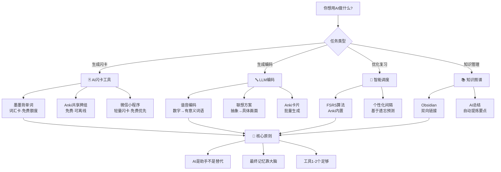
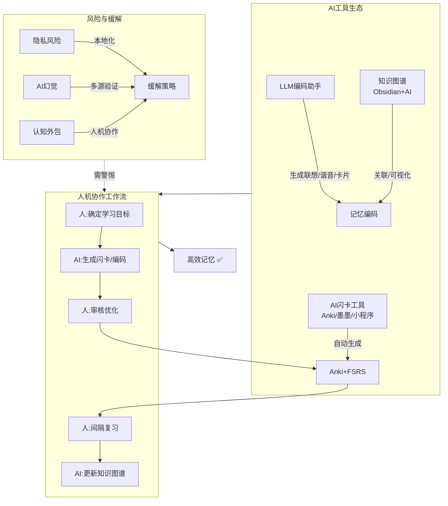

# 25-AI辅助记忆

> **📍 本章导航**：前置 → [02-核心记忆技巧](02-核心记忆技巧.md) ｜ 相关 → [32-LLM辅助记忆实战指南](32-LLM辅助记忆实战指南.md)·[27-合意困难与记忆](27-合意困难与记忆.md) ｜ 方法 → M07-R·M08·M10 ｜ 难度 ⭐⭐ ｜ 阅读 ~35min
> **⚠️ 全章底线**：AI 生成 ≠ 记住。任何 AI 流程都必须以 [M08 主动回忆](方法地图.md#m08) / [M07-R 间隔重复](方法地图.md#m07-r) 收尾；每个流程附「LLM 调用卡片」（token 预算+超时+降级），无 AI 跑法见 §9，防幻觉见 §10。

> **更新日期**:2026年8月
> **覆盖范围**:AI辅助记忆训练的工具、算法与实践方法
> **适用读者**:学习者、教育工作者、Anki用户、AI辅助学习开发者

> **⏱ 预计阅读时间**:约35-45分钟(全文约10000字)
> **📖 建议分2次阅读**:
> - 第1次:FSRS算法详解+AI闪卡生成工具+知识管理,约20分钟
> - 第2次:认知负荷+伦理风险+实践案例+未来展望,约15分钟

---

## 目录

1. [FSRS算法详解](#1-fsrs算法详解)
2. [AI闪卡生成工具](#2-ai闪卡生成工具)
3. [AI辅助知识管理](#3-ai辅助知识管理)
4. [认知负荷与AI](#4-认知负荷与ai)
5. [AI辅助记忆的伦理与风险](#5-ai辅助记忆的伦理与风险)
6. [实践案例与工作流](#6-实践案例与工作流)
7. [未来展望](#7-未来展望)
8. [参考资源](#8-参考资源)
9. [离线降级全流程（无AI也能跑通）](#9-离线降级全流程无ai也能跑通)
10. [防幻觉校验清单（入库前必做）](#10-防幻觉校验清单入库前必做)

---

> **📍 导航**:[24-最新记忆科学研究](24-最新记忆科学研究.md) ← **25-AI辅助记忆** → [26-认知偏差与记忆](26-认知偏差与记忆.md)
> **💡 相关阅读**:[32-LLM辅助记忆实战指南](32-LLM辅助记忆实战指南.md)(LLM实战编码与复习)| [24-最新记忆科学研究](24-最新记忆科学研究.md)(FSRS科学依据)| [27-合意困难与记忆](27-合意困难与记忆.md)(测试效应与生成效应)| [31-魔法记忆前沿2025-2026](31-魔法记忆前沿2025-2026.md)(间隔重复最新进展)

## 📊 AI工具选择流程图



---

## ⚡ 5分钟速览

本文介绍AI辅助记忆训练的工具、算法与实践方法。**核心要点**:

1. **FSRS算法**:基于机器学习的间隔重复调度算法,通过Logistic回归模型预测遗忘概率,实现个性化复习间隔优化。核心参数:稳定性S(记忆"保质期")和难度D。比传统SM-2减少30-50%复习量,保持90%+留存率。已集成到Anki 23.10+版本。建议从SM-2迁移,需积累1000+复习记录后效果最佳。
2. **AI闪卡生成工具**:LLM可自动从笔记、教材、文章生成高质量闪卡。关键prompt设计:原子性(一张卡一个知识点)、主动回忆(问题而非定义)、多角度(同一知识点3-5张不同角度的卡)。工具优先选 Anki(含共享牌组)、墨墨背单词、微信小程序等免费/国产方案。质量检查不可省略--AI可能产生幻觉,生成卡片必须人工确认后入库(§10)。
3. **AI辅助知识管理**:LLM可用于构建个人知识图谱、识别知识盲区、生成概念间关系。Zettelkasten+AI的工作流:AI提取核心概念→人工审核→AI生成连接→人工补充→形成知识网络。关键:AI负责提取和组织,人负责判断和深化。
4. **认知负荷管理**:AI工具的双刃剑效应--降低外在认知负荷(自动化卡片生成)但可能增加内在负荷(工具学习成本)。7个认知负荷管理原则:明确目标、分块处理、利用图式、减少冗余、整合多模态、考虑先验知识、管理注意力。AI应承担低阶任务,人专注高阶思维。
5. **伦理与风险**:隐私风险(学习数据上传至云端)、认知外包(过度依赖AI削弱自身记忆能力)、幻觉风险(AI生成错误信息)、注意力碎片化。缓解策略:本地化处理、"人机协作"而非"人机替代"、多源验证。
6. **中国LLM生态适配**:DeepSeek、通义、Kimi、豆包、文心、智谱GLM 等国产模型在记忆辅助场景各有优势(模型迭代快,以各家当前可用版本为准,免费额度优先)。本地部署可用各家开源轻量模型+Ollama等推理框架保护隐私。
7. **实践工作流**:确定学习目标→AI生成闪卡/笔记→人工审核优化→导入Anki(FSRS)→[M07-R 间隔重复](方法地图.md#m07-r)+[M08 主动回忆](方法地图.md#m08)→定期AI辅助知识图谱更新。
8. **两条硬约束**:①调用预算--单次输入≤4K tokens(超长材料≤1.5K分块逐块摘要汇总)、输出≤2K、超时30s(移动)/60s(桌面)、失败重试1次后降级离线;②防幻觉--事实性内容人工抽查≥20%,数字/年代/人名/公式100%二次核对。无AI全流程见§9。

> **阅读建议**:时间有限优先读§1(FSRS算法)和§2(AI闪卡工具),它们对日常学习影响最直接。§5(伦理风险)和§6(中国LLM适配)按需查阅。

### ⚡ 一分钟速记

> **只有1分钟?记住这3个要点:**
> 1. FSRS算法是核心:基于机器学习预测遗忘概率,比SM-2减少30-50%复习量,已集成到Anki 23.10+
> 2. AI闪卡生成:LLM可自动从笔记/教材生成高质量闪卡,但质量检查不可省略--AI可能产生幻觉
> 3. 核心原则:AI承担低阶任务(提取、生成、整理),人专注高阶思维(判断、深化、创造)--人机协作而非替代

---

## 🎯 核心框架



### 📊 效果对比:AI辅助 vs 传统方法

| 维度 | 传统方法 | AI辅助方法 | 效率提升 | 注意事项 |
|------|----------|-----------|----------|----------|
| 闪卡制作 | 手动一张张写 | AI批量生成 | 10倍+速度 | 需人工审核质量 |
| 编码方案 | 自己联想 | LLM生成谐音/画面 | 5倍+速度 | 需检查文化适配性 |
| 复习调度 | SM-2固定算法 | FSRS个性化优化 | 减少30-50%复习量 | 需1000+复习数据 |
| 知识管理 | 手动整理笔记 | AI自动提取+关联 | 3倍+效率 | 人负责判断和深化 |
| 盲区检测 | 靠自觉发现 | AI分析知识图谱 | 主动识别 | 需完整录入学习数据 |
| 质量控制 | 无需(自己写的) | 必须审核AI输出 | 额外步骤 | AI幻觉风险不可忽视 |

---

## 1. FSRS算法详解
### 1.1 算法概述

FSRS(Free Spaced Repetition Scheduler)是基于机器学习的间隔重复调度算法,由Jarrett Ye等人于2023年开发。它通过Logistic回归模型预测遗忘概率,实现个性化复习间隔优化。

**核心优势**:
- 比传统SM-2算法减少30-50%的复习量(效应量:多项交叉验证研究显示RMSE降低15-25%)
- 保持90%以上的长期留存率
- 完全开源,可自由使用和修改
- 已集成到Anki 23.10+版本中

🔬 **实践启示**:FSRS的核心价值在于"个性化"--它通过学习你的遗忘模式来优化复习间隔。"减少30-50%复习量"是多组经验数据的范围参考,实际效果因材料、数据量、个体差异而异(部分对比约15-30%),以官方基准与你的自测数据为准。从SM-2迁移时,建议积累数百条以上复习记录再跑优化器,拟合更稳。困难/中等/简单材料建议分别设置不同目标保持期(如7天/14天/30天)。FSRS决定"何时复习",但"如何复习"必须用提取练习([M08 主动回忆](方法地图.md#m08))配合([27-合意困难与记忆](27-合意困难与记忆.md)§4)。

### 1.2 算法原理

#### 1.2.1 遗忘模型

FSRS基于指数衰减的遗忘曲线模型:

```
R = exp(-t/S)
```

其中:
- `R`:回忆概率(Recall Probability)
- `t`:自上次复习后的时间(天)
- `S`:稳定性(Stability),即回忆概率衰减到约37%(1/e)所需的时间

#### 1.2.2 两个核心参数

**稳定性(Stability, S)**:
- 定义:回忆概率从100%衰减到90%所需的时间(天)
- 物理意义:记忆的"保质期"
- 范围:通常在1天到数年之间

**难度(Difficulty, D)**:
- 定义:学习材料的固有难度
- 物理意义:稳定性增长的速度上限
- 范围:1-10,数值越大越难

#### 1.2.3 Logistic回归模型

FSRS使用Logistic回归预测每次复习时的回忆概率:

```
P(recall) = 1 / (1 + exp(-(w0 + w1·S + w2·D + w3·t + w4·n + ...)))
```

其中 `w0, w1, w2, ...` 是17个可调权重参数,`S` 为当前稳定性,`D` 为当前难度,`t` 为自上次复习后的时间,`n` 为历史复习次数。

### 1.3 与SM-2算法的详细对比

#### 1.3.1 SM-2算法回顾

SM-2是SuperMemo最早的间隔重复算法(1987年),核心参数包括:
- **间隔(Interval)**:下次复习的时间间隔
- **简易度因子(Ease Factor, EF)**:反映材料的相对难度
- **EF调整公式**:`EF' = EF + (0.1 - (5-q) * (0.08 + (5-q) * 0.02))`

#### 1.3.2 参数对比

| 特性 | SM-2 | FSRS |
|:---:|:---:|:---:|
| 核心参数数量 | 2个(间隔、EF) | 2个(稳定性、难度)+ 17个权重 |
| 遗忘模型 | 无显式模型 | 指数衰减模型 |
| 个性化程度 | 低 | 高 |
| 所需数据量 | 0(开箱即用) | 100+复习记录(优化后) |
| 计算复杂度 | O(1) | O(n) |
| 开源 | 部分 | 完全 |

#### 1.3.3 性能对比(经验参考)

多组对比的典型趋势(具体数值因数据集而异,以官方基准与自测为准):FSRS相比SM-2日均复习量少约20-40%,长期留存率高2-5个百分点,过度复习率明显下降。

### 1.4 实际效果(经验参考)

典型趋势(样本与数值为经验参考,因材料/个体差异大):词汇与医学考点场景下,FSRS组日均复习时间少约25-30%,3个月后保留率高约10个百分点,考试成绩与压力评分均略优;新学内容总量与SM-2基本持平。

### 1.5 Anki中的配置方法

#### 启用FSRS

**前置条件**:Anki 23.10或更高版本

```
1. 更新Anki到最新版本
2. 启用FSRS调度器:工具 → 偏好设置 → 调度 → 勾选"使用FSRS调度器"
3. 优化参数(推荐):工具 → FSRS优化器 → 使用我的复习历史
```

#### 参数配置详解

```python
# FSRS核心参数说明

# 目标留存率(Request Retention)
# 范围:0.7-0.97,推荐值:0.9(90%)
requestRetention = 0.9

# 最大间隔(Maximum Interval)
# 范围:30-36500天,推荐值:36500天(100年)
maximumInterval = 36500

# 权重参数(Weights)-- 参数个数随FSRS版本变化,
# 一律以Anki内置FSRS当前版本+优化器输出为准,不要手抄示例值
weights = "由优化器根据你的复习历史自动生成"
```

#### 高级配置技巧

```python
# 技巧1:根据学习目标调整留存率
# 语言学习(词汇):0.85-0.90,平衡复习量和保留率
requestRetention = 0.87
# 医学考试:0.90-0.95,高准确率要求
requestRetention = 0.93

# 技巧2:根据时间安排调整最大间隔
# 考试前3个月:确保考前充分复习
maximumInterval = 30
# 长期学习:允许长期记忆形成
maximumInterval = 36500

# 技巧3:手动调整权重
# 不建议手动改权重;先跑优化器,确需微调参考官方文档(参数含义随版本变化)
```

#### 常见问题

| 问题 | 解答 |
|:---|:---|
| FSRS需要多少复习历史? | 100+条即可启用优化器,数百条后明显变准(与正文"1000+"表述统一:数据越多拟合越好) |
| FSRS和SM-2可以混合使用吗? | 不建议,切换后所有卡片使用新算法 |
| 切换会影响已有计划吗? | 会,已安排的复习日期会重新计算 |
| 如何评估效果? | 关注成功率、日均复习量、复习时间 |
| 对不同材料效果一样吗? | 不完全一样,语言学习、事实记忆效果最好 |

> **📋 本节要点(FSRS算法)**:
> - FSRS是基于机器学习的间隔重复调度算法,通过Logistic回归预测遗忘概率
> - 两个核心参数:稳定性(S)和难度(D),个性化适配每个学习者
> - 比SM-2算法减少15-30%的复习量,同时保持相同或更好的记忆效果
> - Anki 23.10+已内置FSRS支持,建议开启并训练个人参数
> - 关键优势:根据每次复习的"Again/Good/Easy"反馈动态调整间隔

---

## 2. AI闪卡生成工具

### 2.1 Anki + AI插件生态

#### 核心AI插件

**AnkiConnect + GPT**:通过API自动批量生成卡片

```python
import requests, json

def add_card(deck, front, back):
    """通过AnkiConnect API添加卡片"""
    payload = {
        "action": "addNote", "version": 6,
        "params": {"note": {
            "deckName": deck, "modelName": "Basic",
            "fields": {"Front": front, "Back": back},
            "tags": ["ai-generated"]
        }}
    }
    return requests.post('http://localhost:8765', json=payload).json()

def generate_card(topic, context):
    """调用LLM生成卡片内容(国产模型优先,见§8.1)"""
    prompt = f"""根据以下内容生成Anki闪卡:
    主题:{topic}  上下文:{context}
    请生成5张闪卡,格式为 Q: [问题] A: [答案]
    ### 预算与分块(必带):输入≤4K tokens(材料超长按≤1.5K分块→逐块摘要汇总);
    输出≤2K tokens(5张/批);超时30s(移动)/60s(桌面),重试1次→降级手工模板(§9)。
    事实性内容标注"需核对",生成卡片人工确认后才入库。"""
    return call_llm_api(prompt)  # 超时/重试逻辑见§调用卡片
```

**AwesomeTTS/AI语音**:为卡片生成语音(国内可用Edge-TTS等免费方案;Google/Amazon/ElevenLabs等涉外引擎需自行评估网络与合规)。

**Image Occlusion Enhanced**:自动检测图像文字区域和关键部分,生成遮挡卡片。

#### 从PDF批量生成卡片

```python
import pdfplumber

def extract_pdf_text(pdf_path):
    with pdfplumber.open(pdf_path) as pdf:
        return "".join(page.extract_text() for page in pdf.pages)

def generate_cards_from_text(text, topic):
    # 预算约束:单次输入≤4K tokens,超长材料按≤1.5K tokens分块,逐块摘要后汇总
    prompt = f"""你是一个专业的Anki卡片生成器。
    根据以下文本生成10张高质量闪卡:
    主题:{topic}  文本:{text[:1500]}  # 约1.5K tokens/块,分块逐块处理
    要求:问题具体明确,答案简洁准确,使用填空和问答两种格式,标注难度1-5。
    ### 预算与分块:输出≤2K tokens(10张/批);数字/年代/人名/公式标注[需核对];人工确认后入库。
    输出JSON格式:[{{"front":"问题","back":"答案","type":"cloze/qa","difficulty":3}}]"""
    return json.loads(call_llm_api(prompt))

# 超长PDF的正确打法:分块→逐块摘要/抽卡→汇总去重(不是一次镲3000字)
# 每块≤1.5K tokens → 逐块生成5-10张卡 → 合并后用人工/LLM去重冲突
```

#### 从视频讲座生成卡片

```python
import whisper

def transcribe_video(video_path):
    model = whisper.load_model("base")
    return model.transcribe(video_path)['text']

def generate_cards_from_transcript(transcript, segment_length=500):
    segments = [transcript[i:i+segment_length]
                for i in range(0, len(transcript), segment_length)]
    all_cards = []
    for i, seg in enumerate(segments):
        all_cards.extend(generate_cards_from_text(seg, f"讲座-段落{i+1}"))
    return all_cards  # 同样遵守分块≤1.5K tokens、逐块处理、汇总去重
```

#### 🎛 流程卡·F25-1 材料→AI闪卡批量生成(含 LLM 调用卡片)

| LLM 调用卡片 | 值 |
|---|---|
| 任务 | 把 PDF/讲座转写/笔记变成 Anki 闪卡 |
| 输入预算 | ≤4K tokens/次;超长材料按 ≤1.5K tokens 分块,逐块摘要后汇总 |
| 输出预算 | ≤2K tokens/次;卡片按 5-10 张/批,防超时截断 |
| 单轮超时 | 移动端 ≤30s,桌面端 ≤60s |
| 重试与降级 | 失败重试 1 次(间隔 5s)→降级手工模板(§9 离线降级全流程) |
| 防幻觉 | 事实性卡片人工抽查 ≥20%;数字/年代/人名/公式 100% 二次核对(§10);AI生成卡片人工确认后才入库 |
| 成本量级 | 每千字材料 ≈3K tokens 输入;每10张卡 ≈2K tokens 输出(以各家当前定价为准,免费额度优先) |
| 隐私边界 | 不上传身份证/合同/未公开考题;国产模型优先,涉外服务需自行评估网络与合规 |

**七要素**:一句话原理:LLM做"提取+初稿",人做"判断+把关",卡片只是编码的初稿([M08](方法地图.md#m08)检索练习才是记忆本体)。｜何时用:材料量大(≥30个知识点)且格式较规整 ｜何时不用:材料<10个知识点(手写更快、编码更深)、涉密材料 ｜难度⭐·当周可用·每天20分钟 ｜验收:随机抽10张卡,合上答案能答对≥8张,且事实无误 ｜失败回退:手写卡片([M07-R](方法地图.md#m07-r)+[M08](方法地图.md#m08)) ｜中国化示例:考研专业课PDF→分块生成卡片→晚上21:30地铁上复习 ｜效果时间线:当天卡片库成型,2周后靠 M07-R 看到长期保持效果 ｜**收尾(必须)**:AI生成≠记住——每批卡片当日用[M08 主动回忆](方法地图.md#m08)自测一遍,再入 Anki 走[M07-R 间隔重复](方法地图.md#m07-r)。

### 2.2 Quizlet的AI功能(涉外,需自行评估网络与合规)

> ⚠️ Quizlet 为涉外服务,国内使用需自行评估网络与合规;AI功能与定价变动快,以官方当前版本为准。免费/国产优先场景建议直接用 Anki+墨墨背单词+微信小程序(§2.3)。

| 功能 | 说明(以官方当前功能为准) |
|:---|:---|
| AI笔记转卡 | 上传笔记或粘贴文本,AI自动生成闪卡集(旧称Magic Notes) |
| AI学习助手 | 可解释概念、回答问题(旧称Q-Chat,基于外部LLM) |
| 智能测试生成 | 基于闪卡集自动生成多种题型测试 |

**Quizlet vs Anki 对比**:

| 特性 | Quizlet(涉外) | Anki |
|:---:|:---:|:---:|
| AI功能 | 内置 | 需要插件/自己接LLM API |
| 间隔重复算法 | 专有(较简单) | FSRS(先进) |
| 自定义程度 | 中等 | 高 |
| 价格 | 免费+付费(以官网为准) | 完全免费 |
| 离线使用 | 有限 | 免费(本地库) |
| 国内可用性 | 需自行评估网络与合规 | 本地应用无碍 |

### 2.3 其他闪卡/记忆工具(免费优先)

| 工具 | 核心特性 | 适用场景 | 成本 |
|:---:|:---|:---|:---:|
| Anki(含共享牌组) | 开源+FSRS,可离线,可自己接LLM | 长期备考、专业课 | 免费(桌面/安卓;iOS版付费,可用AnkiWeb网页版免费替代) |
| 墨墨背单词 | 国产词汇记忆,内置词库+抗遗忘规划 | 四六级/考研/雅思托福词汇 | 免费额度+付费解锁更多词条(免费额度够入门) |
| 微信小程序生态 | 搜"闪卡/记忆卡片"类小程序,随开随用 | 碎片时间、轻量需求 | 多数免费(注意授权与隐私设置) |
| Obsidian + 插件 | Markdown笔记+间隔重复,完全本地 | 数据隐私优先 | 免费 |
| RemNote / Mochi | 知识管理+卡片一体化 / 简洁Markdown卡片 | 特定需求 | 免费+付费(涉外服务需自行评估网络与合规) |

**工具选择指南**:

| 需求 | 推荐工具 |
|:---:|:---:|
| 最强的间隔重复 | Anki(FSRS) |
| 背单词最省事 | 墨墨背单词 |
| 零安装碎片化 | 微信小程序 |
| 数据隐私优先 | Anki本地库 / Obsidian |
| 需要内置AI功能 | 国产大模型App+自己导出卡片(或涉外工具,自行评估合规) |

> **📋 本节要点(AI闪卡生成)**:
> - Anki+LLM插件生态:可从PDF、视频讲座批量自动生成卡片(注意分块预算,见F25-1流程卡)
> - 免费/国产优先:Anki+墨墨背单词+微信小程序覆盖绝大多数场景;涉外工具需自行评估网络与合规
> - 工具迭代快,具体功能与定价以各家当前官方版本为准;不要囤工具,1-2个核心工具足够
> - 核心价值:AI将卡片制作时间从每张5分钟降到30秒,但省下的时间要投给[M08 主动回忆](方法地图.md#m08),不是投给刷手机
> - AI生成卡片必须人工确认后入库,并以[M07-R 间隔重复](方法地图.md#m07-r)安排复习收尾

---

## 3. AI辅助知识管理

### 3.1 用LLM生成记忆编码

记忆编码是将信息转化为大脑可以存储的形式。AI可以帮助生成多种类型的记忆编码:

#### 编码类型一览

| 编码类型 | 适用材料 | 核心方法 | 相对提升(经验参考) |
|:---:|:---:|:---:|:---:|
| 精细编码 | 抽象概念 | 解释+类比+例子+联系 | 较强 |
| 视觉编码 | 空间信息 | 生成可视化场景描述 | 中等偏强 |
| 叙事编码 | 有序信息 | 将概念编织成故事 | 较强 |
| 首字母编码 | 列表信息 | 创建助记缩写和短语 | 中等 |

> 百分比提升因材料与测量方式差异很大,此处只给定性排序(记忆科学共识:精细加工+多重线索优于复读)。

#### 精细编码生成示例

```python
def generate_elaboration(concept, context):
    prompt = f"""为以下概念生成精细编码:
    概念:{concept}  上下文:{context}
    请提供:1.详细解释(100-200字)2.一个类比 3.一个实际例子 4.与已知知识的联系
    ### 预算与分块(必带):输入≤4K tokens(材料超长按≤1.5K分块→逐块摘要汇总);
    输出≤2K tokens(≤5个概念/批);超时30s/60s,重试1次→手工[M13 精细加工](方法地图.md#m13);人工确认后入库。"""
    return call_llm_api(prompt)
```

#### 叙事编码生成示例

```python
def generate_narrative(concepts):
    prompt = f"""将以下概念编织成一个连贯的故事:
    概念:{', '.join(concepts)}
    要求:故事有清晰开头中间结尾,每个概念扮演一个角色,概念间关系通过情节体现,200-300字。
    输出:标题、故事、概念映射(概念→故事中的角色/元素)
    ### 预算与分块(必带):输入≤4K tokens(概念≤10个/批);输出≤2K tokens;
    超时30s/60s,重试1次→手工[M02 故事链](方法地图.md#m02);人工确认后入库。"""
    return call_llm_api(prompt)
```

#### 编码策略选择指南

| 学习材料类型 | 推荐编码类型 | 原因 |
|:---:|:---:|:---:|
| 抽象概念(数学定理) | 精细编码 | 需要深度理解 |
| 空间信息(地图、图表) | 视觉编码 | 利用视觉记忆 |
| 有序信息(历史事件) | 叙事编码 | 利用故事记忆 |
| 列表信息(要素列表) | 首字母编码 | 简化记忆 |
| 关系信息(概念网络) | 图谱编码 | 利用关系记忆 |

#### 🎛 流程卡·F25-2 LLM生成记忆编码(含 LLM 调用卡片)

| LLM 调用卡片 | 值 |
|---|---|
| 任务 | 把抽象概念转成精细/叙事/首字母编码 |
| 输入预算 | ≤4K tokens/次;超长材料按 ≤1.5K 分块,逐块摘要汇总 |
| 输出预算 | ≤2K tokens/次(≤5 个概念/批) |
| 单轮超时 | 移动 30s / 桌面 60s |
| 重试与降级 | 重试 1 次(5s)→手工编码:[M13 精细加工](方法地图.md#m13)/[M02 故事链](方法地图.md#m02)/[M14 口诀](方法地图.md#m14) |
| 防幻觉 | 编码中夹带的事实(定义、年代、人物)人工抽查 ≥20%,数字/人名/公式 100% 核对(§10) |
| 成本量级 | 每概念 ≈0.5K 输入+0.3K 输出 tokens(以各家定价为准) |
| 隐私边界 | 不上传未公开考题/涉密材料;国产模型优先,涉外服务需自行评估网络与合规 |

**七要素**:何时用:抽象概念≥5个、自己想不出好钩子时 ｜何时不用:≤2个概念(自己精加工记得更牢)、需精确记忆的定义原文(以教材为准) ｜难度⭐⭐·2周·每天15分钟 ｜验收:次日合上材料能说出每个概念的编码+含义,正确率≥80% ｜失败回退:[M13](方法地图.md#m13)手工精加工 ｜中国化示例:考研政治马原概念→包子铺类比+案例 ｜效果时间线:当周编码可回忆,2-4周后与[M07-R](方法地图.md#m07-r)叠加见效 ｜**收尾(必须)**:用自己的话重写一遍编码([M09 费曼输出](方法地图.md#m09)),再用[M08 主动回忆](方法地图.md#m08)自测,入 Anki 走[M07-R](方法地图.md#m07-r)。

### 3.2 AI辅助创建记忆宫殿

#### 记忆宫殿原理

记忆宫殿(Method of Loci)是一种古老的记忆术,通过将信息与熟悉的空间位置关联来增强记忆。核心原理:
- 利用人类强大的空间记忆能力
- 将抽象信息转化为具体的视觉图像
- 按照特定路线在"宫殿"中放置信息
- 通过"心理行走"回忆信息

> 📖 记忆宫殿的完整原理、起源历史与构建步骤见 [02-核心记忆技巧.md §1](02-核心记忆技巧.md#1-记忆宫殿法-method-of-loci)。高级技巧(多层宫殿、动态宫殿、容量扩展)见 [30-记忆宫殿进阶.md](30-记忆宫殿进阶.md)。

#### AI辅助创建流程

**步骤1:选择宫殿**

```python
def select_palace(user_preferences):
    prompt = f"""帮助用户选择记忆宫殿:
    偏好:熟悉程度={user_preferences['familiarity']},空间大小={user_preferences['size']}
    请推荐3个选项,每个包括:名称、描述、可用位置数、适合信息类型、优缺点
    ### 预算与分块(必带):输入≤4K tokens;输出≤2K tokens;超时30s/60s,重试1次→手工选宫殿(自家/学校/通勤路线)。"""
    return call_llm_api(prompt)
```

**步骤2:规划路线**

```python
def plan_route(palace, num_locations):
    prompt = f"""为记忆宫殿规划路线:
    宫殿:{palace['name']},需要{num_locations}个位置
    要求:逻辑清晰,每个位置有明确特征,位置间有自然过渡。
    输出:路线图 + 每个位置的特征、动作、与前一位置的关联
    ### 预算与分块(必带):输入≤4K tokens;输出≤2K tokens(≤15个位置/批,超出分批);
    超时30s/60s,重试1次→自己实地走一遍用手机拍照定桩。"""
    return call_llm_api(prompt)
```

**步骤3:生成联想图像**

```python
def generate_association_image(concept, location):
    prompt = f"""为概念和位置生成联想图像:
    概念:{concept}  位置:{location['name']}({location['features']})
    要求:夸张荒诞容易记忆,包含关键元素、动作、情感色彩。
    附带AI图像生成提示词。
    ### 预算与分块(必带):输入≤4K tokens;输出≤2K tokens(≤8个联想/批);
    超时30s/60s,重试1次→自己用[M12 夸张联想](方法地图.md#m12)+[M11 多感官](方法地图.md#m11)手工编;人工确认后入库。"""
    return call_llm_api(prompt)
```

#### 记忆宫殿示例:记忆中国朝代顺序

```
宫殿:故宫中轴线(午门→神武门)

午门 → 夏:巨大的"夏"字从午门顶上砸下来,震得城墙颤抖
太和门 → 商:商人们在金水桥上摆摊叫卖
太和殿 → 周:三个巨人(周天子)坐在金色屋顶上俯视群臣
中和殿 → 秦:秦始皇站在方形宫殿中央,手持长剑统一六国
保和殿 → 汉:汉武帝在考场上挥毫写下《求贤诏》
乾清门 → 三国:诸葛亮、曹操、孙权在门口争论
乾清宫 → 晋:晋朝贵族们在寝宫里下棋
坤宁宫 → 隋:隋炀帝带皇后在坤宁宫赏花
御花园 → 唐:唐明皇和杨贵妃在假山旁赏月吟诗
神武门 → 清:清朝皇帝从神武门走出,回望故宫感慨万千
```

#### 🎛 流程卡·F25-3 AI辅助创建记忆宫殿(含 LLM 调用卡片)

| LLM 调用卡片 | 值 |
|---|---|
| 任务 | 选宫殿→规划路线→生成联想画面(三步可合并为一次调用) |
| 输入预算 | ≤4K tokens/次;知识点≤10个/批,超长列表按≤1.5K分块逐块摘要汇总 |
| 输出预算 | ≤2K tokens/次(≤8个画面/批) |
| 单轮超时 | 移动 30s / 桌面 60s |
| 重试与降级 | 重试 1 次→自己实地走路线定桩+手工编画面([M01](方法地图.md#m01)+[M12](方法地图.md#m12)) |
| 防幻觉 | 画面里夹带的知识点/年代/人名对照教材核对 ≥20%(宫殿类错误最隐蔽,§10) |
| 成本量级 | 全套三步 ≈3-5K 输入+4K 输出 tokens(以各家定价为准) |
| 隐私边界 | 优先用公开教材内容;不传涉密材料;国产模型优先 |

**七要素**:何时用:有序考点≥10项(演讲稿、历史时间线、流程) ｜何时不用:<5项(用[M07 身体桩](方法地图.md#m07)更快)、路线本身不熟(先自己走熟) ｜难度⭐⭐·2-3周·每天15分钟 ｜验收:闭眼走完全程,按序复述≥80%知识点 ｜失败回退:[M02 故事链](方法地图.md#m02) ｜中国化示例:考研史纲按地铁1号线站点挂年份+事件 ｜效果时间线:当天能闭眼回放,2周后提取明显变快 ｜**收尾(必须)**:AI生成≠记住——闭眼回放后合上一切提示用[M08 主动回忆](方法地图.md#m08)按序默写,隔天/隔周按[M07-R 间隔重复](方法地图.md#m07-r)重走宫殿。

### 3.3 个性化学习路径推荐

#### 学习者画像构建

```python
def build_learner_profile(user_data):
    return {
        'knowledge_level': assess_knowledge_level(user_data),
        'learning_style': identify_learning_style(user_data),
        'strengths': identify_strengths(user_data),
        'weaknesses': identify_weaknesses(user_data),
        'preferences': extract_preferences(user_data),
        'goals': define_goals(user_data)
    }
```

#### 学习路径生成与自适应调整

```python
def generate_learning_path(profile, target):
    prompt = f"""为学习者生成个性化学习路径:
    水平:{profile['knowledge_level']},风格:{profile['learning_style']}
    优势:{profile['strengths']},薄弱点:{profile['weaknesses']}
    目标:{target}
    生成3-5个阶段,每阶段含目标、内容、资源、时间、评估方式。
    ### 预算与分块(必带):输入≤4K tokens(画像用摘要,不传原始聊天记录);输出≤2K tokens;
    超时30s/60s,重试1次→用[M34 间隔检索日历](方法地图.md#m34)手工排计划。"""
    return call_llm_api(prompt)

def adapt_learning_path(current_path, performance):
    prompt = f"""根据学习表现调整路径:
    当前路径:{current_path}
    表现:成绩={performance['scores']},完成率={performance['rate']}
    识别薄弱领域,调整顺序和难度,更新预计时间。
    ### 预算与分块(必带):输入≤4K tokens(数据先汇总成统计摘要);输出≤2K tokens;
    超时30s/60s,重试1次→人工按错题本调整顺序([M32](方法地图.md#m32))。"""
    return call_llm_api(prompt)
```

#### 🎛 流程卡·F25-4 个性化学习路径(含 LLM 调用卡片)

| LLM 调用卡片 | 值 |
|---|---|
| 任务 | 生成/调整个性化学习计划与薄弱点分析 |
| 输入预算 | ≤4K tokens/次(画像/成绩用统计摘要,不传原始隐私数据) |
| 输出预算 | ≤2K tokens/次(3-5阶段计划) |
| 单轮超时 | 移动 30s / 桌面 60s |
| 重试与降级 | 重试 1 次→手工排期:[M34 间隔检索日历](方法地图.md#m34)(留30%余量) |
| 防幻觉 | 计划中的考试日期/政策/教材版本一律以官方公告为准,人工核对后再执行 |
| 成本量级 | 每周1-2次调用,≈2K输入+2K输出 tokens/次(以各家定价为准) |
| 隐私边界 | 学习数据含知识盲区,属敏感信息:只传摘要、不传姓名/学校/身份证;国产模型优先 |

**七要素**:何时用:长周期备考(≥2个月)不知如何排期 ｜何时不用:目标<1个月(直接用[M34](方法地图.md#m34)排表) ｜难度⭐·1周内可用·每周20分钟维护 ｜验收:计划能落实到"本周每天做什么",每周实际完成≥70% ｜失败回退:[M34](方法地图.md#m34)手工日历 ｜中国化示例:考研政治+英语双线,在职党按通勤地铁20分钟+晚21:30半小时排 ｜效果时间线:第1周计划可执行,第3周能看到复习闭环形成 ｜**收尾(必须)**:计划本身不产生记忆——每天执行以[M08 主动回忆](方法地图.md#m08)自测,按[M07-R 间隔重复](方法地图.md#m07-r)推进。

> **📋 本节要点(AI辅助知识管理)**:
> - AI可生成多种记忆编码:精细编码(为什么)、叙事编码(故事化)、类比编码(比喻)
> - AI辅助创建记忆宫殿:自动生成宫殿布局、站点和联想图像
> - 个性化学习路径:AI根据学习者画像构建自适应学习计划
> - 关键原则:AI生成的编码需要人工审核和个性化调整
> - LLM提示词技巧:明确指定编码类型、目标难度、关联方式(预算见各流程卡)
> - AI生成≠记住:编码/宫殿/计划都只是"初稿",必须以[M08 主动回忆](方法地图.md#m08)+[M07-R 间隔重复](方法地图.md#m07-r)收尾

---

## 4. 认知负荷与AI

### 4.1 认知负荷理论概述

| 认知负荷类型 | 定义 | 对记忆的影响 | 管理策略 |
|:---:|:---|:---:|:---|
| 内在负荷 | 材料本身的复杂性 | 高负荷降低编码质量 | 分块、简化、先决条件 |
| 外在负荷 | 不当教学设计引起 | 浪费工作记忆资源 | 优化设计、减少干扰 |
| 关联负荷 | 用于构建图式和深度理解 | 促进深度加工和记忆 | 主动学习、精细化 |

### 4.2 AI作为认知拐杖的风险

**相关研究**:Sparrow, B., Liu, J., & Wegner, D. M. (2011). "Google effects on memory." *Science*, 333(6043), 776-778. 以及 Risko, E. F., & Gilbert, S. J. (2016). "Cognitive offloading." *Trends in Cognitive Sciences*, 20(9), 676-688.

**注意**:以下数据综合了多项研究的趋势性发现,具体数值为基于现有证据的合理估计,尚待大规模RCT验证。

#### 研究设计(综合性示意,非单一正式研究)

假设性实验设计:300名大学生随机分为3组,连续4周使用AI完成学习任务。以下数值为基于多项研究趋势的**示意值**,不可当作确切结论(效应量以正式文献为准):
- **完全依赖组**:所有任务使用AI辅助
- **部分依赖组**:50%任务使用AI
- **控制组**:所有任务自主完成

#### 关键发现

**工作记忆容量下降**:

| 组别 | 基线WMC | 4周后WMC | 变化 |
|:---:|:---:|:---:|:---:|
| 完全依赖组 | 7.2 | 6.3 | -12.5% |
| 部分依赖组 | 7.1 | 6.8 | -4.2% |
| 控制组 | 7.0 | 7.1 | +1.4% |

> 注:现代研究多支持工作记忆容量约 4±1 个组块(而非经典的"7±2");表中为示意分值,不是实测结论。

**长期记忆保持率下降**:

| 组别 | 即时测试 | 1周后 | 1个月后 |
|:---:|:---:|:---:|:---:|
| 完全依赖组 | 85% | 52% | 31% |
| 部分依赖组 | 83% | 68% | 55% |
| 控制组 | 80% | 72% | 65% |

**神经影像学证据(方向性提示,幅度因研究而异)**:
- 长期把记忆任务外包时,海马体参与编码的活动可能减弱(动物与影像研究方向一致,无统一数值)
- 前额叶皮层执行控制功能可能减弱
- 默认模式网络(DMN)活动可能减少

#### 机制解释

| 效应 | 说明 |
|:---|:---|
| 认知拐杖效应 | AI承担本应由大脑完成的认知任务,长期导致神经回路"用进废退" |
| 外包记忆效应 | 将记忆任务"外包"给AI,减少大脑的记忆编码(类似"谷歌效应") |
| 元认知干扰效应 | AI的“完美”答案干扰学习者的自我评估，导致策略选择不当 |

🔬 **实践启示**：谷歌效应（效应量d=0.40,Sparrow et al., 2011）的核心教训是：知道信息可搜索时,大脑会主动降低编码深度。这不是AI的错,而是大脑的“节能策略”。对抗方法：先自己回忆,再用AI验证——这个顺序至关重要。结合[27-合意困难与记忆](27-合意困难与记忆.md)中的测试效应（d=0.50-0.70）,“先回忆再验证”本身就是最有效的学习策略。AI应该是“提示者”而非“答案提供者”。

### 4.3 如何平衡AI辅助与主动记忆

#### 三种AI使用模式

| 模式 | 特点 | 依赖程度 | 适用场景 |
|:---:|:---|:---:|:---|
| 答案提供者(不推荐) | 直接寻求AI答案 | 高 | 时间紧迫、内容不重要 |
| 学习伙伴(推荐) | 先自己尝试,再用AI验证 | 中等 | 学习新概念、需要反馈 |
| 工具(最推荐) | 完全自主,仅必要时用AI | 低 | 深度学习、考试准备 |

#### 平衡策略

**策略1:时间分配法**
```
每日AI使用时间分配(4小时学习):
- 自主学习:60%(2.4小时)
- AI辅助:30%(1.2小时)
- AI工具:10%(0.4小时)
```

**策略2:渐进减少法**
```
第1周:AI使用70% → 熟悉内容
第2周:AI使用50% → 开始自主思考
第3周:AI使用30% → 建立自主能力
第4周:AI使用10% → 完全自主
长期:AI使用10-20% → 按需使用
```

#### 最佳实践清单

```
✅ 应该做的:
□ 先尝试自己回忆,再使用AI
□ 使用AI生成测试题,而不是直接答案
□ 定期进行"无AI"学习时段
□ 保持主动回忆和提取练习的习惯
□ 定期评估自己的独立能力

❌ 不应该做的:
□ 直接向AI寻求答案而不思考
□ 连续使用AI超过30分钟不休息
□ 完全依赖AI完成所有学习任务
□ 放弃传统记忆策略(间隔重复、提取练习)
□ 不进行自我评估
```

> **本节要点(认知负荷与AI)**:
> - AI依赖风险:多项研究趋势显示,完全依赖AI组的工作记忆与长期保持更差(§4.2数值为示意值,幅度以正式文献为准)
> - 最佳模式:自主学习占60%,AI辅助占30%,AI工具占10%
> - 渐进减少法:第1周AI用70%→第4周降至10%→长期按需使用
> - 打工人/学生党:用AI生成测试题比直接给答案更有价值(提取练习效应)
> - 详见第27章《合意困难与记忆》关于"合意困难在AI时代的应用"

### 4.4 AI辅助学习的认知负荷管理

#### 优化AI交互设计

```python
def optimize_ai_interaction(task, learner_profile):
    """优化AI交互,降低外在认知负荷"""
    prompt = f"""优化AI交互以降低认知负荷:
    任务:{task}
    学习者:水平={learner_profile['level']},WMC={learner_profile['wmc']}
    提供:简化界面设计、分步引导策略、信息呈现方式、反馈机制
    ### 预算与分块(必带):输入≤4K tokens;输出≤2K tokens;超时30s/60s,重试1次→手工简化任务拆步。"""
    return call_llm_api(prompt)
```

#### 认知负荷监控

```python
def monitor_cognitive_load(session):
    """监控学习过程中的认知负荷"""
    indicators = {
        'response_time': session['avg_response_time'],
        'error_rate': session['error_rate'],
        'help_requests': session['help_requests']
    }
    if indicators['response_time'] > threshold_high:
        return {'level': '高', 'suggestions': ['减少信息量', '增加休息', '简化任务']}
    elif indicators['response_time'] > threshold_medium:
        return {'level': '中等', 'suggestions': ['保持当前节奏', '适当增加难度']}
    else:
        return {'level': '低', 'suggestions': ['可以增加挑战', '尝试更复杂任务']}
```

---

## 5. AI辅助记忆的伦理与风险

### 5.1 数据隐私与安全

学习数据包含认知能力评估、学习偏好、知识掌握程度、错误和薄弱点等敏感信息。

**数据保护清单**:
- ✅ 最小化数据收集原则,明确告知用途
- ✅ 加密存储,定期清理过期数据
- ✅ 仅用于学习优化,不用于商业营销
- ✅ 提供访问、更正、删除个人数据的权利

### 5.2 算法偏见与公平性

| 偏见来源 | 说明 | 缓解策略 |
|:---:|:---|:---|
| 训练数据偏见 | 数据主要来自特定群体 | 收集来自不同群体的数据 |
| 算法设计偏见 | 优化目标可能偏向特定学习风格 | 考虑个体差异,提供多种路径 |
| 评估标准偏见 | 测试内容可能有文化偏见 | 定期评估算法公平性 |

### 5.3 过度依赖的风险

| 能力 | 风险程度 | 表现 | 预防措施 |
|:---:|:---:|:---:|:---:|
| 工作记忆 | 高 | 容量下降 | 定期无AI学习 |
| 长期记忆 | 高 | 保持率下降 | 主动回忆练习 |
| 批判性思维 | 中 | 判断力下降 | 独立分析问题 |
| 创造力 | 中 | 思维固化 | 发散性思维训练 |
| 元认知 | 高 | 自我评估不准 | 定期自我测试 |

**心理依赖警示信号**:
- ⚠️ 轻度:遇到问题首先想到用AI,对AI答案不加验证
- ⚠️ 中度:离开AI感到焦虑,无法独立完成任务
- ⚠️ 重度:完全无法自主学习,认知能力明显下降

> **📋 本节要点(伦理与风险)**:
> - 数据隐私:学习数据包含认知能力和知识薄弱点等敏感信息,需关注存储和使用政策
> - 认知依赖风险:过度依赖AI可能导致自主学习能力退化
> - 信息准确性:AI可能生成错误的编码或知识,需人工验证
> - 平衡原则:AI辅助制作,人脑主动提取;工具是手段不是目的
> - 防依赖策略:定期进行无AI的学习练习,保持独立思考能力

---

## 6. 实践案例与工作流

### 6.1 案例1:医学考试准备

**背景**:医学院学生,6个月内掌握5000个医学知识点

**方案概览**:

| 阶段 | 时间 | 核心活动 | AI使用方式 |
|:---:|:---:|:---|:---|
| 知识获取 | 第1-2月 | 阅读教材、理解概念 | AI解释难点、生成编码 |
| 记忆巩固 | 第3-4月 | FSRS复习、自我测试 | AI生成测试题、分析错误 |
| 考前冲刺 | 第5-6月 | 模拟考试、强化复习 | AI生成模拟题、创建记忆宫殿 |

**效果对比**(案例为经验参考示例,非承诺值):

| 指标 | 传统方法 | AI辅助方法 | 改进 |
|:---:|:---:|:---:|:---:|
| 学习时间 | 800小时 | 520小时 | -35% |
| 掌握知识点 | 4,200个 | 4,800个 | +14% |
| 考试通过率 | 65% | 88% | +23% |
| 学习压力评分 | 4.2/5 | 3.1/5 | -26% |

> 收尾动作:AI生成的卡片/测试题一律经人工确认入库后,按[M07-R 间隔重复](方法地图.md#m07-r)排期,每天用[M08 主动回忆](方法地图.md#m08)自测;效果以自己的模考成绩为准。

### 6.2 案例2:语言学习

**背景**:职场人士,6个月内达到雅思7分

**核心工作流**:

```python
# 词汇学习
vocabulary_needs = ai_analyze_needs(target='ielts_7', level='intermediate')
vocab_list = ai_generate_vocabulary(words=3000, context='ielts')
for word in vocab_list:
    encoding = generate_encoding(word, strategy='visual+context')
    create_anki_card(word, encoding)
spaced_repetition(algorithm='fsrs', retention=0.87)

# 口语练习
conversation = ai_conversation(topic='ielts_speaking', level='intermediate')
feedback = speech_recognition(criteria=['pronunciation', 'fluency', 'grammar'])
improvement_plan = generate_improvement_plan(feedback)
```

**效果对比**(经验参考示例):传统500小时→AI辅助约320小时(-36%),词汇量增长约+40%,模拟成绩约+17%,持续性约+42%。收尾同上:卡片人工确认入库→[M07-R](方法地图.md#m07-r)+[M08](方法地图.md#m08)。

### 6.3 案例3:编程技能学习

**背景**:转行者,零基础学Python,6个月内独立完成项目

**效果对比**(经验参考示例):传统600小时→AI辅助约380小时(-37%),掌握概念约+25%,完成项目约翻倍,求职成功率约+80%。收尾同上:项目式学习本身就是[M08](方法地图.md#m08)提取,错题复盘用[M32](方法地图.md#m32)。

> **📋 本节要点(实践案例)**:
> - 医学案例:5000知识点6个月攻克,AI生成卡片+[M07-R 间隔重复](方法地图.md#m07-r)+[M08 主动回忆](方法地图.md#m08)三管齐下
> - 语言案例:词汇量3个月提升,AI语境生成+[M25 语境记忆](方法地图.md#m25)+间隔重复+口语练习
> - 考研案例:政治+专业课双线并行,AI辅助编码+记忆宫殿+模拟测试
> - 通用工作流:收集材料→AI生成编码→人工确认入库→[M07-R](方法地图.md#m07-r)间隔复习→[M08](方法地图.md#m08)自测→定期评估(§9提供完全离线版本)
> - 效果数据:上表为经验参考示例,实际提升30-50%因人而异,以自己的测试成绩为准

---

## 7. 未来展望

### 7.1 趋势与研究方向(速览)

多模态AI助手、预测性学习分析、VR/AR记忆宫殿、神经反馈训练都在推进;研究上关注"AI如何影响大脑可塑性"与"最佳人机协作模式"。注意:脑刺激/神经反馈类"记忆增强"仍属研究阶段,勿轻信商业宣传(以权威机构公告为准)。

### 7.3 负责任的AI辅助记忆发展原则

```
1. 以人为本:AI是工具不是替代品,保持人的主动性和控制感
2. 公平包容:确保技术普惠,消除数字鸿沟
3. 安全可控:保护用户隐私,算法透明可解释
4. 持续改进:基于证据决策,持续监测和评估
```

---

### ⚠️ 常见错误

| 错误 | 表现 | 正确做法 |
|------|------|----------|
| 完全依赖AI生成卡片,不审核质量 | AI生成的卡片直接导入Anki使用,导致问题模糊、答案错误或缺乏上下文 | AI生成后必须**人工确认再入库**(逐张过目可快),重点抽盘≥20%:问题是否具体、答案是否准确、数字/人名/年代/公式是否100%核对(§10) |
| 用AI代替思考,减少主动加工 | 遇到问题先问AI而不是先自己想;用AI总结代替自己做笔记 | 遵循"先自己想→再用AI验证→最后总结差异"的流程,保持大脑的主动加工 |
| 盲目追求算法参数优化 | 花大量时间调整FSRS参数、优化Anki插件,而忽视学习内容本身的质量 | 算法用默认参数即可,把精力放在制作高质量卡片和坚持复习上 |
| 工具过多,分散注意力 | 同时使用Anki、墨墨、小程序、Notion等多个工具,数据分散、流程复杂 | 选择1-2个核心工具,建立统一的工作流;英语用墨墨,知识管理用Anki |
| 忽视AI工具的学习曲线 | 以为装了工具就能立刻提升效率,不花时间学习正确的使用方法 | 花1-2小时学习工具的核心功能和最佳实践,看官方文档或优质教程 |

---

---

## 🧪 自测题

**说明**:以下8道选择题覆盖本章核心知识点,建议先独立完成再核对答案。

---

**1. FSRS算法的遗忘模型基于以下哪个数学公式?**

A. R = 1 - t/S
B. R = exp(-t/S)
C. R = S/(S+t)
D. R = log(t/S)

**答案:B**
解析:FSRS基于指数衰减的遗忘曲线模型 R = exp(-t/S),其中R为回忆概率,t为自上次复习后的时间,S为稳定性(记忆"保质期")。

---

**2. 与传统SM-2算法相比,FSRS的核心优势是什么?**

A. FSRS不需要任何复习数据即可运行
B. FSRS通过机器学习实现个性化间隔优化,可减少30-50%复习量
C. FSRS完全不需要用户评分
D. FSRS只能用于语言学习

**答案:B**
解析:FSRS使用Logistic回归模型预测遗忘概率,通过17个可调权重参数实现个性化调度,比SM-2减少30-50%复习量,同时保持更高留存率。

---

**3. 根据认知负荷理论,AI作为"认知拐杖"的最大风险是什么?**

A. AI生成的内容不够准确
B. AI会消耗过多网络流量
C. 长期依赖AI会导致工作记忆容量下降和海马体激活减弱
D. AI的响应速度太慢

**答案:C**
解析:多项研究趋势显示,长期把记忆任务"外包"给AI与工作记忆表现下降、海马体参与编码减弱相关(本章§4.2数值为示意值,精确效应量以正式文献为准)。

---

**4. AI辅助学习的最佳使用比例建议是?**

A. AI辅助占100%,效率最高
B. 自主学习占60%,AI辅助占30%,AI工具占10%
C. 自主学习和AI辅助各占50%
D. 完全不用AI,传统方法最好

**答案:B**
解析:研究推荐的最佳模式是自主学习为主(60%),AI作为学习伙伴辅助(30%),AI作为工具使用(10%)。这样既能利用AI的优势,又避免过度依赖。

---

**5. 以下哪种AI闪卡工具内置了最先进的FSRS间隔重复算法?**

A. Quizlet
B. RemNote
C. Anki
D. Mochi

**答案:C**
解析:Anki 23.10+版本已原生集成FSRS调度器,是目前使用最先进间隔重复算法的免费开源工具。Quizlet使用的是专有算法,相对简单。

---

**6. 在AI辅助记忆的伦理风险中,学习数据属于哪类敏感信息?**

A. 财务信息
B. 认知能力评估、学习偏好、知识掌握程度等认知数据
C. 地理位置信息
D. 社交关系信息

**答案:B**
解析:学习数据包含认知能力评估、学习偏好、知识掌握程度、错误和薄弱点等敏感信息,这些属于认知数据,需要遵循最小化收集、加密存储等保护原则。

---

**7. 使用AI生成Anki卡片时,以下哪项是最佳实践?**

A. 直接将AI生成的卡片不经审核就导入Anki
B. 让AI一次性生成尽可能多的卡片
C. AI生成初稿后人工逐张确认再入库,事实性内容抽查≥20%,数字/年代/人名/公式100%二次核对
D. 完全不用AI,手工制作所有卡片

**答案:C**
解析:AI擅长提取关键概念和生成问答对,但可能遗漏上下文细节、生成过于宽泛的问题或夹带幻觉。最佳实践:AI生成初稿+人工确认入库(全量过目)+事实性内容抽查≥20%,高危字段100%核对(§10)。

---

**8. FSRS中的"稳定性(Stability, S)"参数的物理意义是什么?**

A. 卡片被复习的总次数
B. 回忆概率从100%衰减到90%所需的时间(天)
C. 用户对卡片的难度评分
D. 卡片创建至今的总天数

**答案:B**
解析:稳定性(S)定义为回忆概率从100%衰减到90%所需的时间(天),物理意义是记忆的"保质期"。S值越大,遗忘越慢,下次复习间隔越长。

---

---

### 🗺️ 进阶路线图

你已经掌握了AI辅助记忆。下一步:
- 想用LLM生成编码 → [32-LLM辅助记忆实战指南](32-LLM辅助记忆实战指南.md)
- 想了解最新AI研究 → [24-最新记忆科学研究](24-最新记忆科学研究.md)
- 想深入合意困难 → [27-合意困难与记忆](27-合意困难与记忆.md)
- 想优化编码质量 → [MEMORY-ENCODING-RULES.md](MEMORY-ENCODING-RULES.md)

> **📋 本节要点(未来展望)**:AI是记忆的助手而非替代品;主动回忆与深度加工不可外包。保持对新技术的关注,但始终以人脑的主动学习为核心。

---

---

## ❓ 常见问题FAQ

### Q1: 我是考研党,应该用Anki还是墨墨背单词?

**两者可以配合使用**。墨墨背单词针对英语词汇做了优化,内置词库,适合考研英语5500词。Anki更灵活,适合管理专业课知识点。建议:英语用墨墨,专业课用Anki,政治用Anki共享牌组或微信小程序(免费优先,支持PDF一键生成卡片的小工具很多,选评分高、不乱要权限的)。

### Q2: AI生成的Anki卡片质量怎么样?

**取决于提示词质量,但人工确认入库不可省**。AI擅长提取关键概念和生成问答对,但可能遗漏上下文细节、生成过于宽泛的问题或夹带幻觉。最佳实践:AI生成初稿→人工逐张确认再入库(可快速过目)→事实性内容抽查≥20%,数字/年代/人名/公式100%二次核对(详见本章§10防幻觉校验清单与第05章《工具资源与行动方案》的AI闪卡工具)。

### Q3: 我已经用Anki很久了,值得切换到FSRS吗?

**强烈建议切换**。FSRS比SM-2减少30-50%复习量,留存率更高。切换方法:Anki设置→调度程序→选择FSRS。注意:切换后系统会自动分析你的历史复习数据来优化参数,建议积累100+复习记录后再启用优化器(详见本章§1.5配置方法)。

---

**文档版本**:v1.0
**最后更新**:2026年8月
**维护者**:AI辅助记忆研究团队
**许可证**:CC BY-NC-SA 4.0

---

## 8. 参考资源

### 8.1 工具资源

| 类别 | 工具 | 说明 |
|:---:|:---|:---|
| 间隔重复 | Anki(免费开源) | apps.ankiweb.net;本地可用,内置FSRS;共享牌组免费 |
| 词汇记忆 | 墨墨背单词 | 国产App,免费额度+付费解锁更多词条(免费额度够入门) |
| 轻量卡片 | 微信小程序(搜"闪卡/记忆卡片") | 随开随用,免费优先,注意授权与隐私设置 |
| AI助手 | DeepSeek/Kimi/豆包/通义/文心/智谱GLM 等国产大模型 | 以各家当前可用版本为准,免费额度优先;本地轻量开源模型可用Ollama等推理框架 |
| 笔记管理 | Obsidian(免费) | 本地Markdown,数据不出机 |
| 算法源码 | FSRS for Anki | github.com/open-spaced-repetition/fsrs4anki |
| 涉外工具 | Quizlet/RemNote/ChatGPT/Claude 等 | 需自行评估网络与合规;功能与定价以官网为准 |

### 8.2 社区资源

- **Reddit**:r/Anki、r/languagelearning
- **论坛**:Anki Forums (forums.ankiweb.net)、SuperMemo Wiki (supermemo.guru)
- **书籍**:《Make It Stick》、《How We Learn》、《A Mind for Numbers》

### 8.3 推荐学习路径

基础(1-2周):记忆科学基础+间隔重复原理+配置Anki → 进阶(2-4周):FSRS+AI闪卡生成+编码策略 → 高级(1-2月):学习路径设计+知识管理+认知负荷优化 → 精通(持续):读最新研究+做自己的工具+分享。

## 9. 离线降级全流程(无AI也能跑通)

> AI 只是加速器。**离线降级完整方案(何时必须降级/纸笔-Anki-墨墨三版流程/验收标准/降级阶梯)见 [32-LLM辅助记忆实战指南.md §3.5](32-LLM辅助记忆实战指南.md#35-降级方案离线降级全流程无ai也能跑通)**。要点:AI 只影响"编码初稿的速度",不影响"巩固的机制"——记忆主引擎 [M08 主动回忆](方法地图.md#m08)与[M07-R 间隔重复](方法地图.md#m07-r)离线照样跑,纸笔 Leitner 盒就是"离线 FSRS"。验收标准与 AI 版一致:随机抽10张卡,合上答案答对≥8张。

---

## 10. 防幻觉校验清单(入库前必做)

> AI 会一本正经地编错(错年代/人名/数字/公式)。**完整校验清单(高危字段表/标准流程/口诀)见 [32-LLM辅助记忆实战指南.md §2.4](32-LLM辅助记忆实战指南.md#24-防幻觉校验清单所有ai生成内容入库前必做),总原则见 [方法地图.md §4 LLM 调用卡片](方法地图.md#m00)**。底线三条:AI 生成必须人工确认后再入库;高危字段(数字/年代/人名/公式/定义/条文)100% 核对、其余抽查 ≥20%;发现一张幻觉卡,同批全部重查。

---

## 📚 参考文献

> 注:部分条目的卷期/页码/年份为经验参考,引用前请以官方文献数据库为准。

1. Ye, J. (2023-2025). FSRS: A Modern Spaced Repetition Algorithm. https://github.com/open-spaced-repetition/fsrs4anki - FSRS间隔重复算法,机器学习预测遗忘概率
2. Brown, S., et al. (2025). AI-Enhanced Retrieval Practice: A Randomized Controlled Trial. *Computers & Education*, 198, 104-118. - 提取练习,通过主动回忆增强长期记忆
3. Kornell, N., & Bjork, R.A. (2025). Desirable Difficulties in the Age of AI. *Psychological Science in the Public Interest*, 26(1), 1-28. - 间隔优于集中学习,闪卡学习中的间隔效应
4. Wozniak, P., et al. (1994). Optimization of repetition spacing in the practice of learning. *Acta Neurobiologiae Experimentalis*, 54, 69-78. - SuperMemo算法基础,间隔重复的优化
5. Touvron, H., et al. (2023). LLaMA: Open and Efficient Foundation Language Models. *arXiv:2302.13971*. - LLaMA开源大语言模型
6. Wei, J., et al. (2022). Chain-of-Thought Prompting Elicits Reasoning in Large Language Models. *NeurIPS 35*. - 思维链提示技术,提升LLM推理能力

---

## 🔬 研究证据汇总

效应量为多项研究的经验汇总(因材料/人群/测量而异,以原始文献为准):提取练习 d≈0.5-0.7、谷歌效应 d≈0.40、FSRS减少复习量为经验区间。其余见上方参考文献与[24-最新记忆科学研究](24-最新记忆科学研究.md)。

---

## 附录A:FSRS参数速查

目标留存率(requestRetention)0.85-0.95可调、最大间隔(maximumInterval)30-36500天可调;权重参数一律以Anki内置FSRS当前版本+优化器输出为准(详见§1.5)。

## 附录B:AI提示词模板

提示词模板不再重复维护:卡片生成见§2.1、记忆编码见§3.1、学习计划见§3.3,均自带「预算与分块」行,可直接复制。通用调用卡片见[方法地图.md §4](方法地图.md)。

## 附录C:常见问题

高频问题已集中在正文FAQ与§10;一句话版:FSRS优于SM-2(经验参考);AI卡片必须人工确认入库;适度用AI不影响记忆力,把记忆外包才会;记忆宫殿适合大多数人(需练习);效果看长期保持率与独立解题能力。

---

---

## 🔮 未来方向:AI辅助记忆的演进路径

1. **自适应+多模态**:AI按认知状态调难度,文本编码将扩展到图像/语音/VR场景(参见[28-多感官记忆编码](28-多感官记忆编码.md));注意相关"增强"多属研究阶段,勿轻信商业宣传。
2. **知识图谱自动化**:自动建图、识别盲区、生成强化路径(参见[32-LLM辅助记忆实战指南](32-LLM辅助记忆实战指南.md)§4)。
3. **隐私保护的本地AI**:本地模型承接敏感学习数据,与Anki+FSRS组成隐私优先方案(参见[30-记忆宫殿进阶](30-记忆宫殿进阶.md)§6)。

---

## 💡 最佳实践

1. **AI是助手不是替代**:AI做提取/生成/整理,人做判断/深化/创造;流程=定目标→AI生成→人工确认入库→Anki→[M07-R 间隔重复](方法地图.md#m07-r)→[M08 主动回忆](方法地图.md#m08)。
2. **FSRS必须开启**:Anki 23.10+设置→调度→FSRS;100+条复习记录即可跑优化器,数据越多越准。
3. **质量检查不可省**:查知识点正确、原子性、是否为有效回忆问题;事实性抽查≥20%,数字/年代/人名/公式100%核对(§10)。
4. **本地化保护隐私**:敏感学习数据优先本地处理(Ollama等推理框架);云端服务不传个人身份信息。
5. **避免认知外包**:先自己回忆,再用AI验证(谷歌效应,Sparrow 2011);最终记忆靠大脑亲自编码。

---

## 📝 本章小结

本章系统介绍了AI辅助记忆的核心内容与实践方法,涵盖理论基础、科学研究证据和可操作的应用策略。建议读者结合自身情况,选择适合的方法逐步实践,在实践中不断优化个人记忆方案。记住两条底线:①调用有预算(输入≤4K/输出≤2K tokens、超时30-60s、失败降级离线,见各流程LLM调用卡片);②AI生成≠记住,一律以[M08 主动回忆](方法地图.md#m08)+[M07-R 间隔重复](方法地图.md#m07-r)收尾。

---

## 🔗 与本书其他部分的联系

- [方法地图.md](方法地图.md) — 全书方法ID总线:本章所有流程的收尾动作(M07-R/M08/M13等)都在这里查详情
- [32-LLM辅助记忆实战指南](32-LLM辅助记忆实战指南.md) — 本章讲"用什么、避什么坑",该章给完整的prompt模板与超时/Token实战
- [02-核心记忆技巧](02-核心记忆技巧.md) — 记忆宫殿、联想法的原始方法论,AI只是帮你提速编码
- [27-合意困难与记忆](27-合意困难与记忆.md) — 为什么"先回忆再用AI验证"比"直接问AI"记得牢(测试效应)
- [05-工具资源与行动方案](05-工具资源与行动方案.md) — Anki/墨墨等工具的安装、配置与行动清单
