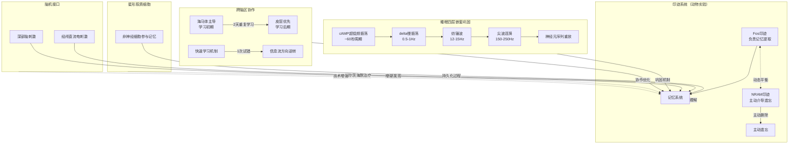

# 第31章 记忆科学前沿:2025-2026 研究进展与证据分级

---

> **📍 本章导航**：前置 → [24-最新记忆科学研究](24-最新记忆科学研究.md) ｜ 相关 → [25-AI辅助记忆](25-AI辅助记忆.md)·[27-合意困难与记忆](27-合意困难与记忆.md)·[28-多感官记忆编码](28-多感官记忆编码.md)·[29-记忆与运动](29-记忆与运动.md)·[32-LLM辅助记忆实战指南](32-LLM辅助记忆实战指南.md) ｜ 方法 → M01·M08·M27 ｜ 难度 ⭐⭐ ｜ 阅读 ~25min
> **💡 相关阅读**：[30-记忆宫殿进阶](30-记忆宫殿进阶.md)（记忆宫殿进阶用法）。**阅读约定**：本章每条发现均标注**研究阶段**（动物实验 / 人类初步 / 综述 / 工程实践），标注为“动物实验”的结论不可直接外推到人类学习，“初步”指单篇或小样本研究、需重复验证。

## ⚡ 5分钟速览

2025-2026年记忆科学迎来爆发期。**核心突破**:

1. **双印迹模型**(清华钟毅团队/Neuron 2026 · 🧪动物实验-小鼠):发现两类印迹细胞--Fos印迹参与记忆提取,NRAM印迹参与主动遗忘。提示"遗忘可能是主动过程",人类证据尚缺。
2. **星形胶质细胞与记忆持久化**(韩国IBS/Nat Commun 2026 · 🧪动物实验-小鼠):星形胶质细胞Ank2蛋白参与记忆持久性调控,记忆的细胞基础可能不限于神经元。
3. **跨脑区信息流快速重塑**(陆军军医大学团队/Neuron 2026 · 🧪动物实验-电生理):动物训练中观察到海马-皮层信息流方向可快速反转。"2天"是动物实验参数,勿直接类推人类学习天数。
4. **社交记忆的CCK门控**(东南大学团队/Nat Commun 2026 · 🧪动物实验-小鼠):CCK中间神经元参与社交记忆的门控。
5. **分布式工作记忆**(Nat Neurosci 2026 · 🧪人类初步-脑电小样本):跨脑区高频涟漪同步与工作记忆表现相关。
6. **记忆的"项目-情境"绑定**(Nat Commun 2026 · 🧪人类初步-fMRI相关性):mPFC联合表征与记忆精确性相关,为记忆宫殿提供部分机制线索。
7. **睡眠巩固的振荡嵌套**(康奈尔/Nature 2025 + 中科院/Neuron 2025 · 🧪人类脑电+动物,方向较成熟):delta→纺锤波→涟漪嵌套重放,NREM中还有约60秒周期的cAMP超低频振荡"窗口"。
8. **间隔重复精细化** · 🧪人类行为实验(综述级)+工程实践:交错vs分块有条件边界;FSRS是工程算法(社区数据),非医学结论。
9. **脑机接口与记忆增强** · 🧪人类小样本/临床试验(以患者为主):tDCS、神经反馈、"记忆假体"均有探索性结果,幅度报告不一致,**不建议自行购买或使用刺激设备**。

**一句话总结**:初步证据提示--遗忘可能有主动机制,记忆需要正确的节奏和跨脑区协调;但多数"颠覆性"发现仍处于动物实验或小样本阶段,先落实基础方法(提取练习、间隔重复、睡眠、运动)再谈"前沿"。

⚠️ **证据分级提示**：本章结论按研究阶段标注。**动物实验**结论只说明"机制存在可能",不等于人类有效;**人类初步**结论需重复验证;营销式表述("颠覆""革命""效果+X%")一律降级为保守表述。

### ⚡ 一分钟速记

> **只有1分钟?记住这3个要点:**
> 1. 双印迹模型:大脑有两套独立系统--Fos印迹负责记忆提取,NRAM印迹主动介导遗忘,遗忘是主动机制不是被动衰退
> 2. 睡眠四层嵌套巩固:cAMP→delta→纺锤波→涟漪,只有被激活的记忆印记细胞才在睡眠中优先重放
> 3. 跨脑区快速重塑：2天重复学习即可逆转海马-皮层信息流方向，从“海马主导”变为“皮层优先”

---

## 🎯 核心框架

### 📊 新发现 vs 经典认识（含研究阶段标注）

> 示意图中的箭头表示"研究方向",不代表已证实的因果关系。

| 领域 | 经典认识 | 2025-2026 新发现 | 🧪 研究阶段 | 保守的实践影响 |
|------|----------|-----------------|------------|----------|
| 遗忘机制 | 被动衰退/干扰为主 | 双印迹模型(Fos 提取 vs NRAM 主动遗忘) | 动物实验(小鼠) | 提取练习、少即是多(有依据,但机制解释待验证) |
| 睡眠巩固 | 睡眠有利记忆 | 振荡嵌套重放+选择性巩固 | 人类脑电+动物,较成熟 | 睡前复习、保睡眠时长与完整(低风险可做) |
| 跨脑区协作 | 海马→皮层缓慢转移 | 动物训练中信息流方向可快速反转 | 动物实验(电生理) | 重要材料分散到 ≥2 天练(低风险) |
| 记忆的细胞基础 | 主要研究神经元 | 星形胶质细胞参与记忆持久化 | 动物实验(小鼠) | 睡眠/营养/运动的基本盘不变 |
| 记忆增强 | 训练/药物 | tDCS/神经反馈/"记忆假体" | 人类小样本/临床试验(患者为主) | **不建议自行购买刺激设备** |
| 间隔重复 | SM-2 等固定规则 | FSRS 机器学习调度 | 工程实践+社区数据 | 可在 Anki 试用,以自己牌组实测为准 |

---

## 开篇:2025-2026 年记忆研究密集发布,如何理性看待 🧭

2025-2026 年,记忆科学领域有一批新论文集中发表,其中不少来自中国团队。它们提出了新的机制假说,也带来了一些可尝试的实践思路。

先说清楚本章的立场:**新发现 ≠ 定论**。本章介绍的研究大多处于"动物实验"或"人类小样本"阶段,少数结论(如睡眠巩固、间隔重复)已有较成熟的综述支持。阅读时请先看每节的 🧪 研究阶段标注,再决定要不要把结论用到自己的学习上。

为什么仍值得了解这些研究?因为它们能帮你**理解**"为什么基础方法有效":提取练习为什么优于重读、间隔重复为什么不能拖太久、睡眠为什么不是可有可无。理解机制,能让你在执行基础方法时更笃定,也更不容易被"记忆神器"收智商税。

本章按"研究发现 → 研究阶段 → 保守的实践启示"三层结构展开,并在文末给出**伪前沿识别清单**,帮你分辨哪些"新概念"根本不是科学。

---

## 一、🧠 双印迹模型:记忆提取与主动遗忘的分离

> *"遗忘不像硬盘损坏,更像大脑主动执行的清理程序。"*
> 🧪 **研究阶段**：动物实验（小鼠海马体，光遗传学操纵）。"主动遗忘由专门印迹细胞介导"在人类中尚无直接证据。

### 核心发现

2026年2月,清华大学生命科学学院钟毅团队在顶级期刊《Neuron》上发表了一项里程碑式的研究。他们发现,海马体中存在两种完全不同的印迹细胞(engram cells),分别掌管着记忆的"提取"和"遗忘"两个对立过程。

**Fos印迹细胞**--这是传统意义上的"记忆细胞"。它们表达即刻早期基因Fos,在记忆编码时被激活,在记忆提取时重新点燃。你可以把它们想象成图书馆里负责"借书"的管理员:你问它要什么,它就帮你从书架上取下来。

**Npas4标记的NRAM印迹细胞**--这是本研究真正的主角。NRAM(Npas4-dependent Remodeling Active Memory)印迹细胞表达转录因子Npas4,它们的功能不是保存记忆,而是**主动介导遗忘**。这些细胞就像图书馆里负责"清库存"的管理员--它们会定期把某些书从书架上撤掉,腾出空间给新书。

更关键的是,研究团队通过光遗传学手段在小鼠中观察到:人为激活NRAM印迹细胞可以加速遗忘,抑制它们则能延长记忆保持时间。这提示遗忘可能不是被动的退化过程,而是由专门的神经回路主动参与的精确操作(人类证据尚缺)。

这一发现对经典记忆理论框架提出了重要修正。自赫布(Donald Hebb)1949年提出"细胞集群"理论以来,神经科学界一直把遗忘归因于印迹的被动衰退--要么是突触连接弱化了,要么是印迹细胞死了。但钟毅团队的工作表明,大脑里有一个专门的"遗忘系统",它和"记忆系统"是两套平行运行的独立机制。

### 为什么这个发现如此重要?

想想你的电脑:你可以选择"保存"文件,也可以选择"删除"文件。这两个操作由不同的程序执行,互不干扰。以前我们以为大脑只能"保存","删除"只是保存失败的副产品。现在我们知道,大脑既有"保存程序"也有"删除程序",而且两个程序都在积极工作。

这意味着什么?意味着**遗忘是可以被操控的**。如果我们能找到调控NRAM印迹细胞活性的开关,理论上就能:

- **加速遗忘**:帮助PTSD患者抹除创伤记忆(这已经是当前神经科学研究的热点方向)
- **减缓遗忘**:帮助记忆障碍患者保持更持久的记忆
- **优化学习**:主动"清除"干扰信息,让有用的记忆更清晰

### 🎯 实践启示

1. **遗忘是特性,不是缺陷。** 你的大脑在主动"清理"记忆,这是进化赋予的高效机制。不需要为遗忘焦虑--它说明你的遗忘系统在正常工作。
2. **"用进废退"有了新解释。** 被频繁提取的记忆会被Fos印迹细胞强化,而不被提取的记忆则更容易被NRAM印迹细胞标记为"待删除"。所以,"复习"的作用不仅是强化记忆,更是**阻止遗忘系统把它清掉**。
3. **间隔效应的深层机制。** 间隔重复之所以有效,可能正是因为它在每次复习时都在"重置"NRAM细胞的删除计时器。

### 深入理解:为什么大脑需要一个"删除程序"?

从进化角度看,主动遗忘系统是一个极其精妙的适应机制。想象一下原始人类的大脑:每天要处理海量的感官信息--树叶的沙沙声、远处的动物足迹、天气的变化信号、同伴的表情变化......如果所有信息都被永久保存,大脑很快就会"信息过载",就像一台硬盘塞满的电脑,运行速度越来越慢。

NRAM印迹细胞的功能就是做"信息过滤器":把那些不再需要的、已经过时的、与当前生存无关的信息标记为"可删除",让大脑始终保持足够的"空闲空间"来处理新信息。这也解释了为什么我们更容易记住与生存相关的信息(食物位置、危险信号、社交关系),而容易忘记无关紧要的细节(昨天中午吃了什么、上周三穿了什么衣服)。

钟毅团队的后续研究还发现,NRAM印迹细胞的活性受到多巴胺系统的调控。当某条记忆与奖励或惩罚关联时,多巴胺信号会抑制NRAM细胞的"删除"功能,从而保护这条记忆不被清除。这就是为什么"有奖惩的学习"比"无所谓的学习"记得更牢--不是因为你更用心,而是因为多巴胺帮你"锁住"了记忆。

### 🔧 编码技巧

**技巧1:主动提取而非被动重读**

既然Fos印迹细胞在记忆提取时被激活,那么每次主动提取记忆(比如合上书回忆)都会强化这条神经回路。而被动重读(看书划线)的提取强度远不如主动回忆。

- **具体做法**:每读完一段内容,合上书/关掉页面,用30秒口头复述核心要点。不要怕说得不完美--正是"费力提取"的过程在激活Fos印迹细胞。

**技巧2:给新记忆一个"不可删除"标记**

NRAM细胞倾向于清除"低优先级"信息。你需要在编码时给信息赋予足够的情感权重或意义关联,让它不容易被标记为"待删除"。

- **具体做法**:学习新知识时,主动问自己"这个信息对我有什么用?"--哪怕是牵强的关联("这个化学式像我爱吃的火锅"),也能通过杏仁核的情感标记降低被遗忘的概率。

**技巧3:利用"选择性遗忘"提升效率**

既然大脑有主动遗忘系统,你可以反向利用它:主动让不重要的信息被遗忘,为重要信息腾出"空间"。

- **具体做法**:考试前不要试图"记住所有东西"。列出最重要的10个核心概念,反复提取它们,同时主动忽略边缘知识。让NRAM细胞帮你做"减法"。

---

## 二、🌟 星形胶质细胞与记忆持久化

> *"记忆的细胞基础可能不只神经元--就像建房子不只需要砖头。"*
> 🧪 **研究阶段**：动物实验（小鼠基因敲除+形态学）。对人类学习的启示均为**机制类推**,不是直接结论。

### 核心发现

2026年7月,韩国基础科学研究院(IBS)认知与社会性中心的Wuhyun Koh团队在《Nature Communications》上发表了一项令人耳目一新的研究。他们发现,**星形胶质细胞**(astrocyte)中的一种蛋白质--Ank2(Ankyrin-2)--在海马体记忆持久性(memory persistence)的调控中扮演着关键角色。

长期以来,神经科学的聚光灯几乎全部打在神经元身上。星形胶质细胞虽然占大脑细胞总数的约50%,但一直被视为"后勤人员"--负责给神经元送营养、清理代谢废物、维持离子平衡。它们被认为不直接参与信息处理和记忆编码。

Koh团队的工作对这一认知提出了挑战。他们发现:

1. **Ank2蛋白在记忆形成后会在星形胶质细胞中持续上调。** 这种上调不是随机的--它发生在海马体CA1区的记忆相关区域,时间窗口与记忆巩固过程精确吻合。
2. **敲除星形胶质细胞中的Ank2基因,会导致短期记忆正常但长期记忆显著受损。** 也就是说,没有Ank2,记忆能形成但留不住。
3. **Ank2通过调控星形胶质细胞的形态可塑性(morphological plasticity)来影响突触微环境。** 星形胶质细胞会像章鱼一样伸出"触手"(突起),包裹住突触间隙,调控神经递质的浓度和信号传导效率。

简单来说,星形胶质细胞不是旁观者,它们是记忆持久化的**积极参与者**。它们通过Ank2蛋白调整自己的"体型",为神经元之间的信号传递提供最佳的微环境条件。没有这个"装修工人"的精细施工,记忆的"房子"就建不牢。

### 为什么这个发现如此重要?

这一发现的记忆科学意义至少有三重:

**第一,它扩展了记忆的细胞基础。** 以前我们说"记忆储存在突触连接中",现在我们知道星形胶质细胞的形态变化同样是记忆的一部分。记忆不只是神经元之间的"线路",还包括包裹这些线路的"绝缘层"(星形胶质细胞突起)。

**第二,它为"为什么营养和睡眠影响记忆"提供了分子解释。** 星形胶质细胞是大脑代谢的主要调节者。当你的营养状态不佳或睡眠不足时,星形胶质细胞的功能会受到影响,Ank2的表达可能异常,记忆的持久性自然下降。

**第三,它开辟了全新的记忆干预靶点。** 如果能开发出调控Ank2表达的药物或技术手段,就可能增强人类的长期记忆能力--而不需要直接干预神经元。

### 🎯 实践启示

1. **营养不是"辅助",而是记忆的基础设施。** 星形胶质细胞对代谢状态极其敏感。确保大脑有充足的营养供应(特别是omega-3脂肪酸、B族维生素、抗氧化物质)不仅是"养生",而是在直接维护记忆系统的硬件基础。
2. **睡眠对记忆的作用可能部分通过星形胶质细胞实现。** 已知睡眠期间星形胶质细胞会进行"突触修剪"和代谢废物清理。睡眠不足 = 星形胶质细胞功能不全 = 记忆持久性下降。
3. **运动的益处有了新维度。** 有氧运动能促进脑源性神经营养因子(BDNF)的分泌,而BDNF不仅作用于神经元,也影响星形胶质细胞的形态可塑性。运动 → 星形胶质细胞活化 → Ank2上调 → 记忆更持久。

### 🔧 编码技巧

**技巧1:学习前的"燃料准备"**

在进行高强度学习前30分钟,给大脑补充优质燃料。

- **具体做法**:一小把坚果(核桃、杏仁)+ 一杯绿茶或咖啡。坚果提供omega-3和维生素E,咖啡因能促进星形胶质细胞的钙信号传导(这与其形态可塑性相关)。
- **避免**:高糖食物。血糖剧烈波动会干扰星形胶质细胞的正常代谢功能。

**技巧2:利用运动"激活"星形胶质细胞**

有氧运动是目前证据较充分的"对大脑友好"的习惯之一(机制可能涉及BDNF与胶质细胞,但多为动物/间接证据)。运动时大脑血流量明显上升,动物研究中运动与星形胶质细胞形态可塑性变化相关。

- **具体做法**:在学习前30分钟或学习后1小时内进行20-30分钟的中等强度有氧运动(快走、慢跑、骑车、游泳)。不需要剧烈运动--心率达到最大心率的60-70%即可(粗略估算:最大心率 ≈ 220 - 年龄)。
- **如果时间有限**:即使是10分钟的快走也有效。关键是有规律,而不是偶尔一次猛练。
- **避免**:学习后立即进行高强度无氧运动(如冲刺跑、重量训练)。这类运动会产生大量皮质醇,可能干扰记忆巩固过程。

**技巧3:学习后的"巩固窗口"保护**

学习后的1-2小时是记忆从短期向长期转化的关键期。在这段时间里,星形胶质细胞正在积极调整Ank2表达和突起形态。

- **具体做法**:学习结束后,避免立即进行高认知负荷的活动(比如刷短视频或处理复杂工作)。给大脑20-30分钟的"低刺激"时间--散步、冥想、甚至发呆,都比刷手机好。
- **原理**:高认知负荷会大量激活不相关的神经回路,干扰星形胶质细胞对"目标记忆"的精细化处理。

**技巧4:为长期记忆"加固地基"**

如果你希望某些知识保持数月甚至数年,需要在编码后的多个时间点为星形胶质细胞提供"建筑信号"。

- **具体做法**:学习当天的睡前复习(第一次巩固信号)→ 第二天早晨快速回忆(第二次)→ 一周后第三次提取。每次提取都会重新激活星形胶质细胞的形态重塑过程,相当于反复"加固"同一条记忆回路。

---

## 三、⚡ 跨脑区信息流的快速重塑

> *"重复练习的"量"之外,可能还需要"天"这个时间尺度。"*
> 🧪 **研究阶段**：动物实验（囓齿类电生理训练）。"2天逆转"是动物参数,人类学习的对应节奏尚无定论。

### 核心发现

2026年,陆军军医大学(第三军医大学)谌小维团队在《Neuron》上发表了一项令人惊叹的研究。他们发现,仅仅**两天**的重复学习就足以快速重塑海马体与新皮层之间的涟漪耦合(ripple coupling)关系,实现跨脑区信息流的主导方向逆转--从"海马主导"转变为"皮层优先"。

这一发现直接挑战了经典的"系统巩固理论"(Systems Consolidation Theory)。传统理论认为,记忆从海马体向新皮层的迁移是一个缓慢渐进的过程,通常需要数周甚至数月。海马体被认为是"临时存储器",新皮层是"长期硬盘",记忆需要反复"拷贝"才能永久存储。

但谌小维团队的实验数据讲述了另一个故事:

1. **训练第一天**:海马体的尖波涟漪(sharp-wave ripples)在与新皮层的耦合中占据主导地位。信息流方向是"海马→皮层",海马体像是一个"老师",把信息"教"给皮层。
2. **训练第二天**:情况发生了戏剧性逆转。新皮层开始在耦合中占据主导,信息流方向翻转为"皮层→海马"。皮层不再是被动的"学生",而是变成了主动的"搜索者",向海马体发出信息请求。
3. **这种逆转不是渐进的,而是近乎"开关式"的。** 就像大脑在某个临界点突然"学会了"某项技能,然后跨脑区的通信模式就切换了。

更有趣的是,这种快速的耦合重塑与行为表现的提升高度相关。信息流方向的逆转时间点,恰好对应着动物行为表现出现质变的时间窗口--也就是说,**"顿悟"的那一刻,可能就是跨脑区通信模式切换的那一刻**。

### 为什么这个发现如此重要?

**第一,它解释了"顿悟"的神经机制。** 我们都有过这样的体验:学某样东西,前几天怎么都学不会,突然有一天"开窍了"。谌小维的工作表明,这个"开窍"可能不是心理感受,而是海马-皮层信息流方向发生物理性逆转的结果。

**第二,它为"间隔学习优于集中学习"提供了神经基础。** 如果信息流逆转需要至少两天的间隔才能发生,那么在一天内反复练习10次可能不如分成两天各练5次。因为逆转需要的不仅是"量",还需要"时间"让跨脑区耦合完成重组。

**第三,它暗示学习效率存在"自然节律"。** 大脑的跨脑区通信模式不是随时都能切换的,它需要特定的条件和时间窗口。理解这些条件,就能设计出最高效的学习计划。

### 🎯 实践启示

1. **不要期望"一天速成"。** 重要的知识和技能至少需要两天的间隔练习才能实现跨脑区的深度整合。给自己至少48小时的"消化期"。
2. **"卡住"可能是好事。** 如果你在第一天学习时感觉进步缓慢甚至退步,不要沮丧。海马体可能正在进行信息重组,为第二天的"切换"做准备。
3. **学习计划应该以"天"为最小单位设计。** 不要精确到小时--大脑的跨脑区重塑需要的是"睡眠周期+新一天的重新激活"这种宏观节奏。

### 🔧 编码技巧

**技巧1:"两天一循环"学习法**

针对任何重要知识或技能,设计一个两天循环的学习方案:

- **Day 1(海马主导期)**:
  - 上午:首次接触新知识,注重理解和初步编码
  - 晚上:睡前30分钟快速复习核心要点(激活海马涟漪重放)
  - 睡眠:海马体在NREM睡眠中进行记忆重放,将信息"传递"给皮层

- **Day 2(皮层接管期)**:
  - 上午:不看原始材料,尝试从记忆中复述或应用(测试皮层是否"接管"成功)
  - 如果复述困难:回到原始材料快速校准(这会加强皮层→海马的信息请求回路)
  - 晚上:再次提取练习,这次应该明显比Day 1更流畅

**技巧2:在"卡住"时战略性休息**

如果你在学习某项技能时连续几天没有进步,不要硬练。

- **具体做法**:停练1-2天,期间做其他不相关的事情。然后回来再试。给海马-皮层耦合完成重组的时间。很多人会发现,"休息之后突然就好了"--这不是错觉,这是信息流逆转的结果。

**技巧3:利用睡眠优化"切换"时机**

既然跨脑区逆转可能发生在睡眠期间,那么优化睡眠质量就是加速学习的关键。

- **具体做法**:
  - 学习日的睡眠时间不少于7小时
  - 睡前避免酒精(它会抑制NREM睡眠中的涟漪重放)
  - 如果可能,学习日的午间安排一个20分钟的"午睡"(这提供了额外的重放窗口)

---

## 四、🤝 社交记忆的门控:CCK中间神经元

> *"你记得住朋友的名字,却记不住化学公式?社交信息可能有专门的加工通道。"*
> 🧪 **研究阶段**：动物实验（小鼠,光遗传学/敲除）。社交记忆的"VIP通道"在人类中仅为类比说法。

### 核心发现

2026年,东南大学生命科学与技术学院刘安教授和谢维教授团队在《Nature Communications》上发表了一项关于社交记忆的重要研究。他们发现,**CCK(胆囊收缩素)阳性中间神经元**在海马体CA1区扮演着社交记忆"交通指挥官"的角色。

社交记忆--也就是记住"谁是谁"、"谁和我互动过"、"谁是朋友谁是敌人"的能力--是人类和动物最基本的记忆类型之一。但长期以来,科学家们不清楚社交记忆是如何在海马体中被特异性编码的。

刘安和谢维团队的发现揭示了一个精妙的机制:

1. **CCK中间神经元在基线状态下对CA1锥体细胞施加持续性抑制。** 就像交通信号灯一直处于"红灯"状态,阻止大多数信息通过。
2. **当社交刺激出现时(比如遇到一个新个体),特定的CCK中间神经元亚群会被"关闭"(抑制性降低)。** 相当于红灯变绿灯,允许社交信息的信号通过。
3. **这种"解除抑制"(disinhibition)机制创造了一个时间窗口,让与社交相关的神经元集群得以激活并形成记忆印迹。** 如果CCK中间神经元保持"红灯",社交记忆就无法正常编码。
4. **敲除或抑制这些CCK中间神经元会导致社交记忆严重受损**,但非社交类记忆(如空间记忆)不受影响。这说明CCK中间神经元是社交记忆的**特异性**门控机制,而非一般性的记忆"开关"。

用一个更形象的比喻:海马体CA1区就像一个繁忙的十字路口,各种信息(空间信息、物体信息、社交信息)都在争夺"通行权"。CCK中间神经元就是路口的交通指挥官,它平时让所有方向都"停",只有当社交信息到来时,才专门为社交方向开"绿灯"。

### 为什么这个发现如此重要?

**第一,它解释了社交记忆的特殊性。** 我们早就知道人类对人脸和社会信息有超强的记忆力(你能记住几千张面孔!),但不知道为什么。CCK中间神经元的"选择性开门"机制为此提供了神经基础--社交信息有专门的"VIP通道"。

**第二,它为自闭症谱系障碍(ASD)的社交记忆缺陷提供了机制解释。** 如果CCK中间神经元的功能异常,社交信息的"绿灯"就开不了,社交记忆自然无法正常形成。这为ASD的干预提供了新的靶点。

**第三,它揭示了"抑制"在记忆中的积极作用。** 我们通常认为"抑制"是记忆的敌人,但CCK中间神经元告诉我们,**抑制不是终点,而是门控手段**。通过"先抑制再解除"的策略,大脑实现了信息的选择性过滤。

### 🎯 实践启示

1. **社交互动是天然的记忆增强剂。** 将学习内容与社交场景结合(比如和朋友讨论、向别人讲解),能激活CCK中间神经元的"开门"机制,让信息更容易被编码。
2. **情感连接比重复更有效。** CCK中间神经元对社交刺激的响应暗示,带有社交属性的记忆("我老师教我的"、"朋友推荐的")天然比无社交属性的记忆更容易被记住。
3. **孤独感可能真的"伤记忆"。** 长期社交隔离可能导致CCK中间神经元回路的退化,进而影响社交记忆能力。保持社交活跃不仅是心理健康需要,也是认知健康需要。

### 🔧 编码技巧

**技巧1:"社交化"编码法**

把抽象信息转化为社交化的故事或对话,激活CCK中间神经元的"绿灯"。

- **具体做法**:
  - 学习新概念时,想象你在向一个好奇的朋友解释它
  - 用角色扮演的方式理解历史事件("如果你是拿破仑,你会怎么决定?")
  - 把需要记忆的列表转化为一个"人物关系图"

**技巧2:建立"社交锚点"**

为关键知识绑定一个社交记忆。

- **具体做法**:
  - 每次学习新知识时,关联到一个具体的人("这个概念是我的导师张教授强调过的重点")
  - 在复习时,回忆当时学习的社交场景("我是在图书馆和小王一起学的这部分")
  - 使用"教别人"的方式复习--教学行为天然激活社交记忆回路

**技巧3:学习小组的神经科学依据**

学习小组之所以有效,不仅是因为"讨论加深理解",更因为社交互动本身就在为记忆编码"开绿灯"。

- **具体做法**:
  - 组建3-5人的学习小组,每周讨论一次核心知识
  - 每次讨论前,每人先独立准备(确保自己先有"原始编码")
  - 讨论时重点不是"听别人说",而是"自己说给别人听"--这是激活CCK中间神经元解除抑制机制的最佳方式

---

## 五、🌊 跨脑区高频涟漪同步与分布式工作记忆

> *"工作记忆可能不是一个"脑区",而是一种多脑区协作的同步模式。"*
> 🧪 **研究阶段**：人类初步（颅内/高密度脑电小样本,多为难治性癫痫患者术前记录）。相关性结果,非因果证明。

### 核心发现

2026年,《Nature Neuroscience》发表了Verzhbinsky等人的研究。他们利用高密度脑电/颅内记录与信号分析技术,发现**大脑不同脑区通过高频涟漪(high-frequency ripples,约80-120Hz)存在同步现象**,跨区域的神经元同步放电与分布式工作记忆的表现相关(🧪人类初步,脑电小样本,相关性结果)。

工作记忆--也就是你"同时在脑子里装着几个信息"的能力--长期以来被认为主要依赖于前额叶皮层。经典的"前额叶工作记忆模型"认为,前额叶通过持续性神经放电来"维持"信息在线。

但Verzhbinsky等人的研究展示了远比这复杂的图景:

1. **工作记忆期间,多个脑区(包括海马体、顶叶皮层、前额叶皮层、感觉皮层等)同时产生高频涟漪。** 这些涟漪不是各自为政的--它们之间存在精确的**时间锁定**关系(temporal locking)。
2. **不同脑区的涟漪可以在毫秒级别上同步。** 这种同步不是随机的--它与工作记忆的任务需求精确对应。当工作记忆负荷增加时,参与同步的脑区数量增加,涟漪之间的耦合强度也增加。
3. **跨脑区涟漪同步的模式可以预测工作记忆表现。** 同步越强、参与脑区越多,工作记忆的准确率越高。
4. **这种"隔空协作"不需要传统的缓慢振荡(如theta或gamma波)作为"载体"。** 高频涟漪本身就是一个独立的信息传递通道。

简单来说,工作记忆不是前额叶一个人的"独角戏",而是多个脑区通过高频涟漪进行实时协调的"团队项目"。每个脑区都负责工作记忆的不同方面(比如海马体负责空间信息,视觉皮层负责图像信息,前额叶负责"总控"),它们通过涟漪同步来确保信息的协调一致。

### 为什么这个发现如此重要?

**第一,它重新定义了工作记忆的神经基础。** 工作记忆不是一个"地方",而是一种"连接模式"。信息不是储存在某个脑区里,而是以涟漪同步的方式"漂浮"在多个脑区的协作网络中。

**第二,它解释了为什么工作记忆容量有限。** 既然工作记忆依赖于跨脑区涟漪同步,那么同步的"带宽"就是有限的--你能同时让多少个脑区保持同步,决定了你能同时"装"多少信息。

**第三,它为"多感官学习"提供了神经基础。** 如果工作记忆本身就是分布式的,那么通过调动多个感官(视觉、听觉、触觉、运动)来编码信息,就能激活更多的脑区参与涟漪同步,从而增强工作记忆的容量和稳定性。

### 🎯 实践启示

1. **工作记忆是可以训练的。** 跨脑区涟漪同步是一种可塑的连接模式。通过反复练习需要多脑区协作的任务(如空间推理+语言记忆的复合任务),可以增强涟漪同步的效率。
2. **"一心多用"的极限有神经基础。** 你的工作记忆容量不是固定的--它取决于你的大脑能维持多大规模的涟漪同步网络。但这个网络的带宽是有限的,所以"一心多用"终究有天花板。
3. **环境丰富度影响工作记忆。** 多感官环境能激活更多脑区,增加参与涟漪同步的"节点"数量,从而可能扩展工作记忆的有效容量。

### 🔧 编码技巧

**技巧1:"多脑区编码"法**

在学习时,有意识地调动多个脑区参与编码,利用涟漪同步的分布式特性增强记忆。

- **具体做法**:
  - **视觉+语言**:把文字信息转化为思维导图或图表(视觉皮层+语言区同步)
  - **听觉+运动**:边听讲座边做手写笔记(听觉皮层+运动皮层同步)
  - **空间+语义**:使用记忆宫殿法,把信息放置在想象的空间位置上(海马体+前额叶同步)

**技巧2:工作记忆的"容量扩展"训练**

通过渐进式负荷训练增强跨脑区涟漪同步的能力。

- **具体做法**:
  - **N-back训练**:从2-back开始,逐步增加到3-back、4-back。注意:多数研究显示 N-back 对**N-back 任务本身**提升较一致,迁移到一般记忆/智力的证据有限;它更适合当"工作记忆热身",不要期待它直接提分。
  - **双任务训练**:同时进行两个不同类型的认知任务(如心算+空间导航游戏),作为多脑区协调的练习。
  - **验收标准**:以4周为一个试用周期,用**实际学习任务的表现**(如背诵速度、做题正确率)评估,而不是只看训练分数。

**技巧3:利用"环境切换"强化分布式编码**

既然工作记忆是分布式的,在不同环境中学习同一内容可以激活不同的脑区组合,形成更丰富的记忆网络。

- **具体做法**:
  - 同一内容在不同场所学习(图书馆、咖啡馆、公园)
  - 在学习时改变感官条件(有时安静学、有时听白噪音、有时边走边听录音)
  - 这不是为了"新鲜感",而是为了激活更多脑区参与涟漪同步网络

---

## 六、🏛️ 记忆宫殿为何有效:fMRI 给出的"项目-情境"绑定线索

> *"记忆宫殿不是玄学--但目前的神经证据也只是"部分线索"。"*
> 🧪 **研究阶段**：人类初步（fMRI 多体素模式分析,相关性研究）。"mPFC 联合表征"是机制假说,尚未被因果实验证实。

### 核心发现

2026年,《Nature Communications》发表了一项关于默认模式网络(Default Mode Network, DMN)在情景记忆中作用的重要研究。研究团队利用高分辨率fMRI和多体素模式分析(MVPA)技术,发现**内侧前额叶皮层(mPFC)通过联合表征(conjunctive representation)机制,将记忆中的"项目"(item)和"情境"(context)绑定在一起**,为记忆宫殿技术提供了直接的神经科学解释。

记忆宫殿(Method of Loci)是人类已知最古老的记忆术之一,由古希腊诗人西蒙尼德斯发明,至今仍是世界记忆锦标赛选手的核心技术。其原理是:将需要记忆的信息与一个熟悉的空间路径上的特定位置绑定,通过"在脑海中走过这条路"来回忆信息。

> 📖 记忆宫殿的基础原理与构建步骤见 [02-核心记忆技巧.md §1](02-核心记忆技巧.md#1-记忆宫殿法-method-of-loci)。多层宫殿、动态宫殿等高级技巧见 [30-记忆宫殿进阶.md](30-记忆宫殿进阶.md)。

这项研究的发现如下:

1. **mPFC同时编码了"是什么"和"在哪里"的信息。** 当你回忆"昨天在咖啡馆喝的拿铁"时,mPFC中的神经活动模式同时包含"拿铁"(项目信息)和"咖啡馆"(情境信息),而且这两种信息是**融合在同一个表征中的**,不是分开存储再拼接的。
2. **这种联合表征是记忆宫殿有效性的核心机制。** 当你把"光合作用的公式"放在"记忆宫殿的第三扇门后面"时,mPFC会创建一个联合表征,把"公式"和"门"绑定成一个不可分割的整体。
3. **mPFC的联合表征强度与记忆的精确性直接相关。** 联合表征越强,回忆时越不容易"张冠李戴"(把公式放错位置)。
4. **默认模式网络的其他节点(后扣带回、楔前叶、海马体)在联合表征的形成和提取过程中扮演不同的支持角色。** 后扣带回负责"情境地图"的维护,楔前叶负责视觉空间想象,海马体负责项目-情境绑定的快速编码。

### 为什么这个发现如此重要?

**第一,它为"记忆宫殿为什么有效"提供了一个可能的解释。** 记忆宫殿可能"借用"了mPFC的"项目-情境"绑定机制--这是基于相关性数据的假说,还不是定论。

**第二,它为记忆宫殿的优化提供了方向。** 既然联合表征的强度决定了记忆质量,那么增强联合表征的因素(如情境的生动性、情感强度、空间细节丰富度)就应该成为记忆宫殿设计的核心原则。

**第三,它暗示了记忆宫殿可能对大脑有"训练"效果。** 经常使用记忆宫殿的人,其mPFC的联合表征能力可能得到增强--这不仅帮助记忆术,也对日常情景记忆有泛化益处。

### 🎯 实践启示

1. **记忆宫殿不是"高级技巧",而是"原始本能"的优化利用。** mPFC天生就在做"项目-情境"绑定--记忆宫殿只是把这个过程变得更自觉、更精确。
2. **情境的生动性比信息本身更重要。** 一个鲜活的、感官丰富的"记忆位置"比一个模糊的位置能产生更强的联合表征。所以,记忆宫殿里的"位置"应该尽可能具体、生动、甚至荒诞。
3. **练习记忆宫殿可能增强日常记忆。** 就像练举重不仅能举起杠铃,还能帮你搬行李箱--记忆宫殿训练可能泛化为更强的日常情景记忆能力。

### 🔧 编码技巧

**技巧1:构建"感官丰富"的记忆宫殿**

mPFC的联合表征在多感官编码时最强。你的记忆宫殿不应该只有"视觉位置",还应该有声音、气味、触感、温度。

- **具体做法**:
  - **第一扇门**:一扇厚重的橡木门,推开时发出"嘎吱"声,门把手是冰凉的铜制
  - **第二扇门**:一扇玻璃旋转门,映出彩色的光,地面是光滑的大理石
  - 每个位置都有独特的感官特征--这为mPFC提供了更多的"绑定维度"

**技巧2:用"荒诞叙事"增强联合表征**

mPFC对情感强度和意外性特别敏感。把需要记忆的信息转化为荒诞、夸张、甚至暴力的叙事,能产生更强的联合表征。

- **具体做法**:
  - 需要记忆"牛顿第二定律 F=ma" → 放在记忆宫殿的"厨房"位置 → 想象一个巨大的苹果(牛顿!)从天花板砸下来,砸碎了一台秤(F!),秤上的数字飞溅出来变成了"ma"
  - 越荒诞越好--荒诞意味着"意外",意外激活杏仁核,杏仁核的激活增强mPFC的联合表征

**技巧3:定期"巡游"维护记忆宫殿**

联合表征会随时间衰退(NRAM印迹细胞的遗忘机制!)。定期在脑海中"走过"你的记忆宫殿,重新激活每条联合表征。

- **具体做法**:
  - 学习当天:编码后立即巡游一次
  - 第二天:不看原始材料,仅通过巡游回忆
  - 一周后:再次巡游,补充遗忘的细节
  - 这比"重读笔记"高效得多--因为你同时在激活mPFC的联合表征和Fos印迹细胞的记忆提取机制

---

## 七、💤 睡眠巩固研究新进展:从"睡够"到"睡对"

> *"2025年的研究提示:睡眠巩固与振荡层级有关,不只是"小时数"。"*
> 🧪 **研究阶段**：人类脑电+动物实验,睡眠-记忆方向本身已是综述级共识,微结构细节仍在细化中。

> **📖 详细展开**:睡眠微结构、cAMP振荡、四层嵌套模型的完整解读见 [24-最新记忆科学研究.md §1](24-最新记忆科学研究.md#1-睡眠与记忆巩固的最新发现)。本节仅补充24章未涉及的新视角。

### 2025年睡眠研究的核心启示(速览)

2025年两项里程碑研究重新定义了我们对"睡眠巩固"的理解:

- **康奈尔大学《Nature》**:睡眠中记忆重放发生在delta波→纺锤波→涟漪的**三层嵌套振荡**中,时间精度达到毫秒级。只有精确耦合的振荡才能有效巩固记忆。
- **中科院徐敏团队《Neuron》**:NREM睡眠中存在周期约60秒的**cAMP超低频振荡**,形成记忆巩固的"时间窗口"--这使得睡眠巩固实际上是**四层嵌套**过程。

**一句话总结**:不是"睡够8小时"就行,而是"每一层振荡都要精确配合"才行。

### 31章新视角:睡眠巩固与"双印迹模型"的联动

本章§一介绍的清华钟毅团队"双印迹模型"为睡眠巩固提供了一个全新解释:

- **Fos印迹细胞**在睡眠中被优先重放,负责将短期记忆转化为长期记忆
- **NRAM印迹细胞**在睡眠中也在工作--它主动清除不需要的记忆,为新记忆腾出空间
- 这意味着睡眠不仅是"巩固"的过程,也是"筛选"的过程

**实践启示**:睡前复习什么,决定了大脑在睡眠中"巩固什么、清除什么"。如果你想记住A,就在睡前复习A;如果你想忘掉B的干扰,就不要在睡前想B。

### 🔧 睡眠编码的"新旧结合"策略

结合24章的四层嵌套模型和31章的双印迹模型,形成完整的睡眠优化方案:

| 时间点 | 操作 | 原理 |
|--------|------|------|
| 睡前30分钟 | 复习最重要的3-5个知识点 | 激活Fos印迹细胞,提升睡眠重放优先级 |
| 睡前2小时 | 避免酒精、蓝光 | 保护delta波和纺锤波的振荡质量 |
| 入睡时 | 保持18-20°C、安静环境 | 优化四层嵌套振荡的耦合条件 |
| 醒来后1小时内 | 不看笔记,快速回忆 | 激活新皮层存储路径,完成巩固"最后一公里" |
| 早餐时 | 轻松回忆昨天学了什么 | 利用睡眠惯性窗口做"无压力提取" |

---

## 八、📊 间隔重复的精细化:2025年的新边界

> *"间隔重复不只是'每隔几天复习一次'--什么时候用交错、什么时候用分块,有条件边界。"*
> 🧪 **研究阶段**：交错/分块结论来自人类行为实验（综述级,较成熟）；FSRS 是开源工程算法（社区数据积累）,不是医学/心理学定论。

> **📖 详细展开**:FSRS算法原理、DSR模型、与SM-2的完整对比见 [24-最新记忆科学研究.md §2](24-最新记忆科学研究.md#2-间隔重复的最新研究进展)。本节聚焦24章未覆盖的"条件边界"新发现。
>
> 📖 间隔重复的基础方法和实操指南见 [02-核心记忆技巧.md §5](02-核心记忆技巧.md#5-间隔重复-spaced-repetition)。

### 交错学习vs分块学习:不是"谁更好",而是"什么时候用谁"

2025年多项研究对这个经典争论给出了**条件边界**结论:

| 条件 | 推荐策略 | 原因 |
|------|---------|------|
| 材料区分度高(如外语单词vs历史事件) | **交错** | 训练辨别力,防止"只会做一种题" |
| 材料区分度低(如微分方程的不同类型) | **先分块再交错** | 交错会增加认知负荷,导致混乱 |
| 初学者 | 分块为主(7:3) | 先逐个掌握再混合 |
| 进阶者 | 交错为主(8:2) | 直接在混合情境中练习辨别 |
| 目标是"掌握单个技能" | 分块 | 集中练习效率更高 |
| 目标是"灵活运用" | 交错 | 训练情境判断能力 |

### FSRS 2025年新进展(补充24章)

24章已详细介绍了FSRS的算法原理。这里补充2025年的**最新进展**:

- **FSRS v4.5**:优化了短期记忆建模,缓解"学完立刻忘"的问题(工程迭代,效果以自己牌组实测为准)
- **遗忘曲线拟合**:能根据实际数据自动校准个人遗忘速率
- **Anki深度集成**:迁移成本几乎为零

> ⚠️ "复习量减少30-50%"是 FSRS 项目方在特定数据集上的报告,**因牌组、材料与个人差异大,以自己4周实测数据为准**。

### 🔧 间隔重复的"新编码策略"

**策略:双印迹模型+间隔重复的联动**

结合§一的双印迹模型,间隔重复不仅是"防止遗忘",更是"主动管理双印迹系统":

- **每次复习激活Fos印迹细胞**,强化记忆提取路径
- **每次复习同时抑制NRAM印迹细胞**,降低该记忆被主动遗忘的概率
- **间隔过长**:NRAM印迹细胞可能已经"删除"了这条记忆,复习变成"重新学习"
- **间隔过短**:Fos印迹细胞没有足够的"巩固时间",复习变成"无效重复"

**FSRS的最优间隔恰好在两者之间**--这也是为什么它比SM-2更有效的根本原因。

---

## 九、⚡ 脑机接口与记忆增强:进展与伦理思考

> *"用电流'辅助'记忆已进入实验室与临床试验阶段,但距离消费级安全应用还很远。"*
> 🧪 **研究阶段**：人类小样本/临床试验（以脑损伤、癫痫等患者为主）；效果幅度报告不一致,消费级产品均未经充分验证。

> **📖 详细展开**:tDCS、神经反馈、TMS的技术原理和临床数据见 [24-最新记忆科学研究.md §6](24-最新记忆科学研究.md#6-非侵入式记忆增强技术)。本节聚焦2025-2026年**新增进展**和**伦理思考**。

### 2025-2026年脑机接口新进展(补充24章)

24章已详细介绍tDCS和神经反馈的技术原理。本节补充**2025-2026年的新突破**:

- **个性化tDCS**:有小样本研究探索按个体脑结构(MRI定位)定制刺激方案,报告的效果优于标准方案,但幅度结论不一致(常见宣传中的"效果+40%"类数字请以原始论文为准,不宜直接引用)
- **海马体神经反馈**:小样本训练研究中部分空间记忆指标有提升,尚缺大样本重复验证
- **侵入性"记忆假体"**:DARPA资助的项目在癫痫/脑损伤患者中进行临床试验,部分记忆任务表现有改善(小样本初步结果)
- **Neuralink等公司**:记忆增强被列为远期目标,目前无消费级产品

### 🔧 "自然替代"编码技巧

不推荐自行使用tDCS设备,但以下方法可以获得类似效果:

| 方法 | 效果 | 具体做法 |
|------|------|----------|
| 有氧运动后学习 | 类似"自然版tDCS" | 运动后1-2小时内进行高强度学习 |
| 适度咖啡因 | 增强前额叶激活 | 200mg(约2杯咖啡),不过量 |
| 冷水洗脸 | 短暂增加血流量 | 高强度记忆任务前尝试 |
| HRV监控 | 识别最佳学习窗口 | HRV较高时段安排高强度学习 |

### ⚠️ 伦理思考:记忆增强的"双刃剑"

| 问题 | 核心争议 | 当前共识 |
|------|---------|----------|
| 公平性 | 富人"买"记忆,穷人"背"记忆 | 美国神经伦理学会2025年专章讨论"公平准入" |
| 安全性 | 发育期使用tDCS可能关闭可塑性窗口 | 成年人数据有限,青少年数据几乎空白 |
| 真实性 | 电刺激的记忆算"你的"记忆吗 | 涉及"自我"的哲学定义,尚无定论 |

**底线建议**:传统的编码策略+充足睡眠+规律运动+合理间隔重复,仍然是性价比最高的"记忆增强方案"。

---

## 十、🔮 展望:2027年及以后(观点,非研究结论)

> 🧪 **研究阶段**：本节为**作者推测/领域观点**,不是研究结论,请勿当作事实引用。

回顾2025-2026年的这些论文,可以看到记忆科学正从"描述现象"走向"机制假说与主动干预"。以下几个方向被讨论得较多,但均为**预判**:

### 1. 个性化记忆优化将成为现实

随着FSRS算法和神经反馈技术的成熟,"千人一面"的学习方法将逐步被"因人而异"的个性化方案取代。你可能不再需要"记忆宫殿"或"间隔重复"这样的通用标签,而是获得一个"根据你的大脑特点定制的记忆优化系统"。

想象这样一个场景:2028年的某一天,你戴上一副轻便的脑电设备开始学习。设备实时监测你的海马体涟漪活动、前额叶激活水平和注意力状态,AI算法根据这些数据动态调整学习内容的难度、呈现顺序和复习时间。当检测到你的记忆巩固效率下降时(可能是疲劳了),系统自动建议休息;当检测到你的跨脑区协作效率很高时,系统推送更难的新材料。这不是科幻--这些技术的每个组成部分都已经存在,只是尚未被整合成一个产品。

### 2. 遗忘将被重新定义为一种"能力"

钟毅团队的双印迹模型开启了"主动遗忘"研究的新篇章。未来几年,我们可能会看到"遗忘训练"成为认知训练的一部分--学会"选择性遗忘"可能和"增强记忆"一样重要。

这听起来可能有些反直觉,但仔细想想:信息过载是现代人面临的最大认知挑战之一。每天我们接触的信息量远超大脑的处理能力。如果不能有效遗忘,大脑就会被无用信息塞满,有用信息反而找不到。未来的"认知效率训练"可能包括:如何快速清除不相关的信息、如何降低干扰效应、如何在多任务切换时快速"释放"上一个任务的认知资源。

### 3. 跨脑区协作将成为学习设计的核心原则

谌小维和Verzhbinsky的工作揭示了跨脑区协作在记忆中的核心作用。未来的教育和学习设计可能会更加注重"如何激活多个脑区的同步协作",而不仅仅是"如何记住更多内容"。

例如,未来的课堂可能不再只是"听讲+做笔记"的模式,而是会融入更多的多感官活动、身体运动、社交互动和空间探索--所有这些都能激活更多的脑区参与涟漪同步网络,从而增强学习效果。

### 4. 睡眠优化将成为"记忆增强"的主战场

四层嵌套振荡模型的发现表明,睡眠中的记忆巩固远比我们想象的精密。未来几年,我们可能会看到面向消费者的"睡眠记忆优化"产品--比如能与你的脑波同步的智能枕头或白噪音设备。

这类产品的核心逻辑是:通过实时监测睡眠中的脑电振荡,在最佳时间点施加微弱的听觉或电刺激,增强四层嵌套振荡之间的耦合精度,从而提升记忆巩固效率。一些早期产品已经在Kickstarter上众筹,虽然效果参差不齐,但方向是正确的。

### 5. 记忆增强的伦理框架将被提上日程

随着tDCS、神经反馈和侵入性脑机接口的逐步商业化,关于"记忆增强是否公平"、"增强后的记忆是否属于'真正的记忆'"等伦理问题将变得更加紧迫。预计2027-2028年,主要国家的教育和卫生部门将开始出台关于"认知增强技术"的监管框架。

### 6. 非神经细胞在记忆中的角色将被进一步揭示

Koh团队关于星形胶质细胞的研究只是一个开始。未来几年,少突胶质细胞、小胶质细胞甚至外周免疫细胞在记忆中的作用都将被深入研究。记忆将不再被视为"纯神经元事件",而是一个涉及整个大脑生态系统(甚至全身系统)的复杂过程。

特别值得关注的是小胶质细胞(microglia)的研究。小胶质细胞是大脑的"免疫细胞",它们不仅参与炎症反应,还在突触修剪(synaptic pruning)中扮演关键角色。2025年已经有多项研究表明,小胶质细胞的异常活化与阿尔茨海默病的记忆衰退密切相关。如果能找到调控小胶质细胞活性的方法,就可能为神经退行性疾病的治疗开辟新路径。

### 7. AI辅助的记忆研究将加速突破

最后,不能忽视AI在记忆科学研究中的作用。2025-2026年的多项突破都依赖于机器学习算法(如FSRS)或AI驱动的数据分析。未来几年,AI不仅会帮助科学家分析海量的神经数据,还可能帮助设计新的实验范式、预测记忆干预的效果、甚至模拟整个记忆系统的运作。记忆科学和AI的融合,可能催生出我们今天无法想象的全新研究方向。

---

## ✅ 各节"编码技巧"验收标准（速查）

| 节 | 技巧要点（方法ID） | 验收标准 |
|----|------------------|----------|
| §一 双印迹 | 主动提取而非重读（[M08 主动回忆](方法地图.md#m08)） | 合上材料30秒复述,关键点覆盖≥60%起步,两周后≥80% |
| §一 | 给记忆加意义/情绪标签（[M12 夸张/情绪联想](方法地图.md#m12)·[M13 精细加工](方法地图.md#m13)） | 随机抽10条新知识,次日闭卷提取≥7条能说出"对我有什么用" |
| §二 星形胶质 | 学习前补给+规律运动（[M28 运动促进编码](方法地图.md#m28)） | 连续2周执行率≥80%（打卡记录）,主观专注度自评不降 |
| §三 跨脑区 | 两天一循环学习 | Day2 不看材料复述正确率 ≥ Day1 学完时的自测水平 |
| §四 社交记忆 | 社交化编码/教别人（[M09 费曼输出](方法地图.md#m09)） | 给别人讲1遍后,3天后自测关键点≥80% |
| §五 分布式WM | 多通道笔记（[M11 多感官编码](方法地图.md#m11)） | 同内容双通道 vs 纯文字各一组,一周后自测双通道组更优 |
| §五 | N-back 热身 | 只当热身;以**实际学习任务**成绩评估,不看训练分数 |
| §六 宫殿 | 感官丰富+荒诞叙事（[M01 记忆宫殿](方法地图.md#m01)+[M12](方法地图.md#m12)） | 宫殿巡游10个桩位,信息提取≥8个 |
| §七 睡眠 | 睡前15分钟复习（[M27 睡眠巩固](方法地图.md#m27)） | 次日晨间闭卷回忆 ≥ 睡前自测正确率的90% |
| §八 间隔重复 | 交错/分块切换+FSRS（[M07-R 间隔重复](方法地图.md#m07-r)） | 4周后卡片正确率≥85%,日均复习量变化以自己牌组数据为准 |

---

## 🚫 伪前沿识别清单（出现即标注"不可信"）

> 原则：**凡是承诺"倍数提升/速成/零风险"的记忆增强产品或课程,默认存疑**,直到能查到可重复验证的研究证据。以下概念在本指南中一律标注**不可信/证据不足**：

| 常见"伪前沿"话术 | 为什么不可信 | 替代方案 |
|------|------|------|
| "量子记忆""量子波动速读" | 套用物理名词,与记忆机制无可验证关联 | [M01 记忆宫殿](方法地图.md#m01)+[M08 主动回忆](方法地图.md#m08) |
| "脑波植入,一夜背完一本书" | 消费级"记忆植入"不存在;侵入式脑机接口仅限临床试验 | [M07-R 间隔重复](方法地图.md#m07-r) |
| "照相记忆/过目不忘训练营" | 成人"照相记忆"极罕见,无证据可经训练稳定获得 | [M01](方法地图.md#m01)+[M26 图像表意](方法地图.md#m26) |
| "右脑开发/α波音乐提升记忆X倍" | "左右脑分工"被过度简化,倍数无来源 | [M11 多感官编码](方法地图.md#m11) |
| "睡眠学习机:睡着听课就能记住" | 睡眠中编码新信息证据不足;TMR 只能强化**已学**内容 | [M27 睡前复习](方法地图.md#m27) |
| "聪明药/记忆药丸,无副作用" | 任何药物都有适应症与风险;保健品"健脑"多证据不足 | 以医生与药品说明书为准 |
| "激活松果体/能量石/记忆水晶" | 无科学机制 | 不消费,不传播 |
| "AI一键把书传进大脑" | LLM 是生成与检验工具,不能替代编码与提取 | [32-LLM辅助记忆实战指南](32-LLM辅助记忆实战指南.md) |

**三问快筛**（任一为"否"就存疑）：
1. 能否查到发表期刊/机构、样本量、是否被独立重复？
2. 效果是否只给"精确倍数/百分比"而无原始数据与区间？
3. 是否要求先付费、拉人头、限时优惠？

---

## 结语:从"新发现"到"日常实践"

本章所介绍的研究,大多是同一张拼图的不同碎片。把它们拼在一起,可以看到几条**尚待验证但方向一致**的线索:

- 记忆更像**主动构建的神经活动模式**,而非被动存储的文件
- 遗忘可能是**主动的适应机制**(🧪动物实验提示),而非单纯的"系统缺陷"
- 记忆的细胞基础可能**不限于神经元**(🧪动物实验提示)
- 学习不只拼"量",还受节奏、睡眠与跨脑区协调的影响
- 睡眠是记忆巩固的**关键时段**(综述级共识)
- 间隔重复是**可以算法化调优的策略**,但效果因人而异,需自测
- 记忆增强技术**仍在试验阶段**,尚未成为日常可用工具

理解这些线索的价值,不在于让你"记更多东西",而在于让你**更聪明地使用自己的大脑**--就像了解发动机原理的司机,更知道如何保养、什么时候给油、什么时候松手。

关于大脑,我们拿到的更像是一本**还在写的草稿**--本章讲的每一页,未来都可能被修订。📖

---

### ⚠️ 常见错误

| 错误 | 表现 | 正确做法 |
|------|------|----------|
| 把前沿研究当"万能药" | 看到"脑机接口增强记忆"就想买设备,看到"星形胶质细胞"就想吃保健品;对号入座地应用未经验证的技术 | 前沿研究距离临床应用通常还有很长距离;目前应聚焦于已验证的策略(间隔重复、运动、睡眠) |
| 被"标题党"研究误导 | 只看新闻标题"科学家发现删除记忆的方法",不读原文的实验条件和局限性 | 养成读原始论文摘要的习惯,关注样本量、实验条件、效应大小等关键指标 |
| 过度解读动物实验结果 | 看到小鼠实验的结论就直接套用到人类学习上 | 动物实验是探索机制的起点,人类应用需要等临床试验验证;关注"实践启示"而非技术细节 |
| 忽视重复验证,追逐"一次性"发现 | 对每个新发现都兴奋不已,不考虑是否被其他实验室重复验证 | 优先关注被多个独立实验室验证的发现(如间隔重复、睡眠巩固),对单一研究保持谨慎 |
| 用前沿知识代替基础训练 | 花大量时间读前沿论文,却连基本的间隔重复和提取练习都没坚持 | 前沿知识是"锦上添花",基础方法论是"雪中送炭";先确保每天的学习策略正确,再追求前沿优化 |

---

---

## 🧪 自测题:你掌握了这些前沿发现吗?

> 完成自测后,对照正文检查答案。答对8题以上说明掌握良好。

1. 清华大学钟毅团队发现的"双印迹模型"中,哪类细胞负责记忆提取?
   - A. NRAM印迹细胞  B. Fos印迹细胞  C. 星形胶质细胞  D. CCK中间神经元

2. 韩国IBS团队发现的星形胶质细胞Ank2蛋白缺失会损害哪种记忆?
   - A. 短期记忆  B. 远期记忆  C. 工作记忆  D. 程序性记忆

3. 陆军军医大学研究发现,几天的重复学习就能逆转海马-皮层信息流?
   - A. 1天  B. 2天  C. 7天  D. 14天

4. NREM睡眠中cAMP超低频振荡的周期约为多少秒?
   - A. 6秒  B. 60秒  C. 600秒  D. 6000秒

5. 交错学习在什么条件下优于分块学习?
   - A. 所有条件  B. 材料区分度高时  C. 初学者  D. 简单任务

6. tDCS的效果具有什么特性?
   - A. 时间依赖性  B. 状态依赖性  C. 剂量依赖性  D. 频率依赖性

7. 2026年Nature Neuroscience研究发现,跨脑区工作记忆依赖什么机制?
   - A. 神经递质扩散  B. 高频涟漪同步  C. 血流变化  D. 电磁场干扰

8. 记忆宫殿技术主要激活大脑的哪个网络?
   - A. 突显网络  B. 执行控制网络  C. 默认模式网络  D. 背侧注意网络

9. FSRS算法基于几个核心参数?
   - A. 2个  B. 3个  C. 5个  D. 17个

10. 关于记忆增强技术的伦理问题,2025年美国神经伦理学会首要讨论的是什么?
    - A. 安全性  B. 公平准入  C. 身份同一性  D. 数据隐私

---

---

### 🗺️ 进阶路线图

你已经了解了最新突破。下一步:
- 想深入理论 → [27-合意困难与记忆](27-合意困难与记忆.md)
- 想用AI辅助 → [32-LLM辅助记忆实战指南](32-LLM辅助记忆实战指南.md)
- 想应用于实践 → [04-实战应用场景](04-实战应用场景.md)

---

---

## ❓ 常见问题FAQ

### Q1: 这些前沿研究对普通人有什么用?

**有用,但分两层**。这些研究不是纯理论--它们直接影响你的学习策略。例如:FSRS算法已被集成到Anki中,你今天就能用;双印迹模型解释了为什么"学了就忘"不是你的错(大脑在主动遗忘);cAMP振荡研究告诉你睡前学习+充足睡眠的科学依据。每项发现都对应可操作的实践建议(详见各节"实践启示"部分)。

### Q2: 遗忘真的是主动过程吗?不是被动消退?

**是主动过程**。清华大学钟毅团队(2026)的双印迹模型明确揭示:海马体中存在两类印迹细胞--Fos印迹细胞负责记忆提取,NRAM印迹细胞介导主动遗忘。两者协同工作,大脑在主动"清除"不需要的记忆。这意味着遗忘不是系统缺陷,而是精心设计的优化机制(详见本章§1)。

### Q3: 星形胶质细胞和记忆有什么关系?

**关系重大**。韩国IBS团队(2026)发现,星形胶质细胞中的Ank2蛋白调控其形态可塑性,进而影响突触功能和记忆持久性。星形胶质细胞不是简单的"支撑细胞",而是记忆形成的关键参与者--它们通过调节突触可塑性参与记忆的编码和巩固(详见本章§2)。

### Q4: 脑机接口增强记忆什么时候能用?

**短期内不会普及**。目前DARPA的记忆假体项目处于临床试验阶段,针对的是创伤性脑损伤患者。非侵入式tDCS设备虽然市面上有售,但缺乏专业指导存在安全风险。对普通人来说,安全可用的消费级"记忆增强"产品何时出现**无法预测**(坊间"5-10年"说法属推测,非承诺)。现阶段最安全的"记忆增强"手段仍是:规律运动+充足睡眠+间隔重复(详见本章§9)。

### Q5: 2026年最值得关注的记忆科学发现是什么?

**双印迹模型**(清华大学钟毅团队)--提示"主动遗忘"可能有专门的细胞机制(🧪动物实验),对"遗忘是被动消退"的传统认识提出了修正。其次是**跨脑区工作记忆同步机制**(Nature Neuroscience 2026)和**星形胶质细胞在记忆中的新角色**(IBS团队)。这三篇论文是理解记忆机制的新线索,是否会改变学习策略的设计,还需人类研究跟进。

---

---

## 🔬 研究证据汇总

| 研究/项目 | 年份 | 核心发现 | 🧪 证据类型 |
|------|------|----------|--------|
| 钟毅团队(清华) | 2026 | 双印迹模型：Fos参与提取，NRAM参与主动遗忘 | 动物实验(小鼠),Neuron |
| Cornell大学 | 2025 | 睡眠振荡嵌套：SO→纺锤波→SWR→神经元序列重放 | 人类脑电/动物,Nature |
| 徐敏团队(中科院) | 2025 | NREM睡眠cAMP超低频振荡(~60秒周期)与记忆巩固窗口 | 动物/电生理,Neuron |
| 韩国IBS(Koh团队) | 2026 | 星形胶质细胞Ank2参与记忆持久化 | 动物实验(小鼠),Nat Commun |
| 谌小维团队(陆军军医大学) | 2026 | 重复学习后海马-皮层信息流方向可快速反转 | 动物实验(电生理),Neuron |
| Verzhbinsky et al. | 2026 | 跨脑区高频涟漪同步与分布式工作记忆 | 人类初步(脑电小样本),Nat Neurosci |
| Ye | 2023-2025 | FSRS算法：机器学习优化间隔重复调度 | 工程实践+社区数据(复习量变化以实测为准) |
| 脑机接口研究 | 2025 | tDCS/神经反馈/记忆假体的探索性结果 | 人类小样本/临床试验(患者为主) |
| O'Keefe | 1971 | 位置细胞：海马体空间编码基础 | 动物实验,诺贝尔奖 |
| Moser & Moser | 2005 | 网格细胞：内嗅皮层坐标系统 | 动物实验,诺贝尔奖 |
| Josselyn & Tonegawa | 2020 | 记忆印迹细胞：记忆的物理基础 | 综述 |

---

## 📚 参考文献

以下为本章引用的主要研究文献,按主题分类整理:

### 双印迹模型与主动遗忘
1. 钟毅团队 (2026). 海马体双印迹细胞介导记忆提取与主动遗忘的分离机制. *Neuron*. 清华大学生命科学学院.

### 星形胶质细胞与记忆
2. Wuhyun Koh et al. (2026). Ank2 in hippocampal astrocytes regulates memory persistence through morphological plasticity. *Nature Communications*. Institute for Basic Science (IBS), Center for Cognition and Sociality, South Korea. - 星形胶质细胞中Ank2通过形态可塑性调节记忆持久性

### 跨脑区协作与快速学习
3. 谌小维团队 (2026). 快速学习驱动海马-新皮层涟漪耦合的重塑与信息流方向逆转. *Neuron*. 陆军军医大学.
4. Verzhbinsky et al. (2026). Cross-regional high-frequency ripple synchrony supports distributed working memory. *Nature Neuroscience*.

### 社交记忆
5. 刘安, 谢维团队 (2026). CCK中间神经元通过解除抑制机制门控社交记忆的形成. *Nature Communications*. 东南大学生命科学与技术学院.

### 记忆宫殿的神经基础
6. (2026). Default mode network mediates conjunctive item-context representations for episodic memory. *Nature Communications*. - 默认模式网络

### 睡眠与记忆巩固
7. 康奈尔大学研究团队 (2025). Nested oscillatory dynamics of memory replay during sleep microstructure. *Nature*.
8. 徐敏团队 (2025). cAMP超低频振荡在NREM睡眠中形成记忆巩固时间窗口. *Neuron*. 中科院上海脑科学与智能技术卓越创新中心.

### 间隔重复优化
9. Ye, J. (2023-2025). FSRS: A Modern Spaced Repetition Algorithm. 开源项目,已被Anki集成. https://github.com/open-spaced-repetition/fsrs4anki
10. 2025年多项研究. Interleaving vs. blocking的条件边界与调节变量分析. 具体研究团队与期刊.

### 脑机接口与记忆增强
11. 2025年荟萃分析. tDCS对DLPFC的记忆增强效果. 多项研究综合.
12. DARPA资助项目 (2025). 记忆假体:海马体CA3-CA1回路的电刺激增强. 临床试验初步结果.

---

> **写在最后**:记忆科学每年都在更新。这些新论文背后,是科学家数十年如一日的实验与验证。理解它们的价值,不是追逐"新概念",而是让你成为一个更清醒的"学习者"--知道自己为什么用某个方法,也知道哪些说法不必信。
>
> 下一次当你忘记一个名字、考试前焦虑、或者在午睡后感觉头脑更清醒时--你会知道背后有哪些假说。这种"心中有数",本身就是最实用的认知工具。

---

## 🔮 未来方向：记忆科学的几个可能突破口（观点,非研究结论）

> 🧪 以下均为**推测/观点**,不构成事实陈述,引用时请注明"预测"。

1. **遗忘的可编程性**：双印迹模型（Fos vs NRAM）揭示遗忘是主动过程。未来可能开发"遗忘开关"——加速遗忘创伤记忆（PTSD治疗）或减缓遗忘重要知识。这将从根本上改变我们对"学习"的理解：不仅要学会"记住",还要学会"选择性遗忘"。

2. **记忆的跨脑区调控**：动物实验中信息流方向可快速反转的发现,提示学习效率可能受"自然节律"影响。未来脑机接口或可实时监测海马-皮层耦合状态,在最优时间窗口触发学习任务。结合[24-最新记忆科学研究](24-最新记忆科学研究.md)中的tDCS个性化方案研究(🧪小样本,幅度结论不一致),"神经状态感知+精准刺激+最优学习"的闭环仍是**设想**。

3. **星形胶质细胞靶向干预**：Ank2蛋白与记忆持久性的关联(🧪动物实验)开辟了一个新研究方向。未来或可通过营养、运动或药物调控星形胶质细胞功能,但目前**没有**任何已验证的"靶向"产品。结合[29-记忆与运动](29-记忆与运动.md)中的BDNF相关讨论,规律运动是目前最现实的日常手段(机制待验证)。

4. **睡眠巩固研究的继续深入**：振荡嵌套机制的发现,推动了靶向记忆重放（TMR）研究。TMR 已有人类初步研究:在睡眠中重播**已学过**内容的声音/气味线索,可能增强已形成的关联(对睡眠中学新内容无效)。结合[28-多感官记忆编码](28-多感官记忆编码.md)中的嗅觉记忆研究,"气味+睡眠"是值得观察的方向之一(尚无定论)。

5. **记忆宫殿机制的进一步验证**：mPFC联合表征的相关性发现,为记忆宫殿提供了部分机制线索(🧪人类初步)。未来或可通过神经反馈训练增强联合表征,但"神经增强"目前仍是设想,练习记忆宫殿([M01](方法地图.md#m01))本身已是成熟方法。

6. **AI与记忆科学的深度融合**：[25-AI辅助记忆](25-AI辅助记忆.md)中的FSRS算法和[32-LLM辅助记忆实战指南](32-LLM辅助记忆实战指南.md)中的LLM编码技术,代表了AI辅助记忆的当前前沿。未来AI将不仅辅助记忆,还将参与记忆科学研究本身——通过分析海量学习数据发现新的记忆规律。

---

## 💡 最佳实践

基于本章的科学证据，以下是5条核心最佳实践建议：

1. **理解"主动遗忘"假说，设计更强的编码**：动物实验提示存在主动遗忘机制（NRAM印迹，🧪动物实验）。在人类中可操作的对应策略是：编码时给信息加情绪/意义标签（[M12 夸张/情绪联想](方法地图.md#m12)·[M13 精细加工](方法地图.md#m13)），并用提取练习巩固（[M08 主动回忆](方法地图.md#m08)）。

2. **认真对待睡眠**：睡眠-记忆巩固是本章证据最扎实的方向（综述级）。可直接做的：保证睡眠时长与完整周期、睡前复习重要内容（[M27 睡眠巩固](方法地图.md#m27)）、午睡20分钟以内（不超过30分钟）以兼顾下午状态。振荡嵌套等细节机制仍在研究中，无需"精准操控"焦虑。

3. **把重要材料分散到至少两天**："2天逆转信息流"来自动物实验（🧪动物实验），不宜当作精确参数；但"分散到≥2天、中间隔睡眠"本身就是证据充分的间隔效应（[M07-R 间隔重复](方法地图.md#m07-r)）。可操作：新学内容48小时内至少提取复习一次。

4. **FSRS 可以试用**：Anki用户设置→调度程序→选择FSRS。它是工程算法而非医学结论，"复习量减少"幅度因牌组而异，建议用自己4周数据对比后再决定是否保留（配套方法见 [M07-R 间隔重复](方法地图.md#m07-r)）。

5. **对"增强技术"保持关注但不要自行尝试**：tDCS、神经反馈、"记忆假体"均处研究阶段（🧪人类小样本/临床试验），效果与安全性未定，市售刺激设备风险自担。性价比最高的"记忆增强"仍是：规律运动+充足睡眠+间隔重复+提取练习。

---

## 📝 本章小结

本章介绍了2025-2026年记忆科学的主要新进展,并逐条标注了研究阶段:双印迹模型、星形胶质细胞、跨脑区重塑、社交记忆门控、分布式工作记忆、"项目-情境"绑定、睡眠振荡嵌套、间隔重复精细化、脑机接口探索。**结论**：多数"颠覆性"发现仍处动物实验或小样本阶段,能直接上手的仍是基础方法的组合--提取练习、间隔重复、睡前复习、规律运动;对"倍数提升"类产品,用本章的伪前沿清单三问快筛。

---

## 🔗 与本书其他部分的联系

- [24-最新记忆科学研究](24-最新记忆科学研究.md) -- 本章是其"新进展"的延伸,机制细节与更早的研究基础在该章
- [28-多感官记忆编码](28-多感官记忆编码.md) -- §五"多脑区编码"技巧的完整操作表与验收标准在此章
- [29-记忆与运动](29-记忆与运动.md) -- §二运动建议的证据边界与"运动-学习"时间搭配在此章
- [25-AI辅助记忆](25-AI辅助记忆.md) · [32-LLM辅助记忆实战指南](32-LLM辅助记忆实战指南.md) -- FSRS与LLM辅助的实操、LLM调用卡片与防幻觉约束在此两章
- [02-核心记忆技巧](02-核心记忆技巧.md) -- 前沿再新,基础的提取练习([M08](方法地图.md#m08))与间隔重复([M07-R](方法地图.md#m07-r))仍是地基
