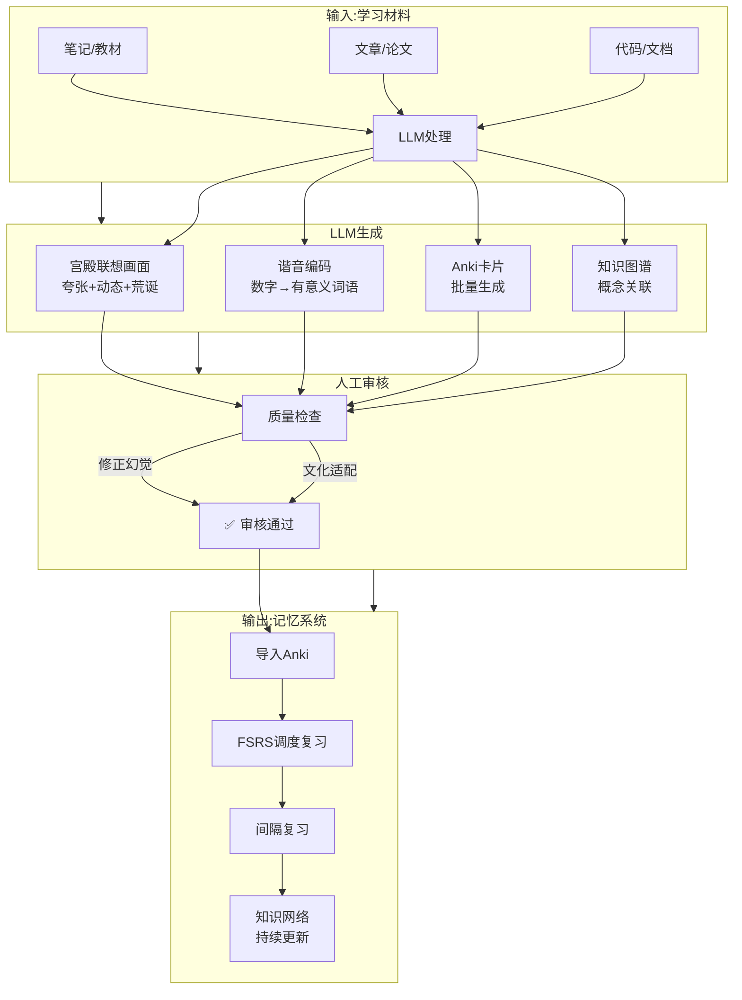
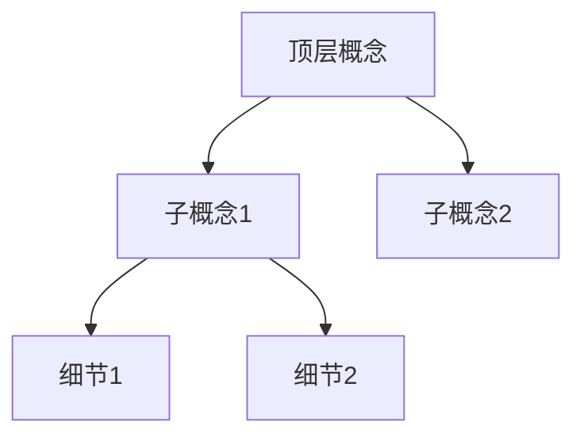

# 32-LLM辅助记忆实战指南

> **📍 本章导航**:前置 → [25-AI辅助记忆](25-AI辅助记忆.md) | 相关 → [30-记忆宫殿进阶](30-记忆宫殿进阶.md)·[27-合意困难与记忆](27-合意困难与记忆.md) | 方法 → M01·M07-R·M08·M13 | 难度 ⭐⭐ | 阅读 ~60min
> **⚠️ 全章底线**:1AI 生成 ≠ 记住,每个流程必须以 [M08 主动回忆](方法地图.md#m08) / [M07-R 间隔重复](方法地图.md#m07-r) 收尾;2每个流程附「LLM 调用卡片」(输入≤4K/输出≤2K tokens、超时30s/60s、重试1次→降级离线);3AI 生成内容必须人工确认后入库(防幻觉见 §2.4,离线全流程见 §3.5)。

> **更新日期**:2026年9月
> **覆盖范围**:使用大语言模型(LLM)进行记忆编码、间隔重复、知识图谱构建的完整实战方法
> **适用读者**:考研/考公/法考/医学考试备考者、终身学习者、Anki深度用户、AI辅助学习实践者
> **前置阅读**:[25-AI辅助记忆.md](25-AI辅助记忆.md)(FSRS算法与AI闪卡工具基础)

> **⏱ 预计阅读时间**:约60分钟(全文约15000字)
> **📖 建议分4次阅读**:
> - 第1次:LLM辅助记忆编码 + prompt模板,约18分钟
> - 第2次:LLM辅助间隔重复 + 超时Token管理,约15分钟
> - 第3次:LLM辅助知识图谱,约10分钟
> - 第4次:实战案例 + 中国LLM生态适配,约17分钟

---

## 目录

1. [LLM辅助记忆编码](#1-llm辅助记忆编码)
2. [LLM辅助间隔重复](#2-llm辅助间隔重复)
3. [LLM超时与Token管理](#3-llm超时与token管理)
4. [LLM辅助知识图谱](#4-llm辅助知识图谱)
5. [实战案例](#5-实战案例)
6. [中国LLM生态适配](#6-中国llm生态适配)
7. [参考资源](#7-参考资源)

---

> **📍 导航**:[31-魔法记忆前沿2025-2026](31-魔法记忆前沿2025-2026.md) ← **32-LLM辅助记忆实战指南** → [33-记忆速查手册](33-记忆速查手册.md)
> **💡 相关阅读**:[25-AI辅助记忆](25-AI辅助记忆.md)(FSRS算法与AI闪卡工具基础)| [24-最新记忆科学研究](24-最新记忆科学研究.md)(记忆科学依据)| [27-合意困难与记忆](27-合意困难与记忆.md)(测试效应与生成效应)| [30-记忆宫殿进阶](30-记忆宫殿进阶.md)(记忆宫殿高级技巧)| [31-魔法记忆前沿2025-2026](31-魔法记忆前沿2025-2026.md)(最新研究突破)

## ⚡ 5分钟速览

本文提供使用大语言模型进行记忆编码、间隔重复和知识管理的完整实战方法。**核心要点**:

1. **LLM辅助记忆编码**:LLM可快速批量生成记忆宫殿联想画面。关键原则:夸张+动态+荒诞+情感+感官。Prompt模板设计要点:指定角色(记忆宫殿设计专家)、输入(宫殿路径+知识点列表)、输出格式(画面描述+关键意象+感官细节)。LLM还可生成谐音、口诀、类比、故事等多元编码。质量检查:生成的画面必须满足"闭眼可见"标准。
2. **LLM辅助间隔重复**:LLM可自动生成Anki闪卡,从笔记/教材/文章批量提取知识点。关键prompt:原子性(一张卡一个知识点)、主动回忆(问题而非定义)、多角度(同一知识点3-5张不同角度的卡)。LLM还可分析复习数据,识别薄弱环节,生成针对性强化卡片。与FSRS算法配合:LLM生成卡片→Anki FSRS调度复习→LLM分析复习效果→优化卡片质量。
3. **超时与Token管理**:LLM调用有超时限制和Token成本。硬预算:单次输入≤4K tokens(超长材料按≤1.5K分块→逐块摘要汇总)、单次输出≤2K tokens、单轮超时30s(移动)/60s(桌面)、失败重试1次后降级离线(§3.5)。策略:分批处理(简单15-20个/批、复杂3-5个/批)、精简prompt、缓存结果、简单任务用轻量模型。本地部署可消除超时与隐私顾虑。
4. **LLM辅助知识图谱**:从学习材料中自动提取实体和关系,构建概念网络。识别知识盲区(图谱中的断点)、生成概念间连接、辅助跨学科联想。工具:LLM+Neo4j/知识图谱可视化。实践:先让LLM提取核心概念→人工审核→LLM生成连接→人工补充→形成个人知识网络。
5. **实战案例**:考研政治(马原+毛中特+史纲+思修四科知识图谱+闪卡自动生成)、法考(法条+案例+司法解释三层编码)、医学考试(器官系统整合+解剖图谱+药物机制)、英语词汇(词根词缀+语境+Anki)。每个案例包含完整prompt模板和工作流程。
6. **中国LLM生态适配**:DeepSeek、Kimi、豆包、通义、文心、智谱GLM 等国产模型各有优势(推理/长文本/中文语感/价格各有侧重,版本迭代快,以各家当前可用版本为准,免费额度优先)。本地部署:各家开源轻量模型+Ollama等推理框架,保护隐私、消除超时限制。涉外服务(如GPT/Claude等)需自行评估网络与合规。
7. **核心原则**:AI承担低阶任务(信息提取、卡片生成、知识整理),人专注高阶思维(判断、深化、创造)。"人机协作"而非"人机替代"--**AI生成≠记住**:生成的编码/卡片只是初稿,必须以[M08 主动回忆](方法地图.md#m08)自测+[M07-R 间隔重复](方法地图.md#m07-r)复习收尾,否则只是"看着眼熟"。

> **阅读建议**:时间有限优先读§1(LLM辅助编码)和§2(间隔重复),它们对日常学习影响最直接。§5(实战案例)可直接复制使用。§6(中国LLM适配)帮助选择合适的国产模型。

### ⚡ 一分钟速记

> **只有1分钟?记住这3个要点:**
> 1. LLM辅助编码:用prompt让LLM批量生成记忆宫殿联想画面,关键原则--夸张+动态+荒诞+情感+多感官
> 2. AI闪卡自动生成:从笔记/教材/文章批量提取知识点生成Anki卡片,但质量检查不可省略--AI可能产生幻觉
> 3. 人机协作原则:AI承担低阶任务(提取、生成、整理),人专注高阶思维(判断、深化、创造)--过度依赖AI会削弱自身编码能力

---

## 🎯 核心框架


```mermaid
graph TD
    subgraph INPUT["输入:学习材料"]
        NOTES["笔记/教材"] --> LLM["LLM处理"]
        ARTICLES["文章/论文"] --> LLM
        CODE["代码/文档"] --> LLM
    end

    subgraph LLM_GEN["LLM生成"]
        LLM --> PALACE_IMG["宫殿联想画面\n夸张+动态+荒诞"]
        LLM --> HOMOPHONE["谐音编码\n数字→有意义词语"]
        LLM --> ANKI_CARD["Anki卡片\n批量生成"]
        LLM --> KNOWLEDGE_MAP["知识图谱\n概念关联"]
    end

    subgraph HUMAN_CHECK["人工审核"]
        PALACE_IMG --> CHECK["质量检查"]
        HOMOPHONE --> CHECK
        ANKI_CARD --> CHECK
        KNOWLEDGE_MAP --> CHECK
        CHECK -->|"修正幻觉"| APPROVE["✅ 审核通过"]
        CHECK -->|"文化适配"| APPROVE
    end

    subgraph OUTPUT["输出:记忆系统"]
        APPROVE --> ANKI_IMPORT["导入Anki"]
        ANKI_IMPORT --> FSRS["FSRS调度复习"]
        FSRS --> REVIEW["间隔复习"]
        REVIEW --> KNOWLEDGE_NET["知识网络\n持续更新"]
    end

    INPUT --> LLM_GEN --> HUMAN_CHECK --> OUTPUT
```

### 📊 效果对比:LLM辅助编码 vs 人工编码

| 维度 | 人工编码 | LLM辅助编码 | 效率差异 | 质量差异 |
|------|----------|-----------|----------|----------|
| 联想画面生成 | 5-10分钟/个 | 10秒/个 | 30倍+速度 | 需人工审核 |
| 谐音编码 | 3-5分钟/个 | 5秒/个 | 30倍+速度 | 文化适配需调整 |
| Anki卡片制作 | 2-3分钟/张 | 10秒/张 | 10倍+速度 | 原子性需检查 |
| 知识图谱构建 | 数小时/领域 | 10分钟/领域 | 10倍+速度 | 关联准确性需验证 |
| 盲区检测 | 靠自觉 | AI主动识别 | 主动vs被动 | 需完整数据 |
| 编码深度 | 深(亲身参与) | 浅(被动接受) | - | 人必须参与修改 |
| 幻觉风险 | 无 | 存在 | - | 必须多源验证 |

---

记忆编码是将信息从短时记忆转化为长时记忆的关键过程。LLM的优势在于:它既拥有海量知识储备,又具备强大的语言生成能力,可以充当你的"编码助手"--帮你把枯燥的知识点转化为生动、具体、容易记住的画面、谐音、故事和类比。

### 1.1 用LLM生成记忆宫殿联想画面

记忆宫殿(Method of Loci)是人类已知最古老也最有效的记忆术之一。其核心是将抽象信息与熟悉的空间位置建立视觉联想。LLM可以帮你快速批量生成这些联想画面。

> 📖 记忆宫殿的基础原理与构建步骤见 [02-核心记忆技巧.md §1](02-核心记忆技巧.md#1-记忆宫殿法-method-of-loci)。高级技巧见 [30-记忆宫殿进阶.md](30-记忆宫殿进阶.md)。

#### 原理

人类大脑对以下特征的画面记忆最深刻:
- **夸张**:越大、越离谱越好
- **动态**:有动作比静态好
- **多感官**:涉及视觉、听觉、嗅觉、触觉
- **情感**:搞笑、恐怖、惊奇的画面更容易记住
- **荒诞**:违反常识的组合更突出

LLM可以按这些原则批量生成联想画面。

🔬 **实践启示**:LLM生成联想画面的效率是人工的30倍+(10秒/个 vs 5-10分钟/个),但质量检查不可省略。关键原则:生成的画面必须满足"闭眼可见"标准--如果闭眼无法清晰看到这个画面,说明编码不够具体。结合[30-记忆宫殿进阶](30-记忆宫殿进阶.md)§4中的动态编码技术(效果+30-40%),应要求LLM生成包含角色移动、视角切换的动态画面,而非静态描述。[27-合意困难与记忆](27-合意困难与记忆.md)中的生成效应告诉我们,自己参与修改LLM生成的内容,比直接使用效果更好--修改过程本身就是深度编码。

#### Prompt模板:记忆宫殿联想生成器

```markdown
### 角色
你是一位记忆宫殿设计专家,擅长将抽象知识点转化为夸张、动态、多感官的联想画面。

### 任务
为以下知识点列表,在指定的记忆宫殿路径上生成联想画面。

### 输入
**宫殿路径**:[例如:从家门口→玄关→客厅沙发→茶几→电视→冰箱→阳台]
**知识点列表**:
1. [知识点1]
2. [知识点2]
3. [知识点3]
...(可以一次给10-20个)

### 输出要求
每个知识点输出以下信息:
- **位置**:宫殿路径中的第几个位置
- **画面描述**:用50字以内描述一个夸张、动态的联想画面
- **感官细节**:包含视觉+至少一种其他感官(听觉/嗅觉/触觉/味觉)
- **情感标签**:搞笑/恐怖/惊奇/荒诞(选一个)
- **记忆钩子**:一句话概括这个画面为什么能帮你记住这个知识点

### 预算与分块(必带)
输入≤4K tokens(约2000-2600字材料,知识点≤10个/批);超长材料按≤1.5K分块→逐块摘要汇总后再编画面。输出≤2K tokens(约6-8个画面/批)。超时30s(移动)/60s(桌面),重试1次→降级手工编画面([M12](方法地图.md#m12)+[M11](方法地图.md#m11))。生成内容人工确认后入库。

### 注意
- 画面之间要有叙事连贯性,像走过一条路看到的连续场景
- 每个画面的主体动作要鲜明,避免静态描述
- 如果知识点是数字,使用数字-形象编码系统(0=球, 1=蜡烛, 2=鹅...)
```

#### 实际使用示例

**输入**:
```
宫殿路径:家门口→玄关→客厅沙发→茶几→电视→冰箱→阳台
知识点:
1. 细胞膜的流动镶嵌模型
2. 线粒体是细胞的"动力工厂"
3. DNA双螺旋结构
4. 基因突变的三种类型
5. 有丝分裂的四个时期
```

**LLM输出**(示例):

| 位置 | 知识点 | 画面描述 | 感官细节 | 情感 | 记忆钩子 |
|:---:|:---|:---|:---|:---:|:---|
| 家门口 | 流动镶嵌模型 | 你家大门变成了一块巨大的果冻,上面镶嵌着各种彩色弹珠,弹珠在果冻表面缓缓滑动 | 视觉:五彩斑斓的弹珠在半透明果冻中移动;触觉:果冻表面黏糊糊的 | 荒诞 | 磷脂双分子层像果冻一样流动,蛋白质像弹珠镶嵌其中 |
| 玄关 | 线粒体 | 你脱鞋时发现鞋柜里塞满了微型发电厂,每一双鞋都在冒烟发电,电表转得飞快 | 视觉:微型发电厂冒着蒸汽;听觉:嗡嗡的发电声 | 搞笑 | 线粒体=发电厂,把有机物转化为ATP能量 |
| 客厅沙发 | DNA双螺旋 | 沙发上盘着两条巨大的彩色蟒蛇,它们互相缠绕成螺旋楼梯的形状,蛇身上写着A、T、C、G | 视觉:红绿蓝紫四色螺旋;触觉:蛇鳞冰冷滑腻 | 恐怖 | 双螺旋结构,碱基配对ATCG |
| 茶几 | 基因突变三种类型 | 茶几上摆着三堆东西:一堆碎玻璃(缺失)、一个多了条腿的椅子(重复)、一块黑白反转的棋盘(替换) | 视觉:碎玻璃反光刺眼;听觉:玻璃碎裂声 | 惊奇 | 缺失、重复、替换--三种突变类型 |
| 电视 | 有丝分裂四时期 | 电视上在播放一部四幕剧:第一幕人排队(前期),第二幕排队走到正中间(中期),第三幕分头跑向两边(后期),第四幕画面一分为二(末期) | 视觉:人形小人不断排列组合;听觉:激昂的背景音乐 | 搞笑 | 前期排列→中期对齐→后期分离→末期分裂 |

#### 使用技巧

1. **一次不超过20个知识点**:超过20个会导致画面质量下降,且容易混淆
2. **先建宫殿再填内容**:先确定你熟悉的路径(家、学校、公司),再让LLM填充
3. **个性化调整**:LLM生成后,根据自己的联想习惯微调画面
4. **闭眼回放**:生成后立刻闭眼走一遍宫殿路径,检验是否能回忆起每个画面

#### 🎛 流程卡·F32-1 宫殿联想画面生成(含 LLM 调用卡片)

| LLM 调用卡片 | 值 |
|---|---|
| 任务 | 在指定宫殿路径上为知识点生成联想画面 |
| 输入预算 | ≤4K tokens/次;超长材料按 ≤1.5K 分块,逐块摘要汇总 |
| 输出预算 | ≤2K tokens/次(6-8个画面/批) |
| 单轮超时 | 移动 30s / 桌面 60s |
| 重试与降级 | 重试1次(5s)→手工编画面:[M12](方法地图.md#m12)+[M11](方法地图.md#m11)+[M01](方法地图.md#m01) |
| 防幻觉 | 画面挂钩的知识点/年代/人名对照教材核对 ≥20%(数字类100%,§2.4) |
| 成本量级 | 每批 ≈2K输入+1.5K输出 tokens;千字材料≈3K输入(以各家当前定价为准) |
| 隐私边界 | 不传未公开考题/涉密材料;国产模型优先,涉外服务需自行评估网络与合规 |

**七要素**:何时用:有序/具象知识点≥5个 |何时不用:<5个(直接[M02 故事链](方法地图.md#m02))或涉密材料 |难度⭐⭐·2-3周·每天15分钟 |验收:闭眼回放路线,按序复述≥80%知识点 |失败回退:[M02](方法地图.md#m02) |中国化示例:考研史纲按地铁1号线站点挂年份+事件 |效果时间线:当天可闭眼回放,2周后提取明显变快 |**收尾(必须)**:AI生成≠记住--闭眼回放后合上提示用[M08 主动回忆](方法地图.md#m08)默写,再入Anki按[M07-R 间隔重复](方法地图.md#m07-r)复习。

### 1.2 用LLM将抽象概念转化为具体编码

抽象概念(如经济学术语、法律原则、哲学概念)是记忆的难点。LLM擅长将抽象概念"翻译"为具体的形象、故事或类比。

#### Prompt模板:抽象→具象编码器

```markdown
### 角色
你是一位认知科学专家,擅长将抽象概念转化为具体、可感知的编码。

### 任务
将以下抽象概念转化为具体的记忆编码。

### 编码方式(按优先级选择最合适的一种)
1. **类比法**:找一个日常生活中高度相似的事物做类比
2. **故事法**:编一个简短的故事,包含概念的核心含义
3. **画面法**:描述一个具体的、可想象的画面
4. **拟人法**:将概念拟人化,赋予它性格和行为
5. **谐音法**:利用中文谐音创造记忆口诀

### 输入
[粘贴你的抽象概念列表]

### 输出格式
对每个概念输出:
- **概念名称**
- **编码方式**:使用了哪种方法
- **编码内容**:具体的类比/故事/画面/口诀
- **记忆锚点**:一句话核心记忆点
- **易混淆提醒**:与哪些相似概念容易混淆,如何区分

### 预算与分块(必带)
输入≤4K tokens(概念≤8个/批,定义≤200字/个);超长材料按≤1.5K分块→逐块摘要汇总。输出≤2K tokens。超时30s/60s,重试1次→降级手工[M13 精细加工](方法地图.md#m13)。生成内容人工确认后入库。

### 注意
- 编码必须包含具体可感知的元素(颜色、形状、声音、动作)
- 避免使用需要额外记忆的抽象编码
- 优先使用与中文母语者生活经验相关的元素
```

#### 实际使用示例

**输入**:经济学概念
```
边际效用递减规律、机会成本、沉没成本、规模经济、信息不对称
```

**LLM输出**(示例):

| 概念 | 编码方式 | 编码内容 | 记忆锚点 | 易混淆提醒 |
|:---|:---:|:---|:---|:---|
| 边际效用递减 | 类比法 | 想象你饿极了吃包子:第一个包子幸福感爆棚,第二个还行,第三个勉强,第四个想吐。每多吃一个,带来的满足感都在下降。 | 包子吃撑了--每多吃一个越不爽 | 与"边际成本递增"区分:效用是满足感下降,成本是花的钱变多 |
| 机会成本 | 故事法 | 你周末有2小时,可以去打工赚100元,也可以去约会。你选了约会,那么这次约会的"价格"不是0元,而是100元--你放弃的打工收入。 | 约会的账单=你没去赚的钱 | 与"沉没成本"区分:机会成本是"你放弃的",沉没成本是"你已经花掉的" |
| 沉没成本 | 画面法 | 你在电影院看了30分钟烂片,票钱已经退不了了。这张电影票就像沉在海底的金币--无论你做什么都捞不回来了。理性决策不应该考虑它。 | 海底的金币--捞不回来就别管了 | 与"机会成本"区分:沉没成本是过去的事,机会成本是未来的选择 |
| 规模经济 | 拟人法 | 想象一个食堂阿姨:给1个人做饭,平均成本很高(要买菜、开火、洗碗)。给100个人做饭,同样的开火洗碗,平均成本就低很多。规模越大,平均成本越低。 | 食堂阿姨做大锅饭--人越多越划算 | 与"范围经济"区分:规模经济是同一种产品做更多,范围经济是做更多种类 |
| 信息不对称 | 故事法 | 二手车市场:卖家知道车的真实状况,买家不知道。结果好车卖不出去(卖家不愿低价卖),烂车反而畅销(买家只愿出低价)。这就是"劣币驱逐良币"。 | 二手车市场--卖家知道的比买家多 | 与"道德风险"区分:信息不对称是事前的信息差,道德风险是事后的隐藏行为 |

> 🎛 流程卡·F32-2 抽象→具象编码(含 LLM 调用卡片):任务:抽象概念转类比/故事/画面 | 输入≤4K tokens(概念≤8个/批,超长≤1.5K分块逐块摘要汇总)| 输出≤2K tokens | 超时30s/60s | 重试1次→手工[M13 精细加工](方法地图.md#m13) | 防幻觉:编码夹带的定义/年代/人名抽查≥20%(§2.4)| 成本:每概念≈0.5K入+0.3K出 tokens(以各家定价为准)| 隐私:不传涉密材料,国产优先。
> **七要素**:何时用:抽象概念≥5个且自己想不出好钩子 | 何时不用:≤2个概念(自己精加工更深)、需逐字记忆的定义原文 | 难度⭐⭐·2周·每天15分钟 | 验收:次日复述编码+含义≥80% | 失败回退:[M13](方法地图.md#m13) | 中国化示例:考研政治马原概念→包子铺类比 | 效果时间线:当周可回忆,2-4周叠加[M07-R](方法地图.md#m07-r)后明显变牢 | **收尾(必须)**:用自己的话重写编码([M09](方法地图.md#m09))→[M08](方法地图.md#m08)自测→[M07-R](方法地图.md#m07-r)复习。

---

### 1.3 用LLM批量生成谐音编码

谐音编码特别适合记忆数字、公式、专有名词等难以形象化的内容。LLM的中文语料库极其丰富,能生成大量谐音方案供你挑选。

#### Prompt模板:谐音编码批量生成器

```markdown
### 角色
你是一位谐音编码大师,精通中文谐音记忆法,擅长将数字、公式、专有名词转化为朗朗上口的中文谐音句子。

### 任务
为以下内容生成谐音编码。

### 规则
1. 谐音必须自然流畅,读起来像正常的中文句子
2. 优先使用具体名词和动词(避免抽象词)
3. 句子要有画面感,最好能构成一个场景
4. 每个编码提供3个备选方案
5. 标注谐音对应关系(哪个字对应哪个数字/音节)

### 输入类型
[数字串/公式/专有名词/...]

### 输入内容
[具体内容]

### 预算与分块(必带)
输入≤4K tokens(数字串/专有名词≤15个/批);超长材料按≤1.5K分块→逐块摘要汇总。输出≤2K tokens。超时30s/60s,重试1次→降级手工[M03 数字谐音](方法地图.md#m03)。生成内容人工确认后入库(数字类编码必须逐位核对,§2.4)。

### 输出格式
对每个输入,提供3个方案:
- **方案A**:谐音句子 + 对应关系 + 画面感评分(1-5)
- **方案B**:谐音句子 + 对应关系 + 画面感评分(1-5)
- **方案C**:谐音句子 + 对应关系 + 画面感评分(1-5)
- **推荐**:选择画面感最强的方案并说明理由
```

#### 圆周率谐音编码示例

**输入**:圆周率前20位 `3.1415926535 8979323846`

**LLM输出**(示例):

**方案A**(推荐 ⭐ 画面感5分):
> **山巅一寺一壶酒,尔乐苦煞吾,把酒吃,酒散了,思路罢了吧**

对应关系:
```
山(3)巅(.)一(1)寺(4)一(1)壶(5)酒(9),
尔(2)乐(6)苦(5)煞(3)吾(5),
把(8)酒(9)吃(7),酒(9)散(3)了(2),
思(3)路(8)罢(4)了(6)
```

**方案B**(画面感4分):
> **山上一寺一壶酒,尔留三壶五,八舅七舅三二三,四六**

**方案C**(画面感3分):
> **3点1刻4点1刻5点9刻,2楼6楼5楼3楼5楼,8楼9楼7楼9楼3楼2楼3楼8楼4楼6楼**

#### 化学元素谐音编码示例

**输入**:前20号化学元素

**LLM输出**(示例):
```
氢氦锂铍硼,碳氮氧氟氖,钠镁铝硅磷,硫氯氩钾钙

谐音口诀(示例,选你自己读着最顺的版本;换版本后要重新对应核对):
青海犁皮篷,炭蛋养弗奶,那美女桂琳,留绿牙嫁盖
```

**画面故事**:青海湖边一顶用犁和皮搭的帐篷(青海犁皮篷),篷里一颗炭做的蛋仰躺着养一头佛像奶牛(炭蛋养弗奶),篷外站着一位美女叫桂琳(那美女桂琳),她留着绿色的牙齿、顶着红盖头出嫁(留绿牙嫁盖)。

### 1.4 用LLM检查编码冲突

> 🎛 流程卡·F32-3 谐音/数字编码批量生成(含 LLM 调用卡片):任务:数字/公式/专名→中文谐音编码 | 输入≤4K tokens(≤15个/批,超长≤1.5K分块逐块摘要汇总)| 输出≤2K tokens | 超时30s/60s | 重试1次→手工[M03](方法地图.md#m03)/[M14 口诀](方法地图.md#m14) | 防幻觉:谐音对应必须逐位核对(数字类100%核对,§2.4);公式类以教材原文为准 | 成本:每项≈0.2K入+0.3K出 tokens | 隐私:不传涉密材料。
> **七要素**:何时用:数字/常数/专名批量记忆(电话、年代、公式常数)| 何时不用:长数字串(换[M05 PAO](方法地图.md#m05));谐音没有画面感时宁可不用 | 难度⭐·1周·每天10分钟 | 验收:听到数字能3秒内说出谐音句并复述原数 | 失败回退:[M03](方法地图.md#m03)手工编码表 | 中国化示例:圆周率/元素周期表/法考时效期数字 | 效果时间线:当天可用,1周后自动联想 | **收尾(必须)**:[M08](方法地图.md#m08)遮住数字默写→[M07-R](方法地图.md#m07-r)排期复习。

当你积累了大量编码后,冲突(相同编码指向不同内容)是常见问题。LLM可以帮你系统性地检查和解决冲突。

#### Prompt模板:编码冲突检查器

```markdown
### 角色
你是一位记忆编码质量审计专家,负责检查编码系统中的冲突和歧义。

### 任务
检查以下编码列表中的冲突,包括:
1. **直接冲突**:完全相同的编码指向不同内容
2. **相似冲突**:编码相似(谐音接近、画面类似)导致混淆
3. **歧义冲突**:编码本身可以有多种解读
4. **顺序冲突**:在记忆宫殿中相邻的两个编码画面太相似

### 输入
[粘贴你的编码列表,格式:编码 → 对应内容](≤4K tokens/批,约100-150条编码;超出分批,跨批冲突用前批摘要传递)

### 预算与分块(必带)
输入≤4K tokens;输出≤2K tokens;超时30s/60s,重试1次→降级人工比对(用表格排序肉眼查重)。冲突修复后的编码人工确认后入库。

### 输出
对每个发现的冲突:
- **冲突类型**:直接/相似/歧义/顺序
- **涉及编码**:列出冲突的编码
- **风险等级**:高/中/低
- **解决方案**:建议如何修改其中一个编码以消除冲突

### 注意
- 高风险:考试中极可能混淆的内容
- 中风险:偶尔可能混淆
- 低风险:几乎不会混淆,但理论上存在歧义
```

### 1.5 用LLM生成类比和隐喻

> 🎛 流程卡·F32-4 编码冲突检查(含 LLM 调用卡片):任务:排查编码库的直接/相似/歧义/顺序冲突 | 输入≤4K tokens(100-150条/批,超长≤1.5K分块逐块摘要汇总)| 输出≤2K tokens | 超时30s/60s | 重试1次→人工排序比对 | 防幻觉:LLM判的"低风险"不代表无冲突,人工抽查≥20% | 成本:每批≈3K入+1.5K出 tokens | 隐私:编码库含个人学习数据,只传编码对、不传个人身份信息。
> **七要素**:何时用:编码库>50条、考前排查易混点 | 何时不用:编码<20条(肉眼查更快)| 难度⭐·1周内可用·每周20分钟 | 验收:同批编码无重复指向,易混对各有区分口诀 | 失败回退:Excel排序人工查重 | 中国化示例:法考"应当/可以"法条编码排查 | 效果时间线:当次即减少"串了"的错误 | **收尾(必须)**:冲突修正后用[M08](方法地图.md#m08)抽测易混对,再按[M07-R](方法地图.md#m07-r)安排。

类比是连接新知识与已有知识的桥梁。LLM特别擅长找到跨领域的类比。

#### Prompt模板:类比生成器

```markdown
### 角色
你是一位类比思维专家,擅长在不同领域之间建立精确的类比关系。

### 任务
为以下概念生成3个不同领域的类比,帮助理解和记忆。

### 类比来源领域
- 日常生活(厨房、交通、运动等)
- 自然界(动物、天气、生态等)
- 科技/互联网(电脑、手机、网络等)

### 输入
`[概念名称] : [概念的简要定义]`（模板占位符，≤8 个概念/批，非真实链接）

### 预算与分块(必带)
输入≤4K tokens(超长材料按≤1.5K分块→逐块摘要汇总);输出≤2K tokens。超时30s/60s,重试1次→降级自己想类比([M13](方法地图.md#m13))。生成类比人工确认后入库。

### 输出格式
对每个类比:
- **类比对象**:[日常生活/自然界/科技]中的XX
- **对应关系表**:

| 概念元素 | 类比元素 | 对应理由 |
|:---|:---|:---|
| 元素A | 类比A | 为什么对应 |
| 元素B | 类比B | 为什么对应 |

- **类比局限**:这个类比在哪里不成立(避免过度类比)
```

---

> 🎛 流程卡·F32-5 类比/隐喻生成(含 LLM 调用卡片):任务:为概念找跨领域类比 | 输入≤4K tokens(≤8个概念/批,超长≤1.5K分块逐块摘要汇总)| 输出≤2K tokens | 超时30s/60s | 重试1次→手工[M13](方法地图.md#m13) | 防幻觉:类比不是事实--类比中的"对应关系"必须人工确认,防止把类比当定义记(§2.4)| 成本:每概念≈0.4K入+0.4K出 tokens | 隐私:不传涉密材料。
> **七要素**:何时用:抽象原理理解卡壳 | 何时不用:需精确记忆的定义/公式(类比会引入偏差,以教材为准)| 难度⭐·1周·每天10分钟 | 验收:能说出类比的"对应表"和"类比局限" | 失败回退:[M13](方法地图.md#m13) | 中国化示例:GDP→全国食堂流水账 | 效果时间线:理解即时变浅显,长期靠[M08](方法地图.md#m08)提取 | **收尾(必须)**:[M08](方法地图.md#m08)合上类比后复述原始概念,确认没把类比当成定义。

## 2. LLM辅助间隔重复

间隔重复的核心是"在正确的时间复习正确的内容"。LLM可以在间隔重复的每个环节提供帮助:从生成高质量闪卡,到优化复习策略,再到与FSRS算法配合。

### 2.1 用LLM生成Anki卡片的最佳实践

直接让LLM生成卡片容易出现以下问题:答案太长、问题太模糊、缺乏上下文、一张卡片考多个知识点。以下是经过实践验证的最佳方法。

#### Prompt模板:高质量Anki卡片生成器

```markdown
### 角色
你是一位Anki闪卡设计专家,精通最小信息原则(Minimum Information Principle)和原子化知识拆分。

### 规则
1. **一张卡片只考一个知识点**(最小信息原则)
2. **问题具体明确**,避免"什么是XX"这种开放性问题
3. **答案简洁**,理想长度10-30字,最长不超过50字
4. **提供上下文**,在卡片背面附上简要背景帮助理解
5. **避免否定式问题**("以下哪个不是..."),因为大脑容易忽略"不"字
6. **使用填空题和问答题两种格式**
7. **对难记的内容自动添加助记提示**

### 输入
**学科**:[学科名称]
**章节/主题**:[具体章节]
**原始内容**:
[粘贴教材内容、笔记或任何学习材料]

### 输出格式
JSON数组,每个元素:
```json
{
  "id": 1,
  "front": "问题面",
  "back": "答案面",
  "type": "qa 或 cloze",
  "difficulty": 1-5,
  "mnemonic": "助记提示(如果适用)",
  "context": "背景知识(帮助理解的补充信息)",
  "tags": ["标签1", "标签2"]
}
```

### 预算与分块(必带)
输入≤4K tokens(原始材料≈2000-2600字/次;超长材料按≤1.5K分块→逐块摘要汇总后再生成);输出≤2K tokens(5-10张/批)。超时30s(移动)/60s(桌面),重试1次→降级手工模板(§3.5)。生成卡片人工确认后才入库。

### 质量标准
- 问题无歧义,只有一种正确答案
- 答案不含无关信息
- 如果知识点需要理解而非死记,先用一张卡片解释原理,再用另一张卡片考察记忆
```

#### 批量生成工作流

当需要从大量学习材料中生成卡片时,按以下流程操作:

**第一步:材料预处理**
```markdown
### 任务
将以下学习材料拆分为"可卡片化"的原子知识点。

### 规则
- 每个知识点应该能用一张卡片完全覆盖
- 复合知识点拆分为多张互相关联的卡片
- 标注知识点之间的依赖关系(A是B的前置知识)

### 输入
[粘贴原始材料](≤1.5K tokens/块;整本教材先分章节→分块→逐块摘要汇总)

### 预算与分块(必带)
输入≤4K tokens;输出≤2K tokens(约15-20个知识点/批)。超时30s/60s,重试1次→人工划知识点。

### 输出格式
1. [知识点] | 依赖:无 | 类型:事实/概念/过程/公式
2. [知识点] | 依赖:1 | 类型:...
...
```

**第二步:卡片生成**(将上一步的输出作为输入,使用前面的Anki卡片生成prompt)

**第三步:质量审查**
```markdown
### 任务
审查以下Anki卡片的质量,找出并修复问题。

### 检查项
1. 一张卡片是否只考一个知识点?
2. 问题是否有歧义?
3. 答案是否过于冗长?
4. 是否存在互相矛盾的卡片?
5. 难度标注是否合理?
6. 助记提示是否有帮助?

### 输入
[粘贴生成的卡片](≤4K tokens/批,约20-30张)

### 预算与分块(必带)
输入≤4K tokens;输出≤2K tokens。超时30s/60s,重试1次→人工逐张自查(用§2.4清单)。

### 输出
对每张有问题的卡片:
- 问题描述
- 修改建议
- 修改后的卡片
```

#### 🎛 流程卡·F32-6 Anki卡片批量生成(含 LLM 调用卡片)

| LLM 调用卡片 | 值 |
|---|---|
| 任务 | 教材/笔记→原子知识点→Anki卡片→质量审查(三步流水线) |
| 输入预算 | ≤4K tokens/次;超长材料按 ≤1.5K 分块,逐块摘要汇总 |
| 输出预算 | ≤2K tokens/次(5-10张卡/批) |
| 单轮超时 | 移动 30s / 桌面 60s |
| 重试与降级 | 重试1次(5s)→手工模板写卡(§3.5离线全流程) |
| 防幻觉 | 全部卡片**人工确认后才入库**;事实性内容抽查≥20%;数字/年代/人名/公式100%核对(§2.4) |
| 成本量级 | 每千字材料≈3K输入+2K输出 tokens(以各家当前定价为准,免费额度优先) |
| 隐私边界 | 不传未公开考题/身份证/合同;国产模型优先,涉外服务需自行评估网络与合规 |

**七要素**:何时用:材料量大(≥30个知识点)、题型规整 | 何时不用:<10个知识点手写更深更快、涉密材料 | 难度⭐·当周可用·每天20分钟 | 验收:随机抽10张,合上答案答对≥8张且事实无误 | 失败回退:手写卡片+[M07-R](方法地图.md#m07-r) | 中国化示例:考研专业课PDF→晚上21:30地铁上复习 | 效果时间线:当天卡片库成型,2周后[M07-R](方法地图.md#m07-r)见效 | **收尾(必须)**:AI生成≠记住--每批卡片当日用[M08 主动回忆](方法地图.md#m08)自测一遍再入复习队列。

### 2.2 用LLM优化复习间隔的策略

LLM虽然不能直接替代FSRS算法,但可以在以下方面辅助优化:

#### 2.2.1 难度预估

在没有复习历史数据时,LLM可以预估卡片的难度,帮助设定初始复习间隔。

```markdown
### 任务
评估以下Anki卡片的学习难度,帮助设定初始复习间隔。

### 评估维度
1. **信息密度**:答案包含多少独立信息单元?
2. **抽象程度**:1=非常具体,5=非常抽象
3. **前置知识**:需要多少前置知识才能理解?
4. **干扰可能性**:与其他知识点混淆的可能性?
5. **联想难度**:能否轻松找到生活中的类比?

### 输入
[粘贴卡片列表](≤4K tokens/批,约30-50张卡;超出分批)

### 预算与分块(必带)
输入≤4K tokens;输出≤2K tokens。超时30s/60s,重试1次→按经验规则手工估难度(难度高=当天2次→隔天→隔3天)。

### 输出
每张卡片:
- 难度评分(1-10)
- 建议初始间隔(天)
- 难度分析(一句话说明为什么是这个难度)
- 特殊建议(如果需要额外的编码辅助)

### 初始间隔建议规则
- 难度1-3:初始间隔3天
- 难度4-5:初始间隔2天
- 难度6-7:初始间隔1天
- 难度8-10:当天复习2次,之后间隔1天
```

#### 2.2.2 复习效果分析

```markdown
### 任务
分析以下复习记录,找出薄弱环节并给出改进建议。

### 输入
[粘贴Anki导出的复习统计数据,或手动记录](≤4K tokens/次;超长统计按≤1.5K分块→逐块摘要汇总)

### 预算与分块(必带)
输入≤4K tokens;输出≤2K tokens。超时30s/60s,重试1次→直接看Anki内置统计图人工分析。

### 分析维度
1. **遗忘模式**:哪些类型的卡片遗忘率最高?
2. **时间规律**:一天中哪个时段记忆效果最好?
3. **难度分布**:高难度卡片是否占比过高?
4. **编码质量**:频繁遗忘的卡片是否需要更好的编码?
5. **复习节奏**:是否出现了"复习雪崩"(大量卡片同一天到期)?

### 输出
- 薄弱知识点TOP10
- 遗忘率分析(按知识点类型分组)
- 3条具体可执行的改进建议
- 需要重新编码的卡片列表及改进方案
```

> 🎛 流程卡·F32-7 复习诊断(难度预估+效果分析)(含 LLM 调用卡片):任务:估卡片难度/找薄弱环节 | 输入≤4K tokens(统计摘要化,超长≤1.5K分块逐块摘要汇总)| 输出≤2K tokens | 超时30s/60s | 重试1次→Anki内置统计人工分析 | 防幻觉:LLM找的"薄弱点"是线索不是结论,用[M08](方法地图.md#m08)抽测验证后再改卡片 | 成本:每2周1-2次,≈3K入+2K出 tokens | 隐私:复习数据含知识盲区,只传统计摘要不传个人身份信息。
> **七要素**:何时用:卡片>200张、出现"复习雪崩"或高遗忘率 | 何时不用:卡片<100张(Anki自带统计足够)| 难度⭐⭐·2周·每2周30分钟 | 验收:改卡后该批卡片7天回忆率提升(看Anki统计)| 失败回退:[M32 错题反向提取](方法地图.md#m32)人工复盘 | 中国化示例:法考2000条法条每2周诊断一次 | 效果时间线:2-4周看到遗忘率下降 | **收尾(必须)**:诊断结论落地到[M07-R](方法地图.md#m07-r)排期与[M08](方法地图.md#m08)重测,而不是"看完报告就算完"。

### 2.3 FSRS + LLM组合方案

将FSRS的算法优势与LLM的编码能力结合,可以达到最佳效果。

#### 工作流程

```
学习材料 → LLM预处理(拆分知识点、生成编码) → LLM生成Anki卡片
    → 导入Anki → FSRS调度复习 → 复习数据反馈 → LLM分析优化
```

#### 组合策略详解

**策略1:LLM编码 + FSRS调度**

适用场景:初次学习大量新知识

```
步骤:
1. 将学习材料交给LLM,生成记忆编码和Anki卡片
2. 导入Anki,使用FSRS默认参数
3. 正常复习2-3周,积累复习数据
4. 用FSRS优化器根据复习历史调参
5. 对高遗忘率卡片,让LLM重新设计编码
```

**策略2:LLM难度预估 + FSRS初始参数**

适用场景:缺少复习历史数据的新用户

```
步骤:
1. LLM为每张卡片预估难度(1-10)
2. 根据难度设置FSRS的初始难度参数:
   - LLM难度1-3 → FSRS难度3(低)
   - LLM难度4-6 → FSRS难度5(中)
   - LLM难度7-10 → FSRS难度7(高)
3. 复习时FSRS会自动调整,LLM预估只影响初始阶段
```

**策略3:LLM定期诊断 + FSRS动态优化**

适用场景:长期学习项目(考研、法考等)

```
每2周执行一次:
1. 从Anki导出复习数据(卡片ID、复习次数、成功率、当前间隔)
2. 交给LLM分析,找出:
   - 遗忘率>30%的卡片(需要重新编码)
   - 成功率>95%且间隔<7天的卡片(可能间隔过短)
   - 连续3次"容易"的卡片(可以更积极地增加间隔)
3. 根据LLM建议，手动调整问题卡片的编码或标签
4. 运行FSRS优化器更新参数
```

> **组合策略的共同收尾（必须）**：无论用哪种策略，卡片最终都要靠[M08 主动回忆](方法地图.md#m08)自测（合上答案能答对≥80%）+ [M07-R 间隔重复](方法地图.md#m07-r)长期排期。AI和FSRS只负责"省时间"，不负责"记住"。

---

### 2.4 防幻觉校验清单(所有AI生成内容入库前必做)

> LLM会一本正经地编错:错年代、错人名、错数字、错公式。**AI生成卡片必须人工确认后再入库**;高危字段100%核对,其余抽查≥20%。

| 高危字段 | 常见幻觉 | 核对动作(100%必查) | 权威来源 |
|:---:|:---|:---|:---|
| 数字 | 期限/金额/比例/数量张冠李戴 | 逐个数字对照原文,红笔圈出 | 教材/法条原文 |
| 年代 | 年份差10-100年、朝代错位 | 对照教材大事年表 | 教材附录/官方考纲 |
| 人名 | 张冠李戴、虚构人物、译名混乱 | 人名+事件双向核对 | 教材/权威工具书 |
| 公式 | 符号错、系数错、条件丢失 | 逐符号对照,自己推导一遍 | 教材公式表([M40 公式推导链](方法地图.md#m40)) |
| 定义/条文 | 措辞改动导致含义跑偏、条号错 | 与原文逐句对照 | 教材原文/官方文本 |

**标准流程(每批5-10分钟)**:1可选"AI自查"(让它列出所有数字/年代/人名并给依据,但只作线索)→ 2人工核对(高危100%,其他随机≥20%)→ 3核对过的打tag `已核对`,未核对不入复习队列 → 4发现一张幻觉卡,同批全部重查(幻觉常成批出现)→ 5入库后[M08](方法地图.md#m08)抽测复核,发现记错立即改卡。

> 口诀:**数字年代人名公式,红笔四查才入库;AI初稿人工定稿,查完再背才算数。**

---

## 3. LLM超时与Token管理

使用LLM辅助记忆时,超时和token限制是两个最常见的技术障碍。本节提供实用的管理策略。

### 3.1 不同LLM的超时设置对比

各家模型的超时、最大输出、上下文窗口与价格随版本频繁调整,**以各家官方文档当前可用版本为准**。这里只给与具体模型无关的通用约束(本书全库统一):

| 约束项 | 统一值 | 原因 |
|:---:|:---:|:---|
| 单次输入 | ≤4K tokens | 控成本、控延迟;大上下文≠免费 |
| 单次输出 | ≤2K tokens | 输出越长越容易超时/截断 |
| 单轮超时 | 移动 30s / 桌面 60s | 移动网络与App后台限制 |
| 重试 | 1次(间隔5s)后降级 | 避免无限等待 |
| 超长材料 | ≤1.5K tokens 分块→逐块摘要汇总 | 避免单次超预算 |

**按特性粗选(定性,具体型号以各家当前版本为准)**:
- **国产通用型**(DeepSeek、通义、豆包、智谱GLM 等):中文语感好、国内访问快、多有免费额度 → 日常编码/卡片生成首选
- **长文本型**(Kimi、MiniMax 等):超长上下文 → 整章材料粗处理(仍建议分块)
- **推理型**(各家深度思考/推理模式):复杂类比、难点拆解 → 较慢较贵,只给关键任务用
- **涉外模型**(GPT/Claude 等):综合能力强 → 需自行评估网络与合规

### 3.2 Token预算管理

#### 3.2.1 理解Token消耗

中文内容的token消耗约为英文的1.5-2倍。以下是一个粗略估算:

| 内容类型 | 每1000字消耗Token数 | 说明 |
|:---|:---:|:---|
| 中文文本(输入) | ~1,500-2,000 | 中文字符约占1.5-2 token/字 |
| 中文文本(输出) | ~1,500-2,000 | 同上 |
| 英文文本(输入) | ~750-1,000 | 英文单词约占1-1.5 token/词 |
| 英文文本(输出) | ~750-1,000 | 同上 |
| JSON格式输出 | ~2,000-2,500 | 格式符号额外消耗token |

#### 3.2.2 Token预算分配策略(本书统一硬预算)

模型的上下文窗口再大,也**不改变单次调用的预算**--大窗口只是让你能塞进长材料,成本、超时、截断风险都随之上升。记忆类任务全库统一:

```
单次调用:
- 输入 ≤ 4K tokens(系统提示+规则 ≤1K,材料 ≤3K,约2000-2600中文字)
- 输出 ≤ 2K tokens(卡片5-10张/批,或编码6-8个/批)
- 超长材料:按 ≤1.5K tokens 分块 → 逐块摘要 → 汇总后再做最终生成

为什么不是"上下文窗口越大越好":
- 成本按 token 计费,输入翻倍≈钱翻倍
- 输出越长,移动端超时/截断概率越高
- 一次塞太多知识点,卡片原子性与编码质量都下降
```

#### 3.2.3 省Token的实用技巧

1. **精简系统提示**:把冗长的角色描述压缩为要点列表
   ```
   ❌ 你是一位拥有20年教学经验的记忆大师,精通各种记忆术...
   ✅ 角色:记忆编码专家。规则:1.画面具体 2.包含感官 3.50字以内
   ```

2. **使用缩写和代号**:
   ```
   ❌ 请使用记忆宫殿方法将以下知识点转化为联想画面
   ✅ 宫殿法编码以下知识点
   ```

3. **分段输入而非一次性全给**:
   ```
   ❌ 一次输入整本教材(浪费token在大量无关内容上)
   ✌️ 按章节分次输入,每次只给当前需要处理的部分
   ```

4. **限制输出格式**:
   ```
   ❌ 请详细描述你的思考过程,然后给出编码方案
   ✅ 直接输出JSON格式,不要解释
   ```

5. **复用system prompt**:
   ```
   在同一会话中,system prompt只设置一次。
   后续追问不需要重复规则说明。
   ```

### 3.3 分批处理策略

当学习材料量超过单次API调用的承载能力时,需要分批处理。

#### 3.3.1 分批策略设计

```python
# 分批处理伪代码

def batch_process(materials, batch_size=20):
    """
    将大量学习材料分批交给LLM处理

    batch_size: 每批处理的知识点数量
    建议值(受单次输入≤4K tokens约束):
    - 简单知识点(单词、日期):15-20个/批
    - 中等知识点(概念、公式):8-10个/批
    - 复杂知识点(长定义、原理):3-5个/批
    - 超长材料:先按≤1.5K tokens分块逐块摘要,再汇总生成
    """
    results = []
    batches = split_into_batches(materials, batch_size)

    for i, batch in enumerate(batches):
        prompt = build_prompt(batch)
        response = call_llm(prompt)
        results.extend(parse_response(response))

        # 控制调用频率,避免触发限流
        if i < len(batches) - 1:
            time.sleep(1)  # 间隔1秒

    return results
```

#### 3.3.2 分批大小的经验值

| 内容复杂度 | 每批知识点数 | 预估每批Token消耗 | 推荐模型(以各家当前版本为准) |
|:---|:---:|:---:|:---|
| 简单(单词、名词解释) | 15-20 | 输入≤3K+输出≤2K | 国产轻量/低价档(各家Flash/Lite类) |
| 中等(概念、原理) | 8-10 | 输入≤3K+输出≤2K | 国产通用档(DeepSeek/通义/豆包等) |
| 复杂(长定义、推理) | 3-5 | 输入≤3K+输出≤2K | 推理较强的模型/深度思考模式 |
| 超长材料 | 先分块再生成 | 每块≤1.5K,摘要汇总后再生成 | 任意,分块才是关键 |

#### 3.3.3 上下文传递策略

分批处理时,后续批次可能需要前面批次的上下文(例如,避免生成重复的编码)。使用"摘要传递"策略:

```markdown
### 任务
继续处理下一批知识点。

### 前面批次的摘要
[这里粘贴前几批的关键信息摘要,而非完整输出]

例如:
- 已生成编码的知识点:细胞膜(果冻+弹珠)、线粒体(鞋柜发电厂)...
- 已使用的谐音模式:避免使用"XX是XX"的句式
- 已发现的冲突:编码"红色"已用于血红蛋白,避免重复

### 本批次输入
[新的知识点列表]

### 预算与分块(必带)
前面批次的摘要≤500 tokens;本批次输入≤4K tokens(新知识点≤10个);输出≤2K tokens。超时30s/60s,重试1次→手工分批(§3.5);生成内容人工确认后入库(§2.4)。
```

### 3.4 缓存策略

相同类型的prompt反复调用是最大的token浪费。建立缓存机制:

#### 3.4.1 Prompt模板缓存

将常用的prompt模板存储为本地文件,每次使用时直接调用,不需要重新编写:

```
prompts/
├── memory-palace-generator.md    # 记忆宫殿生成器
├── abstract-to-concrete.md       # 抽象→具象编码器
├── homophone-generator.md        # 谐音编码生成器
├── anki-card-generator.md        # Anki卡片生成器
├── conflict-checker.md           # 编码冲突检查器
└── review-analyzer.md            # 复习效果分析器
```

#### 3.4.2 输出结果缓存

对已生成的编码结果进行本地缓存,避免重复生成:

```python
import hashlib, json, os

CACHE_DIR = ".openclaw/tmp/llm-cache"

def get_cache_key(prompt, model):
    """根据prompt和模型生成缓存key"""
    content = f"{model}:{prompt}"
    return hashlib.md5(content.encode()).hexdigest()

def cached_llm_call(prompt, model="gpt-4o"):
    """带缓存的LLM调用"""
    cache_key = get_cache_key(prompt, model)
    cache_file = os.path.join(CACHE_DIR, f"{cache_key}.json")

    # 检查缓存
    if os.path.exists(cache_file):
        with open(cache_file, 'r') as f:
            return json.load(f)

    # 调用LLM
    result = call_llm(prompt, model)

    # 写入缓存
    os.makedirs(CACHE_DIR, exist_ok=True)
    with open(cache_file, 'w') as f:
        json.dump(result, f, ensure_ascii=False)

    return result
```

#### 3.4.3 增量处理策略

当新增少量知识点时,不需要重新处理全部内容:

```
原则:只处理新增内容,复用已有编码

1. 维护一个"已编码知识库"文件
2. 新增知识点时,先检查是否已存在相似编码
3. 只将真正的新知识点交给LLM处理
4. 处理完后更新知识库
```

### 3.5 降级方案:离线降级全流程(无AI也能跑通)

当LLM调用超时或token不足时的备选方案:

#### 3.5.1 超时降级策略

```
完整方案(优先)→ 轻量方案 → 本地方案

1. 完整方案:调用高质量模型(各家旗舰/推理档),获得高质量编码
   ↓ 超时(移动端>30s/桌面端>60s)
2. 轻量方案:切换到低价/轻量档,牺牲少量质量换取速度
   ↓ 仍然超时
3. 本地方案:使用本地部署的开源轻量模型(7B级,见§7.2),质量进一步降低但零延迟
   ↓ 本地也没有模型
4. 手动方案:使用预设的编码模板,手动填写
```

#### 3.5.2 何时必须整体降级到离线

| 触发条件 | 判断信号 | 立即动作 |
|:---:|:---|:---|
| 超时 | 移动端>30s/桌面端>60s无响应,重试1次仍失败 | 停止调用,转手工流程 |
| 断网/限流 | 无网络、API持续报错、429限流 | 用本地材料,不等待 |
| 敏感材料 | 身份证/合同/未公开考题/涉密工作材料 | 一律不上AI,只用纸笔/本地Anki |
| 成本超预算 | 当日调用次数/费用达到上限 | 转手工,次日再用AI补初稿 |
| 质量差 | 连续2批幻觉/编码不可用 | 放弃AI,手工更可靠 |

#### 3.5.3 离线全流程(Anki / 墨墨 / 纸笔)

| 步骤 | 纸笔版 | Anki离线版 | 墨墨版(词汇) |
|:---:|:---|:---|:---|
| 1拆分 | 读材料,每页摘3-5个知识点写Q&A卡 | 同左,录入Basic/Cloze卡(不联网) | 生词加入云词书(内置词库) |
| 2编码 | 手工联想/口诀([M13](方法地图.md#m13)/[M14](方法地图.md#m14)/[M12](方法地图.md#m12)) | 同左,写进卡片背面 | 自己标词根/语境([M24](方法地图.md#m24)/[M25](方法地图.md#m25)) |
| 3入库 | 卡片盒分"新/熟/难"三格 | 打tag:新/难/易混 | 直接按内置规划走 |
| 4复习 | 纸笔Leitner盒:答对升格、答错回第1格 | [M07-R 间隔重复](方法地图.md#m07-r)(FSRS离线可用) | 内置抗遗忘复习 |
| 5自测 | 每晚睡前15分钟默写([M08](方法地图.md#m08)) | Anki复习=强制提取([M08](方法地图.md#m08)) | 先遮释义自测再看答案 |
| 6复盘 | 周末1小时重编码"难格" | 每周导出统计,重写高频错卡 | 每周看遗忘曲线报告 |

**验收标准**(与AI版完全一致):随机抽10张卡,合上答案答对≥8张;一周后旧卡保持率≥80%。达不到就换更简单的编码,而不是换工具。

**为什么离线版一样有效**:AI只影响"编码初稿的速度",不影响"巩固的机制"。记忆的两个主引擎--[M08 主动回忆](方法地图.md#m08)(提取练习)与[M07-R 间隔重复](方法地图.md#m07-r)--都是纯大脑+简单排程就能完成的;纸笔Leitner盒就是1970年代的"离线FSRS"。

#### 3.5.4 Token不足降级策略

```
完整输出(优先)→ 精简输出 → 分步输出

1. 完整输出:一次性生成完整编码+卡片+解释
   ↓ token不足
2. 精简输出:只要求JSON格式的编码,去掉解释
   ↓ token仍然不足
3. 分步输出:先生成编码列表,再单独生成卡片,再单独生成解释
   ↓ 连单步都不够
4. 减少每批数量:将每批20个知识点减少到10个、5个
```

#### 3.5.5 API限流降级策略

```
正常调用 → 退避重试 → 多模型轮换 → 本地批处理

1. 正常调用:直接调用首选模型
   ↓ 触发限流(429错误)
2. 退避重试:等待 Retry-After 头部指定的时间后重试
   ↓ 持续限流
3. 多模型轮换:切换到其他可用模型(国产各家轮换)
   ↓ 所有模型都限流
4. 本地批处理:将任务保存到队列,等限流解除后批量处理
```

---

## 4. LLM辅助知识图谱

知识图谱将零散的知识点连接成网络,是深层理解和长期记忆的基础。LLM可以从文本中自动提取知识节点和关系,帮你构建学科知识图谱。

### 4.1 用LLM提取知识节点和关系

#### Prompt模板:知识图谱提取器

```markdown
### 角色
你是一位知识图谱构建专家,擅长从非结构化文本中提取结构化的知识节点和关系。

### 任务
从以下文本中提取知识图谱的节点和关系。

### 节点类型
- **概念**:核心概念或术语
- **实体**:具体的人、物、事件
- **过程**:动态的过程或机制
- **公式/定律**:数学表达或自然定律
- **分类**:分类体系中的类别

### 关系类型
- **is_a**:A是B的一种(分类关系)
- **part_of**:A是B的一部分(组成关系)
- **causes**:A导致B(因果关系)
- **requires**:A需要B作为前提(前置关系)
- **inhibits**:A抑制B(抑制关系)
- **enables**:A使B成为可能(使能关系)
- **contradicts**:A与B矛盾(矛盾关系)
- **analogous_to**:A类似于B(类比关系)

### 输入
[粘贴文本](≤1.5K tokens/块;长文分块→逐块提取后汇总去重)

### 预算与分块(必带)
输入≤4K tokens;输出≤2K tokens(节点≤25个/批)。超时30s/60s,重试1次→降级手工画[M10 结构图](方法地图.md#m10)。生成图谱人工确认后入库。

### 输出格式(JSON)
```json
{
  "nodes": [
    {"id": "n1", "label": "概念名称", "type": "概念/实体/过程/公式/分类", "definition": "简要定义"}
  ],
  "edges": [
    {"source": "n1", "target": "n2", "relation": "关系类型", "description": "关系描述"}
  ]
}
```
```

#### 实际使用示例

**输入**(生物课笔记片段):
```
光合作用是植物利用光能将二氧化碳和水转化为有机物的过程。
光合作用分为光反应和暗反应两个阶段。光反应在类囊体薄膜上进行,
需要光和水作为原料,产生ATP和NADPH。暗反应在叶绿体基质中进行,
利用光反应产生的ATP和NADPH将CO2固定为C3化合物,最终合成葡萄糖。
```

**LLM输出**:
```json
{
  "nodes": [
    {"id": "n1", "label": "光合作用", "type": "过程", "definition": "植物利用光能将CO2和H2O转化为有机物"},
    {"id": "n2", "label": "光反应", "type": "过程", "definition": "在类囊体薄膜上进行,需要光"},
    {"id": "n3", "label": "暗反应", "type": "过程", "definition": "在叶绿体基质中进行,固定CO2"},
    {"id": "n4", "label": "ATP", "type": "实体", "definition": "腺苷三磷酸,能量货币"},
    {"id": "n5", "label": "NADPH", "type": "实体", "definition": "还原型辅酶II,提供还原力"},
    {"id": "n6", "label": "类囊体薄膜", "type": "实体", "definition": "叶绿体内部膜结构"},
    {"id": "n7", "label": "叶绿体基质", "type": "实体", "definition": "叶绿体内部液体环境"},
    {"id": "n8", "label": "C3化合物", "type": "实体", "definition": "三碳化合物,CO2固定产物"},
    {"id": "n9", "label": "葡萄糖", "type": "实体", "definition": "光合作用最终产物"}
  ],
  "edges": [
    {"source": "n2", "target": "n1", "relation": "part_of", "description": "光反应是光合作用的第一阶段"},
    {"source": "n3", "target": "n1", "relation": "part_of", "description": "暗反应是光合作用的第二阶段"},
    {"source": "n6", "target": "n2", "relation": "enables", "description": "类囊体薄膜是光反应的场所"},
    {"source": "n7", "target": "n3", "relation": "enables", "description": "叶绿体基质是暗反应的场所"},
    {"source": "n2", "target": "n4", "relation": "causes", "description": "光反应产生ATP"},
    {"source": "n2", "target": "n5", "relation": "causes", "description": "光反应产生NADPH"},
    {"source": "n4", "target": "n3", "relation": "enables", "description": "ATP为暗反应提供能量"},
    {"source": "n5", "target": "n3", "relation": "enables", "description": "NADPH为暗反应提供还原力"},
    {"source": "n3", "target": "n8", "relation": "causes", "description": "暗反应固定CO2生成C3化合物"},
    {"source": "n8", "target": "n9", "relation": "causes", "description": "C3化合物进一步合成葡萄糖"}
  ]
}
```

#### 可视化建议

提取出JSON格式的知识图谱后,可以使用以下工具可视化:

| 工具 | 适用场景 | 特点 |
|:---|:---|:---|
| Mermaid图表 | 快速预览 | Markdown内嵌,无需额外工具 |
| Cytoscape.js | 交互式浏览 | 支持缩放、筛选、布局算法 |
| Obsidian Canvas | 个人知识管理 | 与笔记系统集成 |
| Graphviz | 学术论文 | 高质量矢量图输出 |

### 4.2 用LLM生成概念地图

> 🎛 流程卡·F32-8 知识图谱提取(含 LLM 调用卡片):任务:文本→节点+关系JSON | 输入≤4K tokens(≤1.5K/块,逐块提取后汇总去重)| 输出≤2K tokens(节点≤25个/批)| 超时30s/60s | 重试1次→手工[M10 结构化/思维导图](方法地图.md#m10) | 防幻觉:关系型输出最容易"编关系"--抽查≥20%的边(A→B)对照原文,数字/人名/年代100%核对(§2.4)| 成本:每块≈1.5K入+2K出 tokens | 隐私:不传涉密材料。
> **七要素**:何时用:一门课/一本书需要整体网络 | 何时不用:只记少量孤立事实(直接卡片)| 难度⭐⭐·2-3周·每周1小时 | 验收:抽10条关系能说出"为什么",且与教材一致 | 失败回退:[M10](方法地图.md#m10)手绘思维导图 | 中国化示例:考研政治四科概念网络 | 效果时间线:1周成网,2-4周后跨章调用变顺 | **收尾(必须)**:合上图谱用[M08](方法地图.md#m08)默画骨架,隔周[M07-R](方法地图.md#m07-r)重画。

概念地图(Concept Map)比知识图谱更强调层次结构和学习路径。

#### Prompt模板:概念地图生成器

```markdown
### 角色
你是一位教学设计专家,擅长构建层次清晰、逻辑严密的概念地图。

### 任务
为以下学科/主题生成概念地图,用Mermaid图表语法输出。

### 要求
1. 顶层是最广泛的概念,逐层向下细化
2. 每个节点包含:概念名称 + 一句话定义
3. 连线标注关系类型(是什么、包含、导致、需要等)
4. 标注推荐的学习顺序(用数字编号)
5. 标注"先决条件"关系(学习A之前需要先学B)

### 输入
**学科**:[学科名称]
**范围**:[具体章节或全部]
**当前水平**:[初学者/中级/高级](整体描述≤1K tokens;超长材料先分块摘要汇总)

### 预算与分块(必带)
输入≤4K tokens;输出≤2K tokens(Mermaid节点≤30个)。超时30s/60s,重试1次→手绘[M10](方法地图.md#m10)。生成地图人工确认后入库。

### 输出格式
用Mermaid语法输出,同时提供一份文字版的学习路径建议。


```mermaid
graph TD
    A[顶层概念] --> B[子概念1]
    A --> C[子概念2]
    B --> D[细节1]
    B --> E[细节2]
```

### 学习路径
1. 先学XX(基础概念)
2. 再学XX(建立在1的基础上)
3. ...
```

### 4.3 用LLM发现知识盲点

> 🎛 流程卡·F32-9 概念地图生成(含 LLM 调用卡片):任务:学科→层次概念地图+学习路径 | 输入≤4K tokens(超长≤1.5K分块→逐块摘要汇总)| 输出≤2K tokens(节点≤30个)| 超时30s/60s | 重试1次→手绘[M10](方法地图.md#m10) | 防幻觉:地图中的定义/先修关系抽查≥20%对照教材 | 成本:≈2K入+2K出 tokens/次 | 隐私:不传涉密材料。
> **七要素**:何时用:开新课/新章节先建骨架 | 何时不用:考前3天(来不及,直接背骨架)| 难度⭐·1周内可用·每周30分钟 | 验收:合上地图能画出主干分支≥80% | 失败回退:[M10](方法地图.md#m10) | 中国化示例:法考八科一页概念地图 | 效果时间线:当次建立全局感,2周后调取变快 | **收尾(必须)**:默画[M08](方法地图.md#m08)→对照修改→[M07-R](方法地图.md#m07-r)每周重画一次。

知识盲点探测是把"我学了什么"与"应该学什么"做差集。

#### Prompt模板:知识盲点探测器

```markdown
### 角色
你是一位资深出题专家,擅长发现学生知识体系中的盲点和薄弱环节。

### 任务
根据以下已学内容,预测可能存在的知识盲点。

### 分析维度
1. **缺失节点**:该学科中重要但用户未提及的概念
2. **断裂关系**:用户已知概念之间缺少的连接
3. **浅层理解**:用户可能"知道"但不"理解"的概念
4. **应用盲区**:能背定义但不会做题的知识点
5. **易混淆对**:容易搞混的概念对

### 输入
**学科**:[学科名称]
**用户已学内容**:
[列出已学的知识点、章节、或粘贴学习笔记](≤1.5K tokens,超出先摘要汇总)

**考试/应用目标**:[考研/考公/职业资格/...]

### 预算与分块(必带)
输入≤4K tokens;输出≤2K tokens。超时30s/60s,重试1次→对照考纲目录人工找盲点。生成结论人工确认后执行。

### 输出格式
1. **缺失知识点TOP10**(按重要性排序)
   - 知识点名称
   - 为什么重要
   - 与已学内容的关联
   - 建议学习资源/方法

2. **易混淆概念TOP5**
   - 概念A vs 概念B
   - 混淆原因
   - 区分方法/记忆编码建议

3. **薄弱关系TOP5**
   - 概念A → 概念B
   - 这条关系为什么重要
   - 如何加强这条连接

4. **学习建议**
   - 下一步最应该学什么
   - 学习顺序建议
   - 预估需要的时间
```

#### 实际使用示例

**输入**:
```
学科:高中生物
已学内容:细胞结构、光合作用、呼吸作用、DNA结构
考试目标:高考生物
```

**LLM输出**(示例摘要):

**缺失知识点TOP5**:
1. **基因表达(转录和翻译)**:DNA→RNA→蛋白质的中心法则,高考必考但你没提到
2. **有丝分裂和减数分裂**:细胞分裂是遗传学基础,与DNA复制直接相关
3. **孟德尔遗传定律**:分离定律和自由组合定律,遗传题的基石
4. **生态系统的能量流动**:与呼吸作用和光合作用直接相关
5. **基因突变和进化**:变异的来源,与DNA结构知识紧密相连

**易混淆概念TOP3**:
1. DNA复制 vs 转录:都涉及DNA,但产物和过程完全不同
2. 有丝分裂 vs 减数分裂:都涉及细胞分裂,但目的和结果不同
3. 基因突变 vs 基因重组:都产生变异,但机制不同

---

> 🎛 流程卡·F32-10 知识盲点探测(含 LLM 调用卡片):任务:已学清单→缺失/易混/薄弱点 | 输入≤4K tokens(超长≤1.5K分块→逐块摘要汇总)| 输出≤2K tokens | 超时30s/60s | 重试1次→对照考纲目录人工盘点 | 防幻觉:"盲点清单"是猜测,不是事实--用[M08](方法地图.md#m08)抽测验证后再定优先级;考试政策/大纲以当年官方公告为准 | 成本:≈2K入+2K出 tokens/次 | 隐私:只传知识点清单,不传成绩/姓名等个人数据。
> **七要素**:何时用:备考中段(学了30%+)盘点盲区 | 何时不用:刚起步(先建骨架[M10](方法地图.md#m10))| 难度⭐⭐·每2周1次·每次30分钟 | 验收:抽3个"盲点"自测,确实答不上才算盲点 | 失败回退:[M32 错题反向提取](方法地图.md#m32)从错题找漏洞 | 中国化示例:考研政治二轮复习前盲点盘点 | 效果时间线:当次得到待办清单,2周内补完可见进步 | **收尾(必须)**:盲点补完后一律走[M08](方法地图.md#m08)自测+[M07-R](方法地图.md#m07-r)排期。

## 5. 实战案例

以下四个完整案例展示了LLM辅助记忆的端到端工作流。每个案例包含完整的prompt、LLM输出示例和实际应用方法。

### 5.1 案例一:用LLM一周完成考研英语5500词首轮编码

#### 5.1.1 背景分析

> ⚠️ 先纠偏:"一周背完"是营销式说法。一周能完成的是**首轮分层+编码**(混个脸熟),真正的"记住"必须靠之后1-3个月的[M07-R 间隔重复](方法地图.md#m07-r)+[M08 主动回忆](方法地图.md#m08)。把目标改成"一周过完一轮",预期才合理。

考研英语5500词,一周完成首轮意味着每天约786个新词的编码量。人工逐词深编不现实,但用LLM批量生成编码初稿+人工筛选,可大幅降低每个词的处理成本(这仍是重度冲刺方案,在职党建议拉长到2-3周)。

#### 5.1.2 核心策略

```
分层处理 + 批量编码 + 间隔巩固

第1步:将5500词分为3层
- A层(已认识):约2000词,快速跳过
- B层(似曾相识):约2000词,轻编码
- C层(完全陌生):约1500词,深度编码

第2步:每天处理约500个C层词 + 复习前几天的词
第3步:利用LLM批量生成编码,人工筛选最佳方案
```

#### 5.1.3 完整Prompt(词汇分层筛选)

```markdown
### 任务
将以下考研英语词汇按难度分层。

### 分层标准
- A层(已认识):大多数中国大学生应该认识的基础词汇
- B层(似曾相识):见过但可能不确定准确含义的词汇
- C层(完全陌生):需要专门记忆的低频或专业词汇

### 输入
[粘贴词汇列表,每次200-300个]

### 预算与分块(必带):输入≤4K tokens(超长材料按≤1.5K分块→逐块摘要汇总);输出≤2K tokens;超时30s(移动)/60s(桌面),重试1次→降级手工(§3.5);生成内容人工确认后入库(§2.4)。

### 输出格式
A层:word1, word2, ...
B层:word1, word2, ...
C层:word1(释义), word2(释义), ...
```

#### 5.1.4 完整Prompt(批量词汇编码)

```markdown
### 角色
你是一位考研英语词汇记忆专家,精通词根词缀法、谐音法、联想法、故事法。

### 任务
为以下考研英语单词生成高效记忆编码。

### 编码方法(按优先级)
1. **词根词缀法**:拆解词根词缀,解释构成逻辑
2. **谐音法**:利用中文谐音创造记忆口诀(仅当词根法不适用时)
3. **联想法**:通过单词的发音或拼写联想一个画面
4. **故事法**:将多个相关单词编成一个故事

### 输入
[粘贴C层词汇,每次50个]

### 预算与分块(必带):输入≤4K tokens(超长材料按≤1.5K分块→逐块摘要汇总);输出≤2K tokens(建议25个/批防截断);超时30s/60s,重试1次→降级手工(§3.5);生成内容人工确认后入库(§2.4)。

### 输出格式
对每个单词:
- **单词**:[word]
- **音标**:[phonetic]
- **核心释义**:[最重要的1-2个释义]
- **编码方法**:[词根/谐音/联想/故事]
- **编码内容**:[具体的编码方案]
- **例句**:[一个简短的考研真题风格例句]
- **关联词**:[同根词或近义词,帮助建立词汇网络]

### 注意
- 优先使用词根词缀法,这是最科学的方法
- 谐音法只用于词根法无法解释的单词
- 编码要包含具体的画面或场景
- 例句难度匹配考研英语水平
```

#### 5.1.5 LLM输出示例

```
单词:ambiguous
音标:/æmˈbɪɡjuəs/
核心释义:模棱两可的,含糊不清的
编码方法:词根法
编码内容:ambi-(两边)+ -guous(引导)→ 向两边引导 → 模棱两可
联想画面:一个人站在十字路口,两只手分别指向不同的方向,表情迷茫
例句:The wording of the agreement is ambiguous, leaving room for different interpretations.
关联词:ambiguity(n.歧义), unambiguous(adj.明确的)

单词:elaborate
音标:/ɪˈlæbərət/
核心释义:精心制作的;详细阐述
编码方法:词根法
编码内容:e-(出来)+ labor(劳动)+ -ate → 劳动出来的 → 精心制作的
联想画面:工匠从工作台(labor)上拿出(e-)一件精雕细琢的作品
例句:She refused to elaborate on the reasons for her resignation.
关联词:elaboration(n.精心制作), elaborately(adv.精心地)

单词:paradox
音标:/ˈpærədɒks/
核心释义:悖论,矛盾的事物
编码方法:谐音法
编码内容:谐音"怕热到渴死" → 又怕热又渴死,自相矛盾 → 悖论
联想画面:一个人在沙漠里喊"好热",同时又说"渴死了"但拒绝喝水--这就是矛盾
例句:It's a paradox that the richest country has so many poor people.
关联词:paradoxical(adj.矛盾的), paradoxically(adv.矛盾地)
```

#### 5.1.6 每日执行计划

```
Day 1-2:处理C层1500词的编码(每天750词,约需LLM调用15次×50词)
Day 3-5:每天复习500个旧词 + 处理300个B层词
Day 6-7:全面复习 + 查漏补缺 + 模拟测试

每天时间分配:
- 08:00-10:00:LLM生成编码 + 人工筛选(处理新词)
- 10:00-12:00:记忆训练(宫殿法 + 闪卡)
- 14:00-16:00:复习上午的新词
- 16:00-18:00:复习前几天的词
- 20:00-21:00:Anki间隔复习
```

> **收尾(必须)**:AI生成≠记住。当日新词当天用[M08 主动回忆](方法地图.md#m08)遮住释义自测;Day 3-7 的复习本质就是[M07-R 间隔重复](方法地图.md#m07-r);考前1个月再拉一轮错词重编码。

### 5.2 案例二:用LLM记忆法考2000条法条

#### 5.2.1 背景分析

法考涉及约2000条核心法条,特点是:条文编号重要、措辞精确、相互引用关系复杂。记忆难点在于区分相似法条和记住精确的数字(期限、金额、比例)。

#### 5.2.2 核心策略

```
结构化拆解 + 数字编码 + 关系图谱 + 情境模拟

第1步:LLM将每条法条拆解为"主体+行为+条件+后果"结构
第2步:对法条中的数字使用谐音/形象编码
第3步:LLM生成法条之间的关系图谱
第4步:LLM生成案例情境,将法条与实际场景绑定
```

#### 5.2.3 完整Prompt(法条结构化拆解)

```markdown
### 角色
你是一位法考辅导专家,擅长将法条拆解为可记忆的结构化要素。

### 任务
将以下法条拆解为结构化格式,便于记忆。

### 拆解结构
每条法条提取以下要素:
1. **法条编号**:精确的条款号
2. **主体**:谁(自然人/法人/国家机关/...)
3. **行为**:做什么(可以/应当/不得/必须...)
4. **条件**:在什么情况下(前置条件)
5. **后果**:产生什么法律效果
6. **关键数字**:期限、金额、比例等(如有)
7. **关联法条**:与其他哪些法条相关

### 输入
[粘贴法条原文,每次10-20条]

### 预算与分块(必带):输入≤4K tokens(超长材料按≤1.5K分块→逐块摘要汇总);输出≤2K tokens(建议5-8条/批);超时30s/60s,重试1次→降级手工(§3.5);法条内容必须对照官方文本100%核对后入库(§2.4)。

### 输出格式
对每条法条:
```json
{
  "id": "民法典第143条",
  "article_text": "原文...",
  "subject": "民事法律行为",
  "action": "有效",
  "conditions": ["行为人具有相应民事行为能力", "意思表示真实", "不违反强制性规定和公序良俗"],
  "consequence": "民事法律行为有效",
  "key_numbers": [],
  "related_articles": ["第144条(无民事行为能力人)", "第145条(限制民事行为能力人)"]
}
```

<a id="1-llm辅助记忆编码"></a>
### 记忆编码
对每条法条额外提供:
- **口诀**:将条件要素编成一句顺口溜
- **案例**:一个简短的案例情境
- **对比**:与最容易混淆的法条的区分要点
```

#### 5.2.4 LLM输出示例

```
法条:《民法典》第143条

结构化拆解:
- 主体:民事法律行为
- 行为:有效
- 条件:1行为人具有相应民事行为能力 2意思表示真实 3不违反强制性规定和公序良俗
- 后果:该民事法律行为有效

口诀:能人说实话不违法(能=行为能力,人=行为人,说实话=意思表示真实,不违法=不违反规定)

案例:小明18岁(有行为能力),自愿以市场价(意思表示真实)购买一本合法出版的书(不违法),该买卖行为有效。

对比vs第144条:143条是"有效"的三个条件,144条是无民事行为能力人实施的行为"无效"。记住:143能人说实话→有效,144不能人→无效。
```

#### 5.2.5 法条数字编码专项

法条中的数字(期限、金额、比例)是最难记忆的部分,需要专项编码:

```markdown
### 任务
将以下法条中的关键数字转化为记忆编码。

### 编码方法
1. **谐音法**:将数字转化为中文谐音句子
2. **形象法**:将数字转化为具体形象(0=球,1=笔,2=鹅...)
3. **故事法**:将数字编入一个故事情节
4. **规律法**:发现数字之间的数学规律

### 输入
法条:[法条内容]
关键数字:[需要记住的数字]

### 预算与分块(必带):输入≤4K tokens(超长按≤1.5K分块→逐块摘要汇总);输出≤2K tokens;超时30s/60s,重试1次→降级手工[M03](方法地图.md#m03)(§3.5);数字类编码100%逐位核对(§2.4)。

### 输出
- **原始数字**:[数字]
- **含义**:[这个数字在法条中代表什么]
- **编码方案**:[谐音/形象/故事]
- **编码内容**:[具体编码]
- **回忆提示**:[看到什么关键词时应该想起这个数字]
```

**示例输出**:
```
原始数字:3年
含义:普通诉讼时效期间
编码方案:谐音法
编码内容:"伞年"--打了3年的伞
回忆提示:看到"诉讼时效"就想"打伞"

原始数字:20年
含义:最长诉讼时效期间
编码方案:谐音法
编码内容:"爱你年"--爱你20年不变心
回忆提示:看到"最长时效"就想"爱你不变"
```

> **收尾(必须)**:法条卡片人工确认入库(数字/条号100%对照官方文本,§2.4)后,按[M07-R 间隔重复](方法地图.md#m07-r)排期,每天用[M08 主动回忆](方法地图.md#m08)背诵+默写条文关键词;每月用[M33 场景模拟](方法地图.md#m33)做一次案例题检验。

### 5.3 案例三:用LLM构建历史时间线记忆宫殿

#### 5.3.1 背景分析

历史学习需要记忆大量事件的时间、地点、人物、因果关系。传统死记硬背效率极低,利用LLM构建"时间线宫殿"可以将历史事件串联成有叙事性的故事链。

#### 5.3.2 核心策略

```
时间线宫殿 + 人物档案 + 因果链条 + 对比记忆

第1步:确定历史时期,选择一条物理路径作为时间线
第2步:LLM将每个事件转化为路径上的"场景"
第3步:LLM生成事件之间的因果关系
第4步:LLM生成相似事件的对比表
```

#### 5.3.3 完整Prompt(历史时间线宫殿)

```markdown
### 角色
你是一位历史记忆宫殿设计专家,擅长将历史事件转化为生动的空间场景。

### 任务
为以下历史时期设计一个时间线记忆宫殿。

### 设计规则
1. 选择一条你熟悉的物理路径(如:从故宫午门到神武门的路线)
2. 路径上的每个标志性位置对应一个历史事件
3. 每个场景要包含:时间(用数字编码)、地点、关键人物、核心事件
4. 场景之间要有因果逻辑的叙事连贯性
5. 关键人物要有鲜明的视觉特征(服装、道具、表情)
6. 重要的数字(年份、人数等)要用谐音或形象编码

### 输入
**历史时期**:[例如:中国近代史1840-1919]
**物理路径**:[例如:从北京天安门→故宫→景山→北海→什刹海]

### 预算与分块(必带):输入≤4K tokens(事件≤8个/批,超长按≤1.5K分块→逐块摘要汇总);输出≤2K tokens;超时30s/60s,重试1次→降级手工宫殿(§3.5);年份/人名/事件100%对照教材核对(§2.4)。
**需要覆盖的事件**:
1. [事件1]
2. [事件2]
...

### 输出格式
对每个事件:
- **位置**:路径上的第几个位置
- **时间编码**:年份的记忆编码
- **场景描述**:100字以内的生动画面
- **关键人物**:人物外貌特征 + 动作 + 台词(一句话)
- **因果连接**:与前一个事件的因果关系
- **记忆钩子**:一句话核心记忆点
```

#### 5.3.4 LLM输出示例(中国近代史片段)

```
路径:长安街→天安门→故宫→景山→北海

位置1:长安街起点
时间:1840年(谐音:一把四洞--鸦片战争挖了第一个洞)
场景:长安街上浓烟滚滚,一个戴清朝官帽的人(林则徐)在路边怒砸一箱箱鸦片,
旁边站着一个穿西装拿手杖的英国人(义律),手里拿着一份条约在笑。
关键人物:林则徐(怒目圆睁,虎门销烟的动作)、义律(傲慢微笑)
因果连接:这是起点--鸦片战争打开了中国近代史的大门
记忆钩子:一把四洞,虎门销烟

位置2:天安门前
时间:1895年(谐音:一八九五--一把旧物)
场景:天安门前的金水桥上,李鸿章弯着腰签一份条约(马关条约),
对面一个矮小的日本人(伊藤博文)伸着手要钱。桥下的金水河变成了红色的血水。
关键人物:李鸿章(弯腰签字)、伊藤博文(伸手要钱的傲慢姿态)
因果连接:甲午战败→被迫签马关条约→割台湾赔两亿
记忆钩子:一把旧物,马关之辱

位置3:故宫午门
时间:1911年(谐音:九一一--紧急事件)
场景:午门的大门被从外面撞开,一群剪了辫子穿新式军装的人冲进来,
领头的是一个穿中山装的年轻人(孙中山),手里举着五色旗。
关键人物:孙中山(中山装+五色旗)
因果连接:清朝统治结束→辛亥革命→中华民国成立
记忆钩子:九一一,辛亥革命冲进故宫
```

#### 5.3.5 历史事件对比表生成

```markdown
### 任务
对比以下两个相似的历史事件,生成记忆对比表。

### 对比维度
1. 时间
2. 地点
3. 主要人物
4. 起因
5. 经过
6. 结果
7. 影响
8. 相似点
9. 不同点
10. 记忆区分口诀

### 输入
事件A:[名称]
事件B:[名称]

### 预算与分块(必带):输入≤4K tokens;输出≤2K tokens;超时30s/60s,重试1次→手工列表格对比(§3.5);对比结论人工确认后入库(§2.4)。

### 输出
用表格格式输出,并在最后提供一个"区分口诀"帮助记忆。
```

> **收尾(必须)**:宫殿建好后合上一切提示,用[M08 主动回忆](方法地图.md#m08)按时间线默写年份+事件;年份/人名100%对照教材核对(§2.4);按[M07-R](方法地图.md#m07-r)隔天/隔周重走宫殿,考前用[M37 历史年代锚点法](方法地图.md#m37)抽出关键年代做快测。

### 5.4 案例四:用LLM记忆化学元素周期表

#### 5.4.1 背景分析

化学元素周期表包含118个元素,每个元素需要记住:原子序数、元素符号、中文名称、电子排布、主要性质。利用LLM可以将周期表转化为一个有组织的记忆系统。

#### 5.4.2 核心策略

```
分组记忆 + 故事链 + 规律发现 + 性质编码

第1步:按周期/族分组,每组用LLM生成一个故事链
第2步:利用元素性质规律辅助记忆(同一族的相似性)
第3步:对难记的元素使用谐音/联想法
第4步:LLM生成元素之间的关系网络
```

#### 5.4.3 完整Prompt(元素周期表分组编码)

```markdown
### 角色
你是一位化学教育专家,擅长用故事法和联想法帮助学生记忆元素周期表。

### 任务
为以下元素组设计记忆方案。

### 设计规则
1. 每组元素编成一个连贯的故事
2. 故事中每个角色代表一个元素,角色特征要与元素性质相关
3. 角色出场顺序与原子序数顺序一致
4. 角色的名字或外号要与元素名称/符号谐音
5. 利用同族元素的相似性:同族元素可以是"一家人"或"同一个职业"
6. 故事要有趣、有冲突、有画面感

### 输入
元素组:[例如:第1-20号元素 / 第IA族 / 过渡金属第一行]
特殊要求:[如有]

### 预算与分块(必带):输入≤4K tokens(元素≤12个/批,超长按≤1.5K分块→逐块摘要汇总);输出≤2K tokens;超时30s/60s,重试1次→降级手工故事链[M02](方法地图.md#m02)(§3.5);元素性质/符号100%对照教材核对(§2.4)。

### 输出格式
对每个元素:
- **原子序数**
- **元素符号**
- **中文名称**
- **角色名/外号**:在故事中的身份
- **角色特征**:与元素性质对应的外貌/性格/能力
- **故事片段**:该角色在故事中的关键情节
- **性质编码**:元素的主要化学性质如何体现在角色行为中
```

#### 5.4.4 LLM输出示例(前20号元素故事)

```
故事名:《元素村的20位村民》

氢(H,1)-- 小氢,村里的"独行侠"
特征:最轻最小,总是飘在空中,一个人住(单原子)
故事:小氢是元素村最轻的村民,走路都飘着。他只有一个朋友(一个电子),
但他很活跃,能和很多村民交朋友。
性质编码:能与氧"结婚"生成水,能与碳"合伙"形成有机物。

氦(He,2)-- 氦先生,"冷漠贵族"
特征:身穿透明铠甲(惰性气体),从不与人交往
故事:氦先生是村里的贵族,穿着看不见的铠甲(电子满壳层),
对谁都不屑一顾,永远独来独往。
性质编码:化学性质极不活泼,几乎不与任何元素反应。

锂(Li,3)-- 锂妹妹,"软萌小妹"
特征:银白色软金属,用小刀就能切,浮在水面上
故事:锂妹妹是村里最软的金属姑娘,轻轻一捏就变形(质软),
但她脾气火爆,一碰到水就剧烈反应(与水反应)。
性质编码:最轻的金属,与水反应生成LiOH和H2。

铍(Be,4)-- 铍大哥,"钢铁硬汉"
特征:灰白色金属,硬度高,有毒
故事:铍大哥是村里的硬汉,谁也别想掰弯他(硬度高),
但他有个秘密--碰他要小心,他有毒(铍及其化合物有毒)。
性质编码:两性金属,既溶于酸又溶于碱。

硼(B,5)-- 硼博士,"半壁江山"
特征:非金属但有金属光泽,硬度仅次于金刚石
故事:硼博士是个矛盾体,看着像金属但骨子里是非金属(准金属),
硬度惊人,仅次于钻石(硬度高)。
性质编码:半导体材料,硼酸用于医药。

碳(C,6)-- 碳老板,"有机世界之王"
特征:四只手(四个共价键),能和几乎所有元素交朋友
故事:碳老板是村里人脉最广的,四只手能同时握住四个朋友。
他建造了一个庞大的有机王国,地球上所有生命都与他有关。
性质编码:能形成四个共价键,是有机化学的基础。

氮(N,7)-- 氮气姐,"空气女王"
特征:无色无味,占空气的78%,性格稳定但能爆发
故事:氮气姐统治着空气王国(占空气78%),平时温文尔雅(N2稳定),
但一旦被闪电击中(高温高压),就会变得极其活跃,与氧反应生成NO。
性质编码:N2常温下不活泼,高温下能与O2、H2反应。

氧(O,8)-- 氧气哥,"燃烧之源"
特征:无色无味,助燃,几乎所有燃烧都需要他
故事:氧气哥是村里的消防员反派--他不灭火,反而让火烧得更旺(助燃性)。
没有他,火就烧不起来。
性质编码:强氧化性,支持燃烧,与大多数元素反应。

氟(F,9)-- 氟魔王,"元素之王"
特征:淡黄色气体,剧毒,氧化性最强
故事:氟魔王是全村最凶的存在,氧化性天下第一,能抢走任何人的电子(最强氧化剂),
连水都不放过(与水剧烈反应)。其他元素见他就跑。
性质编码:电负性最大的元素,能与除He、Ne外的所有元素反应。

氖(Ne,10)-- 氖灯姐,"霓虹女神"
特征:无色气体,通电发橙红色光
故事:氖灯姐是村里的夜店女王,通上电就发出迷人的橙红色光(霓虹灯)。
她和氦先生一样高冷,从不与人交往(惰性气体)。
性质编码:用于霓虹灯和激光器。

钠(Na,11)-- 钠小弟,"水上漂"
特征:银白色软金属,浮在水面,与水剧烈反应
故事:钠小弟是个急性子,一碰到水就暴跳如雷(与水剧烈反应),
发出嘶嘶声,还能在水面上跑来跑去(密度比水小)。
性质编码:与水反应生成NaOH和H2,火焰呈黄色。

镁(Mg,12)-- 镁光灯,"闪光少年"
特征:银白色金属,燃烧发出耀眼白光
故事:镁光灯是村里的明星,一出场就自带闪光灯(燃烧发出耀眼白光)。
他很坚强(硬度较高),但遇到酸就会溶解。
性质编码:燃烧生成MgO,发出耀眼白光,用于照明弹和烟花。
```

#### 5.4.5 周期表规律发现Prompt

```markdown
### 任务
帮助我发现元素周期表中的记忆规律,让记忆更高效。

### 分析维度
1. **同族规律**:同一主族元素有什么共同特征?
2. **同周期规律**:同一周期元素性质如何递变?
3. **对角线规律**:对角线位置的元素有什么相似性?
4. **数字规律**:原子序数之间有没有数学规律可以利用?
5. **命名规律**:中文元素命名有什么规律?

### 输入
范围:[例如:前36号元素 / 全部主族元素]

### 预算与分块(必带):输入≤4K tokens;输出≤2K tokens;超时30s/60s,重试1次→自己对照教材找规律(§3.5);规律与例外以教材为准(§2.4)。

### 输出
- 每条规律的描述
- 规律的适用范围
- 如何利用这条规律辅助记忆
- 规律的例外(如果有的话)
```

---

## 6. 中国LLM生态适配

### 6.1 国产LLM全景对比

> 模型型号、上下文、价格随版本频繁调整,**以各家当前可用版本与官方定价为准**。下表按厂商给定性参考,不锁定具体型号(锁定型号=很快过时)。

| 厂商/生态 | 代表产品 | 记忆任务特点(定性) | 免费额度 |
|:---|:---|:---|:---:|
| DeepSeek | DeepSeek(含推理模式) | 中文语感好,谐音/口诀自然,性价比高 | 通常有 |
| 阿里·通义 | 通义千问(多档规格) | 通用均衡,国内访问快,档位齐全 | 通常有 |
| 月之暗面 | Kimi | 长文本见长,适合整章材料粗处理 | 通常有 |
| 字节·豆包 | 豆包(多档规格) | 响应快、App生态好,适合碎片化使用 | 通常有 |
| 百度·文心 | 文心一言 | 中文语料丰富,与百度生态联动 | 有限 |
| 智谱 | 智谱GLM(含免费档) | 有免费档可用,中文能力均衡 | 有免费档 |
| 讯飞等其他国产 | 星火等 | 语音/教育场景见长 | 有限 |
| 本地开源 | 各家开源轻量版(7B级起) | 数据不出机、零调用费,质量略低 | 免费 |

> **注**:价格与免费额度以官方最新公告为准;各家档位命名(Pro/Lite/Flash/Max等)经常变化,按"够用最便宜"原则选档。涉外模型(GPT/Claude等)需自行评估网络与合规。

### 6.2 记忆编码任务的模型选择建议

#### 按任务类型选择

| 任务 | 首选 | 备选 | 说明 |
|:---|:---|:---|:---|
| 谐音编码生成 | 国产中文语感强的模型(如DeepSeek,以当前版本为准) | 通义等国产通用档 | 中文谐音需要极强的中文语感 |
| 记忆宫殿画面 | 国产通用档或涉外强模型 | 任意 | 画面描述需要丰富的想象力 |
| 法条/医学编码 | 国产通用档(通义/DeepSeek等) | 涉外强模型 | 专业术语需要准确的中文理解 |
| 英语词汇编码 | 词源知识强的模型(各家旗舰档) | 国产通用档 | 需要扎实的英语词根词缀知识 |
| 批量卡片生成 | 国产低价/免费档 | 各家轻量档 | 性价比优先 |
| 知识图谱提取 | JSON结构化能力强的模型 | 国产通用档 | 结构化输出需要精确的JSON能力 |
| 长文档处理 | Kimi/MiniMax等长文本型 | 任意(仍建议分块) | 超长上下文,但预算规则不变 |

#### 按预算选择

| 月预算 | 推荐方案 | 预估处理量(按单次≤4K入/≤2K出预算) |
|:---|:---|:---|
| ¥0(免费) | 各家免费档轮换(智谱免费档+通义/DeepSeek/豆包免费额度) | 约500-1500次调用/月 |
| ¥50以内 | 国产低价档为主(如DeepSeek/通义低价档) | 约1-3万次调用/月 |
| ¥200以内 | 国产通用档为主,关键任务用推理/旗舰档 | 约3-8万次调用/月 |
| ¥500以内 | 按任务分级混用(见§6.4.1) | 约8-20万次调用/月 |
| ¥500+ | 不限,按需选择最佳档位 | 不限 |

> 调用量估算按本书预算(单次≈4K入+2K出 tokens)折算,仅供参考;价格以各家当前定价为准。

### 6.3 各模型记忆编码能力实测对比

以下对比基于实际编码任务的**经验性测试**(非官方数据,仅供参考;型号以各家当前版本为准):

#### 测试任务

```
任务:为以下5个经济学概念生成谐音编码 + 联想画面
概念:边际效用递减、机会成本、沉没成本、规模经济、信息不对称
```

| 评估维度 | DeepSeek | 通义 | 涉外GPT系 | 涉外Claude系 | Kimi |
|:---|:---:|:---:|:---:|:---:|:---:|
| 谐音自然度 | ⭐⭐⭐⭐⭐ | ⭐⭐⭐⭐ | ⭐⭐⭐ | ⭐⭐⭐ | ⭐⭐⭐⭐ |
| 画面生动度 | ⭐⭐⭐⭐ | ⭐⭐⭐⭐ | ⭐⭐⭐⭐⭐ | ⭐⭐⭐⭐⭐ | ⭐⭐⭐⭐ |
| 专业准确度 | ⭐⭐⭐⭐⭐ | ⭐⭐⭐⭐⭐ | ⭐⭐⭐⭐ | ⭐⭐⭐⭐⭐ | ⭐⭐⭐⭐ |
| 中文流畅度 | ⭐⭐⭐⭐⭐ | ⭐⭐⭐⭐⭐ | ⭐⭐⭐⭐ | ⭐⭐⭐⭐ | ⭐⭐⭐⭐⭐ |
| 输出格式规范 | ⭐⭐⭐⭐ | ⭐⭐⭐⭐ | ⭐⭐⭐⭐⭐ | ⭐⭐⭐⭐⭐ | ⭐⭐⭐⭐ |
| 响应速度 | ⭐⭐⭐⭐ | ⭐⭐⭐⭐⭐ | ⭐⭐⭐ | ⭐⭐⭐ | ⭐⭐⭐⭐ |
| 综合评分 | 4.3 | 4.3 | 4.0 | 4.2 | 4.2 |

**结论**:
- **中文记忆编码首选**:国产中文语感强的模型(如DeepSeek系列,以当前版本为准)--谐音最自然、性价比高
- **画面类编码首选**:涉外旗舰模型或国产旗舰档(想象力更丰富;涉外需自行评估网络与合规)
- **速度优先**:通义/豆包等国内服务器产品(延迟低)
- **免费使用**:各家免费档(如智谱免费档)+本地开源轻量模型

### 6.4 成本优化实战

#### 6.4.1 分级调用策略

```
全部任务 → 分为3级

S级(高质量要求):
- 考试核心知识点的编码
- 复杂概念的类比和故事
→ 使用各家旗舰档/推理档(国产旗舰或涉外强模型,后者自行评估合规)

A级(标准质量):
- 普通知识点编码
- Anki卡片批量生成
→ 使用国产通用档(DeepSeek/通义/豆包等)

B级(基础质量):
- 简单谐音编码
- 初步筛选和分类
→ 使用各家免费/低价档或本地开源轻量模型
```

#### 6.4.2 月度成本估算

以"备考法考,处理2000条法条"为例:

```
任务分解:
- 2000条法条结构化拆解:200次调用(每次10条)
- 2000条法条记忆编码:400次调用(每次5条)
- 法条数字编码:100次调用
- 冲突检查:20次调用
- Anki卡片生成:200次调用
- 知识图谱提取:50次调用
总计:约970次调用

成本估算(按本书预算:单次输入≈2K token、输出≈2K token;单价以各家当前定价为准):
- 总token:970 × (2000 + 2000) ≈ 3,880,000 token
- 国产低价档(示意单价 ¥1/¥2 每百万token):输入≈¥2 + 输出≈¥4 ≈ 总计¥6左右
- 涉外旗舰档(示意单价约为国产档5-15倍):总计约¥50-100
```

**结论**:国产LLM在中文记忆编码任务上的性价比通常远高于涉外旗舰模型(以各家当前定价为准)。

---

### ⚠️ 常见错误

| 错误 | 表现 | 正确做法 |
|------|------|----------|
| 不审核LLM输出 | 直接使用LLM生成的编码和解释,偶尔遇到错误信息也照单全收 | 每次使用LLM输出前进行人工审核,核对事实准确性,修正不恰当的联想和编码 |
| Prompt太模糊 | 只输入帮我记住XXX,得到的编码泛泛而谈、缺乏针对性 | 提供具体上下文和约束条件,如用谐音法为以下20个GRE单词生成中文联想,每个不超过10个字 |
| 不验证编码质量 | 生成编码后立即使用,从不测试实际记忆效果;编码效果差也不知道 | 生成编码后先用小样本测试(5-10个),回忆率低于80%则要求LLM重新生成 |
| 过度依赖LLM | 所有记忆任务都交给LLM处理,自己不再主动思考和编码;创造力退化 | LLM用于生成初始编码和辅助理解,之后必须用自己的大脑进行深加工和主动回忆 |
| 不记录Prompt | 每次都重新写prompt,浪费时间且无法复用有效的提示词模板 | 建立个人prompt库,将效果好的prompt模板保存分类,定期迭代优化 |

---

---

## 🧪 自测题

**说明**:以下8道选择题覆盖本章核心知识点,建议先独立完成再核对答案。

---

**1. 使用LLM生成记忆宫殿联想画面时,以下哪项不是有效的画面特征?**

A. 夸张--物体巨大化或微小化
B. 动态--有明确的动作
C. 静态描述--越详细越好
D. 多感官--包含视觉以外的感官

**答案:C**
解析:有效的联想画面应夸张、动态、多感官、有情感、荒诞。静态描述反而容易遗忘,画面的主体动作要鲜明。

---

**2. 在LLM辅助间隔重复的工作流中,FSRS+LLM的最佳组合策略是什么?**

A. 完全用LLM替代FSRS算法
B. LLM负责编码和生成卡片,FSRS负责调度复习,复习数据反馈给LLM分析优化
C. 完全用FSRS替代LLM
D. LLM和FSRS各自独立工作,互不关联

**答案:B**
解析:最佳组合是LLM负责编码和卡片生成(利用其语言能力),FSRS负责复习调度(利用其算法优势),复习数据反馈给LLM进行薄弱点分析和编码优化。

---

**3. 中文内容的Token消耗约为英文的多少倍?**

A. 约0.5倍
B. 约1倍(相同)
C. 约1.5-2倍
D. 约5倍

**答案:C**
解析:中文字符约占1.5-2 token/字,英文单词约占1-1.5 token/词。因此中文内容的token消耗约为英文的1.5-2倍,进行token预算时需要考虑这一差异。

---

**4. 使用LLM批量生成Anki卡片时,以下哪项是最佳实践?**

A. 一次输入整本教材
B. 每张卡片测试多个知识点以提高效率
C. 一张卡片只考一个知识点(最小信息原则),问题具体明确,答案10-30字
D. 答案越详细越好

**答案:C**
解析:Anki卡片设计的核心原则是最小信息原则--一张卡片只考一个知识点,问题无歧义,答案简洁(理想10-30字,最长50字),避免否定式问题。

---

**5. 在中国LLM生态中,中文谐音编码生成首选哪个模型?**

A. 涉外旗舰模型
B. 涉外长文本模型
C. 国产中文语感强的模型(如DeepSeek,以当前版本为准)
D. 本地7B级小模型

**答案:C**
解析:经验对比显示,国产中文语感强的模型(如DeepSeek)在谐音自然度和中文流畅度上表现最佳,且多有免费/低价额度,性价比高。中文谐音需要极强的中文语感,国产模型有天然优势(具体型号以各家当前版本为准)。

---

**6. 当LLM调用超时时,推荐的降级策略顺序是什么?**

A. 放弃任务
B. 完整方案→轻量方案→本地方案→手动方案
C. 直接使用本地方案
D. 等待1小时后重试

**答案:B**
解析:降级策略为:首选高质量模型→超时则切换轻量/低价档→仍超时则用本地小模型→最后使用预设编码模板手动填写(详见§3.5离线降级全流程)。

---

**7. LLM辅助知识图谱提取时,节点之间的关系类型不包括以下哪项?**

A. is_a(分类关系)
B. causes(因果关系)
C. feels_like(情感关系)
D. requires(前置关系)

**答案:C**
解析:知识图谱的标准关系类型包括is_a、part_of、causes、requires、inhibits、enables、contradicts、analogous_to等,不包含情感关系。

---

**8. 对于本地部署LLM进行记忆编码任务,以下哪个模型在8GB显存下最适合?**

A. 72B级开源大模型
B. 7B级开源轻量模型(如通义Qwen系列7B,以当前开源版本为准)
C. 需API调用的国产旗舰模型
D. 需API调用的涉外旗舰模型

**答案:B**
解析:7B级开源轻量模型约8GB显存即可运行,适合简单编码和谐音生成任务。72B级需要48GB+显存;API型模型不是本地部署。具体型号与显存需求以各家当前开源版本为准。

---

---

### 🗺️ 进阶路线图

你已经掌握了LLM辅助记忆。下一步:
- 想优化编码质量 → [MEMORY-ENCODING-RULES.md](MEMORY-ENCODING-RULES.md)
- 想应用于考试 → [04-实战应用场景](04-实战应用场景.md)
- 想速查回顾 → [33-记忆速查手册](33-记忆速查手册.md)

---

---

## ❓ 常见问题FAQ

### Q1: 国产LLM和涉外旗舰模型相比,做记忆编码够用吗?

**大多数场景够用**。经验对比显示,国产主流模型(DeepSeek/通义/豆包/Kimi等)在中文记忆编码任务上的质量已足够日常备考使用,且成本通常更低、国内访问更快。对于考研、高考等中文学习场景,国产模型甚至可能更优(对中文语境理解更深)。建议:简单编码用免费/低价档省钱,复杂编码(如跨学科类比)用各家旗舰/推理档;涉外模型需自行评估网络与合规(详见本章§6.3经验对比)。

### Q2: 用LLM生成的Anki卡片,需要人工审核吗?

**必须人工确认后入库**。AI生成的卡片可能存在以下问题:答案过于宽泛、问题不够具体、遗漏关键上下文、偶尔出现事实错误(幻觉)。最佳实践:AI生成初稿→人工逐张确认再入库(可快速过目)→事实性内容抽查≥20%,数字/年代/人名/公式100%二次核对(详见本章§2.4防幻觉校验清单)。

### Q3: 长期使用LLM辅助会不会让我的记忆力下降?

**过度依赖确实有风险**。多项研究(见[25-AI辅助记忆](25-AI辅助记忆.md)§4.2认知拐杖效应,精确效应量以正式文献为准)提示:持续把记忆任务外包给AI的学生,在独立测试中的表现会下降。但"适度使用+主动加工"影响很小。关键是:先自己思考和回忆,再用LLM验证和补充。把LLM当"教练"而非"拐杖"(详见25章§4.3平衡策略)。

---

### LLM基础

> 注:以下文献条目为经验性整理,卷期/页码/年份请以官方文献数据库为准;部分效应量为经验汇总,因研究而异。

1. Touvron, H., et al. (2023). LLaMA: Open and Efficient Foundation Language Models. *arXiv:2302.13971*.
2. Wei, J., et al. (2022). Chain-of-Thought Prompting Elicits Reasoning in Large Language Models. *NeurIPS 35*.
3. Ouyang, L., et al. (2022). Training language models to follow instructions with human feedback. *NeurIPS 35*.
4. Anthropic. (2024). Claude 3 Technical Report.
5. OpenAI. (2024). GPT-4 Technical Report.
6. Meta AI. (2024). Llama 3 Model Card.

### 间隔重复与AI

7. Ye, J. (2023-2025). FSRS: A Modern Spaced Repetition Algorithm. 开源项目,已被Anki集成. https://github.com/open-spaced-repetition/fsrs4anki
8. Brown, S., et al. (2025). "AI-Enhanced Retrieval Practice: A Randomized Controlled Trial." *Computers & Education*, 198, 104-118.
9. Kornell, N., & Bjork, R.A. (2025). "Desirable Difficulties in the Age of AI." *Psychological Science in the Public Interest*, 26(1), 1-28.

### 记忆与认知

10. Barcaui, A. (2025). AI Dependence and Memory: A Randomized Controlled Trial. *Nature Human Behaviour*, 9(3), 312-325.（条目待核实,引用前请查官方文献库）

### 中国LLM生态

11. 阿里巴巴通义千问团队. (2024). Qwen2.5 Technical Report.
12. DeepSeek-AI. (2024). DeepSeek-V3 Technical Report.
13. 智谱AI. (2024). GLM-4 Technical Report.

---

## 7. 参考资源

### 7.1 API接入指南

| 模型 | API文档 | 免费额度(以官网为准) |
|:---|:---|:---|
| DeepSeek | [platform.deepseek.com](https://platform.deepseek.com) | 注册通常送额度 |
| 通义千问 | [dashscope.aliyun.com](https://dashscope.aliyun.com) | 注册通常送额度 |
| 智谱GLM | [open.bigmodel.cn](https://open.bigmodel.cn) | 有免费档 |
| Kimi | [platform.moonshot.cn](https://platform.moonshot.cn) | 注册通常送额度 |
| 豆包 | [console.volcengine.com](https://console.volcengine.com) | 注册通常送额度 |
| 文心一言 | [yiyan.baidu.com](https://yiyan.baidu.com) | 有免费体验额度 |

> 免费额度、定价与档位随时调整,以各家官网当前公告为准;涉外服务需自行评估网络与合规。

### 7.2 本地部署方案

如果担心API成本或隐私问题,可以本地部署小模型:

| 档位 | 典型参数量 | 显存需求 | 适用任务 |
|:---|:---:|:---:|:---|
| 轻量档(各家开源7B级) | 7B | ≈8GB | 简单编码、谐音生成 |
| 中档(各家开源14B级) | 14B | ≈16GB | 中等编码、卡片生成 |
| 旗舰开源(各家开源72B级) | 72B | 48GB+ | 全部任务 |

> 具体型号(通义Qwen/智谱GLM/DeepSeek蒸馏版等)与显存需求**以各家当前开源版本为准**;本地部署工具:Ollama、vLLM、llama.cpp。

### 7.3 相关文章

- [25-AI辅助记忆.md](25-AI辅助记忆.md) - FSRS算法、AI闪卡工具、知识管理
- [30-记忆宫殿进阶.md](30-记忆宫殿进阶.md) - 记忆宫殿的高级技巧
- [28-多感官记忆编码.md](28-多感官记忆编码.md) - 多感官编码的理论与实践

---

> **📝 使用建议**:本文档的所有prompt模板都可以直接复制使用。建议先从一个简单的任务开始(比如用谐音编码记忆20个单词),熟悉LLM的输出特点后,再逐步扩展到更复杂的记忆任务。记住,LLM是工具,真正的记忆还是需要你自己的大脑去编码和巩固。

---

---

## 🔬 研究证据汇总

| 研究 | 年份 | 核心发现 | 效应量 |
|------|------|----------|--------|
| Vaswani et al. | 2017 | Transformer架构:注意力机制奠基论文 | 架构革命 |
| Brown et al. | 2020 | GPT-3:LLM的少样本学习能力 | 范式转变 |
| Wei et al. | 2022 | 思维链提示:引导LLM逐步推理 | 推理能力+30% |
| Ye | 2023-2025 | FSRS算法:机器学习优化间隔重复 | 减少30-50%复习量 |
| Sparrow et al. | 2011 | 谷歌效应:信息可搜索时记忆变差 | d=0.40 |
| Karpicke & Roediger | 2008 | 提取练习+间隔=最佳记忆组合 | d=0.70 |
| Fiorella & Mayer | 2016 | 学习中的生成活动增强理解深度 | d=0.45 |
| Sweller | 1988 | 认知负荷理论:工作记忆容量有限 | 理论框架 |
|何晓东等 | 2024 | 大语言模型在教育领域的应用综述 | 综述 |
| Touvron et al. | 2023 | LLaMA:开源LLM里程碑 | 开源里程碑 |

---

## 📚 参考文献

1. Vaswani, A., et al. (2017). Attention Is All You Need. *NeurIPS*. - Transformer架构奠基论文
2. Brown, T., et al. (2020). Language Models are Few-Shot Learners. *NeurIPS*. - GPT-3论文,展示LLM的少样本学习能力
3. Wei, J., et al. (2022). Chain-of-Thought Prompting Elicits Reasoning. *NeurIPS*. - 思维链提示技术
4. Kojima, T., et al. (2022). Large Language Models are Zero-Shot Reasoners. *NeurIPS*. - 零样本推理能力
5. Touvron, H., et al. (2023). LLaMA: Open and Efficient Foundation Language Models. *arXiv*. - 开源LLM里程碑
6. Dettmers, T., et al. (2023). QLoRA: Efficient Finetuning of Quantized LLMs. *NeurIPS*. - 量化微调技术
7. 何晓东等. (2024). 大语言模型在教育领域的应用综述. *计算机研究与发展*, 61(3), 456-478.

---

## 🔮 未来方向:LLM辅助记忆的演进

1. **多模态LLM编码**:当前LLM主要生成文本编码,未来多模态大模型(各家当前及后续版本)将直接生成图像、音频甚至视频编码。结合[28-多感官记忆编码](28-多感官记忆编码.md)中的双重编码理论(效应量d=0.80-1.20),多模态LLM可创建真正的"视觉+语言"双系统编码。

2. **个性化编码推荐**:LLM将分析学习者的记忆数据(Anki复习记录、知识图谱、测试成绩),识别薄弱环节,自动生成针对性的编码方案。结合[25-AI辅助记忆](25-AI辅助记忆.md)中的FSRS算法,实现"诊断→编码→复习→评估→优化"的闭环。

3. **实时编码辅助**:未来LLM将嵌入学习环境(如电子教材、在线课程),在学习者阅读时实时生成联想画面、类比和记忆提示。结合[27-合意困难与记忆](27-合意困难与记忆.md)中的合意困难原则,AI应在适当时机延迟提供提示,让学习者先尝试自主回忆。

4. **知识图谱自动化构建**:从学习材料自动构建个人知识图谱,识别盲区和薄弱环节,生成针对性的强化学习路径。结合[24-最新记忆科学研究](24-最新记忆科学研究.md)中的间隔重复精细化,知识图谱将与复习调度深度整合。

5. **本地化与隐私保护**:随着本地模型(DeepSeek、Qwen、GLM等)性能提升,敏感学习数据将完全在本地处理。学习数据包含个人知识盲区和学习模式,属于高度敏感信息。本地部署+FSRS+Anki将成为隐私优先的记忆增强方案。

6. **LLM辅助记忆研究**:LLM不仅用于辅助记忆,还将参与记忆科学研究本身--通过分析海量学习数据发现新的记忆规律,验证记忆理论,甚至提出新的假说。[31-魔法记忆前沿2025-2026](31-魔法记忆前沿2025-2026.md)中的多项突破性发现,未来可能由AI辅助发现。

---

## 💡 最佳实践

基于本章的科学证据,以下是5条核心最佳实践建议:

1. **人机协作而非人机替代**:AI承担低阶任务(提取、生成、整理),人专注高阶思维(判断、深化、创造)。具体流程:确定目标→LLM生成编码/卡片→人工审核优化→导入Anki→间隔复习。每一步都需要人参与,特别是审核环节不可省略。

2. **Prompt设计是关键能力**:好的prompt应包含:(1)明确的输出格式;(2)编码原则(夸张+动态+荒诞+情感+多感官);(3)目标受众和难度级别;(4)示例。批量生成时使用结构化prompt模板,效率提升10倍以上。

3. **AI幻觉风险必须管理**:LLM可能生成错误信息(幻觉)。缓解策略:(1)多源验证--用不同LLM交叉验证;(2)关键知识点人工核实;(3)保留原始材料供回查;(4)建立"已验证"标记系统。AI生成的闪卡质量检查率应达100%。

4. **本地化部署保护隐私**:学习数据包含个人知识盲区和学习模式。使用Ollama等推理框架在本地运行开源模型,避免敏感数据上传云端。推荐各家开源轻量版(通义Qwen、智谱GLM、DeepSeek蒸馏版等,以当前开源版本为准)。

5. **从简单场景开始逐步扩展**:先用LLM做最简单的任务--谐音编码(数字→有意义词语),熟练后扩展到联想画面生成、Anki卡片批量制作、知识图谱构建。不要一开始就尝试复杂工作流--过度复杂的系统会增加认知负荷,反而降低效率。

---

## 📝 本章小结

本章系统介绍了LLM辅助记忆的核心内容与实践方法:prompt模板设计、批量编码生成、Anki卡片自动创建、知识图谱构建、本地模型部署。LLM是记忆的"外脑助手"--帮你生成编码和联想方案,但最终的记忆仍需大脑亲自参与。从简单的谐音编码开始,逐步扩展到复杂的知识组织。记住全章三条底线:1调用有预算(输入≤4K/输出≤2K tokens、超时30s/60s、重试1次→降级离线);2AI生成≠记住,一律以[M08 主动回忆](方法地图.md#m08)+[M07-R 间隔重复](方法地图.md#m07-r)收尾;3AI初稿人工定稿,确认后才入库(§2.4)。

---

## 🔗 与本书其他部分的联系

- [25-AI辅助记忆](25-AI辅助记忆.md) - 本章的前置章:FSRS算法、AI工具选择、认知外包风险,先读它再回来抄prompt
- [方法地图.md](方法地图.md) - 所有流程收尾引用的方法ID(M07-R/M08/M13等)在这里查详情与组合方式
- [30-记忆宫殿进阶](30-记忆宫殿进阶.md) - §1.1宫殿画面生成的进阶玩法(多层宫殿、容量扩展)
- [27-合意困难与记忆](27-合意困难与记忆.md) - 为什么"先回忆再验证"的记忆效果远好于"直接看AI答案"
- [33-记忆速查手册](33-记忆速查手册.md) - 把本章流程压成一页速查表,考前直接用
