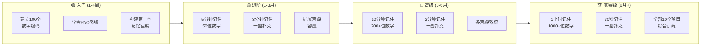

# 34-记忆竞赛攻略

> 从零基础到参加世界记忆锦标赛的完整训练指南。

---

> **📍 本章导航**：前置 → [33-记忆速查手册](33-记忆速查手册.md) ｜ 相关 → [01-number/](01-number/)·[02-card/](02-card/)·[30-记忆宫殿进阶](30-记忆宫殿进阶.md) ｜ 方法 → M03·M02·M05·M35·M36·M17 ｜ 难度 ⭐⭐⭐ ｜ 阅读 ~15min
> **🧭 边界提醒**：本章是**竞赛级**训练；日常需求（考试/演讲/记人名）用 M01/M02/M03/M07-R/M08 即可，勿照搬竞赛强度（见文末"竞赛与日常的边界"及[方法地图](方法地图.md) §3）。

## 📊 竞赛训练进阶路线

---

## ⚡ 5分钟速览

世界记忆锦标赛（World Memory Championships）是全球高水平的记忆竞技赛事，1991年由 Tony Buzan 等创立。**核心项目**：10分钟数字、10分钟扑克牌、15分钟数字马拉松等（**项目设置、规则与时间限制以官方赛会公告为准**）。**训练主线**：[M03](方法地图.md#m03) → [M02](方法地图.md#m02) → [M05 PAO](方法地图.md#m05) → [M35/M36/M17](方法地图.md#m35)（见第三章周期表）。**新手验收**：5分钟数字≥50位且正确率≥90%。中国选手曾在该赛事取得优异成绩（以官方记录为准）。

### ⚡ 一分钟速记

> **只有1分钟？记住这3个要点：**
> 1. 新手路径：[M03 数字谐音](方法地图.md#m03) → [M02 故事链](方法地图.md#m02) → [M05 PAO](方法地图.md#m05)，别跳级
> 2. 记忆宫殿：把编码放在熟悉空间的固定位置上，借空间顺序承载数字
> 3. 验收节奏：5分钟数字新手≥50位 → 进阶≥80位；赛事/纪录信息一律以官方公告为准

---

## 一、世界记忆锦标赛简介

### 1.1 赛事历史
- 1991年由 Tony Buzan 和 Raymond Keene 创立，每年举办一次，吸引众多国家选手参与
- 中国选手曾取得优异成绩（如王峰曾获世界冠军）；头衔、纪录与最新名单**以官方记录为准**

### 1.2 十大比赛项目

| 项目 | 内容 | 时间 | 世界纪录参考 |
|------|------|:----:|:----------:|
| 二进制数字 | 记忆0和1序列 | 30分钟 | ~5000位 |
| 一小时数字 | 记忆数字 | 60分钟 | ~2600位 |
| 速度数字 | 记忆数字 | 5分钟 | ~500位 |
| 马拉松扑克 | 记忆扑克牌 | 60分钟 | ~27副 |
| 速度扑克 | 记忆一副扑克牌 | 最快 | ~13秒 |
| 一小时扑克 | 记忆扑克牌 | 60分钟 | ~27副 |
| 人名头像 | 记忆人名配头像 | 15分钟 | ~200个 |
| 历史日期 | 记忆虚构历史日期 | 5分钟 | ~130个 |
| 随机词汇 | 记忆单词 | 15分钟 | ~300个 |
| 听记数字 | 听数字记忆 | 100秒 | ~300位 |

> ⚠️ 上表"世界纪录参考"为经验参考值，记录随时刷新；项目设置也可能调整——**一律以官方赛会公告/官方记录为准**。

---

## 二、核心训练方法

### 2.1 PAO系统（Person-Action-Object）[M05 PAO](方法地图.md#m05)
PAO系统是记忆竞赛的核心技术。每个两位数编码为一个"人物-动作-物体"三元组（先掌握 [M03 数字谐音](方法地图.md#m03)再上PAO，否则会两套编码互相干扰）：

| 数字 | 人物(P) | 动作(A) | 物体(O) |
|:----:|---------|---------|---------|
| 01 | 灵药仙 | 喝药 | 药瓶 |
| 13 | 医生 | 打针 | 听诊器 |
| 21 | 鳄鱼 | 咬 | 牙齿 |
| 38 | 妇女 | 做饭 | 围裙 |
| 51 | 工人 | 拧螺丝 | 扳手 |

**训练目标**：看到数字<1秒内反应出PAO编码。✅ 验收：随机抽数字卡，10个两位数的PAO平均反应<1秒；达不到就退回 [M03+M02](方法地图.md#m03) 组合继续练。

### 2.2 记忆宫殿 [M01 记忆宫殿](方法地图.md#m01)
- 构建多个宫殿，每个宫殿10-50个站点
- 站点间距5-8步，保持均匀
- 定期维护和翻新（3个月以上清空重用）

### 2.3 速度训练
- 从慢速开始，逐步加快
- 记录每次成绩，追踪进步
- 目标：编码反应<1秒，扑克牌记忆<2分钟
- ✅ 验收：连续3次训练成绩波动≤10%（稳定才算过关，偶尔一次不算）

### 2.4 方法 ID 体系（新手路径，别跳级）

**[M03 数字谐音](方法地图.md#m03) → [M02 故事链](方法地图.md#m02) → [M05 PAO](方法地图.md#m05) → [M35 数字主系统](方法地图.md#m35) / [M36 扑克编码](方法地图.md#m36) / [M17 多维矩阵](方法地图.md#m17)**

| 路径 | 学什么 | 为什么按这个顺序 | 失败回退 |
|---|---|---|---|
| 第1步 [M03](方法地图.md#m03) | 数字→谐音词→画面 | 先建立"数字能变成画面"的基本功 | 谐音想不出 → 用 [M04 形状编码](方法地图.md#m04) |
| 第2步 [M02](方法地图.md#m02) | 画面之间串动作/故事 | 编码没有联结就是散珠子，一提取就散架 | 故事太长记混 → 每组≤3个画面 |
| 第3步 [M05](方法地图.md#m05) | 两位数→人物-动作-物体 | 一次编码6位数字，速度质变 | 反应>2秒 → 退回 M03+M02 组合 |
| 第4步 [M35/M36/M17](方法地图.md#m35) | 竞赛级编码系统、多维矩阵 | 为时间压力下的准确率服务 | 如果只是日常需求，停在第3步就够了 |

> **🧭 竞赛与日常需求的边界**（详见[方法地图](方法地图.md) §3）：
> - 日常需求（考试/演讲/记人名/背课文）用 [M01](方法地图.md#m01)/[M02](方法地图.md#m02)/[M03](方法地图.md#m03)/[M07-R](方法地图.md#m07-r)/[M08](方法地图.md#m08) 就够，**不要**上 M05/M17/M35/M36——杀鸡用牛刀，训练强度还会劝退。
> - **儿童禁用竞赛级高压训练**（见[35-儿童记忆训练](35-儿童记忆训练.md)）。
> - 竞赛追求的是"时间压力下的准确率"，日常追求的是"长期保持+用得上"，目标不同，训练不可互相替代。

---

## 三、训练周期表（新手 3 个月 → 6 个月 → 12 个月）

> 时长与成绩均为**经验参考**，个体差异大。按"每周投入"规划，每周至少留 1 天完全休息；每阶段验收不达标就留在本阶段，不赶进度。

| 阶段 | 方法主线 | 每周投入 | 阶段内重点 | ✅ 验收标准（不达标就别进下一阶段） |
|---|---|---|---|---|
| 新手期 0-3 个月 | [M03](方法地图.md#m03) → [M02](方法地图.md#m02) | 4-5 天 × 30-45 分钟（约 3-4 小时/周） | 周 1-4 建 00-99 编码表；周 5-8 第一个 10 站点宫殿，数字 20 位→50 位；周 9-12 扑克牌入门 | **5 分钟数字 ≥50 位且正确率 ≥90%**；编码反应 <2 秒 |
| 进阶期 3-6 个月 | [M05](方法地图.md#m05) + [M35/M36](方法地图.md#m35) | 6-8 小时/周 | 完善 100 个 PAO 编码、3-5 个宫殿、速度训练 | **5 分钟数字 ≥80 位**；速度扑克 ≤3 分钟/副 |
| 高阶期 6-12 个月 | [M17](方法地图.md#m17) + 全项目 | 8-12 小时/周 | 马拉松项目、人名头像、历史日期等弱势项目 | **5 分钟数字 ≥120 位**；速度扑克 ≤2 分钟/副；完成 3 次完整模拟赛 |
| 竞赛期 12 个月+ | 全项目综合 | 10-15 小时/周（学生党酌减） | 心态管理、比赛策略、赛前模拟与复盘 | 达到目标赛事参赛标准（**以官方赛会公告为准**） |

**阶段内每周节奏示例**（新手期）：编码反应 2 天 + 宫殿数字 2 天 + 扑克 1 天，每次 30-45 分钟；每次训练记录成绩（见[33-记忆速查手册](33-记忆速查手册.md)的记录模板）。

---

## 四、参赛成本清单（免费替代优先）

| 项目 | 经验量级 | 免费/低成本替代 |
|------|---------|---------------|
| 赛事报名费 | **以官方赛会公告为准**（各赛事差异大） | 先参加学校/社区/线上免费挑战赛练手 |
| 交通与住宿（外地参赛） | 视赛事城市而定 | 优先本地或线上赛；拼房拼车 |
| 训练道具 | 普通扑克牌几元/副 | **免费**：扑克牌+纸笔编码表+手机秒表，已覆盖 90% 训练 |
| 训练 App/网站 | 部分为订阅制 | 纸笔随机数字表（自己打印）、Anki（免费）、免费随机数网页；付费 App 非必需 |
| 编码表/教材 | 书籍几十元级 | 自建编码表，见免费资源 [01-number/](01-number/)、[02-card/](02-card/) |

> 💡 总原则：**免费替代优先**。记忆竞技的门槛是每天坚持，不是装备。所有费用以实际公告/实际价格为准，本表仅为量级参考。

---

## 五、比赛技巧

### 5.1 赛前准备
- 提前踩点，熟悉比赛环境
- 准备好编码表和宫殿（打印备用）
- 调整作息，保证充足睡眠
- 准备耳塞（部分项目允许使用）

### 5.2 比赛心态
- 专注当下，不想成绩和排名
- 遇到卡壳不慌张，跳过继续
- 保持匀速，不急于求成
- 享受比赛过程

### 5.3 赛后复盘
- 记录每个项目的成绩和感受
- 分析错误原因（编码卡壳？宫殿混乱？时间不够？）
- 调整训练计划

---

## 六、中国记忆赛事

### 6.1 国内赛事
国内主要参赛渠道包括中国记忆公开赛、各地区记忆赛事、线上记忆挑战赛等。**赛事名称、项目设置、报名时间、参赛资格随时可能调整，一律以官方赛会公告为准**，不要以本章或任何二手信息为准。建议先参加线上免费挑战赛熟悉节奏，再考虑线下赛。

### 6.2 知名中国选手
- **王峰**：曾获世界记忆锦标赛冠军（头衔与纪录以官方记录为准）
- **申一帆**：以年轻选手身份获得记忆大师头衔（以官方记录为准）
- 越来越多的中国选手活跃在国际赛场；最新名单以官方赛会公告为准

---

## ⚠️ 常见错误

| 错误 | 表现 | 正确做法 |
|------|------|---------|
| 编码太慢 | 看到数字要想好几秒 | 每天练习编码反应，目标<1秒 |
| 宫殿混乱 | 站点不清晰、顺序错乱 | 选熟悉的空间，定期走动复习 |
| 急于求成 | 还没掌握基础就练速度 | 先准确再速度，循序渐进 |
| 不记成绩 | 不知道自己的进步 | 每次训练记录成绩，追踪进步 |
| 忽视休息 | 每天练很久不休息 | 每30分钟休息5分钟，保证睡眠 |
| 只练数字 | 只训练数字记忆，忽略其他项目 | 全项目均衡训练，至少覆盖3个主项目 |
| 不做赛前模拟 | 直接上场比赛 | 赛前至少做3次完整模拟赛，熟悉节奏 |
| 编码一成不变 | 用别人的编码，不适合自己 | 根据个人联想习惯定制编码，固定不变 |
| 忽视心理建设 | 比赛时紧张、卡壳就放弃 | 平时练习"跳过继续"策略，培养比赛心态 |
| 不复盘 | 比赛后不分析错误 | 每次训练和比赛后记录成绩，分析卡壳原因 |

---

## 🧪 自测题

1. 世界记忆锦标赛的速度数字项目，时间限制是多少？
   - A. 3分钟  B. 5分钟  C. 10分钟  D. 15分钟
   答案：B

2. PAO系统的三个组成部分是什么？
   - A. 人物-地点-物体  B. 人物-动作-物体  C. 地点-动作-物体  D. 人物-动作-地点
   答案：B

3. 入门阶段的训练目标是什么？
   - A. 5分钟记忆100位数字  B. 3分钟记忆一副扑克牌  C. 5分钟记忆50位数字  D. 1分钟记忆50位数字
   答案：C

4. 记忆宫殿的站点间距建议是多少？
   - A. 1-2步  B. 3-4步  C. 5-8步  D. 10-15步
   答案：C

5. 比赛中遇到卡壳应该怎么处理？
   - A. 停下来回忆  B. 放弃这个项目  C. 跳过继续  D. 重新开始
   答案：C

---

## ❓ 常见问题FAQ

**Q: 我零基础，能参加记忆竞赛吗？**
A: 可以。记忆竞赛的核心是系统训练，不是天赋。Maguire(2003)的研究表明，记忆冠军的大脑在先天结构上与普通人无差异。经过 3-6 个月的系统训练，多数人可达到地区赛参赛水平（个体差异大，见第三章周期表）。

**Q: 训练多久能参加比赛？**
A: 新手期 0-3 个月达到"5 分钟数字≥50 位"即可参加线上赛/地区赛练手；进阶期 3-6 个月（5 分钟≥80 位）可尝试更高级别赛事。具体参赛资格与时限**以官方赛会公告为准**。

**Q: 记忆竞赛需要什么设备？**
A: 主要需要：扑克牌（多副）、数字编码表、记忆宫殿、计时器。不需要特殊设备。

**Q: 年龄有限制吗？**
A: 组别设置以官方赛会公告为准（通常设青少年组与成人组）。但儿童应以游戏化启蒙为主（见[35-儿童记忆训练](35-儿童记忆训练.md)），不建议过早进入竞赛级高压训练。

---

## 🗺️ 进阶路线图

你已经了解了记忆竞赛。下一步：
- 想练习数字编码 → [01-number/](01-number/)
- 想练习扑克牌 → [02-card/](02-card/)
- 想深入宫殿技术 → [30-记忆宫殿进阶](30-记忆宫殿进阶.md)
- 想了解速度训练 → [01-number/01-number-speed-01.md](01-number/01-number-speed-01.md)

---

## 💬 读者实践案例

**案例一：大学生小李的3个月入门之路**
小李是大二学生，零基础开始训练。第1个月专注建立00-99数字编码表，每天30分钟练习编码反应；第2个月构建3个记忆宫殿（家、学校、超市），练习50位数字记忆；第3个月加入扑克牌训练。3个月后，他在校内记忆挑战赛中5分钟记住了72位数字，获得第三名。他说：“关键不是天赋，而是每天坚持30分钟。”

**案例二：退休教师老王的竞赛之路**
58岁的退休数学老师王叔叔，看到记忆竞赛后决定挑战自己。他利用数学思维的优势，将PAO系统与数字规律结合，创造出独特的编码方式。6个月后，他参加了中国记忆公开赛老年组，1小时记住了800位数字。“大脑没有年龄限制，”他说，“每天训练就像给大脑做体操。”

---

## 📚 参考文献

1. Buzan, T. (2010). *The Memory Book*. BBC Books. — 记忆术书籍
2. Maguire, E.A., et al. (2003). Routes to remembering: the brains behind superior memory. *Nature Neuroscience*, 6(1), 90-95. — 空间记忆训练导致海马体结构可塑性变化
3. Dresler, M., et al. (2017). Mnemonic training reshapes brain networks to support superior memory. *Neuron*, 93(5), 1227-1235. — 记忆训练重塑大脑网络支持卓越记忆
4. World Memory Championships. https://worldmemorychampionships.com/ — 世界记忆锦标赛官方网站
5. 中国记忆公开赛. https://www.chinamemorysport.com/

---

## 🛠️ 推荐工具

| 工具 | 类型 | 用途 | 平台 |
|------|------|------|------|
| **Anki** | 间隔重复 | 训练编码反应速度，管理PAO编码库 | 全平台免费 |
| **Memory League** | 在线竞赛 | 全球记忆选手在线对战平台 | 网页版 |
| **训练计时器** | 计时 | 精确记录每次训练成绩，追踪进步 | iOS/Android |
| **数字随机生成器** | 训练 | 生成随机数字串进行记忆训练 | 网页/App |
| **扑克牌计时App** | 扑克训练 | 专门用于扑克牌记忆计时和统计 | iOS/Android |

---

## 📝 本章小结

记忆竞赛不是天才的游戏，而是系统训练的结果：按 [M03](方法地图.md#m03) → [M02](方法地图.md#m02) → [M05](方法地图.md#m05) → [M35/M36/M17](方法地图.md#m35) 的路径，用周期表的验收标准稳步推进，免费工具就够用。同时记住边界：竞赛级方法是给"时间压力下刷准确率"用的，日常需求用轻量组合就好——当你第一次在 5 分钟内记住 80 位数字时，享受的是训练本身，而不是把它套用到生活的每个角落。

---

## 🔗 与本书其他部分的联系

- [方法地图](方法地图.md)——本章方法 ID 的注册表与"场景×方法"选择矩阵，竞赛/日常边界的总纲
- [01-number/](01-number/)·[02-card/](02-card/)——[M35 数字主系统](方法地图.md#m35)与 [M36 扑克编码](方法地图.md#m36)的编码表与练习材料（免费）
- [30-记忆宫殿进阶](30-记忆宫殿进阶.md)——多宫殿系统与站点维护的进阶技巧
- [33-记忆速查手册](33-记忆速查手册.md)——训练成绩记录模板，配合周期表追踪进步
- [35-儿童记忆训练](35-儿童记忆训练.md)——为什么儿童禁用本章的竞赛级高压训练
